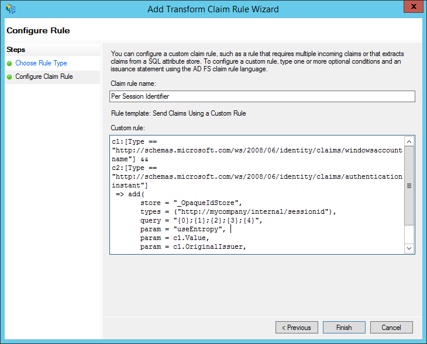

<properties 
    pageTitle="使用 AD FS 驗證建立的業務 Azure 應用程式 |Microsoft Azure" 
    description="瞭解如何建立列的商務應用程式中 Azure 應用程式服務會驗證與內部部署 STS。 本教學課程為內部部署 STS 目標 AD FS。" 
    services="app-service\web" 
    documentationCenter=".net" 
    authors="cephalin" 
    manager="wpickett" 
    editor=""/>

<tags 
    ms.service="app-service-web" 
    ms.devlang="dotnet" 
    ms.topic="article" 
    ms.tgt_pltfrm="na" 
    ms.workload="web" 
    ms.date="08/31/2016" 
    ms.author="cephalin"/>

# 建立業務 Azure 應用程式使用 AD FS 驗證

本文將示範如何建立 ASP.NET MVC 線條的商務應用程式[Azure 應用程式服務](../app-service/app-service-value-prop-what-is.md)中使用內部部署[Active Directory Federation Services](http://technet.microsoft.com/library/hh831502.aspx)為身分識別提供者。 您想要建立 Azure 應用程式服務中的線條的商務應用程式，但您的組織要求目錄內儲存的資料，就可以使用這種情況。

>[AZURE.NOTE] Azure 應用程式服務的不同企業驗證與授權選項的概觀，請參閱[與內部部署的 Active Directory Azure 應用程式中的驗證](web-sites-authentication-authorization.md)。

## 您會建立 ##

您會建立基本 ASP.NET 應用程式 Azure 應用程式服務 Web 應用程式中的使用下列功能︰

- 驗證使用者針對 AD FS
- 使用`[Authorize]`授權使用者的其他動作
- 在 Visual Studio 偵錯和發佈至應用程式服務 Web 應用程式的靜態設定 （一次設定、 偵錯及發佈隨時）  

## 您的需要 ##

[AZURE.INCLUDE [free-trial-note](../../includes/free-trial-note.md)]

您必須完成本教學課程下列動作︰

- 內部部署 AD FS 部署 (在此教學課程中使用的測試實驗端對端逐步解說，請參閱[測試實驗室︰ 與 AD FS 中 （適用於只測試） Azure VM 獨立 STS](https://blogs.msdn.microsoft.com/cephalin/2014/12/21/test-lab-standalone-sts-with-ad-fs-in-azure-vm-for-test-only/))
- 權限可建立依賴派對 AD FS 管理信任
- Visual Studio 2013 更新 4 或更新版本
- [Azure SDK 2.8.1](http://go.microsoft.com/fwlink/p/?linkid=323510&clcid=0x409)或更新版本

## 使用範例應用程式的業務範本 ##

範例應用程式在本教學課程， [WebApp-WSFederation-DotNet)](https://github.com/AzureADSamples/WebApp-WSFederation-DotNet)，由 Azure Active Directory 小組。 由於 AD FS 支援 WS 同盟，您可以使用其另存為範本以輕鬆建立業務的應用程式。 有下列功能︰

- 使用[WS 同盟](http://msdn.microsoft.com/library/bb498017.aspx)驗證內部部署與 AD FS 部署
- 登入並教具借出功能
- 使用[Microsoft.Owin](http://www.asp.net/aspnet/overview/owin-and-katana/an-overview-of-project-katana) （而非 Windows 身分識別 Foundation)，未來的 ASP.NET 以及更容易設定進行驗證和比 WIF 的授權

## 設定範例應用程式 ##

2.  複製或下載範例方案[WebApp-WSFederation-DotNet](https://github.com/AzureADSamples/WebApp-WSFederation-DotNet)在您的本機目錄。

    > [AZURE.NOTE] [README.md](https://github.com/AzureADSamples/WebApp-WSFederation-DotNet/blob/master/README.md)的指示說明如何設定與 Azure Active Directory 的應用程式。 但在本教學課程中，使用 AD FS 設定，因此請改為遵循以下的步驟。

3.  開啟方案，然後在**方案總管**中開啟 Controllers\AccountController.cs。

    您會看到程式碼只要問題驗證要求来使用 WS 同盟使用者進行驗證。 在 App_Start\Startup.Auth.cs 中設定了所有驗證。

4.  開啟 App_Start\Startup.Auth.cs。 在 [`ConfigureAuth`方法，請注意行︰

        app.UseWsFederationAuthentication(
            new WsFederationAuthenticationOptions
            {
                Wtrealm = realm,
                MetadataAddress = metadata                                      
            });

    在 OWIN 世界中，此程式碼片段實際上是您需要設定 WS 同盟驗證的最低。 則更為簡單大方更比 WIF，使用 XML 插入 Web.config 是位置的許多地方。 您需要的唯一資訊是信賴的資源 （點數） 識別碼與 AD FS 服務的中繼資料檔案的 URL。 以下是範例︰

    -   資源點數識別碼︰`https://contoso.com/MyLOBApp`
    -   中繼資料的地址︰`http://adfs.contoso.com/FederationMetadata/2007-06/FederationMetadata.xml`

5.  在 App_Start\Startup.Auth.cs，變更靜態字串定義如下︰  
    <pre class="prettyprint">
    私人靜態字串領域 = ConfigurationManager.AppSettings["ida:<mark>RPIdentifier</mark>」]。<mark><del>私人靜態字串 aadInstance = ConfigurationManager.AppSettings["ida:AADInstance 」];</del></mark>
    <mark><del>私人靜態字串租用戶 = ConfigurationManager.AppSettings["ida:Tenant 」];</del></mark>
    <mark><del>私人靜態字串中繼資料 = 字串。格式 (「 {0}/{1} /federationmetadata/2007-06/federationmetadata.xml 」，aadInstance，租用戶);</del></mark>
    <mark>私人靜態字串中繼資料 = 字串。格式 (「 https:// {0} /federationmetadata/2007-06/federationmetadata.xml 」，ConfigurationManager.AppSettings["ida:ADFS"]);</mark>

    <mark><del>字串授權 = a0 (CultureInfo.InvariantCulture，aadInstance、 租用戶);</del></mark>
    </pre>

6.  現在，請在 Web.config 中的對應的變更。 開啟 Web.config 並修改下列應用程式設定︰  
    <pre class="prettyprint">
    &lt;appSettings&gt;
    &lt;add key="webpages:Version" value="3.0.0.0" /&gt;
    &lt;add key="webpages:Enabled" value="false" /&gt;
    &lt;add key="ClientValidationEnabled" value="true" /&gt;
    &lt;add key="UnobtrusiveJavaScriptEnabled" value="true" /&gt;
      <mark><del>&lt;add key="ida:Wtrealm" value="[Enter the App ID URI of WebApp-WSFederation-DotNet https://contoso.onmicrosoft.com/WebApp-WSFederation-DotNet]" /&gt;</del></mark>
      <mark><del>&lt;add key="ida:AADInstance" value="https://login.windows.net" /&gt;</del></mark>
      <mark><del>&lt;add key="ida:Tenant" value="[Enter tenant name, e.g. contoso.onmicrosoft.com]" /&gt;</del></mark>
      <mark>&lt;add key="ida:RPIdentifier" value="[Enter the relying party identifier為 AD FS，例如 https://localhost:44320 中設定 /] 」 /&gt;</mark>
      <mark>&lt;新增鍵 = 」 ida: ADFS 」 值 = 「 [請輸入 AD FS 服務，例如 adfs.contoso.com 的 FQDN] 」 /&gt; </mark>        

    &lt;/appSettings&gt;
    </pre>

    填寫根據各自的環境的關鍵值。

7.  建立應用程式，請確定沒有任何錯誤。

就是它。 現在範例應用程式已準備好使用 AD FS。 您仍需要設定資源點數信任稍後 AD FS 中此應用程式。

## 部署至 Azure 應用程式服務 Web 應用程式的範例應用程式

在這裡，您發佈至 web 應用程式的應用程式在應用程式服務 Web 應用程式中同時保留偵錯環境。 請注意，您將之前與 AD FS 資源點數信任，因此驗證仍然無法運作尚未發行應用程式。 不過，如果您進行此動作現在您可以讓您可以使用稍後設定資源點數信任的 web 應用程式 URL。

1. 以滑鼠右鍵按一下您的專案，然後選取 [**發佈]**。

    

2. 選取**Microsoft Azure 應用程式服務**。
3. 如果您還沒有登入 Azure，請按一下 [**登入**並使用 Azure 訂閱的 Microsoft 帳戶登入。
4. 登入之後，請按一下 [**新增**]，以建立 web 應用程式]。
5. 填滿的所有必要的欄位。 您要連線到內部部署資料之後，因此沒有建立此 web 應用程式的資料庫。

    

6. 按一下 [**建立**]。 Web 應用程式建立後，會開啟 [發佈網站] 對話方塊。
7. 在**目的地 URL**，變更**http**為**https**。 將整個 URL 複製到 [文字編輯器中，以供日後使用。 然後按一下 [**發佈**]。

    

11. 在 Visual Studio 中，開啟**Web.Release.config**您專案中。 插入下列 XML`<configuration>`標記，並以的值取代發佈 web 應用程式的 URL。  
    <pre class="prettyprint">
&lt;和 appSettings&gt;
   &lt;新增鍵 = 」 ida: RPIdentifier 」 值 = 」<mark>[例如 https://mylobapp.azurewebsites.net/]</mark>」 xdt:Transform = 」 SetAttributes 「 xdt:Locator="Match(key) 」 /&gt;
&lt;/appSettings&gt;</pre>

當您完成時，您會有兩個資源點數識別項在您的專案，在 Visual Studio 中，偵錯環境的其中一個，一個用於 Azure 中的已發佈的 web 應用程式中設定。 您會針對每個兩種環境中 AD FS 設定資源點數信任。 偵錯期間，Web.config 的應用程式設定可讓您使用 AD FS**偵錯**的設定。 何時發佈 （根據預設，**版本**設定已發佈），已轉換的 Web.config 上傳，其中包含 Web.Release.config 的應用程式設定變更。

如果您想要附加發佈的網頁中的應用程式至 Azure 偵錯工具 （也就是您必須上傳已發佈的 web 應用程式中的程式碼偵錯符號），您可以建立的偵錯組態 Azure 偵錯，但它自己自訂 Web.config 轉換 (例如 Web.AzureDebug.config) 使用 Web.Release.config 的應用程式設定的複本。 這個選項可讓您維護靜態設定不同的環境。

## 設定 AD FS 管理依賴廠商信任 ##

現在，您需要設定 AD FS 管理資源點數信任之前，您可以使用範例應用程式，並使用 AD FS 實際驗證。 您必須設定兩個不同的資源點數信任，一個用於偵錯環境，其中一個發佈的網頁應用程式。

> [AZURE.NOTE] 請確定您在這兩個環境重複下列步驟。

4.  在 AD FS 伺服器上認證登入的 AD FS 管理權限。
5.  開啟 AD FS 管理]。 以滑鼠右鍵按一下 [**信任 AD FS\Trusted Relationships\Relying 合作對象**，然後選取 [**新增依賴廠商信任**。

    

5.  在 [**選取資料來源**] 頁面中，選取 [**手動輸入信賴相關資料**。 

    

6.  在 [**指定顯示名稱**] 頁面中，輸入應用程式的顯示名稱，然後按一下 [**下一步**。
7.  在 [**選擇通訊協定**] 頁面上，按一下 [**下一步**]。
8.  在 [**設定認證**] 頁面中，按一下 [**下一步**]。

    > [AZURE.NOTE] 您應該使用 HTTPS 已經，因為加密的權杖是選擇性的。 如果您確實想要加密權杖從 AD FS，在此頁面上，您也必須在程式碼中，將權杖解密邏輯。 如需詳細資訊，請參閱[手動設定 OWIN WS-同盟介軟體和接受加密的權杖](http://chris.59north.com/post/2014/08/21/Manually-configuring-OWIN-WS-Federation-middleware-and-accepting-encrypted-tokens.aspx)。
  
5.  您移至下一個步驟之前，您會需要從 Visual Studio 專案資訊。 在 [專案] 屬性中記下**SSL URL**的應用程式。 

    

6.  回 AD FS 管理，在 [**設定 URL**頁面上的**新增依賴廠商信任精靈**中，選取 [**啟用支援 WS 同盟被動式通訊協定**，然後輸入 SSL URL Visual Studio 專案您記下一個步驟中。 然後，請按一下 [**下一步**]。

    

    > [AZURE.NOTE] URL 指定在驗證成功後，傳送用戶端的位置。 偵錯環境中，它應該<code>https://localhost:&lt;port&gt;/</code>。 發佈的 web 應用程式時，它應該的 web 應用程式的 URL。

7.  在**設定的識別碼**] 頁面上，確認已列專案 SSL URL，然後按一下 [**下一步**。 按一下 [**下一步**到精靈含預設選項的結尾。

    > [AZURE.NOTE] 在 Visual Studio 專案的 App_Start\Startup.Auth.cs，此識別碼符合的值<code>WsFederationAuthenticationOptions.Wtrealm</code>同盟驗證期間。 根據預設，上述步驟中的應用程式的 URL 會新增為資源點數識別碼。

8.  您現在已經完成 AD FS 中設定您專案的資源點數應用程式。 接下來，您可以設定此應用程式來傳送應用程式所需的宣告。 [**編輯宣告規則**] 對話方塊預設會開啟您在精靈的最後之後，您可以立即開始。 讓我們來設定至少下列宣告 （使用括號括住的結構描述）︰

    -   ASP.NET 用來產生的名稱 (http://schemas.xmlsoap.org/ws/2005/05/identity/claims/name)- `User.Identity.Name`。
    -   使用者主要名稱 (http://schemas.xmlsoap.org/ws/2005/05/identity/claims/upn)-用來識別組織中的使用者。
    -   可利用為 (http://schemas.microsoft.com/ws/2008/06/identity/claims/role)-角色群組成員資格`[Authorize(Roles="role1, role2,...")]`裝飾授權控制站/動作。 實際上，此方法可能不是角色授權的大部分的效能。 如果 AD 使用者屬於下數百個安全性群組，就會變成下數百個 SAML 權杖中的角色宣告。 另一個方法是傳送一組特定條件根據使用者的成員資格的單一角色宣告。 不過，我們會保留簡單在本教學課程。
    -   命名識別碼 (http://schemas.xmlsoap.org/ws/2005/05/identity/claims/nameidentifier)-可用於反偽造驗證。 如需有關如何讓它使用反偽造驗證的詳細資訊，請參閱[建立-業務 Azure Azure Active Directory 驗證應用程式](web-sites-dotnet-lob-application-azure-ad.md#bkmk_crud)的**新增的業務功能**一節。

    > [AZURE.NOTE] 必須先設定您的應用程式的宣告型別取決於您的應用程式的需求。 Azure Active Directory 應用程式 （也就是資源點數信任） 所支援的宣告清單中，例如，請參閱[支援權杖和宣告類型](http://msdn.microsoft.com/library/azure/dn195587.aspx)。

8.  在 [編輯宣告規則] 對話方塊中，按一下 [**新增規則**]。
9.  設定名稱、 UPN 和角色宣告，如下圖所示的螢幕擷取畫面，然後按一下 [**完成**]。

    

    接下來，您可以建立識別碼宣告使用[SAML 判斷提示中的名稱識別項](http://blogs.msdn.com/b/card/archive/2010/02/17/name-identifiers-in-saml-assertions.aspx)所示的步驟的暫時名稱。

9.  再次按一下 [**新增規則**]。
10. 選取 [**傳送宣告使用自訂規則**，然後按一下 [**下一步**]。
11. 貼入 [**自訂規則**] 方塊中的下列規則語言**每個階段識別項**規則的名稱，按一下 [**完成]**。  
    <pre class="prettyprint">
    c1: [類型 ="http://schemas.microsoft.com/ws/2008/06/identity/claims/windowsaccountname 」] &amp; &amp; 
    c2: [類型 = = 「 http://schemas.microsoft.com/ws/2008/06/identity/claims/authenticationinstant 」] = > 新增 (儲存 = 「 _OpaqueIdStore 」，類型 = (「<mark>http://contoso.com/internal/sessionid</mark>」)，查詢 ="{0}，{1};{2};{3};{4} 」，參數 = 「 useEntropy 」，參數 = c1。Value，參數 = c1。OriginalIssuer，參數 = 」 」，參數 = c2。值）。
    </pre>

    您的自訂規則看起來應該像此螢幕擷取畫面︰

    

9.  再次按一下 [**新增規則**]。
10. 選取 [**轉換為內送的宣告**，然後按一下 [**下一步**]。
11. 設定規則，如下圖所示的螢幕擷取畫面 （使用您建立自訂規則中的宣告型別），然後按一下 [**完成**]。

    

    暫時名稱識別碼宣告的步驟的詳細資訊，請參閱[SAML 判斷提示中的名稱識別碼](http://blogs.msdn.com/b/card/archive/2010/02/17/name-identifiers-in-saml-assertions.aspx)。

12. 按一下 [**編輯宣告規則**] 對話方塊中的 [**套用**]。 現在看起來應該像下列的螢幕擷取畫面︰

    

    > [AZURE.NOTE] 同樣地，請確定您偵錯環境和發佈的網頁應用程式重複這些步驟。

## 測試您的應用程式的同盟的驗證

您準備好測試您的應用程式與 AD FS 的驗證邏輯。 在我 AD FS 實驗室的環境，我有一個測試使用者，測試群組 Active Directory (AD)。

若要測試驗證偵錯工具，您需要執行現在就是類型`F5`。 如果您想要測試驗證的已發佈的 web 應用程式中，瀏覽至 URL。

在 web 應用程式載入後，按一下 [**登入**。 您現在應該取得登入] 對話方塊或登入頁面由 AD FS，根據選擇 AD fs 的驗證方法。 以下是出現在 Internet Explorer 11。

當您登入的 AD FS 部署 AD 網域中的使用者時，您現在應該會看到一次使用首頁**Hello， <User Name>！** 角。 以下是什麼取得。

到目前為止，您已成功透過下列方式︰

- 您的應用程式已成功達到 AD FS 和 AD FS 資料庫中找到相符的資源點數識別碼
- AD FS 具有驗證成功 AD 使用者和重新導向您返回應用程式的首頁
- 為 AD FS 成功傳送您的應用程式名稱宣告 (http://schemas.xmlsoap.org/ws/2005/05/identity/claims/name) 的使用者名稱會顯示在角 fact 以。 

如果名稱宣告遺失，您會看到**Hello，！**。 如果您查看 Views\Shared\_LoginPartial.cshtml，找到它使用`User.Identity.Name`若要顯示的使用者名稱。 如前述，如果使用 SAML 權杖中的已驗證的使用者名稱宣告，ASP.NET hydrates，這個屬性。 若要查看 AD FS 所傳送的所有宣告，置於中斷點 Controllers\HomeController.cs，在索引動作方法。 驗證使用者之後，請檢查`System.Security.Claims.Current.Claims`集合。

 

## 授權使用者使用特定的控制站或動作

由於您要加入群組的成員資格角色宣告為資源點數信任設定，您現在可以使用其直接在`[Authorize(Roles="...")]`裝飾控制器和動作。 在建立讀取-更新刪除 (CRUD) 圖樣的線條的商務應用程式，您可以授權存取每個動作的特定角色。 現在，您會只嘗試現有常用控制器上這項功能。

1. 開啟 Controllers\HomeController.cs。
2. 裝飾`About`和`Contact`動作方法類似下列的程式碼，並使用安全性群組的成員您已驗證的使用者。  
    <pre class="prettyprint">
    <mark>[授權 (角色 = 」 測試群組 」)]</mark>
   公用 ActionResult about {ViewBag.Message = 「 您的應用程式說明頁面。 」;

        return View();
    }

    <mark>[授權 (角色 = 「 網域管理員 」)]</mark>
   公用 ActionResult Contact() {ViewBag.Message = 「 您連絡人的頁面。 」;

        return View();
    }  </pre>

    當我新增到**測試群組**的**測試使用者**我 AD FS 實驗室環境中之後, 會使用測試群組上測試授權`About`。 針對`Contact`，測試負數的**Domain Admins****測試使用者**不相關的大小寫。

3. 輸入啟動偵錯`F5`並登入，然後按一下 [**關於**]。 您現在應該可以檢視`~/About/Index`成功，頁面，如果您已驗證的使用者權限該動作。
4. 現在，請按一下**連絡人**，這在這個案例中不應該授權**測試使用者**動作。 不過，在瀏覽器重新導向至 AD FS，最後會出現以下訊息︰

    

    如果您調查此事件檢視器中 AD FS 伺服器上的錯誤，您會看見此例外狀況訊息︰  
    <pre class="prettyprint">
   Microsoft.IdentityServer.Web.InvalidRequestException: MSIS7042:<mark>相同的用戶端瀏覽器工作階段所做的最後一個 「 11 的 「 秒的 「 6 」 的要求。</mark> 如需詳細資訊，請連絡您的系統管理員。
   在 Microsoft.IdentityServer.Web.Protocols.PassiveProtocolHandler.UpdateLoopDetectionCookie （WrappedHttpListenerContext 內容），在 Microsoft.IdentityServer.Web.PassiveProtocolListener.ProcessProtocolRequest （ProtocolContext protocolContext、 PassiveProtocolHandler protocolHandler） 在 Microsoft.IdentityServer.Web.PassiveProtocolListener.OnGetContext （WrappedHttpListenerContext 內容） Microsoft.IdentityServer.Web.Protocols.WSFederation.WSFederationProtocolHandler.SendSignInResponse （WSFederationContext 內容、 MSISSignInResponse 回應） </pre>

    這項錯誤的原因是，根據預設，MVC 會傳回 401 未經授權時未獲授權使用者的角色。 這樣會觸發重新驗證您的身分識別提供者 (AD FS) 的要求。 使用者已驗證，因為 AD FS 會傳回相同的頁面，然後問題另一個 401，建立重新導向循環播放。 您將會覆寫 AuthorizeAttribute 的`HandleUnauthorizedRequest`以簡單邏輯來顯示項目，繼續進行重新導向循環播放而不是有意義的方法。

5. 建立稱為 AuthorizeAttribute.cs，專案中的檔案，並貼上下列的程式碼。

        using System;
        using System.Web.Mvc;
        using System.Web.Routing;
        
        namespace WebApp_WSFederation_DotNet
        {
            [AttributeUsage(AttributeTargets.Class | AttributeTargets.Method, Inherited = true, AllowMultiple = true)]
            public class AuthorizeAttribute : System.Web.Mvc.AuthorizeAttribute
            {
                protected override void HandleUnauthorizedRequest(AuthorizationContext filterContext)
                {
                    if (filterContext.HttpContext.Request.IsAuthenticated)
                    {
                        filterContext.Result = new System.Web.Mvc.HttpStatusCodeResult((int)System.Net.HttpStatusCode.Forbidden);
                    }
                    else
                    {
                        base.HandleUnauthorizedRequest(filterContext);
                    }
                }
            }
        }

    覆寫程式碼會在經過驗證，但未獲授權的情況下傳送 HTTP 403 （禁止），而不是 HTTP 401 （未經授權）。

6. 執行一次使用偵錯工具`F5`。 按一下**連絡人**的 [立即顯示 （即使不適當） 清楚的錯誤訊息︰

    

7. 發佈再次 Azure 應用程式服務 Web 應用程式至應用程式，並測試即時應用程式的行為。

## 連線到內部部署資料

您想要實作與 AD FS，而不是 Azure Active Directory 線條的商務應用程式的原因是把組織資料關閉內部部署的相容性問題。 這也可能表示 web 應用程式中 Azure 必須存取內部部署資料庫，因為您無法使用您的 web 應用程式作為資料層[SQL 資料庫](/services/sql-database/)。

Azure 應用程式服務 Web 應用程式支援存取內部部署的資料庫，有兩種方法︰[混合式連線](../biztalk-services/integration-hybrid-connection-overview.md)與[虛擬網路](web-sites-integrate-with-vnet.md)。 如需詳細資訊，請參閱[使用 VNET 整合和 Azure 應用程式服務 Web 應用程式的混合式連線](https://azure.microsoft.com/blog/2014/10/30/using-vnet-or-hybrid-conn-with-websites/)。

## 其他資源

- [保護 SSL 與授權屬性的應用程式](web-sites-dotnet-deploy-aspnet-mvc-app-membership-oauth-sql-database.md#protect-the-application-with-ssl-and-the-authorize-attribute)
- [Azure 應用程式中的內部部署 Active Directory 驗證方法](web-sites-authentication-authorization.md)
- [建立業務 Azure 應用程式與 Azure Active Directory 驗證](web-sites-dotnet-lob-application-azure-ad.md)
- [使用 Visual Studio 2013 中的 ASP.NET 內部部署組織驗證選項 (ADFS)](http://www.cloudidentity.com/blog/2014/02/12/use-the-on-premises-organizational-authentication-option-adfs-with-asp-net-in-visual-studio-2013/)
- [移轉到武士 VS2013 Web 專案 WIF](http://www.cloudidentity.com/blog/2014/09/15/MIGRATE-A-VS2013-WEB-PROJECT-FROM-WIF-TO-KATANA/)
- [Active Directory Federation Services 概觀](http://technet.microsoft.com/library/hh831502.aspx)
- [WS 同盟 1.1 規格](http://download.boulder.ibm.com/ibmdl/pub/software/dw/specs/ws-fed/WS-Federation-V1-1B.pdf?S_TACT=105AGX04&S_CMP=LP)

