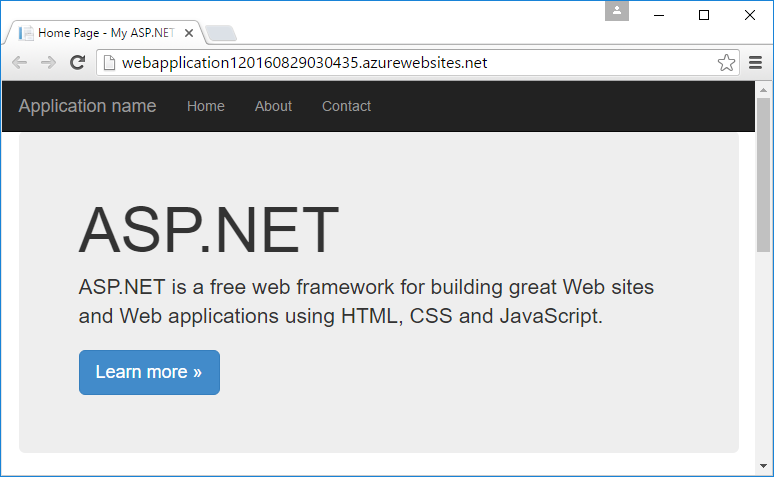
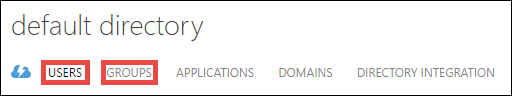

<properties 
    pageTitle="建立業務 Azure 應用程式與 Azure Active Directory 驗證 |Microsoft Azure" 
    description="瞭解如何在 Azure 應用程式服務會驗證與 Azure Active Directory 中建立 ASP.NET MVC 線條的商務應用程式" 
    services="app-service\web, active-directory" 
    documentationCenter=".net" 
    authors="cephalin" 
    manager="wpickett" 
    editor=""/>

<tags 
    ms.service="app-service-web" 
    ms.devlang="dotnet" 
    ms.topic="article" 
    ms.tgt_pltfrm="na" 
    ms.workload="web" 
    ms.date="09/01/2016" 
    ms.author="cephalin"/>

# 建立業務 Azure 應用程式與 Azure Active Directory 驗證 #

本文將示範如何建立.NET 線條的商務應用程式中[Azure 應用程式服務 Web 應用程式](http://go.microsoft.com/fwlink/?LinkId=529714)使用[驗證 / 授權](../app-service/app-service-authentication-overview.md)功能。 也會顯示如何使用應用程式中的[Azure Active Directory 圖表 API](https://msdn.microsoft.com/Library/Azure/Ad/Graph/api/api-catalog)來查詢目錄資料。

您使用的 Azure Active Directory 租用戶可以是 Azure 專用的目錄。 或者，它可以是[與您內部部署的 Active Directory 同步處理](../active-directory/active-directory-aadconnect.md)的同事的內部部署與遠端建立單一登入體驗。 本文 Azure 帳戶使用預設的目錄。

## 您會建立 ##

您會建立簡單的業務建立讀取-更新刪除 (CRUD) 應用程式，在應用程式服務 Web 應用程式中追蹤工作項目，下列功能︰

- 驗證使用者針對 Azure Active Directory
- 查詢目錄使用者和群組使用[Azure Active Directory 圖表 API](http://msdn.microsoft.com/library/azure/hh974476.aspx)
- 使用 ASP.NET MVC*無驗證*範本

如果您需要的業務應用程式 Azure 中的角色型存取控制 (RBAC)，請參閱[下一步](#next)。

## 您的需要 ##

[AZURE.INCLUDE [free-trial-note](../../includes/free-trial-note.md)]

您必須完成本教學課程下列動作︰

- Azure Active Directory 租用戶，且各種不同的群組中的使用者
- Azure Active Directory 租用戶上建立應用程式的權限
- Visual Studio 2013 更新 4 或更新版本
- [Azure SDK 2.8.1 或更新版本](https://azure.microsoft.com/downloads/)

## 建立並部署至 Azure web 應用程式 ##

1. Visual Studio 中，按一下 [**檔案** > **新增** > **專案**。

2. 選取**ASP.NET Web 應用程式**、 您的專案的名稱，然後按一下**[確定**]。

3. 選取 [ **MVC**範本，然後變更驗證**無**驗證。 請確認已**在雲端的 host （主機）** ，然後按一下**[確定**]。

    

4. 在 [**建立應用程式服務**] 對話方塊中，按一下**新增帳戶**（，然後在下拉式清單中**新增帳戶**） Azure 帳戶登入。

5. 登入設定 web 應用程式。 資源群組和新的應用程式服務方案即可建立個別的 [**新增**] 按鈕。 按一下 [**瀏覽其他 Azure 服務**，繼續]。

    

6. 在 [**服務**] 索引標籤中，按一下 [**+**將 SQL 資料庫應用程式。 

    

7. 在 [**設定 SQL 資料庫**中，按一下 [**新增**]，以建立 SQL Server 執行個體]。

8. 在 [**設定 SQL Server**設定您的 SQL Server 執行個體。 接著，按一下**[確定]**、 **[確定**]，啟動 Azure 中的應用程式建立的**建立**。

9. **Azure 應用程式服務活動**，您可以看到應用程式建立完成時。 按一下 [**發佈&lt;*應用程式名稱*> 此 Web 應用程式現在**，請按一下 [**發佈 * *。 

    一旦 Visual Studio 完成時，它會在瀏覽器中開啟發佈應用程式。 

    

## 設定驗證和目錄存取

1. [Azure 入口網站](https://portal.azure.com)登入。

2. 從左側功能表中，按一下 [**應用程式服務** > **&lt;*應用程式名稱*>** > **驗證 / 授權 * *。

    

3. Azure Active Directory 驗證**上**的 [開啟 > **Azure Active Directory** > **Express** > **[確定]**。

    

4. 命令列中，按一下 [**儲存**]。

    

    驗證設定會儲存之後成功，請嘗試瀏覽至您的應用程式，在瀏覽器中一次。 您的預設設定強制執行完整的應用程式上驗證。 如果您還沒有登入，您會重新導向至登入畫面。 後登入，您會看到您 HTTPS 受保護的應用程式。 接下來，您需要啟用目錄資料的存取權。 

5. 瀏覽至[傳統入口網站](https://manage.windowsazure.com)。

6. 從左側功能表中，按一下 [ **Active Directory** > **預設目錄** > **應用程式** > **&lt;*應用程式名稱*> * *。

    

    這是為您建立的應用程式服務的 Azure Active Directory 應用程式啟用授權 / 驗證功能。

7. 按一下 [**使用者**及**群組**] 以確定目錄中有一些使用者和群組]。 如果不是，建立幾個測試使用者和群組]。

    

7. 按一下 [**設定**]，以設定此應用程式]。

8. 向下**鍵**捲動並選取期間新增機碼。 接著，按一下 [**委派的權限**，並選取**讀取目錄資料**。 按一下 [**儲存**]。

    

8. 後會儲存您的設定，請向上捲動，回到 [**索引鍵**] 區段，然後按一下 [**複製**] 按鈕，若要複製的用戶端鍵。 

    

    >[AZURE.IMPORTANT] 如果您離開這個網頁現在瀏覽，您無法再存取此用戶端登錄機碼。

9. 接下來，您需要使用此按鍵設定 web 應用程式。 [Azure 資源檔案總管](https://resources.azure.com)以 Azure 帳戶登入。

10. 在頁面頂端，按一下 [**讀/寫**Azure 資源檔案總管中進行變更。

    

11. 尋找您的應用程式，位於訂閱的驗證設定 > * *&lt;*subscriptionname*>** > **resourceGroups** > **&lt;*resourcegroupname*>** > **提供者** > **Microsoft.Web** > **網站** > **&lt;*應用程式名稱*>** > **config** > **authsettings * *。

12. 按一下 [**編輯**]。

    

13. 在 [編輯] 窗格中，設定`clientSecret`和`additionalLoginParams`，如下所示的屬性。

        ...
        "clientSecret": "<client key from the Azure Active Directory application>",
        ...
        "additionalLoginParams": ["response_type=code id_token", "resource=https://graph.windows.net"],
        ...

14. 提交您的變更頂端，按一下 [**保留**]。

    

14. 現在，若要測試如果您有授權權杖，來存取 Azure Active Directory 圖表 API，只要瀏覽至**https://&lt;*應用程式名稱*>.azurewebsites.net/.auth/me** 在瀏覽器中的。 如果您正確設定所有項目，您應該會看到`access_token`JSON 回應的屬性。

    `~/.auth/me` URL 路徑會管理應用程式服務驗證 / 可讓您的資訊全部授權相關驗證的工作階段。 如需詳細資訊，請參閱[驗證和 Azure 應用程式服務中的授權](../app-service/app-service-authentication-overview.md)。

    >[AZURE.NOTE] `access_token`具有的過期期間。 不過，應用程式服務驗證 / 授權提供使用的權杖重新整理功能`~/.auth/refresh`。 如需有關如何使用它的詳細資訊，請參閱    [應用程式服務權杖存放區](https://cgillum.tech/2016/03/07/app-service-token-store/)。

接下來，您會進行目錄資料有用的動作。

## 將-業務功能新增至您的應用程式

現在，您可以建立簡單的 CRUD 工作項目追蹤工具。  

5.  在 [~\Models] 資料夾中，建立類別檔案稱為 WorkItem.cs，並取代`public class WorkItem {...}`下列程式碼︰

        using System.ComponentModel.DataAnnotations;

        public class WorkItem
        {
            [Key]
            public int ItemID { get; set; }
            public string AssignedToID { get; set; }
            public string AssignedToName { get; set; }
            public string Description { get; set; }
            public WorkItemStatus Status { get; set; }
        }

        public enum WorkItemStatus
        {
            Open,
            Investigating,
            Resolved,
            Closed
        }

7.  建立專案可讓您新的模型存取臨時平台邏輯 Visual Studio 中使用。

8.  新增 scaffolded 項目`WorkItemsController`~\Controllers 資料夾 （以滑鼠右鍵按一下**控制站**，指向 [**新增**]，並選取**新的 scaffolded 項目**）。 

9.  選取**MVC 5 控制器使用實體架構的檢視**，然後按一下 [**新增**]。

10. 選取您建立的然後按一下 [模型**+**，然後**新增**至新增資料內容，然後再按一下 [**新增]**。

    

14. 在 ~\Views\WorkItems\Create.cshtml （自動 scaffolded 項目），找出`Html.BeginForm`協助程式方法，然後進行下列醒目提示的變更︰  
<pre class="prettyprint">
    @modelWebApplication1.Models.WorkItem

    @{ViewBag.Title =&quot;建立&quot;;}

    &lt;h2&gt;建立&lt;/h2&gt;

    @using(Html.BeginForm (<mark>&quot;建立&quot;，&quot;工作項目&quot;，新增 FormMethod.Post {id =&quot;主表單&quot;}</mark>)){@Html.AntiForgeryToken()

        &lt;div class=&quot;form-horizontal&quot;&gt;
            &lt;h4&gt;WorkItem&lt;/h4&gt;
            &lt;hr /&gt;
            @Html.ValidationSummary(true, &quot;&quot;, new { @class = &quot;text-danger&quot; })
            &lt;div class=&quot;form-group&quot;&gt;
                @Html.LabelFor(model =&gt; model.AssignedToID, htmlAttributes: new { @class = &quot;control-label col-md-2&quot; })
                &lt;div class=&quot;col-md-10&quot;&gt;
                    @Html.EditorFor(model =&gt; model.AssignedToID, new { htmlAttributes = new { @class = &quot;form-control&quot;<mark>, @type = &quot;hidden&quot;</mark> } })
                    @Html.ValidationMessageFor(model =&gt; model.AssignedToID, &quot;&quot;, new { @class = &quot;text-danger&quot; })
                &lt;/div&gt;
            &lt;/div&gt;

            &lt;div class=&quot;form-group&quot;&gt;
                @Html.LabelFor(model =&gt; model.AssignedToName, htmlAttributes: new { @class = &quot;control-label col-md-2&quot; })
                &lt;div class=&quot;col-md-10&quot;&gt;
                    @Html.EditorFor(model =&gt; model.AssignedToName, new { htmlAttributes = new { @class = &quot;form-control&quot; } })
                    @Html.ValidationMessageFor(model =&gt; model.AssignedToName, &quot;&quot;, new { @class = &quot;text-danger&quot; })
                &lt;/div&gt;
            &lt;/div&gt;

            &lt;div class=&quot;form-group&quot;&gt;
                @Html.LabelFor(model =&gt; model.Description, htmlAttributes: new { @class = &quot;control-label col-md-2&quot; })
                &lt;div class=&quot;col-md-10&quot;&gt;
                    @Html.EditorFor(model =&gt; model.Description, new { htmlAttributes = new { @class = &quot;form-control&quot; } })
                    @Html.ValidationMessageFor(model =&gt; model.Description, &quot;&quot;, new { @class = &quot;text-danger&quot; })
                &lt;/div&gt;
            &lt;/div&gt;

            &lt;div class=&quot;form-group&quot;&gt;
                @Html.LabelFor(model =&gt; model.Status, htmlAttributes: new { @class = &quot;control-label col-md-2&quot; })
                &lt;div class=&quot;col-md-10&quot;&gt;
                    @Html.EnumDropDownListFor(model =&gt; model.Status, htmlAttributes: new { @class = &quot;form-control&quot; })
                    @Html.ValidationMessageFor(model =&gt; model.Status, &quot;&quot;, new { @class = &quot;text-danger&quot; })
                &lt;/div&gt;
            &lt;/div&gt;

            &lt;div class=&quot;form-group&quot;&gt;
                &lt;div class=&quot;col-md-offset-2 col-md-10&quot;&gt;
                    &lt;input type=&quot;submit&quot; value=&quot;Create&quot; class=&quot;btn btn-default&quot;<mark> id=&quot;submit-button&quot;</mark> /&gt;
                &lt;/div&gt;
            &lt;/div&gt;
        &lt;/div&gt;
    }

    &lt;div&gt;
    @Html.ActionLink(&quot;回到清單&quot;，&quot;索引&quot;) &lt;/div    &gt;

    @section指令碼 { @Scripts.Render( &quot;~/bundles/jqueryval&quot;)     <mark>&lt;指令碼&gt;
     / / 使用者/群組選擇器程式碼 var maxResultsPerPage = 14。        var 輸入 = document.getElementById (&quot;AssignedToName&quot;);

            // Access token from request header, and tenantID from claims identity
            var token = &quot;@Request.Headers[&quot;X-MS-TOKEN-AAD-ACCESS-TOKEN&quot;]&quot;;
            var tenant =&quot;@(System.Security.Claims.ClaimsPrincipal.Current.Claims
                            .Where(c => c.Type == &quot;http://schemas.microsoft.com/identity/claims/tenantid&quot;)
                            .Select(c => c.Value).SingleOrDefault())&quot;;

            var picker = new AadPicker(maxResultsPerPage, input, token, tenant);

            // Submit the selected user/group to be asssigned.
            $(&quot;#submit-button&quot;).click({ picker: picker }, function () {
                if (!picker.Selected())
                    return;
                $(&quot;#main-form&quot;).get()[0].elements[&quot;AssignedToID&quot;].value = picker.Selected().objectId;
            });
        &lt;/script&gt;</mark>
    }
    </pre>
    
    請注意，`token`和`tenant`會使用`AadPicker`進行 Azure Active Directory 圖表 API 通話的物件。 您要新增`AadPicker`更新版本。   
    
    >[AZURE.NOTE] 您也可以取得`token`和`tenant`從用戶端與`~/.auth/me`，但當中應其他伺服器通話。 例如︰
    >  
    >     $.ajax({
    >         dataType: "json",
    >         url: "/.auth/me",
    >         success: function (data) {
    >             var token = data[0].access_token;
    >             var tenant = data[0].user_claims
    >                             .find(c => c.typ === 'http://schemas.microsoft.com/identity/claims/tenantid')
    >                             .val;
    >         }
    >     });
    
15. 變更與相同 ~ \Views\WorkItems\Edit.cshtml。

15. `AadPicker`物件定義中的指令碼，您需要新增至您的專案。 ~\Scripts 資料夾按一下滑鼠右鍵，指向 [**新增**]，然後按一下 [ **JavaScript 檔案**。 輸入`AadPickerLibrary`的檔名並按一下**[確定]**。

16. 從[這裡](https://raw.githubusercontent.com/cephalin/active-directory-dotnet-webapp-roleclaims/master/WebApp-RoleClaims-DotNet/Scripts/AadPickerLibrary.js)將複製內容 ~ \Scripts\AadPickerLibrary.js。

    在 [指令碼`AadPicker`物件通話[Azure Active Directory 圖表 API](https://msdn.microsoft.com/Library/Azure/Ad/Graph/api/api-catalog)搜尋使用者和群組符合輸入。  

17. ~\Scripts\AadPickerLibrary.js 也會使用[jQuery UI 自動完成小工具](https://jqueryui.com/autocomplete/)。 因此您需要新增至專案 jQuery ui。 以滑鼠右鍵按一下您專案中的，按一下 [**管理 NuGet 套件**。

18. 在 [NuGet 套件管理員] 中，按一下 [瀏覽在 [搜尋] 列中，輸入**jquery ui** ，按一下**jQuery.UI.Combined**。

    

19. 在右窗格中，按一下 [**安裝**]，然後按一下**[確定]**以繼續。

19. 開啟 ~\App_Start\BundleConfig.cs，然後進行下列醒目提示的變更︰  
    <pre class="prettyprint">
    公用靜態 void RegisterBundles(BundleCollection bundles) {配搭。新增 (新 ScriptBundle (&quot;~/bundles/jquery&quot;)。包含 ( &quot;~/Scripts/jquery-{version}.js&quot;<mark>， &quot;~/Scripts/jquery-ui-{version}.js&quot;， &quot;~/Scripts/AadPickerLibrary.js&quot;</mark>))。

        bundles.Add(new ScriptBundle(&quot;~/bundles/jqueryval&quot;).Include(
                    &quot;~/Scripts/jquery.validate*&quot;));

        // Use the development version of Modernizr to develop with and learn from. Then, when you&#39;re
        // ready for production, use the build tool at http://modernizr.com to pick only the tests you need.
        bundles.Add(new ScriptBundle(&quot;~/bundles/modernizr&quot;).Include(
                    &quot;~/Scripts/modernizr-*&quot;));

        bundles.Add(new ScriptBundle(&quot;~/bundles/bootstrap&quot;).Include(
                    &quot;~/Scripts/bootstrap.js&quot;,
                    &quot;~/Scripts/respond.js&quot;));

        bundles.Add(new StyleBundle(&quot;~/Content/css&quot;).Include(
                    &quot;~/Content/bootstrap.css&quot;,
                    &quot;~/Content/site.css&quot;<mark>,
                    &quot;~/Content/themes/base/jquery-ui.css&quot;</mark>));
    }
    </pre>

    還有更多的效能方法來管理您的應用程式中的 JavaScript 及 CSS 檔案。 不過，為了簡化您只要即將藉由使用每個檢視的載入配搭。

12. 最後，在 ~ \Global.asax，新增程式碼中的下列行`Application_Start()`方法。 `Ctrl`+`.`若要修正此問題每個命名解決錯誤。

        AntiForgeryConfig.UniqueClaimTypeIdentifier = ClaimTypes.NameIdentifier;
    
    > [AZURE.NOTE] 您需要這一行程式碼，因為預設 MVC 範本使用<code>[ValidateAntiForgeryToken]</code>裝飾上的部分動作。 由於在    [MVC 4、 AntiForgeryToken 和宣告](http://brockallen.com/2012/07/08/mvc-4-antiforgerytoken-and-claims/) [Brock Allen](https://twitter.com/BrockLAllen)所述的行為，因此 HTTP 文章可能會失敗反偽造 token 驗證，因為︰

    > - Azure Active Directory 不會傳送 http://schemas.microsoft.com/accesscontrolservice/2010/07/claims/identityprovider，所需預設的反偽造 token。
    > - 如果 Azure Active Directory 與 AD FS 同步處理的目錄，AD FS 信任預設不會傳送 http://schemas.microsoft.com/accesscontrolservice/2010/07/claims/identityprovider 宣告，雖然您可以手動設定 AD FS 傳送此宣告。

    > `ClaimTypes.NameIdentifies`指定宣告`http://schemas.xmlsoap.org/ws/2005/05/identity/claims/nameidentifier`，即會提供 Azure Active Directory。  

20. 現在，發佈您的變更。 以滑鼠右鍵按一下您的專案，然後按一下 [**發佈**]。

21. 按一下 [**設定]**，請確定您的 SQL 資料庫連線字串，選取**更新資料庫**結構描述變更您的模型，並按一下 [**發佈**]。

    

22. 在瀏覽器中，瀏覽到 https://&lt;*應用程式名稱*>.azurewebsites.net/workitems，按一下 [**建立新檔案**。

23. 按一下 [ **AssignedToName**方塊。 從您在下拉式清單中的 Azure Active Directory 租用戶，您現在應該會看到使用者及群組]。 您可以輸入篩選，或使用`Up`或`Down`按鍵，或按一下以選取使用者或群組。 

    

24. 按一下 [**建立**] 以儲存變更]。 然後按一下 [**編輯**上建立的工作項目觀察相同的行為。

備用，您現在線條的商務應用程式中 Azure 以執行目錄存取 ！ 還有更多圖形的 api，您可以執行。 請參閱[Azure AD 圖形 API 參考](https://msdn.microsoft.com/library/azure/ad/graph/api/api-catalog)。

## 下一步

如果您需要的業務應用程式 azure 中的角色型存取控制 (RBAC)，請參閱 Azure Active Directory 小組樣本[WebApp-RoleClaims-DotNet](https://github.com/Azure-Samples/active-directory-dotnet-webapp-roleclaims) 。 顯示您如何啟用 Azure Active Directory 應用程式中的角色，以及授權的使用者`[Authorize]`裝飾。

如果您的業務應用程式需要存取內部部署資料，請參閱[存取內部部署資源使用 Azure 應用程式服務中的混合式連線](web-sites-hybrid-connection-get-started.md)。

## 其他資源

- [驗證和 Azure 應用程式服務中的授權](../app-service/app-service-authentication-overview.md)
- [Azure 應用程式中的內部部署 Active Directory 驗證方法](web-sites-authentication-authorization.md)
- [建立列的商務應用程式中 Azure AD FS 驗證時](web-sites-dotnet-lob-application-adfs.md)
- [應用程式服務驗證和 Azure AD Graph API](https://cgillum.tech/2016/03/25/app-service-auth-aad-graph-api/)
- [Microsoft Azure Active Directory 範例與文件](https://github.com/AzureADSamples)
- [Azure Active Directory 支援權杖和宣告類型](http://msdn.microsoft.com/library/azure/dn195587.aspx)

[Protect the Application with SSL and the Authorize Attribute]: web-sites-dotnet-deploy-aspnet-mvc-app-membership-oauth-sql-database.md#protect-the-application-with-ssl-and-the-authorize-attribute
