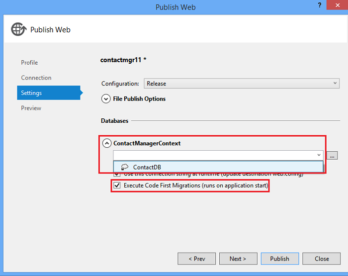

<properties 
    pageTitle="建立其他服務中 Azure 應用程式服務使用 ASP.NET Web API 與 SQL 資料庫" 
    description="此教學課程會指導您如何部署使用 Visual Studio 使用 ASP.NET Web API Azure web 應用程式至應用程式。" 
    services="app-service\web" 
    documentationCenter=".net" 
    authors="Rick-Anderson" 
    writer="Rick-Anderson" 
    manager="wpickett" 
    editor=""/>

<tags 
    ms.service="app-service-web" 
    ms.workload="web" 
    ms.tgt_pltfrm="na" 
    ms.devlang="dotnet" 
    ms.topic="article" 
    ms.date="02/29/2016" 
    ms.author="riande"/>

# 建立其他服務中 Azure 應用程式服務使用 ASP.NET Web API 與 SQL 資料庫

本教學課程中會顯示如何使用 Visual Studio 2013 或 Visual Studio 2013 社群版中的 [發佈網站精靈 」 ASP.NET web 應用程式部署至[Azure 應用程式服務](http://go.microsoft.com/fwlink/?LinkId=529714)。 

您可以開啟 Azure 帳戶免費，並且 SDK 如果您還沒有 Visual Studio 2013，會自動安裝 Web express Visual Studio 2013。 因此，您可以開始免費開發針對整個 Azure。

本教學課程，假設您已使用 Azure 沒有先前經驗。 完成本教學課程中，您必須設定簡單的 web 應用程式，並在雲端中執行。
 
您將學習︰

* 如何安裝 Azure SDK 來啟用您的電腦 Azure 開發。
* 如何建立 Visual Studio ASP.NET MVC 5 專案，並將它發佈到 Azure 應用程式。
* 如何使用 ASP.NET Web API 來啟用 Restful API 呼叫。
* 如何使用資料儲存於 Azure SQL 資料庫。
* 如何將應用程式更新發佈至 Azure。

您會建立簡單的連絡人清單 web 應用程式的內建在 ASP.NET MVC 5，並使用資料庫存取的 ADO.NET 實體架構。 下圖顯示已完成的應用程式︰

![網站的螢幕擷取畫面][intro001]

<!-- the next line produces the "Set up the development environment" section as see at http://azure.microsoft.com/documentation/articles/web-sites-dotnet-get-started/ -->
[AZURE.INCLUDE [create-account-and-websites-note](../../includes/create-account-and-websites-note.md)]

### 建立專案

1. 啟動 Visual Studio 2013。
1. 從 [**檔案**] 功能表按一下 [**新專案**]。
3. 在 [**新專案**] 對話方塊中，展開**Visual C#**並選取**網頁**，然後選取**ASP.NET Web 應用程式**。 命名**ContactManager**的應用程式，然後按一下**[確定**]。

    ![新增專案] 對話方塊](./media/web-sites-dotnet-rest-service-aspnet-api-sql-database/rr4.png)

1. 在 [**新的 ASP.NET 專案**] 對話方塊中，選取**MVC**範本，檢查**網站的 API** ，然後按一下**變更驗證**。

1. 在**變更驗證**] 對話方塊中，按一下 [**無驗證**]，然後按一下**[確定]**。

    

    您要建立範例應用程式就不必要求使用者登入的功能。 有關如何實作驗證與授權功能，請參閱在本教學課程結尾處的 [[下一步](#nextsteps)] 區段。 

1. 在 [**新的 ASP.NET 專案**] 對話方塊中，請確定已核取 [**在雲端的主機**，按一下**[確定]**。

如果您有不先前登入 Azure，系統會提示您登入。

1. 設定精靈會建議根據*ContactManager*唯一的名稱 （請參閱下方圖像）。 選取您的區域。 您可以使用[azurespeed.com](http://www.azurespeed.com/ "AzureSpeed.com")尋找最低的延遲資料中心。 
2. 如果您還沒有建立資料庫伺服器之前，請選取 [**建立新的伺服器**，輸入資料庫的使用者名稱和密碼。

    

如果您有資料庫伺服器，請使用的來建立新的資料庫。 資料庫伺服器是寶貴的資源，您通常要在相同的伺服器的測試和開發而建立的每個資料庫的資料庫伺服器上建立多個資料庫。 請確定您的網站和資料庫位於相同的區域。

### 設定的頁首及頁尾

1. 在**方案總管]**中，展開 [ *Views\Shared* ] 資料夾，然後開啟*_Layout.cshtml*檔案。

    ![在方案總管中 _Layout.cshtml][newapp004]

1. 取代下列程式碼*Views\Shared_Layout.cshtml*檔案的內容︰

        <!DOCTYPE html>
        <html lang="en">
        <head>
            <meta charset="utf-8" />
            <title>@ViewBag.Title - Contact Manager</title>
            <link href="~/favicon.ico" rel="shortcut icon" type="image/x-icon" />
            <meta name="viewport" content="width=device-width" />
            @Styles.Render("~/Content/css")
            @Scripts.Render("~/bundles/modernizr")
        </head>
        <body>
            <header>
                

                    

                        
@Html.ActionLink("Contact Manager", "Index", "Home")

                    

                

            </header>
            

                @RenderSection("featured", required: false)
                <section class="content-wrapper main-content clear-fix">
                    @RenderBody()
                </section>
            

            <footer>
                

                    

                        
&copy; @DateTime.Now.Year - Contact Manager

                    

                

            </footer>
            @Scripts.Render("~/bundles/jquery")
            @RenderSection("scripts", required: false)
        </body>
        </html>
            
上方的標記變更 「 我的 ASP.NET 應用程式 」 應用程式名稱為 「 連絡管理員 」，並移除**家用版**、**瞭解**以及**連絡人**的連結。

### 在本機上執行應用程式

1. 按下 CTRL + F5 執行應用程式。
應用程式的 [首頁] 頁面會顯示在預設瀏覽器。
    ![待辦事項清單] 首頁](./media/web-sites-dotnet-rest-service-aspnet-api-sql-database/rr5.png)

這是您只需要建立的應用程式，您會部署至 Azure 現在。 稍後您要新增的資料庫功能。

## 部署至 Azure 應用程式

1. 在 Visual Studio 中，以滑鼠右鍵按一下 [專案**總管**] 中的，然後從操作功能表選取 [**發佈]** 。

    ![發佈專案內容功能表][PublishVSSolution]

    **發佈網站**精靈 」 隨即會開啟。

12. 按一下 [**發佈**]。

![設定] 索引標籤](./media/web-sites-dotnet-rest-service-aspnet-api-sql-database/pw.png)

Visual Studio 開始將檔案複製到 Azure 伺服器的程序。 **輸出**視窗會顯示哪些部署動作是，和報表的部署完成。

14. 預設的瀏覽器會自動開啟的部署網站的 url。

    在雲端立即執行您所建立的應用程式。
    
    ![Azure 中執行的待辦事項清單] 首頁][rxz2]

## 將資料庫新增至應用程式

接下來，您將會更新 MVC 應用程式，以新增可顯示和更新連絡人儲存資料庫中的資料。 應用程式會使用實體架構，建立資料庫，以讀取和更新資料庫中的資料。

### 新增連絡人的資料模型類別

您開始建立簡單的資料模型中的程式碼。

1. 在**方案總管**] 中，以滑鼠右鍵按一下 [模型] 資料夾，按一下 [**新增**]，然後按一下 [**課程**。

    ![加入模型資料夾快顯功能表中的類別][adddb001]

2. 在 [**新增項目**] 對話方塊中命名新的類別檔案*Contact.cs*，，然後再按一下 [**新增**]。

    ![新增新的項目] 對話方塊][adddb002]

3. 下列程式碼取代 Contacts.cs 檔案的內容。

        using System.Globalization;
        namespace ContactManager.Models
        {
            public class Contact
            {
                public int ContactId { get; set; }
                public string Name { get; set; }
                public string Address { get; set; }
                public string City { get; set; }
                public string State { get; set; }
                public string Zip { get; set; }
                public string Email { get; set; }
                public string Twitter { get; set; }
                public string Self
                {
                    get { return string.Format(CultureInfo.CurrentCulture,
                         "api/contacts/{0}", this.ContactId); }
                    set { }
                }
            }
        }

**連絡**類別定義的資料，您將會儲存每一位連絡人，以及主索引鍵，ContactID 所需的資料庫。 您可以在[下一步](#nextsteps)] 區段中取得關於資料模型的詳細資訊，在本教學課程結尾處。

### 建立網頁，可讓應用程式使用者使用連絡人

ASP.NET MVC 臨時平台功能會自動產生執行的程式碼建立、 讀取、 更新及刪除 (CRUD) 動作。

## 新增一個控制器和資料檢視

1. 在**方案總管**] 中，展開控制站資料夾。

3. 建立專案**(Ctrl + Shift + B)**。 （您必須先使用臨時平台機制建置專案）。 

4. 控制站資料夾按一下滑鼠右鍵並按一下 [**新增**]，然後按一下**控制器**。

    ![控制站資料夾快顯功能表中新增控制器][addcode001]

1. 在 [**新增 Scaffold** ] 對話方塊中，選取 [ **MVC 控制站使用實體架構的檢視**，然後按一下 [**新增**。

 

6. 將**HomeController**控制器名稱。 選取**連絡人**，為您模型的類別。 按一下 [**新的資料內容**] 按鈕並接受預設的 「 ContactManager.Models.ContactManagerContext 「**新的資料內容類型**。 按一下 [**新增**]。

    對話方塊會提示您輸入: 「 檔案名稱 HomeController 已經離開。 您是否要取代它？ 」。 按一下**[是]**。 我們會覆寫常用控制器建立新的專案。 我們會使用新的常用控制器我們的連絡人清單。

    Visual Studio 建立控制器方法和**連絡人**物件的 CRUD 資料庫作業的檢視。

## 啟用移轉、 建立資料庫、 新增範例資料與資料初始設定 ##

下一步是啟用[程式碼的第一個移轉](http://curah.microsoft.com/55220)功能以建立您所建立的資料模型為基礎的資料庫。

1. 在 [**工具**] 功能表中，選取**文件庫封裝管理員**]，然後按一下 [**封裝管理員主控台**。

    ![在 [工具] 功能表中的封裝管理員主控台][addcode008]

2. 在 [**封裝管理員主控台**] 視窗中，輸入下列命令︰

        enable-migrations 
  
    **啟用移轉**命令建立*移轉*資料夾，並將其置於該資料夾*Configuration.cs*檔案，您可以編輯] 以設定移轉。 

2. 在 [**封裝管理員主控台**] 視窗中，輸入下列命令︰

        add-migration Initial

    **新增移轉初始**] 命令會產生類別命名為**&lt;date_stamp&gt;初始**建立資料庫。 （*初始*） 的第一個參數是任意和用來建立檔案的名稱。 您可以看到新的類別檔案**總管**] 中。

    在**初始**類別中，**設定**方法會建立 [連絡人] 資料表，並**向下**方法 （使用您想要回到先前的狀態） 放置至。

3. 開啟*Migrations\Configuration.cs*檔案。 

4. 新增下列命名空間。 

         using ContactManager.Models;

5. 下列程式碼取代*種子*方法︰
        
        protected override void Seed(ContactManager.Models.ContactManagerContext context)
        {
            context.Contacts.AddOrUpdate(p => p.Name,
               new Contact
               {
                   Name = "Debra Garcia",
                   Address = "1234 Main St",
                   City = "Redmond",
                   State = "WA",
                   Zip = "10999",
                   Email = "debra@example.com",
                   Twitter = "debra_example"
               },
                new Contact
                {
                    Name = "Thorsten Weinrich",
                    Address = "5678 1st Ave W",
                    City = "Redmond",
                    State = "WA",
                    Zip = "10999",
                    Email = "thorsten@example.com",
                    Twitter = "thorsten_example"
                },
                new Contact
                {
                    Name = "Yuhong Li",
                    Address = "9012 State st",
                    City = "Redmond",
                    State = "WA",
                    Zip = "10999",
                    Email = "yuhong@example.com",
                    Twitter = "yuhong_example"
                },
                new Contact
                {
                    Name = "Jon Orton",
                    Address = "3456 Maple St",
                    City = "Redmond",
                    State = "WA",
                    Zip = "10999",
                    Email = "jon@example.com",
                    Twitter = "jon_example"
                },
                new Contact
                {
                    Name = "Diliana Alexieva-Bosseva",
                    Address = "7890 2nd Ave E",
                    City = "Redmond",
                    State = "WA",
                    Zip = "10999",
                    Email = "diliana@example.com",
                    Twitter = "diliana_example"
                }
                );
        }

    上述此程式碼會以初始化資料庫的連絡資訊。 如需有關種子資料庫的詳細資訊，請參閱[偵錯實體架構 (EF) 好處](http://blogs.msdn.com/b/rickandy/archive/2013/02/12/seeding-and-debugging-entity-framework-ef-dbs.aspx)。

1. 在**封裝管理員主控台**輸入的命令︰

        update-database

    ![封裝管理員主控台] 指令][addcode009]

    **更新資料庫**執行第一個移轉建立資料庫。 根據預設，為 SQL Server Express LocalDB 資料庫建立資料庫。

1. 按下 CTRL + F5 執行應用程式。 

應用程式顯示種子資料，並提供 [編輯]、 [詳細資料和 [刪除] 連結。

![MVC 資料檢視][rxz3]

## 編輯檢視

1. 開啟*Views\Home\Index.cshtml*檔案。 在下一個步驟中，我們將會取代產生的標記與使用[jQuery](http://jquery.com/)和[Knockout.js](http://knockoutjs.com/)的程式碼。 此新的程式碼從使用 web API 及 JSON 擷取的連絡人清單，然後再將連絡人資料繫結至使用 knockout.js 使用者介面。 如需詳細資訊，請參閱在本教學課程結尾處的 [[下一步](#nextsteps)] 區段。 

2. 下列程式碼取代檔案的內容。

        @model IEnumerable<ContactManager.Models.Contact>
        @{
            ViewBag.Title = "Home";
        }
        @section Scripts {
            @Scripts.Render("~/bundles/knockout")
            
        }
        <ul id="contacts" data-bind="foreach: contacts">
            <li class="ui-widget-content ui-corner-all">
                <h1 data-bind="text: Name" class="ui-widget-header"></h1>
                

                

                    ,
                    
                    
                

                

                
Email?

                

                
Twitter?

                
<a data-bind="attr: { href: Self }, click: $root.removeContact" class="removeContact ui-state-default ui-corner-all">Remove</a>

            </li>
        </ul>
        <form id="addContact" data-bind="submit: addContact">
            <fieldset>
                <legend>Add New Contact</legend>
                <ol>
                    <li>
                        <label for="Name">Name</label>
                        <input type="text" name="Name" />
                    </li>
                    <li>
                        <label for="Address">Address</label>
                        <input type="text" name="Address" >
                    </li>
                    <li>
                        <label for="City">City</label>
                        <input type="text" name="City" />
                    </li>
                    <li>
                        <label for="State">State</label>
                        <input type="text" name="State" />
                    </li>
                    <li>
                        <label for="Zip">Zip</label>
                        <input type="text" name="Zip" />
                    </li>
                    <li>
                        <label for="Email">E-mail</label>
                        <input type="text" name="Email" />
                    </li>
                    <li>
                        <label for="Twitter">Twitter</label>
                        <input type="text" name="Twitter" />
                    </li>
                </ol>
                <input type="submit" value="Add" />
            </fieldset>
        </form>

3. 以滑鼠右鍵按一下 [內容] 資料夾，按一下 [**新增**]，然後按一下**新項目]**。

    ![新增內容的資料夾快顯功能表中的樣式表][addcode005]

4. 在**新增新的項目**] 對話方塊中，輸入**樣式**上方正確的搜尋方塊中，然後選取**樣式表**。
    ![新增新的項目] 對話方塊][rxStyle]

5. *Contacts.css*的檔案名稱，然後按一下 [**新增**]。 下列程式碼取代檔案的內容。
    
        .column {
            float: left;
            width: 50%;
            padding: 0;
            margin: 5px 0;
        }
        form ol {
            list-style-type: none;
            padding: 0;
            margin: 0;
        }
        form li {
            padding: 1px;
            margin: 3px;
        }
        form input[type="text"] {
            width: 100%;
        }
        #addContact {
            width: 300px;
            float: left;
            width:30%;
        }
        #contacts {
            list-style-type: none;
            margin: 0;
            padding: 0;
            float:left;
            width: 70%;
        }
        #contacts li {
            margin: 3px 3px 3px 0;
            padding: 1px;
            float: left;
            width: 300px;
            text-align: center;
            background-image: none;
            background-color: #F5F5F5;
        }
        #contacts li h1
        {
            padding: 0;
            margin: 0;
            background-image: none;
            background-color: Orange;
            color: White;
            font-family: Trebuchet MS, Tahoma, Verdana, Arial, sans-serif;
        }
        .removeContact, .viewImage
        {
            padding: 3px;
            text-decoration: none;
        }

    我們會使用這個樣式表的版面配置、 色彩及連絡人管理員應用程式中使用的樣式。

6. 開啟*App_Start\BundleConfig.cs*檔案。

7. 新增下列登錄[油墨廓清](http://knockoutjs.com/index.html "弩")外掛程式。

        bundles.Add(new ScriptBundle("~/bundles/knockout").Include(
                    "~/Scripts/knockout-{version}.js"));
    使用以簡化處理畫面範本的動態 JavaScript 程式碼的油墨廓清這個範例。

8. 修改登錄*contacts.css*樣式表的內容/css 項目。 變更的下列行︰

                 bundles.Add(new StyleBundle("~/Content/css").Include(
                   "~/Content/bootstrap.css",
                   "~/Content/site.css"));
若要︰

        bundles.Add(new StyleBundle("~/Content/css").Include(
                   "~/Content/bootstrap.css",
                   "~/Content/contacts.css",
                   "~/Content/site.css"));

1. 在封裝管理員主控台中，執行下列命令以安裝油墨廓清。

        Install-Package knockoutjs

## 新增 Web API Restful 介面控制器

1. 在**方案總管]**中，以滑鼠右鍵按一下控制站，然後按一下 [**新增**] 和 [**控制器...** 

1. **新增 Scaffold**在對話方塊中，輸入**Web API 2 控制器與使用實體架構的動作**，然後再按一下 [**新增**]。

    

4. 在 [**新增控制器**] 對話方塊中，輸入 「 ContactsController 」 作為控制器名稱。 選取**模型課程**的 「 連絡人 (ContactManager.Models) 」。  讓**資料內容類別**的預設值。 

6. 按一下 [**新增**]。

### 在本機上執行應用程式

1. 按下 CTRL + F5 執行應用程式。

    ![索引頁面][intro001]

2. 輸入連絡人，然後按一下 [**新增**]。 應用程式會傳回至首頁，並顯示您所輸入的連絡人。

    ![索引頁待辦事項清單項目][addwebapi004]

3. 在瀏覽器中，將**/api/contacts**附加至 URL。

    產生的 URL 會看起來像 http://localhost:1234/api 連絡人。 您新增 RESTful 網路 API 傳回儲存的連絡人。 Firefox 和 chrome 是會顯示資料的 XML 格式。

    ![索引頁待辦事項清單項目][rxFFchrome]
    

    IE 會提示您開啟或儲存連絡人。

    ![網路 API 儲存對話方塊][addwebapi006]
    
    
    您可以在記事本或瀏覽器中開啟所傳回的連絡人。
    
    輸出可由另一個應用程式，例如行動裝置的網頁或應用程式使用。

    ![網路 API 儲存對話方塊][addwebapi007]

    **安全性警告**︰ 時候，您的應用程式會不安全且容易 CSRF 攻擊。 稍後的教學課程中，我們將會移除此弱點。 如需詳細資訊請參閱[防止跨網站要求偽造 」 (CSRF) 攻擊][prevent-csrf-attacks]。
## 新增 XSRF 保護

跨網站要求偽造 （也稱為 XSRF 或 CSRF） 是攻擊 web 裝載的應用程式也就是惡意網站可能會影響用戶端瀏覽器和瀏覽器受信任的網站之間的互動。 這些攻擊所做可能是因為網頁瀏覽器會將驗證權杖使用每個要求自動傳送給網站。 標準的範例是驗證 cookie，例如 ASP。網路的表單驗證票證。 不過，可以做目標這些攻擊使用任何常設驗證機制 （例如 Windows 驗證、 基本、 等） 的網站。

XSRF 攻擊是有別於網路釣魚攻擊的。 網路釣魚攻擊需要從受害者的互動。 在網路釣魚攻擊，惡意網站會模仿目標網站，並受害者騙到攻擊者提供的機密資訊。 在 XSRF 攻擊，沒有通常互動必要的受害者。 而攻擊依賴自動傳送至目的地網站的所有相關的 cookie 瀏覽器。

如需詳細資訊，請參閱[開啟 Web 應用程式的安全性專案](https://www.owasp.org/index.php/Main_Page)(OWASP) [XSRF](https://www.owasp.org/index.php/Cross-Site_Request_Forgery_(CSRF))。

1. 在**方案總管]**中，以滑鼠右鍵**ContactManager**專案並按一下 [**新增**]，然後按一下**類別**。

2. *ValidateHttpAntiForgeryTokenAttribute.cs*的檔案名稱，並新增下列程式碼︰

        using System;
        using System.Collections.Generic;
        using System.Linq;
        using System.Net;
        using System.Net.Http;
        using System.Web.Helpers;
        using System.Web.Http.Controllers;
        using System.Web.Http.Filters;
        using System.Web.Mvc;
        namespace ContactManager.Filters
        {
            public class ValidateHttpAntiForgeryTokenAttribute : AuthorizationFilterAttribute
            {
                public override void OnAuthorization(HttpActionContext actionContext)
                {
                    HttpRequestMessage request = actionContext.ControllerContext.Request;
                    try
                    {
                        if (IsAjaxRequest(request))
                        {
                            ValidateRequestHeader(request);
                        }
                        else
                        {
                            AntiForgery.Validate();
                        }
                    }
                    catch (HttpAntiForgeryException e)
                    {
                        actionContext.Response = request.CreateErrorResponse(HttpStatusCode.Forbidden, e);
                    }
                }
                private bool IsAjaxRequest(HttpRequestMessage request)
                {
                    IEnumerable<string> xRequestedWithHeaders;
                    if (request.Headers.TryGetValues("X-Requested-With", out xRequestedWithHeaders))
                    {
                        string headerValue = xRequestedWithHeaders.FirstOrDefault();
                        if (!String.IsNullOrEmpty(headerValue))
                        {
                            return String.Equals(headerValue, "XMLHttpRequest", StringComparison.OrdinalIgnoreCase);
                        }
                    }
                    return false;
                }
                private void ValidateRequestHeader(HttpRequestMessage request)
                {
                    string cookieToken = String.Empty;
                    string formToken = String.Empty;
                    IEnumerable<string> tokenHeaders;
                    if (request.Headers.TryGetValues("RequestVerificationToken", out tokenHeaders))
                    {
                        string tokenValue = tokenHeaders.FirstOrDefault();
                        if (!String.IsNullOrEmpty(tokenValue))
                        {
                            string[] tokens = tokenValue.Split(':');
                            if (tokens.Length == 2)
                            {
                                cookieToken = tokens[0].Trim();
                                formToken = tokens[1].Trim();
                            }
                        }
                    }
                    AntiForgery.Validate(cookieToken, formToken);
                }
            }
        }

1. 好讓您存取**[ValidateHttpAntiForgeryToken]**屬性，則您可以加入合約控制器下列*使用*陳述式。

        using ContactManager.Filters;

1. 新增文章的方法來防止 XSRF 威脅**ContactsController** **[ValidateHttpAntiForgeryToken]**屬性。 您會將其新增至 「 PutContact 」、 「 PostContact 」 及**DeleteContact**動作方法。

        [ValidateHttpAntiForgeryToken]
            public IHttpActionResult PutContact(int id, Contact contact)
            {

1. 更新包含代碼以取得 XSRF 權杖*Views\Home\Index.cshtml*檔案的*指令碼*] 區段。

         @section Scripts {
            @Scripts.Render("~/bundles/knockout")
            
         }

## 將應用程式更新發佈至 Azure 和 SQL 資料庫

若要發佈應用程式，您可以重複您先前已追蹤的程序。

1. 在**方案總管]**中，以滑鼠右鍵按一下專案，然後選取 [**發佈]**。

    ![發佈][rxP]

5. 按一下 [**設定**] 索引標籤。
    

1. 按一下 [ **ContactsManagerContext(ContactsManagerContext)**， **v**圖示，若要變更連絡人的資料庫的連線字串*遠端的連線字串*。 按一下 [ **ContactDB**]。

    

7. 核取方塊，以**執行程式碼第一個**移轉時 （在 [應用程式開始執行）。

1. 按一下 [**下一步**，然後按一下 [**預覽**]。 Visual Studio 顯示的檔案，將會新增或更新的清單。

8. 按一下 [**發佈**]。
部署完成後，在瀏覽器會開啟 [首頁] 頁面的應用程式。

    ![與任何連絡人索引頁面][intro001]

    Visual Studio 發佈程序會自動設定部署*Web.config*檔案以指向 [SQL 資料庫中的連接字串。 它也設定程式碼的第一個移轉將自動資料庫升級為最新版本的應用程式存取資料庫部署後第一次。

    由於這個設定，程式碼第一個建立資料庫的您先前建立的**初始**類別中執行的程式碼。 同時包含此應用程式嘗試存取資料庫部署後第一次。

9. 當您執行的應用程式，以驗證資料庫部署成功一樣，請輸入連絡人。

當您看到您所輸入的項目會儲存，而且會出現在 [連絡人管理員] 頁面上時，就會知道的資料庫中將其儲存。

![與連絡人索引頁面][addwebapi004]

應用程式現在執行在雲端，若要將資料儲存使用 SQL 資料庫。 Azure 中測試應用程式之後，請將其刪除。 應用程式為公用群組，並不會有限制存取機制。

>[AZURE.NOTE] 如果您想要開始使用 Azure 應用程式服務註冊 Azure 帳戶之前，請移至[嘗試應用程式服務](http://go.microsoft.com/fwlink/?LinkId=523751)，可以讓您立即建立短暫入門 web 應用程式在應用程式服務。 必要; 沒有信用卡沒有承諾。

## 後續步驟

實際的應用程式需要驗證與授權，和您想要使用的成員資格資料庫的用途。 [部署 OAuth、 成員資格與 SQL 資料庫的安全 ASP.NET MVC 應用程式](web-sites-dotnet-deploy-aspnet-mvc-app-membership-oauth-sql-database.md)教學課程此教學課程為基礎，並示範如何部署與成員資格資料庫的 web 應用程式。

Azure 應用程式中儲存資料的另一個方法是使用 Azure 儲存空間，其中提供非關聯式資料儲存在表單中的二進位大型物件和表格。 下列連結提供 Web API、 ASP.NET MVC 和視窗 Azure 的詳細資訊。
 

* [使用 MVC 的實體架構快速入門][EFCodeFirstMVCTutorial]
* [ASP.NET MVC 5 簡介](http://www.asp.net/mvc/tutorials/mvc-5/introduction/getting-started)
* [第一個 ASP.NET Web API](http://www.asp.net/web-api/overview/getting-started-with-aspnet-web-api/tutorial-your-first-web-api)
* [偵錯 WAWS](web-sites-dotnet-troubleshoot-visual-studio.md)

本教學課程和範例應用程式所撰寫[Rtf Anderson](http://blogs.msdn.com/b/rickandy/) (Twitter [@RickAndMSFT](https://twitter.com/RickAndMSFT)) 明揚 Dykstra 和 Barry Dorrans 的協助 (Twitter [@blowdart](https://twitter.com/blowdart))。 

請在您按讚，或您想要查看上的 [離開意見反應改良，而不只是本身教學課程的相關的產品，它會示範。 您的意見反應可協助我們排列優先順序的改良功能。 我們特別是感興趣找出在多個自動化程序中的設定及部署成員資格資料庫有多少利息。 

## 變更的項目
* 若要變更的指南，從網站應用程式服務請參閱︰ [Azure 應用程式服務與程式影響現有 Azure 服務](http://go.microsoft.com/fwlink/?LinkId=529714)

<!-- bookmarks -->
[Add an OAuth Provider]: #addOauth
[Add Roles to the Membership Database]:#mbrDB
[Create a Data Deployment Script]:#ppd
[Update the Membership Database]:#ppd2
[setupdbenv]: #bkmk_setupdevenv
[setupwindowsazureenv]: #bkmk_setupwindowsazure
[createapplication]: #bkmk_createmvc4app
[deployapp1]: #bkmk_deploytowindowsazure1
[adddb]: #bkmk_addadatabase
[addcontroller]: #bkmk_addcontroller
[addwebapi]: #bkmk_addwebapi
[deploy2]: #bkmk_deploydatabaseupdate

<!-- links -->
[EFCodeFirstMVCTutorial]: http://www.asp.net/mvc/tutorials/getting-started-with-ef-using-mvc/creating-an-entity-framework-data-model-for-an-asp-net-mvc-application
[dbcontext-link]: http://msdn.microsoft.com/library/system.data.entity.dbcontext(v=VS.103).aspx

<!-- images-->
[rxE]: ./media/web-sites-dotnet-rest-service-aspnet-api-sql-database/rxE.png
[rxP]: ./media/web-sites-dotnet-rest-service-aspnet-api-sql-database/rxP.png
[rx22]: ./media/web-sites-dotnet-rest-service-aspnet-api-sql-database/
[rxb2]: ./media/web-sites-dotnet-rest-service-aspnet-api-sql-database/rxb2.png
[rxz]: ./media/web-sites-dotnet-rest-service-aspnet-api-sql-database/rxz.png
[rxzz]: ./media/web-sites-dotnet-rest-service-aspnet-api-sql-database/rxzz.png
[rxz2]: ./media/web-sites-dotnet-rest-service-aspnet-api-sql-database/rxz2.png
[rxz3]: ./media/web-sites-dotnet-rest-service-aspnet-api-sql-database/rxz3.png
[rxStyle]: ./media/web-sites-dotnet-rest-service-aspnet-api-sql-database/rxStyle.png
[rxz4]: ./media/web-sites-dotnet-rest-service-aspnet-api-sql-database/rxz4.png
[rxz44]: ./media/web-sites-dotnet-rest-service-aspnet-api-sql-database/rxz44.png
[rxNewCtx]: ./media/web-sites-dotnet-rest-service-aspnet-api-sql-database/rxNewCtx.png
[rxPrevDB]: ./media/web-sites-dotnet-rest-service-aspnet-api-sql-database/rxPrevDB.png
[rxOverwrite]: ./media/web-sites-dotnet-rest-service-aspnet-api-sql-database/rxOverwrite.png
[rxPWS]: ./media/web-sites-dotnet-rest-service-aspnet-api-sql-database/rxPWS.png
[rxNewCtx]: ./media/web-sites-dotnet-rest-service-aspnet-api-sql-database/rxNewCtx.png
[rxAddApiController]: ./media/web-sites-dotnet-rest-service-aspnet-api-sql-database/rxAddApiController.png
[rxFFchrome]: ./media/web-sites-dotnet-rest-service-aspnet-api-sql-database/rxFFchrome.png
[intro001]: ./media/web-sites-dotnet-rest-service-aspnet-api-sql-database/dntutmobil-intro-finished-web-app.png
[rxCreateWSwithDB]: ./media/web-sites-dotnet-rest-service-aspnet-api-sql-database/rxCreateWSwithDB.png
[setup007]: ./media/web-sites-dotnet-rest-service-aspnet-api-sql-database/dntutmobile-setup-azure-site-004.png
[setup009]: ../Media/dntutmobile-setup-azure-site-006.png
[newapp002]: ./media/web-sites-dotnet-rest-service-aspnet-api-sql-database/dntutmobile-createapp-002.png
[newapp004]: ./media/web-sites-dotnet-rest-service-aspnet-api-sql-database/dntutmobile-createapp-004.png
[firsdeploy007]: ./media/web-sites-dotnet-rest-service-aspnet-api-sql-database/dntutmobile-deploy1-publish-005.png
[firsdeploy009]: ./media/web-sites-dotnet-rest-service-aspnet-api-sql-database/dntutmobile-deploy1-publish-007.png
[adddb001]: ./media/web-sites-dotnet-rest-service-aspnet-api-sql-database/dntutmobile-adddatabase-001.png
[adddb002]: ./media/web-sites-dotnet-rest-service-aspnet-api-sql-database/dntutmobile-adddatabase-002.png
[addcode001]: ./media/web-sites-dotnet-rest-service-aspnet-api-sql-database/dntutmobile-controller-add-context-menu.png
[addcode002]: ./media/web-sites-dotnet-rest-service-aspnet-api-sql-database/dntutmobile-controller-add-controller-dialog.png
[addcode004]: ./media/web-sites-dotnet-rest-service-aspnet-api-sql-database/dntutmobile-controller-modify-index-context.png
[addcode005]: ./media/web-sites-dotnet-rest-service-aspnet-api-sql-database/dntutmobile-controller-add-contents-context-menu.png
[addcode007]: ./media/web-sites-dotnet-rest-service-aspnet-api-sql-database/dntutmobile-controller-modify-bundleconfig-context.png
[addcode008]: ./media/web-sites-dotnet-rest-service-aspnet-api-sql-database/dntutmobile-migrations-package-manager-menu.png
[addcode009]: ./media/web-sites-dotnet-rest-service-aspnet-api-sql-database/dntutmobile-migrations-package-manager-console.png
[addwebapi004]: ./media/web-sites-dotnet-rest-service-aspnet-api-sql-database/dntutmobile-webapi-added-contact.png
[addwebapi006]: ./media/web-sites-dotnet-rest-service-aspnet-api-sql-database/dntutmobile-webapi-save-returned-contacts.png
[addwebapi007]: ./media/web-sites-dotnet-rest-service-aspnet-api-sql-database/dntutmobile-webapi-contacts-in-notepad.png
[Add XSRF Protection]: #xsrf
[WebPIAzureSdk20NetVS12]: ./media/web-sites-dotnet-rest-service-aspnet-api-sql-database/WebPIAzureSdk20NetVS12.png
[Add XSRF Protection]: #xsrf
[ImportPublishSettings]: ./media/web-sites-dotnet-rest-service-aspnet-api-sql-database/ImportPublishSettings.png
[ImportPublishProfile]: ./media/web-sites-dotnet-rest-service-aspnet-api-sql-database/ImportPublishProfile.png
[PublishVSSolution]: ./media/web-sites-dotnet-rest-service-aspnet-api-sql-database/PublishVSSolution.png
[ValidateConnection]: ./media/web-sites-dotnet-rest-service-aspnet-api-sql-database/ValidateConnection.png
[WebPIAzureSdk20NetVS12]: ./media/web-sites-dotnet-rest-service-aspnet-api-sql-database/WebPIAzureSdk20NetVS12.png
[prevent-csrf-attacks]: http://www.asp.net/web-api/overview/security/preventing-cross-site-request-forgery-(csrf)-attacks
 
