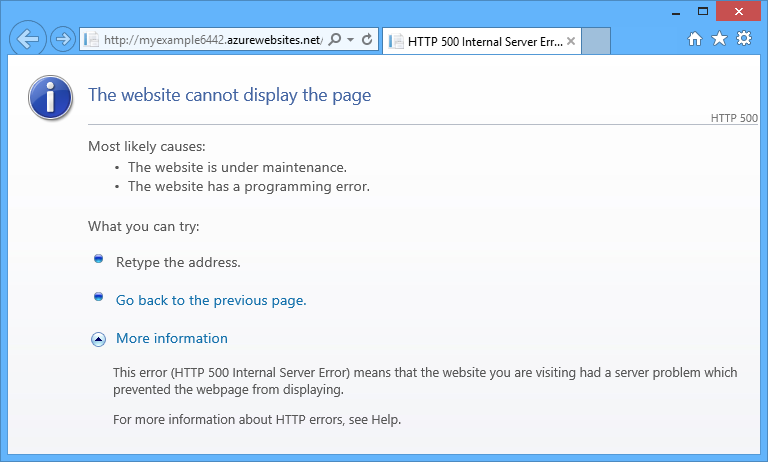
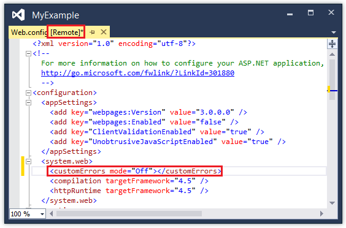
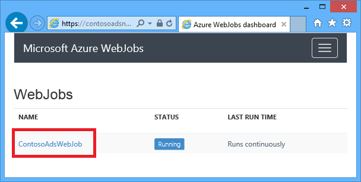
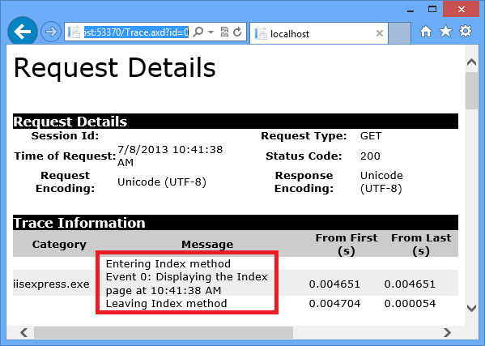
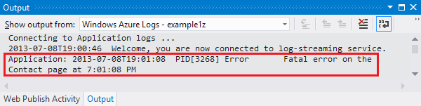
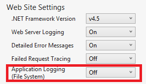
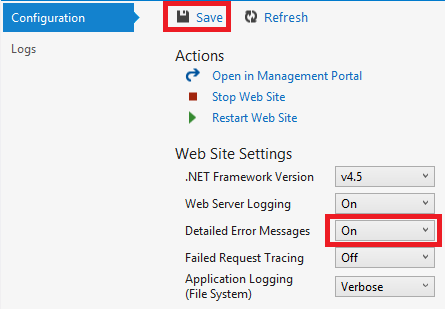
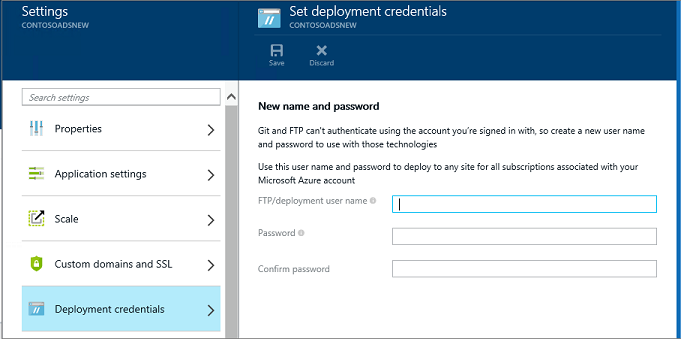
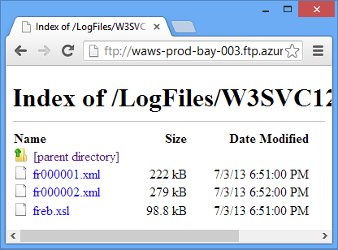

<properties 
    pageTitle="疑難排解 Azure 應用程式服務使用 Visual Studio 中的 web 應用程式" 
    description="瞭解如何使用遠端偵錯、 追蹤和 Visual Studio 2013 建立的記錄工具，即可疑難排解在 Azure web 應用程式。" 
    services="app-service" 
    documentationCenter=".net" 
    authors="tdykstra" 
    manager="wpickett" 
    editor=""/>

<tags 
    ms.service="app-service" 
    ms.workload="na" 
    ms.tgt_pltfrm="na" 
    ms.devlang="dotnet" 
    ms.topic="article" 
    ms.date="08/29/2016" 
    ms.author="rachelap"/>

# 疑難排解 Azure 應用程式服務使用 Visual Studio 中的 web 應用程式

## 概觀

本教學課程中會顯示如何使用 Visual Studio 工具，可協助偵錯在[應用程式服務](http://go.microsoft.com/fwlink/?LinkId=529714)中的 web 應用程式，藉由從遠端執行中[偵錯模式](http://www.visualstudio.com/get-started/debug-your-app-vs.aspx)或檢視應用程式的記錄，以及網頁伺服器記錄。

[AZURE.INCLUDE [app-service-web-to-api-and-mobile](../../includes/app-service-web-to-api-and-mobile.md)]

您將學習︰

* 哪些 Azure web 應用程式管理功能，可在 Visual Studio 中。
* 若要快速變更遠端 web 應用程式中使用 Visual Studio 遠端檢視方式。
* Web 應用程式和 WebJob Azure 正在執行遠端時專案的偵錯模式的執行方式。
* 如何建立應用程式追蹤記錄，並檢視應用程式時就建立它們。
* 如何檢視 web 伺服器記錄，包括詳細的錯誤訊息，無法要求追蹤。
* 如何傳送診斷記錄至 Azure 儲存體帳戶，並那里檢視。

如果您有 Visual Studio 最終，您也可以使用[IntelliTrace](http://msdn.microsoft.com/library/vstudio/dd264915.aspx)偵錯。 IntelliTrace 並不會包含在本教學課程。

## 必要條件

本教學課程的運作的開發環境、 web 專案和 Azure web 應用程式中[開始使用 Azure 與 ASP.NET]設定[GetStarted]。 針對 WebJobs 各節中，您必須在應用程式中[開始使用 Azure WebJobs SDK]，您建立[GetStartedWJ]。

在此教學課程中所顯示的程式碼範例 C# MVC web 應用程式，但疑難排解的程序也適用於 Visual Basic 及網頁表單應用程式。

教學課程，假設您使用 Visual Studio 2015 或 2013年。 如果您使用 Visual Studio 2013，WebJobs 功能需要[更新 4](http://go.microsoft.com/fwlink/?LinkID=510314)或更新版本。 

串流的記錄功能只適用於.NET Framework 4 或更新版本的目標應用程式。

## Web 應用程式設定及管理

Visual Studio 提供存取 web 應用程式管理功能和設定的設定[Azure 入口網站](http://go.microsoft.com/fwlink/?LinkId=529715)提供的子集。 此區段中，您會看到什麼是使用**伺服器檔案總管**，可使用。 若要查看最新的 Azure 整合功能，也試用**雲端的檔案總管**。 您可以從 [**檢視**] 功能表開啟這兩個視窗。 

1. 如果您不已登入 Azure Visual Studio 中，按一下 [**伺服器總管**] 中的 [**連線至 Azure** ] 按鈕。

    另一個方法是安裝管理憑證能夠存取您的帳戶。 如果您選擇安裝憑證， **Azure**中的節點**伺服器總管]**，以滑鼠右鍵按一下，然後按一下快顯功能表中的 [**管理和篩選訂閱**。 在**管理 Azure 訂閱**] 對話方塊中，按一下 [**憑證**] 索引標籤，然後按一下 [**匯入**。 Azure 帳戶，請遵循指示以下載，然後再匯入訂閱檔案 （也稱為*.publishsettings*檔案）。

    > [AZURE.NOTE]
    > 如果您下載訂閱檔案，請將其儲存到外部來源 （例如，在 [下載] 資料夾），程式碼目錄的資料夾，然後完成匯入後再將它刪除。 惡意使用者會取得訂閱檔案的存取權，都可以編輯、 建立及刪除 Azure 服務。

    如需有關如何從 Visual Studio 連線至 Azure 資源的詳細資訊，請參閱[管理帳戶、 訂閱及系統管理角色](http://go.microsoft.com/fwlink/?LinkId=324796#BKMK_AccountVCert)。

2. 在 [**伺服器總管]**中，展開**Azure** ，展開 [**應用程式服務**。

3. 展開包含您所建立的[快速入門 Azure 和 ASP.NET]web 應用程式的資源群組[GetStarted]，然後以滑鼠右鍵按一下網頁應用程式節點並按一下 [**檢視設定**。

    

    **Azure Web 應用程式**] 索引標籤隨即出現，而您那里可以看到的 web 應用程式管理及設定工作所提供的 Visual Studio。

    ![Azure Web App] 視窗](./media/web-sites-dotnet-troubleshoot-visual-studio/tws-configtab.png)

    在此教學課程中您要使用的記錄及追蹤] 下拉式清單。 您也可以使用遠端偵錯，但您會使用不同的方法，讓它。
   
    在這個視窗中的 [應用程式設定] 和 [連線字串] 方塊的相關資訊，請參閱[Azure Web 應用程式︰ 如何應用程式字串和連線字串工時](http://blogs.msdn.com/b/windowsazure/archive/2013/07/17/windows-azure-web-sites-how-application-strings-and-connection-strings-work.aspx)。

    如果您想要執行這個視窗中，無法執行的 web 應用程式管理工作，請按一下 [以開啟 Azure 入口網站的瀏覽器視窗的 [**管理入口網站中開啟**]。

## 伺服器總管] 中的 access web 應用程式檔案

您通常部署網頁的專案`customErrors`設定為 [Web.config 檔案中的旗標`On`或`RemoteOnly`，這表示您沒有收到很有幫助的錯誤訊息時內容發生錯誤。 許多錯誤所有您收到是類似以下的文件的頁面。

**「 / 」 應用程式中的伺服器錯誤︰**

**發生錯誤︰**

**網站無法顯示網頁**

通常最簡單的方法，尋找錯誤的原因是，啟用詳細的錯誤訊息，先前的螢幕擷取畫面中的第一個說明如何進行。 需要部署 Web.config 檔案中的變更。 您無法編輯*專案中的 web.config*和重新部署專案，或建立[Web.config 轉換](http://www.asp.net/mvc/tutorials/deployment/visual-studio-web-deployment/web-config-transformations)及部署偵錯組建，但還有更快的方法︰ 在**方案總管**中您可以直接檢視及編輯檔案遠端 web 應用程式中的使用*遠端檢視*功能。

1. 在 [**伺服器總管]**中，展開**Azure**、 展開 [**應用程式服務**、 展開 [資源] 群組中，位於您的 web 應用程式，然後展開 web 應用程式的節點。

    您會看到您存取權授與 web 應用程式的內容的檔案和記錄檔的節點。

2. 展開 [**檔案**] 節點並按兩下*Web.config*檔案。

    

    Visual Studio 從遠端的 web 應用程式開啟 Web.config 檔案，然後顯示標題列中的檔案名稱] 旁的 [遠端]。

3. 新增至下行`system.web`項目︰

    `<customErrors mode="Off"></customErrors>`

    

4. 重新整理瀏覽器顯示沒有幫助的錯誤訊息，並立即您取得詳細的錯誤訊息，如下列範例︰

    

    （藉由新增*Views\Home\Index.cshtml*顯示紅色線條已建立所顯示的錯誤）。

編輯 Web.config 檔是只有一個範例案例在其中進行疑難排解更加容易閱讀及上 Azure web 應用程式編輯檔案的能力。

## 遠端偵錯的 web 應用程式

如果詳細的錯誤訊息並不提供資訊不足，您無法重新建立本機錯誤疑難排解的另一種方法是從遠端執行偵錯模式中。 您可以設定中斷點、 直接操作記憶體、 逐步執行程式碼，甚至將程式碼的路徑。 

遠端偵錯無法運作的 Visual Studio Express 版本。

本節說明如何使用您在中[快速入門 Azure 和 ASP.NET]建立的專案遠端偵錯[GetStarted]。

1. 開啟您建立的[快速入門 Azure 和 ASP.NET]web 專案[GetStarted]。

1. 開啟*Controllers\HomeController.cs*。

2. 刪除`About()`方法] 和 [插入其位置中的下列程式碼。

        public ActionResult About()
        {
            string currentTime = DateTime.Now.ToLongTimeString();
            ViewBag.Message = "The current time is " + currentTime;
            return View();
        }

2. 在 [[設定中斷點](http://www.visualstudio.com/get-started/debug-your-app-vs.aspx)`ViewBag.Message`線條。

1. 在**方案總管] 中**的專案，以滑鼠右鍵按一下，然後按一下 [**發佈**]。

2. 在**設定檔**] 下拉式清單中，選取 [在中[快速入門 Azure 和 ASP.NET]所使用的設定檔[GetStarted]。

3. 按一下 [**設定**] 索引標籤和欲**偵錯**，變更**設定**，然後按一下 [**發佈**。

    

4. 部署後完成和您的瀏覽器會開啟至 Azure URL web 應用程式，請關閉瀏覽器。

5. 在**伺服器總管**] 中，以滑鼠右鍵按一下您的 web 應用程式，然後按一下**附加偵錯工具**。 

    

    在瀏覽器會自動開啟至首頁 Azure 中執行。 您可能必須等候 20 秒 Azure 將偵錯的伺服器設定。 此延遲只會發生在 web 應用程式執行偵錯模式中的第一次。 當您再次啟動偵錯有下一步 48 小時內的後續時間將不會延遲。

    **附註︰**如果您有啟動偵錯任何問題，請嘗試使用**雲端的檔案總管**，而不是**伺服器總管]**。

6. 在功能表中，按一下 [**關於**]。

    Visual Studio 停止上中斷點，且不在您的本機電腦上執行的程式碼中 Azure。

7. 將游標停留在`currentTime`變數，請參閱時間值。

    

    您看到的時間是 Azure 伺服器時，可能是在不同的時區，於您的本機電腦。

8. 輸入新值`currentTime`變數，例如 「 立即執行 Azure 中 」。

5. 按 F5 以繼續執行。

    執行 Azure 中的 [關於] 頁面會顯示與您在 currentTime 變數輸入新的值。

    

## 遠端偵錯 WebJobs

本節說明如何偵錯遠端使用您在[開始使用 Azure WebJobs SDK](websites-dotnet-webjobs-sdk.md)建立專案和 web 應用程式。 

此區段中所顯示的功能可只在 Visual Studio 2013 更新 4 或更新版本。 

遠端偵錯只適用於連續 WebJobs。 排程與視 WebJobs 不支援偵錯。

1. 開啟您在[開始使用 Azure WebJobs SDK]建立 web 專案[GetStartedWJ]。

1. 在 ContosoAdsWebJob 專案中，開啟*Functions.cs*。

2. [第一個陳述式中的 [[設定中斷點](http://www.visualstudio.com/get-started/debug-your-app-vs.aspx)`GnerateThumbnail`方法。

    

1. 在**方案總管**] 中，以滑鼠右鍵按一下網頁專案 （不是 WebJob 專案），然後按一下**發佈**。

2. 在**設定檔**] 下拉式清單中，選取您使用的[快速入門 Azure WebJobs SDK](websites-dotnet-webjobs-sdk.md)的設定檔。

3. 按一下 [**設定**] 索引標籤和欲**偵錯**，變更**設定**，然後按一下 [**發佈**。

    Visual Studio 中部署網頁和 WebJob 專案，並在瀏覽器開啟 Azure url web 應用程式。

5. **伺服器總管**] 中展開**Azure > 應用程式服務 > 資源群組 > web 應用程式 > WebJobs > 連續**，然後以滑鼠右鍵按一下**ContosoAdsWebJob**。

7. 按一下 [**附加偵錯工具**]。 

    

    在瀏覽器會自動開啟至首頁 Azure 中執行。 您可能必須等候 20 秒 Azure 將偵錯的伺服器設定。 此延遲只會發生在 web 應用程式執行偵錯模式中的第一次。 下次您附加偵錯工具有不會延遲，如果您執行 48 小時內。

6. 在網頁瀏覽器會開啟至 Contoso 廣告首頁，建立新的廣告。 

    建立 ad 會使佇列來建立訊息，將收取的 WebJob 並處理。 當 WebJobs SDK 呼叫處理佇列中訊息函數時，程式碼會叫用中斷點。

7. 當您中斷點中斷偵錯工具時，您可以檢查及雲端執行程式時變更變數的值。 下列圖例中偵錯工具會顯示已傳遞至 GenerateThumbnail 方法 blobInfo 物件的內容。

    
 
5. 按 F5 以繼續執行。

    GenerateThumbnail 方法完成建立縮圖。

6. 在瀏覽器中，重新整理 [索引] 頁面，您會看到縮圖。

6. 在 Visual Studio 中，按下 SHIFT + F5 停止偵錯。

7. 在**伺服器總管**] 中，以滑鼠右鍵按一下 ContosoAdsWebJob 節點並按一下**檢視儀表板**。

8. 使用您的 Azure 認證，登入，然後按一下 [移至頁面，針對您 WebJob WebJob 名稱。 

    

    儀表板顯示最近執行 GenerateThumbnail 函數。

    （下次當您按一下 [**檢視儀表板**，您不必登入，和在瀏覽器直接移至頁面的您 WebJob）。

9. 按一下 [若要查看詳細函數執行的函數名稱]。

    

如果您函數[寫記錄](websites-dotnet-webjobs-sdk-storage-queues-how-to.md#logs)，您也可以按一下以查看其**ToggleOutput** 。

## 遠端偵錯的相關附註

* 建議您不要執行生產環境中的偵錯模式。 如果生產 web 應用程式不延展到多個伺服器執行個體，則偵錯時，將無法從回應其他要求的網頁伺服器。 如果您的確具備多的網頁伺服器執行個體，當您附加至偵錯工具就會顯示為隨機的執行個體，與您有任何方式可確保後續的瀏覽器要求會移至該執行個體。 此外，您通常不部署偵錯組建生產，與編譯器最佳化的發行版本可能會使其不顯示有什麼新鮮事逐行程式碼。 如需疑難排解生產問題，您最佳的資源是應用程式追蹤與網頁伺服器記錄。

* 避免在中斷點時遠端長停駐點偵錯。 Azure 處理程序，停止超過幾分鐘的時間短時間無反應程序，並將其關閉。

* 您偵錯時，伺服器傳送資料至 Visual Studio 中，可能會影響頻寬費用。 有關頻寬費率，請參閱[Azure 價格](/pricing/calculator/)。

* 請確定`debug`屬性`compilation` *Web.config*檔案中的項目設為 true。 設定為 [依預設，當您發佈的偵錯組建設定，則為 true。

        <system.web>
          <compilation debug="true" targetFramework="4.5" />
          <httpRuntime targetFramework="4.5" />
        </system.web>

* 如果您發現偵錯工具無法進入您想要偵錯的程式碼，您可能只是我的程式碼設定變更。  如需詳細資訊，請參閱[限制逐步執行只是我的程式碼](http://msdn.microsoft.com/library/vstudio/y740d9d3.aspx#BKMK_Restrict_stepping_to_Just_My_Code)。

* 在伺服器上的計時器開始，當您啟用遠端偵錯功能，並 48 小時後功能會自動關閉。 基於安全性和效能完成此 48 小時限制。 您可以輕鬆地功能再次開啟您要的次數。 我們建議您保留它不主動偵錯時停用。

* 您可以手動附加偵錯工具，任何程序，不僅 web 應用程式程序 (w3wp.exe)。 如需有關如何在 Visual Studio 中使用偵錯模式的詳細資訊，請參閱[偵錯 Visual Studio 中](http://msdn.microsoft.com/library/vstudio/sc65sadd.aspx)。

## 診斷記錄概觀

Azure web 應用程式中執行的 ASP.NET 應用程式，可以建立下列類型的記錄︰

* **應用程式追蹤記錄** 
  在應用程式建立這些記錄，則可電話[System.Diagnostics.Trace](http://msdn.microsoft.com/library/system.diagnostics.trace.aspx)類別的方法。
* **網頁伺服器記錄檔** 
  網頁伺服器建立至 web 應用程式的每個 HTTP 要求的記錄項目。
* **詳細的錯誤訊息記錄** 
  網頁伺服器建立 HTML 頁面失敗 HTTP 要求 （即會導致 400 或更大的狀態碼） 的一些其他資訊。 
* **無法要求追蹤記錄檔** 
  網頁伺服器會建立詳細的追蹤資訊失敗 HTTP 要求的 XML 檔案。 網頁伺服器也提供若要設定格式的在瀏覽器中的 XML 的 XSL 檔案。
  
記錄會影響 web 應用程式的效能，因此 Azure 可讓您以啟用或停用各種類型的記錄，視需要。 應用程式的記錄檔，您可以指定應該才能寫入上方特定重要性層級的記錄檔。 當您建立新的 web 應用程式中，依預設所有記錄會停用。

記錄會寫入到您的 web 應用程式的檔案系統中*的記錄檔*資料夾中的檔案，可透過 FTP。 網頁伺服器記錄，以及應用程式記錄也可以撰寫 Azure 儲存體帳戶。 您可以保留儲存帳戶比檔案系統中的記錄提高音量。 當您使用的檔案系統，您可以限制為 100 mb 記錄檔的最大值。 （僅適用於短期保留是檔案系統的記錄。 Azure 刪除舊的記錄檔，若要達到限制之後新的空間。）  

## 建立和檢視應用程式追蹤記錄檔

此區段中，您必須執行下列工作︰

* 您在[開始使用 Azure 與 ASP.NET]web 專案中新增追蹤陳述式[GetStarted]。
* 當您在本機上執行專案時，請檢視記錄檔。
* 為所產生 Azure 中執行的應用程式，請檢視 [記錄]。 

如需有關如何建立應用程式資訊 WebJobs 登入時，請參閱[如何使用 Azure 佇列中的儲存空間使用 WebJobs SDK-如何寫入記錄檔，](websites-dotnet-webjobs-sdk-storage-queues-how-to.md#logs)。 下列指示，檢視記錄及控制如何它們儲存在 Azure 也套用到應用程式 WebJobs 所建立的記錄檔。 

### 新增至應用程式的追蹤陳述式

1. 開啟*Controllers\HomeController.cs*，並取代`Index`， `About`，及`Contact`才能新增下列程式碼的方法`Trace`陳述式和`using`陳述式`System.Diagnostics`:

        public ActionResult Index()
        {
            Trace.WriteLine("Entering Index method");
            ViewBag.Message = "Modify this template to jump-start your ASP.NET MVC application.";
            Trace.TraceInformation("Displaying the Index page at " + DateTime.Now.ToLongTimeString());
            Trace.WriteLine("Leaving Index method");
            return View();
        }
        
        public ActionResult About()
        {
            Trace.WriteLine("Entering About method");
            ViewBag.Message = "Your app description page.";
            Trace.TraceWarning("Transient error on the About page at " + DateTime.Now.ToShortTimeString());
            Trace.WriteLine("Leaving About method");
            return View();
        }
        
        public ActionResult Contact()
        {
            Trace.WriteLine("Entering Contact method");
            ViewBag.Message = "Your contact page.";
            Trace.TraceError("Fatal error on the Contact page at " + DateTime.Now.ToLongTimeString());
            Trace.WriteLine("Leaving Contact method");
            return View();
        }       

2. 新增`using System.Diagnostics;`檔案頂端的陳述式。
                
### 檢視追蹤輸出至本機

3. 按 F5 偵錯模式中執行應用程式。

    預設追蹤接聽會將所有的追蹤輸出至**輸出**視窗中，以及其他偵錯的輸出。 下圖顯示您新增至追蹤陳述式的輸出`Index`方法。

    ![在 [偵錯] 視窗中追蹤](./media/web-sites-dotnet-troubleshoot-visual-studio/tws-debugtracing.png)

    下列步驟說明如何在網頁上，檢視追蹤輸出，不需要編譯偵錯模式。

2. 開啟應用程式 Web.config 檔案 （位於 [專案] 資料夾中的項目），並新增`<system.diagnostics>`結尾的結束檔案的項目`</configuration>`項目︰

        <system.diagnostics>
            <trace>
              <listeners>
                <add name="WebPageTraceListener"
                    type="System.Web.WebPageTraceListener, 
                    System.Web, 
                    Version=4.0.0.0, 
                    Culture=neutral,
                    PublicKeyToken=b03f5f7f11d50a3a" />
              </listeners>
            </trace>
          </system.diagnostics>

    `WebPageTraceListener`可讓您檢視瀏覽至追蹤輸出`/trace.axd`。

3. 新增下一個<a href="http://msdn.microsoft.com/library/vstudio/6915t83k(v=vs.100).aspx">追蹤項目</a> `<system.web>` Web.config 檔案，如下列範例中︰

        <trace enabled="true" writeToDiagnosticsTrace="true" mostRecent="true" pageOutput="false" />

3. 按下 CTRL + F5 執行應用程式。

4. 在瀏覽器視窗的網址列中新增*trace.axd* URL，然後按一下的 Enter （URL 會類似 http://localhost:53370/trace.axd）。

5. 在**應用程式追蹤**頁面上，按一下 [**檢視詳細資料**的第一行 （不 BrowserLink 線條）。

    

    出現**要求的詳細資料**頁面，並**追蹤資訊**] 區段中看到您新增至追蹤陳述式的輸出`Index`方法。

    

    根據預設，`trace.axd`只適用於本機。 如果您想要使其可從遠端的 web 應用程式，您可以新增`localOnly="false"`至`trace`在*Web.config*檔案中，如下列範例所示的項目︰

        <trace enabled="true" writeToDiagnosticsTrace="true" localOnly="false" mostRecent="true" pageOutput="false" />

    不過，啟用`trace.axd`生產 web 應用程式通常不建議基於安全性理由，和在下列各節中，您會看到容易閱讀追蹤 Azure web 應用程式中的記錄。

### 檢視追蹤輸出 Azure 中

1. 在**方案總管]**中，以滑鼠右鍵按一下 web 專案，然後按一下 [**發佈**]。

2. 在**發佈網站**] 對話方塊中，按一下 [**發佈**]。

    Visual Studio 發佈您的更新後，它會開啟至首頁 （假設您未清除 [**連線**] 索引標籤上的 [**目的地 URL** ） 在瀏覽器視窗。

3. 在**伺服器總管**] 中，以滑鼠右鍵按一下您的 web 應用程式並選取**檢視串流記錄檔**。 

    

    **輸出**視窗會顯示您連線到記錄串流的服務，並將通知線新增記錄以顯示不會按照每分鐘。

    

4. 在瀏覽器視窗，顯示您的應用程式的首頁，按一下 [**連絡人**]。

    在數秒內錯誤層級的輸出追蹤您新增至`Contact`方法會出現在 [**輸出**視窗中。

    

    Visual Studio 只會顯示錯誤層級追蹤，因為這是預設的設定，當您啟用監視服務的記錄檔。 當您建立新的 Azure web 應用程式時，所有記錄預設為停都用，如您所見時您先前開啟的 [設定] 頁面︰

    

    不過，當您選取**檢視串流記錄**時，Visual Studio 會自動變更**應用程式 Logging(File System)**到**錯誤**，這表示得知層級的錯誤記錄檔。 若要查看所有您追蹤記錄，您可以變更此設定以**詳細資訊**。 當您選取重要性層級低於錯誤時，也會報告的較高的重要性層級的所有記錄。 因此當您選取詳細資訊，您也會看到資訊、 警告，以及錯誤記錄檔。  

4. 在**伺服器總管]**中，web 應用程式中，以滑鼠右鍵按一下，然後按一下**檢視設定**如前述。

5. **詳細資訊**，變更**的應用程式記錄 （檔案系統）** ，然後按一下 [**儲存**。
 
    

6. 在瀏覽器視窗中現在會顯示您**的連絡人**] 頁面，按一下 [**常用]**，然後按一下 [**關於**，，然後按一下**連絡人**。

    在幾秒內，**輸出**視窗會顯示所有您追蹤輸出。

    

    此區段中，您啟用並停用透過 Azure web app 設定的記錄。 您也可以啟用及停用的追蹤接聽修改 Web.config 檔案。 不過，修改 web.config 會使應用程式網域資源，並啟用記錄功能，透過 web 應用程式設定不會執行這項作業。 如果問題耗費很長的時間，重現，或是間歇性發生，可能會 「 修正 」，強制再次發生等到回收應用程式的網域。 啟用診斷 Azure 中的不會執行此動作，讓您可以立即擷取錯誤資訊。

### 輸出視窗功能

**輸出**視窗中的 [ **Azure 記錄**] 索引標籤具有多個按鈕和 [文字] 方塊︰

![記錄檔] 索引標籤的按鈕](./media/web-sites-dotnet-troubleshoot-visual-studio/tws-icons.png)

這些會執行下列功能︰

* 清除 [**輸出**] 視窗。
* 啟用或停用自動換行。
* 啟動或停止監視記錄檔。
* 指定要監視的記錄。
* 下載記錄。
* 篩選搜尋字串或規則運算式的記錄。
* 關閉 [**輸出**] 視窗。

如果您輸入搜尋字串或規則運算式，Visual Studio 篩選在用戶端記錄資訊。 這表示記錄會顯示在 [**輸出**視窗中，您可以變更篩選準則，而不必重新產生記錄之後，您可以輸入準則。

## 檢視 web server 記錄檔

網頁伺服器記錄檔記錄的 web 應用程式的所有 HTTP 活動。 若要在 [**輸出**視窗中看到您必須啟用 web 應用程式，並告知您想要查看其的 Visual Studio。 

1. 在 [ **Azure Web 應用程式設定**] 索引標籤**伺服器檔案總管**中開啟變更為**上**的 [網頁伺服器記錄，然後按一下 [**儲存**。

    

2. 在 [**輸出**] 視窗中，按一下 [**指定哪些 Azure 記錄監控**按鈕。
    
    

3. **Azure 記錄選項**] 對話方塊中，選取 [**網頁伺服器記錄**，，然後按一下**[確定]**。

    

4. 在瀏覽器視窗中顯示的 web 應用程式，按一下 [**常用]**，然後按一下 [**關於**，，然後按一下**連絡人**。

    應用程式記錄通常會顯示，後面接著網頁伺服器記錄檔。 您可能必須等候時，若要顯示的記錄。 

    ![輸出] 視窗中的網頁伺服器記錄](./media/web-sites-dotnet-troubleshoot-visual-studio/tws-wslogs.png)

根據預設，當您第一次使用 Visual Studio 中，啟用網頁伺服器記錄檔 Azure 寫入記錄檔檔案系統。 或者，您可以使用 Azure 入口網站，來指定應該 blob 儲存體帳戶容器寫入記錄檔的網頁伺服器。

如果您使用入口網站啟用 Azure 儲存體帳戶，請登入網頁伺服器，然後停用當您重新啟用記錄 Visual Studio 中的記錄功能 Visual Studio 中，您儲存的帳戶設定會還原。 

## 檢視詳細的錯誤訊息的記錄檔

詳細的錯誤記錄檔提供的其他 HTTP 要求導致回應錯誤碼 （400 或上方） 的相關資訊。 若要查看這些**輸出**視窗中，您必須啟用 web 應用程式，並告知您想要查看其的 Visual Studio。

1. **Azure Web 應用程式設定**] 索引標籤中的**伺服器檔案總管**中開啟，變更**詳細的錯誤訊息****上**，然後再按一下 [**儲存**。

    

2. 在 [**輸出**] 視窗中，按一下 [**指定哪些 Azure 記錄監控**按鈕。

3. 在**Azure 記錄選項**] 對話方塊中，按一下**所有記錄檔**]，然後再按一下**[確定]**。

    

4. 在瀏覽器視窗的網址列中加入額外的字元造成 404 錯誤的 URL (例如， `http://localhost:53370/Home/Contactx`)，然後按 enter 鍵。

    幾秒鐘詳細的錯誤記錄檔，就會出現在 Visual Studio**輸出**視窗。

    

    Control + 按一下連結，請參閱記錄輸出格式在瀏覽器中︰

    

## 下載檔案系統記錄檔

您可以監視**輸出**視窗中的任何記錄檔也可以為*.zip*檔案下載。 

1. 在 [**輸出**] 視窗中，按一下 [**下載串流記錄**]。

    ![記錄檔] 索引標籤的按鈕](./media/web-sites-dotnet-troubleshoot-visual-studio/tws-downloadicon.png)

    檔案總管] 會隨即開啟，您*下載*的資料夾已選取 [下載檔案。

    

2. 擷取*.zip*檔案，而且您看到下列資料夾結構︰

    

    * 應用程式追蹤記錄位於*.txt* *LogFiles\Application*資料夾中的檔案。
    * 網頁伺服器記錄檔位於*LogFiles\http\RawLogs*資料夾中的*.log*檔案。 您可以使用的工具，例如[記錄剖析器](http://www.microsoft.com/download/details.aspx?displaylang=en&id=24659)檢視和管理這些檔案。
    * 詳細的錯誤訊息記錄位於*LogFiles\DetailedErrors*資料夾中的*.html*檔案。

    (適用於發佈; 來源控制所建立的檔案的*部署*資料夾它沒有任何相關 Visual Studio 發佈的項目。 *給*資料夾會與來源控制項相關的追蹤的發佈與記錄檔案資料流服務。)  

## 檢視儲存記錄檔

應用程式追蹤記錄也會傳送 Azure 儲存體帳戶，然後您可以在 Visual Studio 中檢視。 若要在您將建立的儲存空間帳戶，請啟用 [傳統] 入口網站中的儲存記錄檔，並在檢視**Azure Web 應用程式**視窗的 [**記錄**] 索引標籤。

您可以傳送記錄檔給任何或所有三個目的地。

* 檔案系統中。
* 儲存帳戶的資料表。
* 儲存帳戶二進位大型物件。

您可以指定不同的重要性層級的每個項目的。 

表格會使其易於檢視的線上的記錄檔的詳細資料，以及它們支援串流;您可以查詢在資料表中的記錄，並查看所建立的新記錄。 二進位大型物件輕鬆下載檔案中的記錄，以及分析其使用 HDInsight，因為 HDInsight 知道如何使用 blob 儲存體。 如需詳細資訊，請參閱**Hadoop 和 MapReduce** [資料儲存選項 （建置真實世界雲端應用程式搭配使用 Azure）](http://www.asp.net/aspnet/overview/developing-apps-with-windows-azure/building-real-world-cloud-apps-with-windows-azure/data-storage-options)。

您目前擁有的檔案系統記錄設定為詳細的層級。下列步驟會引導您完成設定資訊層級的記錄，以移至儲存帳戶資料表。 資訊等級表示呼叫所建立的所有記錄`Trace.TraceInformation`， `Trace.TraceWarning`，及`Trace.TraceError`就會顯示，但不是呼叫所建立的記錄`Trace.WriteLine`。

儲存帳戶提供更多儲存空間及長期保留比較檔案系統的記錄。 傳送到存放裝置的應用程式追蹤記錄其他優點是您會使用檔案系統記錄檔中沒有收到每個記錄檔的其他資訊。

5. 以滑鼠右鍵按一下 Azure 節點下的**儲存空間**，然後按一下 [**建立儲存帳戶**。

3. 在 [**建立儲存帳戶**] 對話方塊中，輸入儲存帳戶的名稱。 

    名稱必須必須是唯一的 （沒有其他 Azure 儲存體帳戶可以有相同的名稱）。 如果您輸入的名稱已在使用您將有機會變更。

    存取您儲存的帳戶的 URL 會*{名稱}*。 core.windows.net。 

5. 設定地區的 [**地區或相關性群組**下拉式清單中最接近您。

    此設定可以指定哪些 Azure 資料中心會裝載您儲存的帳戶。 在此教學課程您選擇不會進行可觀，，但您生產 web 應用程式想您的網頁伺服器與儲存帳戶的最小化延遲和資料出口費用相同的區域。 Web 應用程式 （您稍後會建立） 應為關閉，可能要以最小化延遲存取您的 web app 的瀏覽器中執行。

6. 若要**從本機多餘**設定**複寫**下拉式清單。 

    儲存帳戶啟用地理複寫時，會將儲存的內容複寫到次要的資料中心，以啟用容錯移轉的主要位置的主要損毀的情況下該位置。 地理複寫可以造成成本。 測試和開發的帳戶，您通常不想支付地理複寫。 如需詳細資訊，請參閱[建立、 管理，或刪除儲存的帳戶](../storage-create-storage-account/#replication-options)。

5. 按一下 [**建立**]。 

      

1. 在 [Visual Studio **Azure Web App** ] 視窗中，按一下 [**記錄**] 索引標籤，然後按一下**設定記錄管理入口網站中**。

    <!-- todo:screenshot of new portal if the VS page link goes to new portal -->
    

    這會在 web 應用程式的 [傳統] 入口網站，開啟 [**設定**] 索引標籤。

2. 在傳統入口網站**設定**] 索引標籤向下捲動應用程式 [診斷] 區段中，然後再變更為 [**開啟**的 [**應用程式記錄 （資料表儲存體）** 。

3. 變更**記錄層級****的資訊**。

4. 按一下 [**管理資料表儲存體**]。

    

    在 [**管理應用程式診斷的表格儲存體**] 方塊中，您可以選擇您儲存的帳戶，如果您有多個。 您可以建立新的資料表，或使用現有的項目。

    

6. 在 [**管理應用程式診斷的表格儲存體**] 方塊中按一下 [核取記號，以關閉方塊]。

6. 在 [傳統] 入口網站的 [**設定**] 索引標籤上，按一下 [**儲存**]。

7. 在瀏覽器視窗中顯示的應用程式的 web 應用程式，按一下 [**常用]**，然後按一下 [**關於**，，然後按一下**連絡人**。

    儲存帳戶會寫入瀏覽這些網頁所產生的記錄資訊。

8. 在 Visual Studio **Azure Web 應用程式**視窗的 [**記錄**] 索引標籤中，按一下 [**診斷摘要**下的 [**更新**]。

    

    [**診斷摘要**] 區段會根據預設，會記錄顯示最後一個 15 分鐘。 您可以變更的期間，若要查看更多的記錄。 

    （如果您收到 「 找不到表格 」 錯誤，請確認您瀏覽至您已啟用**的應用程式記錄 （儲存）**之後，然後按一下 [**儲存**後，請執行追蹤] 頁面。）

    

    請注意，在此檢視中您看到**程序識別碼**和**執行緒識別碼**的檔案系統記錄檔中沒有收到每個記錄檔。 您可以直接檢視 Azure 儲存資料表，以查看其他欄位。

8. 按一下 [**檢視所有應用程式的記錄檔**]。

    追蹤記錄資料表會出現在 Azure 儲存體表格檢視器。
   
    （如果您收到 「 順序會包含任何項目 」 的錯誤，請開啟**伺服器檔案總管]**，為您儲存的帳戶的**Azure**節點下，展開節點然後以滑鼠右鍵按一下**資料表**並按一下**重新整理**。）

    

    此檢視會顯示您沒有看到任何其他檢視中的其他欄位。 此檢視也可讓您使用特殊的查詢建立器 UI 建構查詢中篩選記錄。 如需詳細資訊，請參閱使用表格資源-[瀏覽儲存資源伺服器檔案總管](http://msdn.microsoft.com/library/ff683677.aspx)中的 [篩選項目。

7. 若要查看之單一資料列的詳細資料，按兩下其中一列。

    ![追蹤伺服器總管] 中的表格](./media/web-sites-dotnet-troubleshoot-visual-studio/tws-tracetablerow.png)

## 檢視失敗的要求追蹤記錄

當您需要瞭解的 IIS 如何處理 HTTP 要求，例如 URL 重新寫入或驗證問題的案例中詳細資料，失敗的要求追蹤記錄很有用。 

Azure web 應用程式使用相同的失敗的要求追蹤功能已提供 IIS 7.0 及更新版本。 您沒有設定哪些錯誤取得登入，但是 IIS 設定的存取權。 當您啟用追蹤失敗的要求時，所擷取的所有錯誤。 

您可以使用 Visual Studio 中，啟用追蹤失敗的要求，但您無法在 Visual Studio 中檢視。 這些記錄是 XML 檔案。 串流的 「 記錄 」 服務只監視視為可讀取純文字模式中的檔案︰ *.txt*、 *.html*及*.log*檔案。

您可以直接透過 FTP 或本機使用 FTP 工具其下載至您的本機電腦之後，在瀏覽器中檢視失敗的要求追蹤記錄。 本節中您要檢視這些瀏覽器中直接。

1. 在**伺服器檔案總管**中開啟**Azure Web 應用程式**視窗的 [**設定**] 索引標籤，變更**失敗要求的追蹤****上**，，然後按一下 [**儲存**。

    

4. 在瀏覽器視窗顯示的 web 應用程式的網址列中的 url 新增額外的字元，按一下 [輸入導致出現 404 錯誤。

    這會導致失敗的要求追蹤記錄檔以建立，下列步驟說明如何檢視或下載的記錄。

2. 在 Visual Studio 中，[ **Azure Web App** ] 視窗中，[**設定**] 索引標籤中按一下 [**管理入口網站中開啟**。

3. 在 web 應用程式[Azure 入口網站](https://portal.azure.com)**設定**刀，按一下 [**部署認證**，然後輸入以新的使用者名稱和密碼。

    

    * * 當您登入，您必須使用 web 應用程式的名稱以便加上完整的使用者名稱。 例如，如果您輸入使用者名稱 」 myid 」，網站的 「 myexample 」，您登入為 「 myexample\myid 」。

5. 在新的瀏覽器視窗中，移至 [在 web 應用程式的**Web 應用程式**刀**FTP 主機名稱**或**FTP 主機名稱**底下顯示的 URL。 

6. 使用您建立較舊版本 （包括使用者名稱的 web 應用程式名稱首碼） FTP 認證登入。

    在瀏覽器會顯示的 web 應用程式的根資料夾。

6. 開啟*記錄檔*] 資料夾。

    ![開啟記錄檔] 資料夾](./media/web-sites-dotnet-troubleshoot-visual-studio/tws-logfilesfolder.png)

7. 開啟名為 [W3SVC 加上一個數字值的資料夾。

    

    資料夾包含的啟用追蹤失敗的要求之後, 已登入錯誤的 XML 檔案可以使用瀏覽器設定格式的 XML 的 XSL 檔案。

    

8. 按一下您想要查看的追蹤資訊失敗要求的 XML 檔案。

    下圖顯示部分範例錯誤的追蹤資訊。

    

## 後續步驟

您已經看到如何 Visual Studio 使其易於檢視 Azure web 應用程式所建立的記錄。 下列各節提供更多資源的連結相關主題︰

* Azure web 應用程式疑難排解
* 在 Visual Studio 偵錯 
* 遠端 Azure 中偵錯
* ASP.NET 應用程式中追蹤
* 分析網頁伺服器的記錄檔
* 分析無法要求追蹤記錄檔
* 偵錯雲端服務

### Azure web 應用程式疑難排解

如需更多疑難排解 Azure 應用程式服務中的 web 應用程式的詳細資訊，請參閱下列資源︰

* [如何監視 web 應用程式](/manage/services/web-sites/how-to-monitor-websites/)
* [調查與 Visual Studio 2013 Azure Web 應用程式中的記憶體遺漏](http://blogs.msdn.com/b/visualstudioalm/archive/2013/12/20/investigating-memory-leaks-in-azure-web-sites-with-visual-studio-2013.aspx)。 Visual Studio 功能來分析受管理的記憶體耗盡問題的相關的 Microsoft ALM 部落格文章。
* [您應該瞭解的 azure web 應用程式線上工具](/blog/2014/03/28/windows-azure-websites-online-tools-you-should-know-about-2/)。 Amit Apple 部落格文章。

將特定的疑難排解問題的說明，請啟動執行緒論壇下列其中一項︰

* [ASP.NET 網站上的 Azure 論壇](http://forums.asp.net/1247.aspx/1?Azure+and+ASP+NET)。
* [Azure MSDN 上的論壇](http://social.msdn.microsoft.com/Forums/windowsazure/)。
* [StackOverflow.com](http://www.stackoverflow.com)。

### 在 Visual Studio 偵錯 

如需有關如何在 Visual Studio 中使用偵錯模式的詳細資訊，請參閱[在 Visual Studio 偵錯](http://msdn.microsoft.com/library/vstudio/sc65sadd.aspx)MSDN 主題和[偵錯時，使用 Visual Studio 2010 的秘訣](http://weblogs.asp.net/scottgu/archive/2010/08/18/debugging-tips-with-visual-studio-2010.aspx)。

### 遠端 Azure 中偵錯

如需 Azure web 應用程式和 WebJobs 遠端偵錯的詳細資訊，請參閱下列資源︰

* [遠端偵錯 Azure 應用程式服務 Web 應用程式的簡介](/blog/2014/05/06/introduction-to-remote-debugging-on-azure-web-sites/)。
* [遠端偵錯 Azure 應用程式服務 Web 應用程式組件 2-內遠端偵錯簡介](/blog/2014/05/07/introduction-to-remote-debugging-azure-web-sites-part-2-inside-remote-debugging/)
* [在 Azure 應用程式服務 Web 應用程式組件 3-多個執行個體的環境及給遠端偵錯簡介](/blog/2014/05/08/introduction-to-remote-debugging-on-azure-web-sites-part-3-multi-instance-environment-and-git/)
* [WebJobs 偵錯 （影片）](https://www.youtube.com/watch?v=ncQm9q5ZFZs&list=UU_SjTh-ZltPmTYzAybypB-g&index=1)

如果您的 web 應用程式使用 Azure Web API 或行動電話服務後端，您需要的偵錯，請參閱[偵錯時，在 Visual Studio.NET 後端](http://blogs.msdn.com/b/azuremobile/archive/2014/03/14/debugging-net-backend-in-visual-studio.aspx)。

### ASP.NET 應用程式中追蹤

在網際網路上有 ASP.NET 追蹤不完整和最新介紹可用。 最好的方式被開始使用舊的簡介教材撰寫的網頁表單因為 MVC 不存在，並使用較新的部落格補充的文章，將焦點放在特定的問題。 若要開始好應對是下列資源︰

* [監控和遙測 （建置真實世界雲端應用程式搭配使用 Azure）](http://www.asp.net/aspnet/overview/developing-apps-with-windows-azure/building-real-world-cloud-apps-with-windows-azure/monitoring-and-telemetry)。  E 書籍章節的 Azure 雲端應用程式中的追蹤建議。
* [ASP.NET 追蹤](http://msdn.microsoft.com/library/ms972204.aspx) 
  舊版，但仍主旨的基本簡介的絕佳資源。
* [追蹤接聽](http://msdn.microsoft.com/library/4y5y10s7.aspx) 
  追蹤接聽程式的相關資訊，但不提及[組態區段](http://msdn.microsoft.com/library/system.web.webpagetracelistener.aspx)。
* [逐步解說︰ 整合 ASP.NET 追蹤 System.Diagnostics 追蹤](http://msdn.microsoft.com/library/b0ectfxd.aspx) 
  此太舊，但包含的簡介本文並未涵蓋的其他資訊。
* [ASP.NET MVC Razor 檢視中追蹤](http://blogs.msdn.com/b/webdev/archive/2013/07/16/tracing-in-asp-net-mvc-razor-views.aspx) 
  除了 Razor 檢視中的追蹤，文章也會說明如何建立錯誤篩選器，才能登 MVC 應用程式中的所有處理的例外狀況。 如何在網頁表單應用程式中記錄所有處理的例外狀況的相關資訊，請參閱 MSDN 上的 Global.asax 範例中[的錯誤處理常式完成的範例](http://msdn.microsoft.com/library/bb397417.aspx)。 在 MVC 或 Web 表單中，如果您想要記錄特定的例外狀況，但讓預設架構處理生效，您可以找出並重新擲回如下列範例所示︰

        try
        {
           // Your code that might cause an exception to be thrown.
        }
        catch (Exception ex)
        {
            Trace.TraceError("Exception: " + ex.ToString());
            throw;
        } 

* [從 Azure 的命令列 （加號概覽 ！） 的記錄串流診斷追蹤](http://www.hanselman.com/blog/StreamingDiagnosticsTraceLoggingFromTheAzureCommandLinePlusGlimpse.aspx) 
  如何使用命令列執行本教學課程說明如何在 Visual Studio 中執行。 [概覽](http://www.hanselman.com/blog/IfYoureNotUsingGlimpseWithASPNETForDebuggingAndProfilingYoureMissingOut.aspx)是偵錯 ASP.NET 應用程式的工具。 
* [使用記錄的 Web 應用程式和診斷-使用 David Ebbo](/documentation/videos/azure-web-site-logging-and-diagnostics/)和[從 Web 應用程式-搭配 David Ebbo 串流記錄](/documentation/videos/log-streaming-with-azure-web-sites/) 
  史 Hanselman 並 David Ebbo 的影片。

錯誤記錄其他方法來撰寫您自己的追蹤程式碼是使用例如[ELMAH](http://nuget.org/packages/elmah/)開啟來源記錄架構。 如需詳細資訊，請參閱[史 Hanselman 部落格文章瞭解 ELMAH](http://www.hanselman.com/blog/NuGetPackageOfTheWeek7ELMAHErrorLoggingModulesAndHandlersWithSQLServerCompact.aspx)。

另請注意，您不必使用 ASP.NET 或 System.Diagnostics 追蹤如果您想要取得串流 azure 的記錄。 在 [*記錄檔*] 資料夾中找到的任何*.txt*、 *.html*或*.log*檔案時，會串流 Azure web 應用程式串流記錄服務。 因此，您可以建立自己的記錄系統寫入檔案系統的 web 應用程式，而且會自動傳送並下載檔案。 您只需要是寫入*d:\home\logfiles*資料夾中建立檔案的應用程式碼。 

### 分析網頁伺服器的記錄檔

如需分析網頁伺服器記錄檔的詳細資訊，請參閱下列資源︰

* [LogParser](http://www.microsoft.com/download/details.aspx?id=24659) 
  檢視 web 伺服器記錄 （*.log*檔案） 中的資料工具。
* [IIS 效能問題或使用 LogParser 的應用程式錯誤的疑難排解](http://www.iis.net/learn/troubleshoot/performance-issues/troubleshooting-iis-performance-issues-or-application-errors-using-logparser) 
  您可以用來分析網頁伺服器記錄的記錄剖析器工具簡介。
* [部落格文章的 Robert McMurray 使用 LogParser](http://blogs.msdn.com/b/robert_mcmurray/archive/tags/logparser/) 
* [IIS 7.0、 IIS 7.5 和 IIS 8.0 HTTP 狀態碼](http://support.microsoft.com/kb/943891)

### 分析無法要求追蹤記錄檔

Microsoft TechNet 網站包含[使用失敗要求的追蹤](http://www.iis.net/learn/troubleshoot/using-failed-request-tracing)] 區段，其可能會很有幫助瞭解如何使用這些記錄。 不過，這份文件著重於主要 IIS，您無法在 Azure Web 應用程式中設定追蹤失敗的要求。

[GetStarted]: web-sites-dotnet-get-started.md
[GetStartedWJ]: websites-dotnet-webjobs-sdk.md
 
