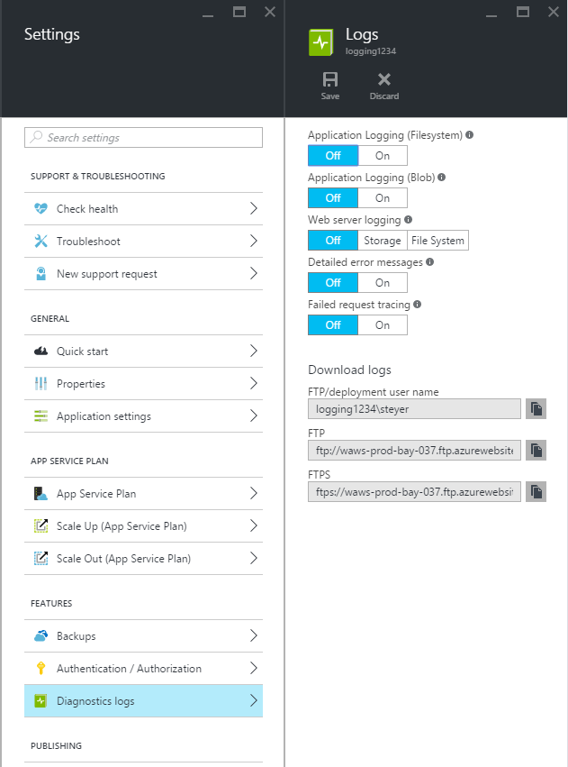

<properties
    pageTitle="啟用診斷記錄 Azure 應用程式服務中的 web 應用程式"
    description="瞭解如何啟用診斷記錄，並將儀器新增至您的應用程式，以及如何存取 Azure 所記錄的資訊。"
    services="app-service"
    documentationCenter=".net"
    authors="cephalin"
    manager="wpickett"
    editor="jimbe"/>

<tags
    ms.service="app-service"
    ms.workload="na"
    ms.tgt_pltfrm="na"
    ms.devlang="na"
    ms.topic="article"
    ms.date="06/06/2016"
    ms.author="cephalin"/>

# 啟用診斷記錄 Azure 應用程式服務中的 web 應用程式

## 概觀

Azure 提供內建的診斷，以協助偵錯[應用程式服務 web 應用程式](http://go.microsoft.com/fwlink/?LinkId=529714)。 在本文中，您將學習如何啟用診斷記錄，並將儀器新增至您的應用程式，以及如何存取 Azure 所記錄的資訊。

本文會使用[Azure 入口網站](https://portal.azure.com)與 PowerShell 的 Azure Azure 命令列介面 (Azure CLI) 使用 [診斷記錄。 使用 Visual Studio 診斷記錄的資訊，請參閱[疑難排解在 Visual Studio 中的 Azure](web-sites-dotnet-troubleshoot-visual-studio.md)。

[AZURE.INCLUDE [app-service-web-to-api-and-mobile](../../includes/app-service-web-to-api-and-mobile.md)]

## 網頁伺服器診斷和應用程式診斷

應用程式服務 web 應用程式提供診斷記錄資訊，從網頁伺服器和 web 應用程式功能。 這些邏輯分成**網頁伺服器診斷**和**應用程式診斷**。

### 網頁伺服器診斷程式

您可以啟用或停用下列類型的記錄︰

- **詳細的錯誤記錄**-詳細的錯誤資訊的 HTTP 狀態碼表示失敗 （狀態碼 400 或更大）。 這可能包含可協助您決定為什麼伺服器會傳回錯誤的程式碼的資訊。
- **無法要求的追蹤**-失敗的要求，包括 IIS 元件，用來處理要求並在每個元件所花費的時間追蹤的詳細資訊。 這可能是如果您嘗試增加網站效能或隔離導致傳回特定的 HTTP 錯誤。
- **網頁伺服器記錄**-使用[W3C 延伸的記錄檔格式](http://msdn.microsoft.com/library/windows/desktop/aa814385.aspx)的 HTTP 交易的相關資訊。 決定整體網站指標，例如數處理要求或多少邀請是來自特定 IP 位址時，這是很有用。

### 應用程式診斷

應用程式診斷可讓您擷取所產生的 web 應用程式的資訊。 ASP.NET 應用程式可以使用[System.Diagnostics.Trace](http://msdn.microsoft.com/library/36hhw2t6.aspx)類別的應用程式診斷記錄至記錄的資訊。 例如︰

    System.Diagnostics.Trace.TraceError("If you're seeing this, something bad happened");

在執行階段中，您可以擷取這些記錄以協助疑難排解。 如需詳細資訊，請參閱[疑難排解 Azure web 應用程式，在 Visual Studio 中](web-sites-dotnet-troubleshoot-visual-studio.md)。

應用程式服務 web 應用程式在 web 應用程式發佈內容時，也會記錄部署資訊。 發生這種情況自動且沒有部署記錄設定的設定。 部署記錄 」 可讓您判斷部署失敗的原因。 例如，如果您使用的自訂部署指令碼，您可能會使用部署記錄來決定指令碼失敗的原因。

## 如何啟用診斷程式

若要啟用診斷[Azure 入口網站](https://portal.azure.com)中的，移至 web app 刀，然後按一下**設定 > 診斷記錄**。

<!-- todo:cleanup dogfood addresses in screenshot -->

當您啟用**應用程式診斷**您也可以選擇**層級**。 這項設定可讓您篩選資訊擷取**資訊**、**警告**或**錯誤**的資訊。 將它設定為**詳細資訊**，將會記錄所產生的應用程式的所有資料。

> [AZURE.NOTE] 不同於變更 web.config 檔案，請啟用應用程式診斷或變更診斷記錄層級不會資源執行中的應用程式的應用程式網域。

在 [[傳統] 入口網站](https://manage.windowsazure.com)Web 應用程式**設定**] 索引標籤中，您可以選取**儲存空間**或**檔案系統**的**網頁伺服器的記錄**。 選取**儲存空間**，可讓您選取的儲存空間帳戶，然後按一下 [記錄才能寫入 blob 容器。 所有其他**網站診斷**記錄會寫入到檔案系統中。

[傳統的入口網站](https://manage.windowsazure.com)Web 應用程式**設定**] 索引標籤也有其他應用程式診斷設定︰

* **檔案系統**-會儲存至 web 應用程式檔案系統的應用程式診斷資訊。 這些檔案可以存取的 FTP，或使用 PowerShell 的 Azure 或 Azure 命令列介面 (Azure CLI) 下載 Zip 封存。
* **資料表儲存體**-儲存應用程式的診斷資訊中指定的 Azure 儲存體帳戶和資料表名稱。
* **Blob 儲存體**-儲存指定 Azure 儲存體帳戶和 blob 容器中的應用程式的診斷資訊。
* **保留期間**-根據預設，記錄不會自動從刪除**blob 儲存體**。 選取 [**設定保留**，然後輸入要保留記錄，如果您想要自動刪除記錄的天數。

>[AZURE.NOTE] 如果您[重新產生儲存帳戶的便捷鍵](storage-create-storage-account.md#view-copy-and-regenerate-storage-access-keys)，您必須重設個別記錄設定以使用更新的鍵。 若要執行這項操作︰
>
> 1. 在 [**設定**] 索引標籤中，設定個別的記錄功能來**關閉**。 儲存您的設定。
> 2. 啟用記錄功能來儲存帳戶 blob 或表格一次。 儲存您的設定。

檔案系統、 資料表儲存體或 blob 儲存體的任何組合可啟用同時，且您擁有個別記錄層級設定。 例如，您可能要記錄錯誤及警告，作為長期記錄解決方案，blob 儲存空間，同時檔案系統記錄層級的詳細資訊。

所有三個的儲存位置提供記錄事件的相同基本資訊，但是**資料表儲存體**和**blob 儲存體**都是記錄其他資訊的執行個體識別碼、 執行緒識別碼等比記錄微調時間戳記 （刻度格式）**檔案**系統。

> [AZURE.NOTE] 儲存在**資料表儲存體**或**blob 儲存體**中的資訊只能使用儲存空間的用戶端或可以直接使用下列的儲存空間系統的應用程式。 例如，Visual Studio 2013 包含可用來瀏覽表格或 blob 儲存體儲存檔案總管，和 HDInsight 能夠存取儲存在 blob 儲存體中的資料。 您也可以撰寫存取 Azure 儲存體使用其中一個[Azure Sdk](/downloads/#)的應用程式。

> [AZURE.NOTE] 也可以從使用此**設定 AzureWebsite**指令程式 PowerShell 的 Azure 啟用診斷。 如果您沒有安裝 PowerShell 的 Azure，或未設定以使用您的 Azure 訂閱，請參閱[如何使用 PowerShell Azure](/develop/nodejs/how-to-guides/powershell-cmdlets/)。

##如何︰ 下載記錄

可以直接使用 FTP 存取儲存至 web 應用程式檔案系統的診斷資訊。 也可以使用 PowerShell 的 Azure 或 Azure 命令列介面壓縮保存為下載。

記錄儲存於目錄結構如下所示︰

* **應用程式記錄**-/LogFiles/應用程式 /。 這個資料夾包含一或多個文字檔案所產生的應用程式記錄的資訊。

* **無法要求追蹤**-/ 記錄檔/W3SVC # # # /。 此資料夾包含的 XSL 檔案及一或多個 XML 檔案。 請確定為 XML 檔案，因為的 XSL 檔案提供的格式設定及篩選內容的 XML 檔案時在 Internet Explorer 中檢視功能的 XSL 檔案下載到相同的目錄。

* **詳細的錯誤記錄檔**-/LogFiles/DetailedErrors /。 這個資料夾包含一或多個.htm 檔，可提供的任何 HTTP 已發生錯誤的詳細資訊。

* **網頁伺服器記錄檔**-/LogFiles/http/RawLogs。 這個資料夾包含一或多個文字檔案格式使用[W3C 延伸的記錄的檔案格式](http://msdn.microsoft.com/library/windows/desktop/aa814385.aspx)。

* **部署記錄**-/ 記錄檔/給。 此資料夾包含由 Azure web 應用程式，使用的內部部署程序所產生的記錄，以及給部署記錄。

### FTP

若要存取使用 FTP 的診斷資訊，請造訪**儀表板**web 應用程式在[傳統的入口網站](https://manage.windowsazure.com)。 在 [**快速規則**] 區段中，使用**FTP 診斷記錄**連結存取使用 FTP 記錄檔。 **部署/FTP 使用者**項目會列出應該用來存取 FTP 站台的使用者名稱。

> [AZURE.NOTE] 如果沒有設定**部署/FTP 使用者**項目，或您忘了此使用者的密碼，您可以使用的**儀表板**的 [**快速規則**] 區段中的 [**重設部署認證**] 連結來建立新的使用者和密碼。

### 使用 PowerShell 的 Azure 下載

若要下載的記錄檔，開始新的執行個體的 PowerShell 的 Azure 並使用下列命令︰

    Save-AzureWebSiteLog -Name webappname

這會儲存 web 應用程式所指定的記錄**-名稱**檔案的參數，名為 「 **logs.zip**在目前的目錄。

> [AZURE.NOTE] 如果您沒有安裝 PowerShell 的 Azure，或未設定以使用您的 Azure 訂閱，請參閱[如何使用 PowerShell Azure](/develop/nodejs/how-to-guides/powershell-cmdlets/)。

### 下載 Azure 命令列介面

若要下載使用 Azure 命令列介面的記錄檔，開啟新的命令提示字元、 PowerShell、 艦隊或終端機工作階段，然後輸入下列命令︰

    azure site log download webappname

這會將儲存 web 應用程式名稱為 「 webappname' 命名**diagnostics.zip**目前的目錄中的檔案至記錄的檔。

> [AZURE.NOTE] 如果您沒有安裝 Azure 命令列介面 (Azure CLI)，或未設定以使用您的 Azure 訂閱，請參閱[如何使用 Azure CLI](../xplat-cli-install.md)。

## 如何︰ 登入應用程式的深入見解的檢視

Visual Studio 應用程式獲得深入見解提供的工具，篩選及搜尋記錄，以及相互關聯要求及其他事件的記錄。

1. 在 Visual Studio 中您專案中新增應用程式的深入見解 SDK。
 * 在方案總管中，以滑鼠右鍵按一下您的專案，然後選擇 [新增應用程式深入資訊。 會引導您，包括建立應用程式的深入見解資源的步驟。 [深入瞭解](../application-insights/app-insights-asp-net.md)
2. 您專案中新增追蹤接聽程式套件。
 * 以滑鼠右鍵按一下您的專案，然後選擇 [管理 NuGet 套件。 選取 [ `Microsoft.ApplicationInsights.TraceListener` [進一步瞭解](../application-insights/app-insights-asp-net-trace-logs.md)
3. 上傳您的專案，並執行產生記錄資料。
4. 在[Azure 入口網站](https://portal.azure.com/)中，瀏覽至新的應用程式的深入見解資源，然後開啟 [**搜尋**]。 您會看到您記錄的資料，以及要求、 使用情況和其他遙測。 某些遙測可能需要幾分鐘的時間才能送達︰ 按一下 [重新整理。 [深入瞭解](../application-insights/app-insights-diagnostic-search.md)

[進一步瞭解追蹤應用程式的深入見解的效能](../application-insights/app-insights-azure-web-apps.md)

##如何︰ 串流記錄

開發應用程式，通常很有用，查看即時附近的記錄資訊。 這可以透過串流到使用 PowerShell 的 Azure 或 Azure 命令列介面開發環境的記錄資訊。

> [AZURE.NOTE] 某些類型的記錄緩衝寫入記錄檔，這可能會導致順序資料流中的事件。 例如，使用者造訪頁面時，會發生的應用程式日誌項目可能會顯示頁面要求的相對應 HTTP 記錄項目之前資料流中。

> [AZURE.NOTE] 記錄串流也會串流資訊儲存在任何文字檔案寫入**d\\家用\\記錄檔\\**資料夾。

### 使用 PowerShell 的 Azure 串流

串流記錄資訊，開始新的執行個體的 PowerShell 的 Azure，請使用下列命令︰

    Get-AzureWebSiteLog -Name webappname -Tail

這會連線至指定的 web 應用程式**-名稱**參數，並開始記錄事件發生於 web 應用程式串流至 PowerShell 視窗的資訊。 以.txt、.log 或.htm 結尾的檔案儲存於 /LogFiles 目錄 （d/常用/記錄檔） 撰寫的任何資訊會被串流本機主控台。

若要篩選特定的事件，例如錯誤，使用**-訊息**參數。 例如︰

    Get-AzureWebSiteLog -Name webappname -Tail -Message Error

若要篩選特定的記錄類型，例如 HTTP]，使用**-路徑**參數。 例如︰

    Get-AzureWebSiteLog -Name webappname -Tail -Path http

若要查看可用的路徑的清單，請使用-ListPath 參數。

> [AZURE.NOTE] 如果您沒有安裝 PowerShell 的 Azure，或未設定以使用您的 Azure 訂閱，請參閱[如何使用 PowerShell Azure](/develop/nodejs/how-to-guides/powershell-cmdlets/)。

### Azure 命令列介面串流

若要串流記錄資訊、 開啟新的命令提示字元、 PowerShell、 艦隊或終端機工作階段，並輸入以下命令︰

    azure site log tail webappname

將連接到 web 應用程式名稱為 「 webappname 」，並開始記錄事件發生在 web 應用程式串流至視窗的資訊。 以.txt、.log 或.htm 結尾的檔案儲存於 /LogFiles 目錄 （d/常用/記錄檔） 撰寫的任何資訊會被串流本機主控台。

若要篩選特定的事件，例如錯誤，使用**-篩選**參數。 例如︰

    azure site log tail webappname --filter Error

若要篩選特定的記錄類型，例如 HTTP]，使用**-路徑**參數。 例如︰

    azure site log tail webappname --path http

> [AZURE.NOTE] 如果您沒有安裝 Azure 命令列介面，或未設定以使用您的 Azure 訂閱，請參閱[如何以使用 Azure 命令列介面](../xplat-cli-install.md)。

##如何︰ 了解診斷記錄

### 應用程式診斷記錄

應用程式診斷.NET 應用程式，根據您是否儲存記錄檔給檔案系統、 資料表儲存體或 blob 儲存體以特定格式儲存的資訊。 基底的一組資料儲存為相同在所有三個的儲存空間類型-的日期和時間事件發生時，所產生的事件]、 [事件類型資訊、 警告 （錯誤） 和 [事件訊息的程序識別碼。

__檔案系統__

在檔案系統登入，或使用串流接收每一行會以下列格式︰

    {Date}  PID[{process id}] {event type/level} {message}

例如，錯誤的事件會出現類似下列各項︰

    2014-01-30T16:36:59  PID[3096] Error       Fatal error on the page!

在檔案系統的記錄提供提供只時間、 程序識別碼、 事件層級，以及訊息的三種方法提供最基本的資訊。

__資料表儲存體__

當記錄至資料表儲存體，其他屬性可用來搜尋中的資料表，以及微調事件資訊儲存的資料。 儲存在資料表中每個實體 （列） 會使用下列屬性 （欄）。

屬性名稱|值/格式
---|---
PartitionKey|事件 yyyyMMddHH 格式的日期/時間
RowKey|唯一識別此實體 GUID 值
時間戳記|事件發生的時間與日期
EventTickCount|日期及時間刻度格式 （精確度） 事件發生
ApplicationName|Web 應用程式的名稱
層級|事件層級 （例如錯誤，警告，資訊）
EventId|此事件的事件 ID

如果有指定任何 0 的預設值
執行個體識別碼|在偶數發生的 web 應用程式的執行個體
Pid|處理程序識別碼
Tid|所產生的事件的執行緒識別碼
訊息|事件詳細資料的訊息

__Blob 儲存體__

登入 blob 儲存體時, 資料會儲存於逗點分隔值 (CSV) 格式中。 類似於資料表儲存體，提供更細緻事件的相關資訊記錄其他欄位。 Csv 檔案中的每個資料列，可以使用下列屬性︰

屬性名稱|值/格式
---|---
日期|事件發生的時間與日期
層級|事件層級 （例如錯誤，警告，資訊）
ApplicationName|Web 應用程式的名稱
執行個體識別碼|在事件發生的 web 應用程式的執行個體
EventTickCount|日期及時間刻度格式 （精確度） 事件發生
EventId|此事件的事件 ID

如果有指定任何 0 的預設值
Pid|處理程序識別碼
Tid|所產生的事件的執行緒識別碼
訊息|事件詳細資料的訊息

Blob 中儲存的資料看起來如下︰

    date,level,applicationName,instanceId,eventTickCount,eventId,pid,tid,message
    2014-01-30T16:36:52,Error,mywebapp,6ee38a,635266966128818593,0,3096,9,An error occurred

> [AZURE.NOTE] 登入的第一行表示在此範例中，將包含欄標題。

### 無法要求追蹤

無法的要求追蹤會儲存在名為__下列格式 # # #.xml__的 XML 檔案。 若要讓您更容易檢視登入的資訊，名為__freb.xsl__的 XSL 樣式表中提供的 XML 檔案所在的目錄。 在 Internet Explorer 中開啟其中一個 XML 檔案，會提供追蹤資訊的格式的顯示使用 XSL 樣式表。 這會顯示如下︰

### 詳細的錯誤記錄

詳細的錯誤記錄檔是提供 HTTP 已發生錯誤的詳細的資訊的 HTML 文件。 因為它們是只要 HTML 文件時，他們可以使用網頁瀏覽器來檢視。

### 網頁伺服器記錄檔

使用[W3C 延伸的記錄檔格式](http://msdn.microsoft.com/library/windows/desktop/aa814385.aspx)來格式化網頁伺服器記錄檔。 使用文字編輯器，或使用公用程式，例如[記錄剖析器](http://go.microsoft.com/fwlink/?LinkId=246619)剖析可以讀取這項資訊。

> [AZURE.NOTE] 記錄所產生的 Azure web 應用程式不支援的__s 電腦名稱__、 __s ip__或__cs 版本__的欄位。

##後續步驟

- [如何監視 Web 應用程式](/manage/services/web-sites/how-to-monitor-websites/)
- [在 Visual Studio 中的疑難排解 Azure web 應用程式](web-sites-dotnet-troubleshoot-visual-studio.md)
- [分析 web 應用程式登入 HDInsight](http://gallery.technet.microsoft.com/scriptcenter/Analyses-Windows-Azure-web-0b27d413)

> [AZURE.NOTE] 如果您想要開始使用 Azure 應用程式服務註冊 Azure 帳戶之前，請移至[嘗試應用程式服務](http://go.microsoft.com/fwlink/?LinkId=523751)，可以讓您立即建立短暫入門 web 應用程式在應用程式服務。 必要; 沒有信用卡沒有承諾。

## 變更的項目
* 若要變更的指南，從網站應用程式服務請參閱︰ [Azure 應用程式服務與程式影響現有 Azure 服務](http://go.microsoft.com/fwlink/?LinkId=529714)
* 舊的入口網站，以新的入口網站的變更引導請參閱︰[參考瀏覽 Azure 入口網站](http://go.microsoft.com/fwlink/?LinkId=529715)
 
