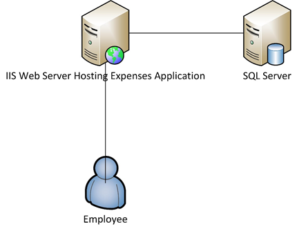

<properties 
    pageTitle="Azure 應用程式服務 Web 應用程式功能，企業版" 
    description="顯示如何使用 Azure 應用程式服務 Web 應用程式建立企業網站解決方案，為您的企業" 
    services="app-service\web" 
    documentationCenter="" 
    authors="apwestgarth" 
    manager="wpickett" 
    editor=""/>

<tags 
    ms.service="app-service-web" 
    ms.workload="web" 
    ms.tgt_pltfrm="na" 
    ms.devlang="na" 
    ms.topic="article" 
    ms.date="07/29/2016" 
    ms.author="anwestg"/>

# Azure 應用程式服務 Web 應用程式提供的企業白皮書 #

降低成本，並提供更快速的 IT 解決方案快速發展環境中需要為開發人員、 IT 專業人員和管理員建立新的挑戰。 使用者逐漸尋找他們的商務線條 (LOB) web 應用程式，快速、 回應，且可從任何裝置。 同時，企業嘗試利用提升的生產力和來自雲端和行動服務整合的效率，這可能是內容，只要單一登入裝置使用 Active Directory 中的共同作業 Office365 使用資料取自依次提取 Salesforce 公司實作資料中的內部 LOB 應用程式]。 [Azure 應用程式服務 Web 應用程式](http://go.microsoft.com/fwlink/?LinkId=529714)是企業級雲端服務的開發、 測試和執行網頁與行動應用程式、 Web Api 和一般的網站。 可用於全域最佳化的時幅] 和 [顯示狀態，以及支援連續整合的資料中心的網路上執行公司網站、 內部網路網站、 商務應用程式及數位行銷活動，以及現代 DevOps 作法。  

本白皮書醒目提示特別著重於執行 LOB Web 應用程式，其涵蓋移轉現有的 web 應用程式及部署平台上的新 LOB web 應用程式的[Web 應用程式](/services/app-service/web/)服務的功能。 

## 對象 ##

IT 專業人員、 架構，以及正在尋找移轉至正在執行內部部署的雲端網頁工作負載的管理員。 員工的商務或企業版合作夥伴 web 應用程式，可以橫跨 web 負載。

## 簡介 ##

應用程式服務 Web 應用程式是時間的理想的平台上以主控內部及外部 web 應用程式和服務，它提供、 彈性、 受管理的解決方案，可讓您專注於進行商業價值為您的使用者，而不是時間的花費大量以及金錢維護和支援分隔環境。 Web 應用程式提供非常有彈性的平台要部署企業 web 應用程式提供的功能，以繼續進行內部部署 Active Directory 透過整合與 Microsoft Azure Active Directory 驗證支援的簡單且快速部署進行時自動進行調整，提升業務需求-可讓您將焦點放在您的應用程式並不基礎結構的受管理平台上的所有與您內部連續整合和部署作法，，使用。 

## 定義問題 ##

快速變更 IT 橫向、 停止使用傳統的伺服器上裝載與他們高資金成本上使用隨選長的前置重疊時間與使用自動調整處理載入的服務。 IT 部門會被挑戰降低成本，並將焦點放在減少 CAPEX，也可以提高靈活性花在所需的基礎結構和維護。 耐用年限較舊的基礎結構平台，例如 Windows Server 2003 中，結尾前置檢閱潛在的方式，以避免新的長期資金成本為雲端移轉的 IT 部門。 過去 Cio 會決定購買其他部門。不過，逐漸 CMOs 及其他商務單位家庭主事者的時間中其預算所花費的方式和其投資更多作用中的角色。 逐漸，企業需要員工遠端工作、 花更長的時間與需存取系統容易免費的客戶都必須比以前更行動其人力。

企業需求的改變，每月、 每週、 每日。 企業尋求與一般更新服務完整的新功能，第三方或內部提供立即全域的縮放比例。  在某些情況下企業也正在尋找的功能來找出其應用程式，並存取資源，同時也讓公用雲端功能的用途。 使用者會有較高的期望，使用多個自己私人的生活，例如 office 365 服務使用。 預期其工作生活中有類似的最新功能豐富視覺效果與服務的存取。 若要處理此要求，IT 必須外觀，可協助啟用此選取項目和協力廠商整合到商務服務，同時也在 [可靠精簡的總成本，擁有權，商務需求，可以調整的平台小心，因為選取範圍。

開發團隊正在進行立即商務的優勢，進行經常為基礎的新功能。 尋找的成本有效、 可靠的平台的整合現有的工具和作法 – 開發、 測試、 放開;與 IT 部門與工作自動化部署、 管理及提醒，所有的零停機時間的目標。

<a href="highlevel" />
## 高層級的解決方案 ##

Web 平台和架構會逐漸用於開發、 測試和主辦商務應用程式。  與一般商務應用程式，例如內部員工費用系統，通常包含單獨使用備份資料庫來儲存資料連線的應用程式的 web 應用程式。

應用程式服務 Web 應用程式是適合用來裝載這類應用程式中，提供可調整可靠的基礎結構的管理，使用修補附近零手動互動和停機時間。 Microsoft Azure 平台提供許多資料儲存選項支援從 Microsoft Azure SQL 資料庫，受管理調整關聯式資料庫-為-的-服務，我們的合作夥伴，例如 ClearDB MySQL 資料庫及 MongoDB 從常用的服務的 Web 應用程式上的 web 應用程式。

另一個方法是，讓您現有的投資，內部部署的使用。 在範例案例中，員工費用系統，您可能會想要維持您內部的基礎結構中的資料存放區。 這可能是整合內部系統 （報告、 薪資、 計費等） 或滿足 IT 管理需求。  Web 應用程式提供讓您連線到您上的部署基礎結構的方法︰

- [應用程式服務環境](app-service-app-service-environment-intro.md)的應用程式服務環境 (ASE) 會是新的最近已新增至 Microsoft Azure 應用程式服務產品的進階功能。  ASEs 提供完整隔離和專用的環境的安全地在高執行 Azure 應用程式服務應用程式時也提供隔離及安全的網路存取   
- [混合式連線](../biztalk-services/integration-hybrid-connection-overview.md)– 混合式連線是 Microsoft Azure Biztalk 的功能，並啟用安全地連線到內部部署資源的 Web 應用程式，例如 SQL Server、 MySQL、 Web Api 和自訂 web 服務。 
- [虛擬網路的整合](https://azure.microsoft.com/blog/2014/09/15/azure-websites-virtual-network-integration/)– Azure 虛擬網路 Web 應用程式整合，可讓您將 web 應用程式連線至 Azure 虛擬網路依次可以連接到網站-VPN 上的部署基礎結構。 

以下圖表說明高層級解決方案部署資源的連線選項的範例。  第一個範例顯示如何如下使用 Azure 應用程式服務的標準功能，第二個顯示這可能是使用提供，應用程式服務環境進階版達成。

使用標準的應用程式服務功能︰

使用的應用程式服務環境︰

## 商務優點 ##

應用程式服務 Web 應用程式提供的優勢可讓您更效益與敏捷式中進行商務需求的函數。 

### PaaS 模型 ###

應用程式服務 Web 應用程式的平台上內建為 Service 模型提供成本和效率存款的數字。  您不再需要花時間管理 Vm、 修補的作業系統與架構。 Web 應用程式是自動修補的環境這可讓您將焦點放在 [管理您的 web 應用程式和不 Vm，讓小組免費提供其他的商務價值。

PaaS 模型基礎 Web 應用程式可讓人員都在 DevOps 方法以達成其目標。 為商務代表完整管理及整合應用程式整個生命週期，包括開發、 測試、 版本、 監控和管理及支援。 

開發團隊連續的整合及部署工作流程可以設定 Visual Studio 小組服務、 GitHub、 TeamCity、 Hudson 或 BitBucket，啟用自動的建立、 測試和啟用快發行循環而減少人事參與放開中現有的基礎結構的部署。 Web 應用程式也支援建立多個測試和臨時您發佈工作流程的環境，您需要保留，或為上述目的配置硬體不再，您可以建立任何數量的環境，並定義自己升級至發行工作流程。 您可能決定要從來源控制發行到測試位置，請執行測試並成功完成一系列的企業升階到階段位置，最後交換生產不中斷的情況，與新增可以為主機裝載在 Web 應用程式的 web 應用程式預先載入和熱提供最可能的客戶體驗。  此外企業可以是直接流量的不同位置的節，請切換至新的部署的所有流量或還原所有流量導向之前的部署之前驗證修訂，請使用生產功能的應用程式服務 Web 應用程式中測試。 

作業小組可以覺得自信，這些是最適合使用任何主機裝載在 Web 應用程式，使用內建 web 應用程式回應任何問題可能位置中監控和通知功能。 應該作業小組有已經投資在分析及監視解決方案這類從 Microsoft Visual Studio 應用程式的深入見解、 新的聖器和 AppDynamics。 這些也完全支援啟用連續性和熟悉的環境，從中監控您的 web 應用程式的 Web 應用程式。

最後，Web 應用程式提供可自動備份您的應用程式的功能，並裝載的資料庫引導至 Azure Blob 儲存體容器。 提供您用來修復損毀，減少需要複雜的部署硬體與軟體簡單的方式和非常成本有效方法。

### 以便於移轉 ###

硬體維護及旋轉是硬體與作業系統的版本循環加速適用於企業的主要問題。 或許您有 Windows Server 2003 R2 伺服器因為 2015年中支援的結尾的數字，但是他們仍會裝載您的商務用的索引鍵的 web 應用程式？ 應用程式服務 Web 應用程式就好應該要裝載這些 web 應用程式，並讓您合理化商務硬體空間。 Web 應用程式可讓您存取範圍的硬體規格會被管理並維持為服務，不需要做為基礎結構預算的一部分納入取代及管理成本的一部分。  移轉可以簡單的只複製和貼上作業從現有的部署至 Web 應用程式或更複雜的移轉位置使用 Web 應用程式移轉小幫手]，將值。 移轉的 web 應用程式喜歡的 Azure 服務整合到 web 應用程式的其他服務。 例如，您可以考慮加入來控制您根據使用者的安全性群組關聯的應用程式的存取權的 Azure Active Directory。 可以整體快取服務，以改善效能，並提供減少延遲，較高的使用者體驗要新增另一個範例。 

### 企業課程主機服務 ###

應用程式服務 Web 應用程式提供穩定、 可靠的平台的已證明能夠處理各種不同的商務需要從小型內部開發和測試負載，高度不按比例縮放的高流量的網站。 藉由使用 Web 應用程式，您對使用相同的企業類別裝載平台的 Microsoft 用於高值的 web 工作負載的公司。 建立 web 應用程式，以及在 Azure 的平台上的所有服務的安全性和法規遵循法規需求，例如 ISO (ISO/IEC 27001:2005);SOC1 與 SOC2 SSAE 16/ISAE 3402 Attestations、 HIPAA BAA、 PCI 和 Fedramp，其實的每個項目和功能，如需詳細資訊，請參閱[http://aka.ms/azurecompliance](/support/trust-center/compliance/)。 

Microsoft Azure 平台可讓角色授權控制項啟用企業層級的控制 Web 應用程式中的資源。 RBAC 可讓企業 power 實作自己存取管理原則其資產的所有在 Azure 環境中，將使用者指派給群組，然後依序將必要的權限指派給這些群組，例如 web 應用程式的資產。 如需有關 RBAC Azure 中的詳細資訊，請參閱[http://aka.ms/azurerbac](../active-directory/role-based-access-control-configure.md)。 利用 Web 應用程式，您可以確定安全的環境中部署 web 應用程式，而且您有 「 完全控制到哪個銷售領域部署您的資產。 

Azure 應用程式服務環境[http://aka.ms/aseintro](http://aka.ms/aseintro)企業版客戶想要使用 Azure 應用程式服務新的進階版服務方案選項而這些提供完整隔離和專用的環境。  這可以讓企業客戶部署的應用程式，可以利用更高的縮放比例也有 [完全控制傳入和傳出網路流量而和 ASEs 讓內部部署資源的虛擬網路上有高速安全連線的應用程式。

應用程式服務 Web 應用程式，也會無法提供可連線到您的內部資源，例如您的資料倉庫或 SharePoint 環境，讓您開啟的部署投資完整使用。 您可以進行的[高層級方案](#highlevel)中所述使用的混合式連線及虛擬網路連線來建立連線部署基礎結構和服務。

### 全域的小數位數 ###

應用程式服務 Web 應用程式是業務的全域管理員和擴充的平台，請啟用放大及調整的成長需求快速和最小的長期規劃與成本 web 應用程式。 中一般上部署基礎結構的情況下，展開] 及 [視需要增加同時本機地理區域會需要大量的管理、 規劃及進行佈建支出，並管理其他基礎結構。 Web 應用程式可讓您不按比例縮放 ebb 與您的需求的流程 web 應用程式。 例如作為範例，使用費用應用程式的月份的大部分您的使用者已精簡的使用者的應用程式，但期限為每個月的費用送出 」 輸入增加應用程式的使用方式、 Web 應用程式能夠自動佈建應用程式的基礎結構，然後後去除使用一次，可以不按比例縮放回您所定義的比較基準基礎結構。

Web 應用程式中會有全域 24 資料中心全球，並持續增加。 地區和位置的最更新清單，請參閱[http://aka.ms/azlocations](http://aka.ms/azlocations)。 使用 Web 應用程式，您的業務可以輕鬆地達到到和小數位數。 當您的公司規模擴大時，將新的區域，報告您使用的應用程式儀表板主機 Web 應用程式可以輕鬆地將其他資料中心部署和服務本機的使用者，就能快速透過的 Web 應用程式和 Azure 流量管理員，所有的好處，就可調整下方能夠合約和展開的區域辦公室變更需求為基礎結構的組合。
 
## 解決方案詳細資料 ##

讓我們來看看應用程式移轉案例的範例。 這將概述如何應用程式服務 Web 應用程式功能一起提供最佳的解決方案和商務值的詳細資料。
 
在此範例中的商務應用程式，我們會討論會報告應用程式，可讓員工送出其費用補助費用。 應用程式裝載在執行 IIS6 Windows Server 2003 R2，資料庫是 SQL Server 2005 資料庫。 因此我們選擇較舊的伺服器就是未來的結束的服務的 Windows Server 2003 R2 和 SQL Server 2005、，我們具備[工具](http://aka.ms/websitesmigration)和[指引](http://aka.ms/websitesmigrationresources)，會自動移轉到 Azure 的工作量。 這一點之後，在此範例中所用的圖樣適用於移轉案例寬 verity。 

### 移轉現有的應用程式 ###

移動到 Web 應用程式的線條的商務應用程式的整體解決方案的其中一個步驟是將現有的應用程式資產以及架構。 本文中的範例是下圖所示，在單一 IIS 伺服器上裝載與資料庫裝載於個別的 SQL Server，ASP.NET web 應用程式。 員工登入至系統使用使用者名稱和密碼的組合，輸入的支出分類表的詳細資訊的人員，並將回條、 掃描的複本上傳至資料庫中，每個項目的費用。 
 

#### 若要考慮的項目 ####

從內部部署環境移轉應用程式，您可能要時請記住，幾個 Web 應用程式限制式。 以下是一些重要的主題時要注意的移轉到 Web 應用程式 ([http://aka.ms/websitesmigrationresources](http://aka.ms/websitesmigrationresources)) 的 web 應用程式︰

-   連接埠繫結-Web 應用程式只支援連接埠 80 HTTP 和 HTTPS 流量的連接埠 443。 如果您的應用程式使用任何其他連接埠]，然後再一次移轉應用程式，就能使用的連接埠 80 HTTP 和連接埠 443 HTTPS 流量。 這是通常無害的問題，因為它是在進行部署部署中常見使用才能解決的網域名稱，尤其是在開發和測試環境中使用不同的連接埠
-   驗證-Web 應用程式支援匿名驗證的預設表單驗證以應用程式。 Web 應用程式可以提供 Windows 驗證，當只整合 Azure Active Directory 與 ADFS 應用程式。 這是更多詳細資料中所提及的功能[以下](http://aka.ms/azurebizapp) 
-   GAC 基礎的組件-Web 應用程式不允許部署的組件至全域組件快取 (GAC)。 因此，如果要移轉應用程式，使用此功能的內部部署，請考慮移動 bin 資料夾的應用程式組件。
-   IIS5 相容性模式 – Web 應用程式不支援 IIS5 相容性模式中，並為每個 Web 應用程式執行個體與上層 Web 應用程式執行個體中的所有 web 應用程式執行相同的背景工作程序中的單一應用程式集區。
-   COM 文件庫-Web 應用程式的使用不允許在平台上的 [COM 元件註冊。 因此如果應用程式正在使用的任何 COM 元件，這些所需使用 managed 程式碼重寫和部署應用程式。
-   在 Web 應用程式，可支援 ISAPI 篩選 – ISAPI 篩選器。 他們會需要部署應用程式的一部分，而且註冊 web 應用程式的 web.config 檔案中。 如需詳細資訊，請參閱[http://aka.ms/azurewebsitesxdt](web-sites-transform-extend.md)。 

一旦這些主題已被視為，web 應用程式應準備好進行雲端。 別擔心，移轉工具來移轉如果未完全符合某些主題，讓最佳效果。 

移轉程序中的下一個步驟所建立的應用程式服務 web 應用程式和 Azure SQL 資料庫。 有多個不同的數字的 CPU 核心 Web 應用程式執行個體的大小，可供您選取的 RAM 金額根據您的 web 應用程式需求。 其他資訊和價格、，請參閱[http://aka.ms/azurewebsitesskus](/pricing/details/websites/)。 同樣地，Microsoft Azure SQL 資料庫 caters 所有使用各種不同的服務層和效能層級的商務的需求，以符合需求。 在[http://aka.ms/azuresqldbskus](/pricing/details/sql-database/)找的詳細資訊。 建立後，應用程式上傳到應用程式服務 Web 應用程式，請透過 FTP 或 WebDeploy，然後拖曳至資料庫。

在此移轉方案，請使用 Azure SQL 資料庫，但也就是不支援 Azure 只的資料庫。 使用 MySQL，MongoDB，Azure DocumentDB 可能更多透過可以在[Azure 市集](/marketplace/partner-program/)購買附加元件，也可以讓公司。 

建立 Azure SQL 資料庫時數個選項可從內部部署的伺服器產生要使用的[資料層應用程式匯出及匯入](http://aka.ms/dacpac)的現有資料庫的指令碼匯入現有的資料庫。 

費用應用程式所建立的資料庫來建立新的 Azure SQL 資料庫、 連線至資料庫使用 SQL Server Management Studio 中，然後執行指令碼，以建立資料庫結構描述，填入從內部部署資料庫的資料。

在第一個階段的移轉中的最後一個步驟需要更新的應用程式資料庫的連線字串。 這可以達成透過 Azure 入口網站。 每一個 web 應用程式中，您可以修改應用程式特定設定，包括任何連線到任何所使用的資料庫應用程式正在使用的連接字串。

### 若要使用 Azure SQL 資料庫的替代方案 ###

Azure 平台所提供的 web 應用程式主要資料庫為使用 Azure SQL 資料庫的項目，這是即啟用不同的工作負載 使用 NoSQL 解決方案或啟用的平台的企業的資料的需求。 例如商務可能不能儲存的資料離線，或在公用雲端環境中，按住因此看起來會維持其內部部署資料庫的使用。

#### 連線至部署資源 ####
應用程式服務 Web 應用程式提供數個選項來部署資源，例如資料庫連線到現有高值基礎結構的重複使用。 選項是如下所示︰

- 隔離應用程式服務環境而建立的虛擬網路，子網路內因此啟用通訊與私人位於相同的虛擬網路- [http://aka.ms/appserviceasenetworking](http://aka.ms/appserviceasenetworking)中的端點環境
- Web 應用程式虛擬網路的整合支援 Web 應用程式和 Azure 虛擬網路，可讓您存取資源執行可，如果連線到您上的部署網路與網站-VPN 連線直接開啟部署系統虛擬網路之間的整合。
- 混合式連線是 Azure BizTalk 服務的功能，並提供容易連線至個別內部部署資源，例如 SQL Server、 MySQL、 HTTP Web Api 和最自訂 Web 服務。

#### 時幅] 和 [恢復功能 ####

當商務規模擴大時其人力，透過收購或自然有機等比級數，因此也必須 web 應用程式縮放以符合這些新的需求。 確實今天常見若要查看更大的散佈放在一起的團隊和遠端的員工，例如公司辦公室在 [美國、 歐洲與亞洲、 行動裝置的銷售額強制的許多更多的領域。 Web 應用程式都可以輕鬆地與自動處理彈性變更縮放比例。

應用程式服務 Web 應用程式可讓您設定為自動透過 Azure 入口網站中，根據兩個向量 – 排程時間或 CPU 使用率不按比例縮放的 web 應用程式。 Web 應用程式自動調整大小] 會提供成本有效且非常有彈性的方式，跟著更大的變更，在 [所有商務應用程式，從 web 應用程式，例如行銷體驗高尖峰流量的簡短的持續時間的升級的網站報告系統我們費用的使用狀況。 如詳細的資訊與縮放比例使用 Web 應用程式的 web 應用程式的指示，請參閱[如何色階網站](web-sites-scale.md)。

Web 應用程式的縮放比例的彈性，除了整體的平台可跨多個資料中心和地理區域讓業務連續性和恢復透過可能的通訊群組的 web 應用程式和其資產。

## 摘要 ##
應用程式服務 Web 應用程式提供動態的快速發展環境中的企業需求的彈性，回應成本有效解決方案。 Web 應用程式可協助企業提高生產力並使用受管理的平台現代 DevOps 功能與精簡的手上管理，同時提供小數位數、 可靠度、 安全性和整合內部部署資產的企業功能讓效率。

## 呼叫動作 ##
如需有關這些 Azure 應用程式服務 Web 應用程式服務、 造訪[http://aka.ms/enterprisewebsites](/services/websites/enterprise/)哪裡可以取得詳細資訊，並登入註冊試用今天[http://aka.ms/azuretrial](/pricing/free-trial/)來評估服務及探索您企業的優點。

[AZURE.INCLUDE [app-service-web-whats-changed](../../includes/app-service-web-whats-changed.md)]

[AZURE.INCLUDE [app-service-web-try-app-service](../../includes/app-service-web-try-app-service.md)]
 
 
