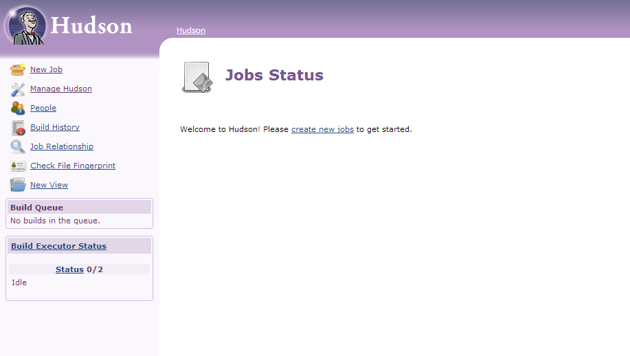
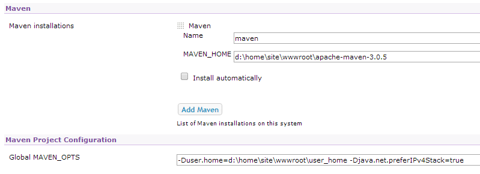

<properties 
    pageTitle="將自訂的 Java web 應用程式上傳至 Azure" 
    description="本教學課程教您如何上傳至 Azure 應用程式服務 Web 應用程式的自訂 Java web 應用程式。" 
    services="app-service\web" 
    documentationCenter="java" 
    authors="rmcmurray" 
    manager="wpickett" 
    editor=""/>

<tags 
    ms.service="app-service-web" 
    ms.workload="web" 
    ms.tgt_pltfrm="na" 
    ms.devlang="Java" 
    ms.topic="article" 
    ms.date="08/11/2016" 
    ms.author="robmcm"/>

# 將自訂的 Java web 應用程式上傳至 Azure

本主題說明如何上傳至[Azure 應用程式服務]Web 應用程式的自訂 Java web 應用程式。 包含提供適用於任何 Java 網站或 web 應用程式，以及也特定應用程式的一些範例的資訊。

請注意，Azure 就會提供一種建立使用 Azure 入口網站的設定 UI 及 Azure 服務商場 Java web 應用程式，如所述，[建立 Java web 應用程式中 Azure 應用程式服務](web-sites-java-get-started.md)。 本教學課程為 UI 或 Azure Marketplace 案例中您不想使用 Azure 入口網站設定]。  

## 設定指導方針

下列說明自訂 Java 網頁上的應用程式 Azure 預期的設定。

- 動態指派 Java 程序所使用的 HTTP 連接埠。  程序必須使用從環境變數的連接埠`HTTP_PLATFORM_PORT`。
- 應該停用單一 HTTP 接聽以外的所有接聽連接埠。  在 Tomcat，包含關機 HTTPS，與 AJP 連接埠。
- 容器必須只 IPv4 流量的設定。
- 若要設定的設定，必須應用程式的 [**啟動**] 命令。
- 需要使用目錄的應用程式寫入權限必須位於 Azure web 應用程式的內容的目錄，也就是**D:\home**。  環境變數`HOME`D:\home 參照。  

您可以視需要設定環境變數，web.config 檔案中。

## web.config httpPlatform 設定

下列資訊說明 web.config **httpPlatform**的格式。
                                 
**引數**(預設 ="")。 可執行檔或指令碼**processPath**設定中指定的引數。

（顯示**processPath**包含） 的範例︰

    processPath="%HOME%\site\wwwroot\bin\tomcat\bin\catalina.bat"
    arguments="start"
    
    processPath="%JAVA_HOME\bin\java.exe"
    arguments="-Djava.net.preferIPv4Stack=true -Djetty.port=%HTTP\_PLATFORM\_PORT% -Djetty.base=&quot;%HOME%\site\wwwroot\bin\jetty-distribution-9.1.0.v20131115&quot; -jar &quot;%HOME%\site\wwwroot\bin\jetty-distribution-9.1.0.v20131115\start.jar&quot;"

**processPath** -可執行檔或指令碼，便會啟動接聽 HTTP 要求的程序的路徑。

範例︰

    processPath="%JAVA_HOME%\bin\java.exe"

    processPath="%HOME%\site\wwwroot\bin\tomcat\bin\startup.bat"

    processPath="%HOME%\site\wwwroot\bin\tomcat\bin\catalina.bat"
                                                                                       
**rapidFailsPerMinute**(預設 = 10。)當機每分鐘允許**processPath**中指定的程序的次數。 如果超過此限制， **HttpPlatformHandler**會停止啟動分鐘的其餘部分的程序。
                                    
**requestTimeout**(預設 = 「 00: 02:00 」。)工期的**HttpPlatformHandler**等候接聽的程序的回應`%HTTP_PLATFORM_PORT%`。

**startupRetryCount**(預設 = 10。)**HttpPlatformHandler**會嘗試啟動程序**processPath**中指定的次數。 請參閱**startupTimeLimit**如需詳細資訊。

**startupTimeLimit**(預設 = 10 秒。)期間的**HttpPlatformHandler**等候可執行檔/指令碼開始接聽連接埠程序。  如果超過此時間限制， **HttpPlatformHandler**會刪除程序，並嘗試啟動它再次**startupRetryCount**時間。
                                                                                      
**stdoutLogEnabled**(預設 ="true"。)如果為 true， **stdout**和**stderr** **processPath**設定所指定的程序會被重新導向至**stdoutLogFile**中指定的檔案 （請參閱**stdoutLogFile**一節）。
                                    
**stdoutLogFile**(Default="d:\home\LogFiles\httpPlatformStdout.log 」。)絕對檔案路徑的**stdout**和**stderr**從**processPath**中指定的程序會記錄。
                                    
> [AZURE.NOTE] `%HTTP_PLATFORM_PORT%`為特殊的版面配置區這需要指定做為**引數**的一部分，或是**httpPlatform** **environmentVariables**清單的一部分。 這會以取代**HttpPlatformHandler**內部產生連接埠以便**processPath**所指定的程序可以聆聽這個連接埠。

## 部署

Java 根據的 web 應用程式可以輕鬆地部署透過大部分的相同的方式使用網際網路資訊服務 (IIS) 使用的依據 web 應用程式。  FTP，就可以給 Kudu 所有支援作為部署機制現狀整合式的 SCM 功能的 web 應用程式。 WebDeploy 運作，做為通訊協定，不過，當 Java 不開發在 Visual Studio 中，WebDeploy 不適合 Java web 應用程式部署使用情況下使用。

## 應用程式設定範例

下列應用程式、 web.config 檔案和應用程式的設定，提供為範例，顯示如何啟用應用程式服務 Web 應用程式上的應用程式 Java。

### Tomcat
有 Tomcat 上兩個應用程式服務 Web 應用程式提供的變化，仍很可能是上傳客戶特定的執行個體。 以下是安裝 Tomcat 與不同 Java 虛擬機器 (JVM) 的範例。

    <?xml version="1.0" encoding="UTF-8"?>
    <configuration>
      <system.webServer>
        <handlers>
          <add name="httpPlatformHandler" path="*" verb="*" modules="httpPlatformHandler" resourceType="Unspecified" />
        </handlers>
        <httpPlatform processPath="%HOME%\site\wwwroot\bin\tomcat\bin\startup.bat" 
            arguments="">
          <environmentVariables>
            <environmentVariable name="CATALINA_OPTS" value="-Dport.http=%HTTP_PLATFORM_PORT%" />
            <environmentVariable name="CATALINA_HOME" value="%HOME%\site\wwwroot\bin\tomcat" />
            <environmentVariable name="JRE_HOME" value="%HOME%\site\wwwroot\bin\java" /> <!-- optional, if not specified, this will default to %programfiles%\Java -->
            <environmentVariable name="JAVA_OPTS" value="-Djava.net.preferIPv4Stack=true" />
          </environmentVariables>
        </httpPlatform>
      </system.webServer>
    </configuration>

在 Tomcat 側邊，有幾個需要進行的設定變更。 Server.xml 需要編輯設定︰

-   關閉連接埠 =-1
-   HTTP 連接器連接埠 = ${port.http}
-   HTTP 連接器位址 = 「 127.0.0.1 」
-   註解 HTTPS 及 AJP 連接器
-   IPv4 設定也可以設定可讓您新增 catalina.properties 檔案中`java.net.preferIPv4Stack=true`
    
在 [應用程式服務 Web 應用程式上不支援 Direct3d 來電。 若要停用，新增下列 Java 選項應用程式應該都讓這類來電︰`-Dsun.java2d.d3d=false`

### Jetty

在此情況下的 Tomcat，客戶可以用 Jetty 上傳自己的執行個體。 若是執行完整的 Jetty 安裝，請設定看起來像這樣︰

    <?xml version="1.0" encoding="UTF-8"?>
    <configuration>
      <system.webServer>
        <handlers>
          <add name="httppPlatformHandler" path="*" verb="*" modules="httpPlatformHandler" resourceType="Unspecified" />
        </handlers>
        <httpPlatform processPath="%JAVA_HOME%\bin\java.exe" 
             arguments="-Djava.net.preferIPv4Stack=true -Djetty.port=%HTTP_PLATFORM_PORT% -Djetty.base=&quot;%HOME%\site\wwwroot\bin\jetty-distribution-9.1.0.v20131115&quot; -jar &quot;%HOME%\site\wwwroot\bin\jetty-distribution-9.1.0.v20131115\start.jar&quot;"
            startupTimeLimit="20"
          startupRetryCount="10"
          stdoutLogEnabled="true">
        </httpPlatform>
      </system.webServer>
    </configuration>

Jetty 設定需要變更的設定 start.ini `java.net.preferIPv4Stack=true`。

### Springboot
若要取得 Springboot 執行您的應用程式需要上傳 JAR 或馬檔案，並新增下列 web.config 檔案。 Web.config 進入 wwwroot] 資料夾。 在 web.config 調整指向 JAR 檔案，下列範例 JAR 檔案位於 wwwroot] 資料夾中的引數。  

    <?xml version="1.0" encoding="UTF-8"?>
    <configuration>
      <system.webServer>
        <handlers>
          <add name="httpPlatformHandler" path="*" verb="*" modules="httpPlatformHandler" resourceType="Unspecified" />
        </handlers>
        <httpPlatform processPath="%JAVA_HOME%\bin\java.exe"
            arguments="-Djava.net.preferIPv4Stack=true -Dserver.port=%HTTP_PLATFORM_PORT% -jar &quot;%HOME%\site\wwwroot\my-web-project.jar&quot;">
        </httpPlatform>
      </system.webServer>
    </configuration>

### Hudson

我們測試用 Hudson 3.1.2 和預設 Tomcat 7.0.50 執行個體但不使用 UI 設定項目。  因為 Hudson 是軟體建立工具，建議將其安裝在固定位置**AlwaysOn**旗標，可以設定 web 應用程式的執行個體。

1. 在 web 應用程式的根目錄，亦即**d:\home\site\wwwroot**，建立**webapps**目錄 （如果已不存在），然後放置 Hudson.war **d:\home\site\wwwroot\webapps**中。
2. 下載 apache maven 3.0.5 （與 Hudson 相容），並將其放在**d:\home\site\wwwroot**。
3. 建立 web.config 中**d:\home\site\wwwroot**並在其中貼上下列內容︰
    
        <?xml version="1.0" encoding="UTF-8"?>
        <configuration>
          <system.webServer>
            <handlers>
              <add name="httppPlatformHandler" path="*" verb="*" 
        modules="httpPlatformHandler" resourceType="Unspecified" />
            </handlers>
            <httpPlatform processPath="%AZURE_TOMCAT7_HOME%\bin\startup.bat"
        startupTimeLimit="20"
        startupRetryCount="10">
        <environmentVariables>
          <environmentVariable name="HUDSON_HOME" 
        value="%HOME%\site\wwwroot\hudson_home" />
          <environmentVariable name="JAVA_OPTS" 
        value="-Djava.net.preferIPv4Stack=true -Duser.home=%HOME%/site/wwwroot/user_home -Dhudson.DNSMultiCast.disabled=true" />
        </environmentVariables>            
            </httpPlatform>
          </system.webServer>
        </configuration>

    此時 web 應用程式可以重新啟動才能所做的變更。  連線至啟動 Hudson http://yourwebapp/hudson。

4. Hudson 設定本身之後，您應該會看到下列畫面︰

    
    
5. 存取 Hudson 的 [設定] 頁面︰ 按一下 [**管理 Hudson**，然後再按一下 [**設定系統**。
6. 設定 JDK，如下所示︰

    

7. 設定 Maven，如下所示︰

    

8. 儲存設定。 Hudson 現在應該設定且可供使用。

如需有關 Hudson 的詳細資訊，請參閱[http://hudson-ci.org](http://hudson-ci.org)。

### Liferay

應用程式服務 Web 應用程式支援 Liferay。 由於 Liferay 可能需要很大的記憶體，web 應用程式需要執行中的或大專用背景工作，如此就能足夠的記憶體。 Liferay 也會啟動幾分鐘的時間。 因此，建議您將 web 應用程式設定為**一律上**。  

使用 Tomcat Liferay 6.1.2 社群 Edition GA3 結合在一起，下列檔案已編輯下載 Liferay 之後︰

**Server.xml**

- 變更-1 關閉連接埠。
- 若要變更 HTTP 連接器      `<Connector port="${port.http}" protocol="HTTP/1.1" connectionTimeout="600000" address="127.0.0.1" URIEncoding="UTF-8" />`
- 註解起來 AJP 連接器。

在 [ **liferay\tomcat-7.0.40\webapps\ROOT\WEB-INF\classes** ] 資料夾中，建立一個名為**入口網站 ext.properties**檔案。 此檔案必須包含一行，如下所示︰

    liferay.home=%HOME%/site/wwwroot/liferay

相同層級目錄 tomcat 7.0.40 資料夾，建立一個名為 [與下列內容**web.config**檔案︰

    <?xml version="1.0" encoding="UTF-8"?>
    <configuration>
      <system.webServer>
        <handlers>
    <add name="httpPlatformHandler" path="*" verb="*"
         modules="httpPlatformHandler" resourceType="Unspecified" />
        </handlers>
        <httpPlatform processPath="%HOME%\site\wwwroot\tomcat-7.0.40\bin\catalina.bat" 
                      arguments="run" 
                      startupTimeLimit="10" 
                      requestTimeout="00:10:00" 
                      stdoutLogEnabled="true">
          <environmentVariables>
      <environmentVariable name="CATALINA_OPTS" value="-Dport.http=%HTTP_PLATFORM_PORT%" />
      <environmentVariable name="CATALINA_HOME" value="%HOME%\site\wwwroot\tomcat-7.0.40" />
            <environmentVariable name="JRE_HOME" value="D:\Program Files\Java\jdk1.7.0_51" /> 
            <environmentVariable name="JAVA_OPTS" value="-Djava.net.preferIPv4Stack=true" />
          </environmentVariables>
        </httpPlatform>
      </system.webServer>
    </configuration>

**HttpPlatform**區塊下, **requestTimeout**設定為 「 00: 10:00 」。  可減少但即表示您可能會看到一些逾時錯誤，而 Liferay 會啟動。  如果此值會變更， **connectionTimeout** tomcat server.xml 中應該也修改。  

值得 JRE_HOME environnment varariable 指定指向 64 位元 JDK 上述 web.config 中。 預設值是 32 位元，但由於 Liferay 可能會要求高層級的記憶體，因此建議使用 64 位元 JDK。

一旦您進行這些變更，重新啟動您執行 Liferay 的 web 應用程式，然後開啟 http://yourwebapp。 使用從 web 應用程式根目錄 Liferay 入口網站。 

## 後續步驟

如需有關 Liferay 的詳細資訊，請參閱[http://www.liferay.com](http://www.liferay.com)。

如需有關 Java 的詳細資訊，請參閱[Java 開發人員中心](/develop/java/)。

[AZURE.INCLUDE [app-service-web-whats-changed](../../includes/app-service-web-whats-changed.md)]

[AZURE.INCLUDE [app-service-web-try-app-service](../../includes/app-service-web-try-app-service.md)]
 
 
<!-- External Links -->
[Azure 應用程式服務]: http://go.microsoft.com/fwlink/?LinkId=529714
