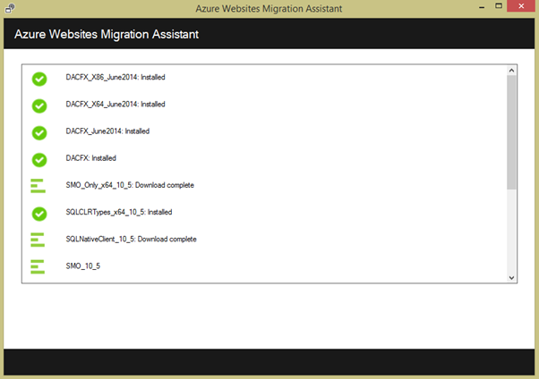

<properties 
    pageTitle="Azure 應用程式服務移轉企業 web 應用程式" 
    description="顯示如何使用 Web 應用程式移轉小幫手]，快速地將現有的 IIS 網站移轉至 Azure 應用程式服務 Web 應用程式" 
    services="app-service" 
    documentationCenter="" 
    authors="cephalin" 
    writer="cephalin" 
    manager="wpickett" 
    editor=""/>

<tags 
    ms.service="app-service" 
    ms.workload="na" 
    ms.tgt_pltfrm="na" 
    ms.devlang="na" 
    ms.topic="article" 
    ms.date="07/01/2016" 
    ms.author="cephalin"/>

# Azure 應用程式服務移轉企業 web 應用程式

您可以輕鬆地移轉網際網路資訊服務 (IIS) 6 上或更新版本，[應用程式服務 Web 應用程式](http://go.microsoft.com/fwlink/?LinkId=529714)執行您現有的網站。 

>[AZURE.IMPORTANT] Windows Server 2003 達到年 7 月 14 2015年上支援的結尾。 如果您目前裝載您的網站 IIS 伺服器上的 Windows Server 2003、 Web 應用程式是低風險，低成本，而低人事的方式，讓您在線上的網站和 Web 應用程式移轉小幫手]，可協助您自動化移轉程序。 

[Web 應用程式移轉小幫手]，](https://www.movemetothecloud.net/)可以分析 IIS server 安裝，找出哪些網站可以移轉應用程式服務、 醒目提示無法移轉或不支援的平台上的任何項目，然後將您的網站和相關聯的資料庫移轉到 Azure。

[AZURE.INCLUDE [app-service-web-to-api-and-mobile](../../includes/app-service-web-to-api-and-mobile.md)]

## 驗證在相容性分析的項目 ##
移轉小幫手建立整備報表，以識別封鎖問題可能無法從內部部署 IIS 成功移轉到 Azure 應用程式服務 Web 應用程式的問題的任何可能的原因。 重要的項目，必須注意的一些是︰

-   連接埠繫結-Web 應用程式只支援連接埠 80 HTTP 和連接埠 443 HTTPS 流量。 設定不同的連接埠也會忽略並將路由流量至 80 或 443。 
-   驗證-Web 應用程式支援匿名驗證的預設表單驗證應用程式所指定的位置。 Windows 驗證可與 Azure Active Directory 和 ADFS 只整合。 目前不支援的驗證，例如基本驗證的所有其他表單。 
-   全域的組件快取 (GAC) – GAC 不支援在 Web 應用程式。 如果您的應用程式參考通常部署 gac 的組件，您必須部署至 Web 應用程式中的 [應用程式回收筒] 資料夾。 
-   IIS5 相容性模式 – 在 Web 應用程式中不支援此。 
-   應用程式集區 – 在 Web 應用程式與每個網站及其子應用程式中的執行相同的應用程式集區。 如果您的網站有多個子應用程式使用多個應用程式集區，合併至單一應用程式集區的常見設定，或移轉至另一個 web 應用程式的每個應用程式。
-   COM 元件-Web 應用程式不允許在平台上的註冊 COM 元件。 如果您的網站或應用程式使用任何 COM 元件，您必須重寫 managed 程式碼中，並將它們部署網站或應用程式。
-   ISAPI 篩選 – Web 應用程式可支援使用 ISAPI 篩選器。 您需要執行下列動作︰
    -   部署 Dll 與您的 web 應用程式 
    -   註冊使用[Web.config](http://www.iis.net/configreference/system.webserver/isapifilters) Dll
    -   applicationHost.xdt 將檔案放在網站根目錄下列內容︰

            <?xml version="1.0"?>
            <configuration xmlns:xdt="http://schemas.microsoft.com/XML-Document-Transform">
            <configSections>
                <sectionGroup name="system.webServer">
                  <section name="isapiFilters" xdt:Transform="SetAttributes(overrideModeDefault)" overrideModeDefault="Allow" />
                </sectionGroup>
              </configSections>
            </configuration>

        如需如何使用您的網站中使用 XML 文件轉換的更多範例，請參閱[轉換您的 Microsoft Azure 的網站](http://blogs.msdn.com/b/waws/archive/2014/06/17/transform-your-microsoft-azure-web-site.aspx)。

-   其他元件喜歡 SharePoint 前端網頁伺服器擴充功能 (FPSE)，FTP 時，將不會移轉 SSL 憑證。

## 如何使用 Web 應用程式移轉小幫手 ##
若要使用的 SQL Server 資料庫，並在內部部署的 Windows Server 2003 R2 (IIS 6.0) 電腦上執行移轉一些網站範例本區段逐一︰

1.  IIS 伺服器或您的用戶端電腦上瀏覽至[https://www.movemetothecloud.net/](https://www.movemetothecloud.net/) 

    

2.  安裝 Web 應用程式移轉小幫手]，按一下 [**固定 IIS 伺服器**] 按鈕。 更多選項會在不久的將來會的選項。 
4.  按一下 [**安裝工具**] 按鈕，在您的電腦上安裝 Web 應用程式移轉小幫手]。

    

    >[AZURE.NOTE] 您也可以按一下 [下載 ZIP 檔案安裝在未連線到網際網路的伺服器上的 [**下載適用於離線安裝**。 或者，您可以按一下 [**上傳現有的移轉整備報告**，進階的選項，可以使用現有移轉整備報告先前產生 （稍後所述）。

5.  在 [**應用程式安裝**] 畫面中，按一下 [**安裝**在您的電腦上安裝。 如有需要它也會安裝 Web 部署、 等 DacFX，IIS，對應的相依性。 

    

    安裝後，Web 應用程式移轉小幫手] 會自動啟動。
  
6.  選擇 [**將網站和 Azure 在遠端伺服器的資料庫**]。 輸入遠端伺服器的系統管理認證，然後按一下 [**繼續**]。 

    

    當然，您可以選擇從本機伺服器移轉。 遠端選項時，您想要從生產 IIS 伺服器移轉網站。
 
    移轉工具會檢查此時 IIS 伺服器的設定，例如，網站、 應用程式、 應用程式集區和相依性，以識別候選網站移轉。 

8.  以下螢幕擷取畫面顯示三個網站 –**預設的網站**、 **TimeTracker**及**CommerceNet4**。 全部都有相關聯的資料庫，我們要移轉。 選取所有您想要評估，然後按一下 [**下一步**的網站。

    
 
9.  按一下 [**上傳**整備報告上傳]。 如果您按一下 [**儲存至本機檔案**，您可以稍後再次執行移轉工具，然後上傳已儲存的整備報告，如先前所述。

    
 
    一旦您上傳整備報告，Azure 執行整備分析，並顯示您的結果。 讀取每個網站的評估詳細資料，請確定您瞭解或有處理所有的問題，再繼續進行。 
 
    

12. 按一下 [**開始移轉**] 開始移轉。您會立即重新導向至 Azure 登入您的帳戶中。 請務必登入有作用中的 Azure 訂閱的帳戶。 如果您沒有 Azure 帳戶然後您可以註冊免費試用版[以下](https://azure.microsoft.com/pricing/free-trial/?WT.srch=1&WT.mc_ID=SEM_)。 

13. 選取租用戶帳戶 Azure 訂閱與使用已移轉 Azure web 應用程式與資料庫的區域，然後按一下 [**開始移轉**。 您可以選取要移轉的更新版本的網站。

    

14. 在下一個畫面上您可以變更預設的升級設定，例如︰

    - 使用現有的 Azure SQL 資料庫或建立新的 Azure SQL 資料庫，並設定其認證
    - 選取要移轉的網站
    - 定義 Azure web 應用程式和其連結的 SQL 資料庫的名稱
    - 自訂的通用設定和網站層級設定

    以下螢幕擷取畫面顯示選取的預設設定移轉的所有網站。

    

    >[AZURE.NOTE] 在自訂設定中的 [**啟用 Azure Active Directory**核取方塊整合 Azure web 應用程式與[Azure Active Directory](active-directory-whatis.md) （**預設目錄**）。 如需同步處理的 Azure Active Directory 與您內部部署的 Active Directory 的詳細資訊，請參閱[目錄整合](http://msdn.microsoft.com/library/jj573653)。

16.  後所需的變更，請按一下 [**建立**]，啟動移轉程序。 移轉工具會建立 Azure SQL 資料庫和 Azure web 應用程式，然後發佈網站內容與資料庫]。 移轉進度清楚地顯示在移轉工具中，您會看到摘要螢幕結束時，網站移轉，它們都已成功，是否的詳細資訊連結至新建立的 Azure web 應用程式。 

    如果移轉時，發生任何錯誤，移轉工具會清楚指出失敗，以及復原變更。 您也可以回報即可直接傳送給工程團隊按一下 [**回報此問題**] 按鈕，擷取的失敗呼叫堆疊並建立郵件本文。 

    

    如果移轉成功不具有錯誤，您也可以按一下 [**提供意見反應**] 按鈕，直接提供任何意見反應。 
 
20. 按一下 [連結至 Azure web 應用程式，並確認 [已成功移轉。

21. 您現在可以管理移轉的 web 應用程式中 Azure 應用程式服務。 若要這麼做，請登入[Azure 入口網站](https://portal.azure.com)。

22. Azure 入口網站中開啟 Web 應用程式刀，若要查看您移轉後的網站 （顯示為 web 應用程式），然後按一下任何一種即可開始管理 web 應用程式，例如設定連續發佈，建立備份、 自動縮放，並監控使用或效能。

    

>[AZURE.NOTE] 如果您想要開始使用 Azure 應用程式服務註冊 Azure 帳戶之前，請移至[嘗試應用程式服務](http://go.microsoft.com/fwlink/?LinkId=523751)，可以讓您立即建立短暫入門 web 應用程式在應用程式服務。 必要; 沒有信用卡沒有承諾。

## 變更的項目
* 若要變更的指南，從網站應用程式服務請參閱︰ [Azure 應用程式服務與程式影響現有 Azure 服務](http://go.microsoft.com/fwlink/?LinkId=529714)
 
