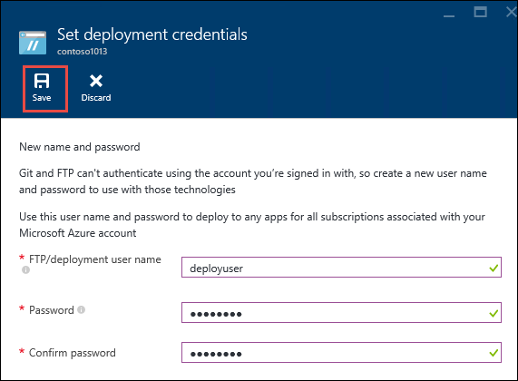

<properties
    pageTitle="Azure 應用程式服務中建立 Node.js web 應用程式 |Microsoft Azure"
    description="瞭解如何部署 Node.js 應用程式中 Azure 應用程式服務 web 應用程式。"
    services="app-service\web"
    documentationCenter="nodejs"
    authors="rmcmurray"
    manager="wpickett"
    editor=""/>

<tags
    ms.service="app-service-web"
    ms.workload="web"
    ms.tgt_pltfrm="na"
    ms.devlang="nodejs"
    ms.topic="hero-article"
    ms.date="08/11/2016"
    ms.author="robmcm"/>

# Azure 應用程式服務中建立 Node.js web 應用程式

> [AZURE.SELECTOR]
- [.Net](web-sites-dotnet-get-started.md)
- [Node.js](web-sites-nodejs-develop-deploy-mac.md)
- [Java](web-sites-java-get-started.md)
- [PHP-給](web-sites-php-mysql-deploy-use-git.md)
- [PHP-FTP](web-sites-php-mysql-deploy-use-ftp.md)
- [Python](web-sites-python-ptvs-django-mysql.md)

本教學課程中會顯示如何建立簡單的[Node.js](http://nodejs.org)應用程式，並將其部署到[Azure 應用程式服務](../app-service/app-service-value-prop-what-is.md)中的[web 應用程式](app-service-web-overview.md)中，使用[給](http://git-scm.com)。 可以在能夠執行 Node.js 任何作業系統上遵循此教學課程中的指示進行。

您將學習︰

* 如何建立 Azure 應用程式服務中的 web 應用程式，使用 Azure 入口網站。
* 如何將發送到 web 應用程式給存放庫來部署 web 應用程式 Node.js 應用程式。

完成的應用程式至瀏覽器寫入的簡短"hello 全球 」 字串。

![在瀏覽器會顯示 「 Hello World 」 訊息。][helloworld-completed]

教學課程和程式碼範例更複雜的 Node.js 應用程式，或瞭解如何使用 Node.js Azure 中的其他主題，請參閱[Node.js 開發人員中心](/develop/nodejs/)。

> [AZURE.NOTE]
> 若要完成此教學課程中，您需要 Microsoft Azure 帳戶。 如果您沒有帳戶，您可以[啟動您的 Visual Studio 訂閱權益](/en-us/pricing/member-offers/msdn-benefits-details/?WT.mc_id=A261C142F)或[註冊免費試用版](/en-us/pricing/free-trial/?WT.mc_id=A261C142F)。
>
> 如果您想要快速入門 Azure 應用程式服務註冊 Azure 帳戶之前，請移至[嘗試應用程式服務](http://go.microsoft.com/fwlink/?LinkId=523751)。 那里，您可以立即建立短暫入門 web 應用程式的應用程式服務，必要時，沒有信用卡和沒有承諾。

## 建立 web 應用程式，並啟用給發佈

遵循這些步驟 Azure 應用程式服務中建立 web 應用程式，並啟用發佈給。 

[給](http://git-scm.com/)是部署您 Azure 的網站，您可以使用的分散式的版本控制系統。 您會儲存於本機給存放庫，web 應用程式撰寫程式碼，您會將您的程式碼部署至 Azure 推入到遠端儲存機制。 此部署方法是應用程式服務 web 應用程式的功能。  

1. [Azure 入口網站](https://portal.azure.com)登入。

2. 按一下左上 Azure 入口網站頂端的 [ **+ 新增**] 圖示。

3. 按一下 [ **Web + 行動**]，然後按一下 [ **Web 應用程式**。

    ![][portal-quick-create]

4. 在**Web 應用程式**] 方塊中輸入的 web 應用程式的名稱。

    此名稱必須是唯一的 azurewebsites.net 網域，因為 web 應用程式的 URL 會 {名稱}。 azurewebsites.net。 如果您輸入的名稱不是唯一的一個紅色驚嘆號會出現在 [文字] 方塊中。

5. 選取 [**訂閱**]。

6. 選取**資源群組**或建立新的項目。

    如需有關資源群組的詳細資訊，請參閱[Azure 資源管理員的概觀](../azure-resource-manager/resource-group-overview.md)。

7. 選取**應用程式服務方案/位置**，或建立新的項目。

    如需有關應用程式服務方案的詳細資訊，請參閱[Azure 應用程式服務方案概觀](../azure-web-sites-web-hosting-plans-in-depth-overview.md)

8. 按一下 [**建立**]。
   
    ![][portal-quick-create2]

    在一段時間，通常不到一分鐘，Azure 完成建立新 web 應用程式。

9. 按一下 [ **Web 應用程式 > {新的 web 應用程式}**。

    

10. 在**Web 應用程式**刀中，按一下 [**部署**組件。

    ![][deployment-part]

11. 在**連續部署**刀中，按一下 [**選擇來源**

12. 按一下 [**本機給存放庫**，，然後按一下**[確定]**。

    ![][setup-git-publishing]

13. 如果您還沒有這麼做，請設定部署認證。

    。 在 Web 應用程式刀中，按一下 [**設定 > 部署認證**。

    ![][deployment-credentials]
 
    b。 建立使用者名稱和密碼。 
    
    

14. 在 Web 應用程式刀中，按一下 [**設定**]，然後按一下**屬性**。
 
    若要發佈，您會推入遠端給存放庫。 將存放庫的 URL 會列在**給 URL**。 稍後在本教學課程中，您會使用這個 URL。

    ![][git-url]

## 建立並測試您的應用程式至本機

在此區段中，您會建立**server.js**檔案中含有 「 Hello World 」 範例中，從 [nodejs.org] 也經過小幅修改的版本。 程式碼新增 process.env.PORT 為接聽 Azure web 應用程式中執行時的連接埠。

1. 建立名為*helloworld*的目錄。

2. 使用文字編輯器建立名為**server.js** *helloworld*目錄中的新檔案。

2. 到**server.js**檔案中，複製下列程式碼，然後儲存檔案︰

        var http = require('http')
        var port = process.env.PORT || 1337;
        http.createServer(function(req, res) {
          res.writeHead(200, { 'Content-Type': 'text/plain' });
          res.end('Hello World\n');
        }).listen(port);

3. 開啟命令列中，並開始本機 web 應用程式中使用下列命令。

        node server.js

4. 開啟網頁瀏覽器，然後瀏覽至 http://localhost:1337。 

    顯示"Hello World 」 的網頁隨即出現，如以下的螢幕擷取畫面所示。

    ![在瀏覽器會顯示 「 Hello World 」 訊息。][helloworld-localhost]

## 發佈您的應用程式

1. 如果您還沒有這麼做，請安裝給。

    如需您的平台的安裝指示，請參閱[給下載頁面](http://git-scm.com/download)。

1. 從命令列中，將目錄變更為**helloworld**目錄]，輸入下列命令以初始化本機給存放庫。

        git init

2. 將檔案新增到存放庫中使用下列命令︰

        git add .
        git commit -m "initial commit"

3. 新增給遠端用於推入至您先前，使用下列命令來建立 web 應用程式的更新︰

        git remote add azure [URL for remote repository]

4. 推入 Azure 的變更，請使用下列命令︰

        git push azure master

    系統提示您輸入密碼先前所建立。 輸出是類似以下的範例。

        Counting objects: 3, done.
        Delta compression using up to 8 threads.
        Compressing objects: 100% (2/2), done.
        Writing objects: 100% (3/3), 374 bytes, done.
        Total 3 (delta 0), reused 0 (delta 0)
        remote: New deployment received.
        remote: Updating branch 'master'.
        remote: Preparing deployment for commit id '5ebbe250c9'.
        remote: Preparing files for deployment.
        remote: Deploying Web.config to enable Node.js activation.
        remote: Deployment successful.
        To https://user@testsite.scm.azurewebsites.net/testsite.git
         * [new branch]      master -> master

5. 若要檢視您的應用程式，請按一下 [ **Web 應用程式**組件中 Azure 入口網站上的 [**瀏覽**] 按鈕。

    ![瀏覽] 按鈕](./media/web-sites-nodejs-develop-deploy-mac/browsebutton.png)

    

## 將變更發佈至您的應用程式

1. 開啟**server.js**檔案在文字編輯器中，並變更 'Hello World\n'' Hello Azure\n 」。 

2. 儲存檔案。

2. 從命令列中，將目錄變更為**helloworld**目錄，然後執行下列命令︰

        git add .
        git commit -m "changing to hello azure"
        git push azure master

    您會再次提示您輸入密碼。

3. 重新整理瀏覽器視窗，您瀏覽至 web 應用程式的 URL。

    ![網頁上顯示 「 Hello Azure 」][helloworld-completed]

## 復原部署

您可以按一下**Web 應用程式**刀**設定 > 連續部署**查看中**部署**刀部署記錄。 如果您要回復為舊版的部署，您可以加以選取，然後再按一下 [**部署詳細資料**刀中的 [**重新部署**。

## 後續步驟

您已部署至 Azure 應用程式服務中的 web 應用程式的 Node.js 應用程式。 若要深入瞭解應用程式服務 web 應用程式執行 Node.js 應用程式的方式，請參閱[Azure 應用程式服務 Web 應用程式︰ Node.js](http://blogs.msdn.com/b/silverlining/archive/2012/06/14/windows-azure-websites-node-js.aspx) ，並[指定 Node.js 版本 Azure 應用程式中的](../nodejs-specify-node-version-azure-apps.md)。

Node.js 提供豐富的生態系統的模組，可讓您的應用程式。 若要瞭解如何 Web 應用程式搭配模組，請參閱[Azure 應用程式的使用 Node.js 模組](../nodejs-use-node-modules-azure-apps.md)。

如果部署 Azure 之後，您就會發生問題，您的應用程式，請參閱[如何偵錯 Azure 應用程式服務中的 Node.js 應用程式](web-sites-nodejs-debug.md)上診斷問題的資訊。

本文會使用 Azure 入口網站，來建立 web 應用程式。 您也可以使用[Azure 命令列介面](../xplat-cli-install.md)或[PowerShell 的 Azure](../powershell-install-configure.md)執行相同的作業。

如需有關如何開發 Node.js Azure 上的應用程式的詳細資訊，請參閱[Node.js 開發人員中心](/develop/nodejs/)。

[helloworld-completed]: ./media/web-sites-nodejs-develop-deploy-mac/helloazure.png
[helloworld-localhost]: ./media/web-sites-nodejs-develop-deploy-mac/helloworldlocal.png
[portal-quick-create]: ./media/web-sites-nodejs-develop-deploy-mac/create-quick-website.png
[portal-quick-create2]: ./media/web-sites-nodejs-develop-deploy-mac/create-quick-website2.png
[setup-git-publishing]: ./media/web-sites-nodejs-develop-deploy-mac/setup_git_publishing.png
[go-to-dashboard]: ./media/web-sites-nodejs-develop-deploy-mac/go_to_dashboard.png
[deployment-part]: ./media/web-sites-nodejs-develop-deploy-mac/deployment-part.png
[deployment-credentials]: ./media/web-sites-nodejs-develop-deploy-mac/deployment-credentials.png
[git-url]: ./media/web-sites-nodejs-develop-deploy-mac/git-url.png
