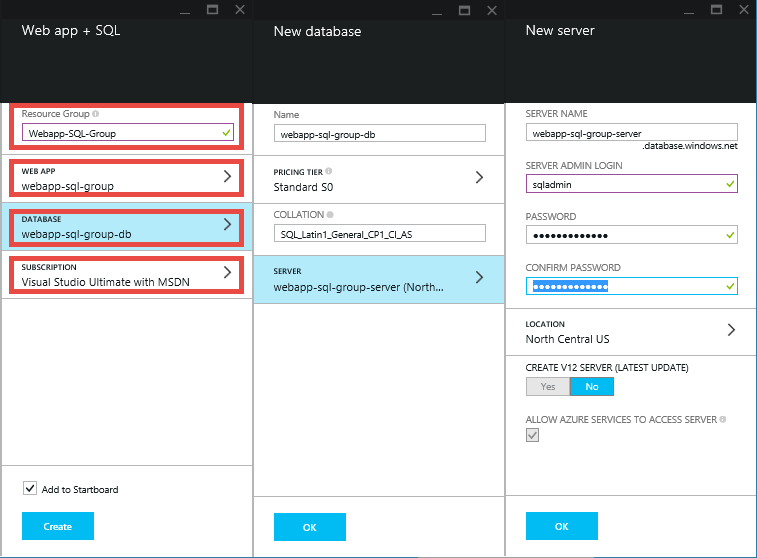

<properties 
    pageTitle="建立 PHP SQL web 應用程式，並使用給 Azure 應用程式服務部署" 
    description="示範如何建立 PHP web 應用程式儲存 Azure SQL 資料庫中的資料，並使用 Azure 應用程式服務給部署教學課程。" 
    services="app-service\web, sql-database" 
    documentationCenter="php" 
    authors="rmcmurray" 
    manager="wpickett" 
    editor=""/>

<tags 
    ms.service="app-service-web" 
    ms.workload="web" 
    ms.tgt_pltfrm="na" 
    ms.devlang="PHP" 
    ms.topic="article" 
    ms.date="08/11/2016" 
    ms.author="robmcm"/>

# 建立 PHP SQL web 應用程式，並使用給 Azure 應用程式服務部署

本教學課程教您如何[Azure 應用程式服務](http://go.microsoft.com/fwlink/?LinkId=529714)的連線到 Azure SQL 資料庫中建立 PHP web 應用程式，以及如何將其使用給部署。 本教學課程，假設您有[PHP][install-php]， [SQL Server Express][install-SQLExpress]、 [Microsoft SQL Server，PHP 驅動程式](http://www.microsoft.com/download/en/details.aspx?id=20098)及[給][install-git]您電腦上安裝。 完成本指南，您必須在 Azure 中執行的 PHP SQL web 應用程式。

> [AZURE.NOTE]
> 您可以安裝並設定 PHP、 SQL Server Express，及 Microsoft 驅動程式的 SQL Server PHP 使用[Microsoft Web 平台安裝程式](http://www.microsoft.com/web/downloads/platform.aspx)。

您將瞭解︰

* 如何建立 Azure web 應用程式和 SQL 資料庫使用[Azure 入口網站](http://go.microsoft.com/fwlink/?LinkId=529715)。 因為 PHP 預設會啟用應用程式服務 Web 應用程式中，選擇性執行任何動作，才能執行碼。
* 如何發佈並重新發佈 Azure 使用給您的應用程式。
 
依照本教學課程中，您會建立簡單的註冊 web 應用程式中 PHP。 應用程式將會裝載於 Azure 網站。 下方，為已完成的應用程式的螢幕擷取畫面︰

[AZURE.INCLUDE [create-account-and-websites-note](../../includes/create-account-and-websites-note.md)]

>[AZURE.NOTE] 如果您想要開始使用 Azure 應用程式服務註冊 Azure 帳戶之前，請移至[嘗試應用程式服務](http://go.microsoft.com/fwlink/?LinkId=523751)，可以讓您立即建立短暫入門 web 應用程式在應用程式服務。 必要; 沒有信用卡沒有承諾。

##建立 Azure web 應用程式，並設定給發佈

請遵循這些步驟來建立 Azure web 應用程式和 SQL 資料庫︰

1. [Azure 入口網站](https://portal.azure.com/)登入。

2. **選取所有**服務商場，然後選取 [ **Web + 行動電話**] 旁，按一下頂端的 [**新增**] 圖示，即可 Azure Marketplace 方的儀表板，開啟。
    
3. 在 [市集]，選取**Web + 行動**。

4. 按一下 [ **Web 應用程式 + SQL**圖示。

5. 讀取之後 Web 應用程式 + SQL 應用程式的說明，請選取 [**建立**]。

6. 按一下 [在每個部分 （**資源群組**、 **Web 應用程式**、**資料庫**及**訂閱**） 與輸入或選取所需的欄位的值︰
    
    - 輸入您所選擇的 URL 名稱   
    - 設定資料庫伺服器認證
    - 選取您的區域

    

7. 定義完成 web 應用程式，請按一下 [**建立**]。

    建立 web 應用程式之後，[**通知**] 按鈕會 flash 綠色**成功**與資源] 群組中開啟] 群組中顯示的 web 應用程式和 SQL 資料庫。

4. 按一下以開啟 web 應用程式的刀資源群組刀 web 應用程式的圖示。

    ![web 應用程式的 [資源] 群組](./media/web-sites-php-sql-database-deploy-use-git/resource-group-blade.png)

5. 在 [**設定**中，按一下 [**接續本頁] 分部署** > **設定所需的設定**。 選取 [**本機給存放庫**，然後按一下**[確定**]。

    

    如果您有沒有設定給存放庫之前，您必須提供使用者名稱和密碼。 若要這麼做，請按一下 [**設定** > **部署認證**在 web 應用程式的刀。

    

6. 在**設定**，按一下 [**屬性**]，請參閱您需要使用稍後部署 PHP 應用程式的給遠端 URL。

##取得 SQL 資料庫連線資訊

若要連線至 SQL 資料庫執行個體的已連結至您的 web 應用程式，您會需要連線資訊，您所指定當您建立資料庫。 若要取得 SQL 資料庫連線資訊，請遵循下列步驟︰

1. 回到 [資源] 群組的刀按一下 SQL 資料庫的圖示。

2. 在 SQL 資料庫的刀，按一下 [**設定** > **屬性**]，然後按一下 [**顯示資料庫連線字串**。 

    
    
3. 從 [ **PHP**區段的 [結果] 對話方塊中，記下的值`Server`， `SQL Database`，及`User Name`。 稍後 PHP web 應用程式發佈到 Azure 應用程式服務時，您會使用這些值。

##建立並測試您的應用程式至本機

登錄的是簡單的 PHP 應用程式，可讓您註冊的事件提供您的名稱和電子郵件地址。 上一個開放的相關資訊會顯示在表格中。 註冊資訊會儲存於 SQL 資料庫執行個體。 此應用程式包含兩個檔案 （如下所示複製/貼上程式碼）︰

* **index.php**︰ 顯示註冊和資料表，其中包含 registrant 資訊的表單。
* **createtable.php**︰ 建立應用程式的 SQL 資料庫表格。 一次只會用這個檔案。

若要在本機上執行應用程式，請遵循下列步驟。 請注意，這些步驟是假設您有 PHP 與 SQL Server Express 在您的本機電腦上設定和您已啟用[SQL Server PDO 副檔名][pdo-sqlsrv]。

1. 建立 SQL Server 資料庫稱為`registration`。 您可以從`sqlcmd`命令提示字元中的下列命令︰

        >sqlcmd -S localhost\sqlexpress -U <local user name> -P <local password>
        1> create database registration
        2> GO   

2. 在 [應用程式根目錄，建立兩個檔案-一個名為`createtable.php`和一個名為`index.php`。

3. 開啟`createtable.php`文字編輯器或 IDE 文件中的檔案，並新增下列程式碼。 將此程式碼會用來建立`registration_tbl`表格中`registration`資料庫。

        <?php
        // DB connection info
        $host = "localhost\sqlexpress";
        $user = "user name";
        $pwd = "password";
        $db = "registration";
        try{
            $conn = new PDO( "sqlsrv:Server= $host ; Database = $db ", $user, $pwd);
            $conn->setAttribute( PDO::ATTR_ERRMODE, PDO::ERRMODE_EXCEPTION );
            $sql = "CREATE TABLE registration_tbl(
            id INT NOT NULL IDENTITY(1,1) 
            PRIMARY KEY(id),
            name VARCHAR(30),
            email VARCHAR(30),
            date DATE)";
            $conn->query($sql);
        }
        catch(Exception $e){
            die(print_r($e));
        }
        echo "<h3>Table created.</h3>";
        ?>

    請注意，您需要更新的值<code>$user</code>和<code>$pwd</code>使用本機的 SQL Server 使用者名稱和密碼。

4. 在 terminal 中，在應用程式的根目錄中，輸入下列命令︰

        php -S localhost:8000

4. 開啟網頁瀏覽器，然後瀏覽至**http://localhost:8000/createtable.php**。 這會建立`registration_tbl`資料庫中的資料表。

5. 在文字編輯器] 或 [IDE 開啟**index.php**檔案，並新增基本 HTML 和 CSS 網頁程式碼 （PHP 程式碼會在稍後步驟中新增）。

        <html>
        <head>
        <Title>Registration Form</Title>
        
        </head>
        <body>
        <h1>Register here!</h1>
        
Fill in your name and email address, then click <strong>Submit</strong> to register.

        <form method="post" action="index.php" enctype="multipart/form-data" >
              Name  <input type="text" name="name" id="name"/> 
              Email <input type="text" name="email" id="email"/> 
              <input type="submit" name="submit" value="Submit" />
        </form>
        <?php

        ?>
        </body>
        </html>

6. 內 PHP 標籤中，新增 PHP 需連線至資料庫的程式碼。

        // DB connection info
        $host = "localhost\sqlexpress";
        $user = "user name";
        $pwd = "password";
        $db = "registration";
        // Connect to database.
        try {
            $conn = new PDO( "sqlsrv:Server= $host ; Database = $db ", $user, $pwd);
            $conn->setAttribute( PDO::ATTR_ERRMODE, PDO::ERRMODE_EXCEPTION );
        }
        catch(Exception $e){
            die(var_dump($e));
        }

    同樣地，您需要更新的值<code>$user</code>和<code>$pwd</code>使用本機 MySQL 使用者名稱和密碼。

7. 下列資料庫連線程式碼中，將程式碼的插入資料庫中的註冊資訊。

        if(!empty($_POST)) {
        try {
            $name = $_POST['name'];
            $email = $_POST['email'];
            $date = date("Y-m-d");
            // Insert data
            $sql_insert = "INSERT INTO registration_tbl (name, email, date) 
                           VALUES (?,?,?)";
            $stmt = $conn->prepare($sql_insert);
            $stmt->bindValue(1, $name);
            $stmt->bindValue(2, $email);
            $stmt->bindValue(3, $date);
            $stmt->execute();
        }
        catch(Exception $e) {
            die(var_dump($e));
        }
        echo "<h3>Your're registered!</h3>";
        }

8. 最後，下列上述的程式碼，新增 [從資料庫中擷取資料的程式碼。

        $sql_select = "SELECT * FROM registration_tbl";
        $stmt = $conn->query($sql_select);
        $registrants = $stmt->fetchAll(); 
        if(count($registrants) > 0) {
            echo "<h2>People who are registered:</h2>";
            echo "<table>";
            echo "<tr><th>Name</th>";
            echo "<th>Email</th>";
            echo "<th>Date</th></tr>";
            foreach($registrants as $registrant) {
                echo "<tr><td>".$registrant['name']."</td>";
                echo "<td>".$registrant['email']."</td>";
                echo "<td>".$registrant['date']."</td></tr>";
            }
            echo "</table>";
        } else {
            echo "<h3>No one is currently registered.</h3>";
        }

現在，您可以瀏覽至**http://localhost:8000/index.php**測試應用程式。

##發佈您的應用程式

您已測試您的應用程式本機之後，您可以將其發佈至應用程式服務 Web 應用程式使用給。 不過，您必須以更新應用程式中的資料庫連線資訊。 較舊版本 （在 [**取得 SQL 資料庫連線資訊**] 區段），使用您取得資料庫連線資訊更新**同時**中的下列資訊`createdatabase.php`和`index.php`檔案以適當的值︰

    // DB connection info
    $host = "tcp:<value of Server>";
    $user = "<value of User Name>";
    $pwd = "<your password>";
    $db = "<value of SQL Database>";

> [AZURE.NOTE]
> 在 [ <code>$host</code>，伺服器的值必須加<code>tcp:</code>。

現在，您可以開始設定給發佈及發佈應用程式。

> [AZURE.NOTE]
> 這些是相同結尾的**建立 Azure web 應用程式，並設定給發佈**節所述的步驟。

1. 開啟 GitBash (或 terminal 中，如果是給您`PATH`) 將目錄變更為您的應用程式 （**登錄**目錄） 的根目錄，請執行下列命令︰

        git init
        git add .
        git commit -m "initial commit"
        git remote add azure [URL for remote repository]
        git push azure master

    系統會提示您先前建立的密碼。

2. 瀏覽至**http://[web 應用程式 name].azurewebsites.net/createtable.php**建立應用程式的 SQL 資料庫的資料表。
3. 瀏覽至**http://[web 應用程式 name].azurewebsites.net/index.php**若要開始使用應用程式。

發佈您的應用程式之後，您可以開始進行變更，就可以給發佈給。 

##將變更發佈至您的應用程式

若要將變更發佈至應用程式，請遵循下列步驟︰

1. 本機應用程式中進行變更。
2. 開啟 GitBash (或 terminal 中，it 給位於您`PATH`) 將目錄變更為您的應用程式的根目錄，請執行下列命令︰

        git add .
        git commit -m "comment describing changes"
        git push azure master

    系統會提示您先前建立的密碼。

3. 瀏覽至**http://[web 應用程式 name].azurewebsites.net/index.php**若要查看您的變更。

## 變更的項目
* 若要變更的指南，從網站應用程式服務請參閱︰ [Azure 應用程式服務與程式影響現有 Azure 服務](http://go.microsoft.com/fwlink/?LinkId=529714)

[install-php]: http://www.php.net/manual/en/install.php
[install-SQLExpress]: http://www.microsoft.com/download/details.aspx?id=29062
[install-Drivers]: http://www.microsoft.com/download/details.aspx?id=20098
[install-git]: http://git-scm.com/
[pdo-sqlsrv]: http://php.net/pdo_sqlsrv
 
