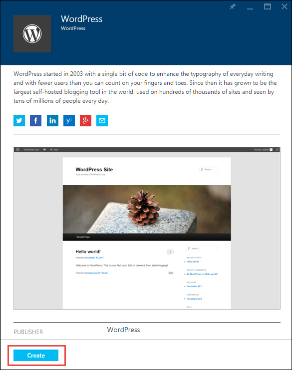

<properties
    pageTitle="Azure 應用程式服務中建立 WordPress web 應用程式 |Microsoft Azure"
    description="瞭解如何建立新的 Azure web 應用程式，使用 [Azure 入口網站 WordPress 部落格的。"
    services="app-service\web"
    documentationCenter="php"
    authors="rmcmurray"
    manager="wpickett"
    editor=""/>

<tags
    ms.service="app-service-web"
    ms.workload="na"
    ms.tgt_pltfrm="na"
    ms.devlang="PHP"
    ms.topic="hero-article"
    ms.date="08/11/2016"
    ms.author="robmcm"/>

# Azure 應用程式服務中建立 WordPress web 應用程式

[AZURE.INCLUDE [tabs](../../includes/app-service-web-get-started-nav-tabs.md)]

本教學課程介紹如何部署從 Azure Marketplace WordPress 部落格網站。

當您完成教學課程您必須設定您自己 WordPress 部落格網站，並在雲端中執行。

您將學習︰

* 如何在 Azure Marketplace 尋找應用程式範本。
* 如何建立 web 應用程式中 Azure 範本為基礎的應用程式服務。
* 如何設定新的 web 應用程式與資料庫的 Azure 應用程式服務設定。

Azure Marketplace 讓許多熱門的 web 應用程式開發 Microsoft、 協力廠商及開啟來源軟體計劃。 Web 應用程式的內建在大範圍的常用的架構，例如[PHP](/develop/nodejs/)此 WordPress 範例、 [.NET](/develop/net/)、 [Node.js](/develop/nodejs/)、 [Java](/develop/java/)，和[Python](/develop/python/)等等。 若要建立 web 應用程式從 Azure Marketplace 所需的唯一軟體是您用於[Azure 入口網站](https://portal.azure.com/)瀏覽器。 

在本教學課程中部署 WordPress 網站使用 MySQL 資料庫。 如果您想要改為使用資料庫的 [SQL 資料庫，請參閱[專案 Nami](http://projectnami.org/)。 **專案 Nami**也是透過 Marketplace 提供的選項。

> [AZURE.NOTE]
> 若要完成此教學課程中，您需要 Microsoft Azure 帳戶。 如果您沒有帳戶，您可以[啟動您的 Visual Studio 訂閱權益](/pricing/member-offers/msdn-benefits-details/?WT.mc_id=A261C142F)或[註冊免費試用版](/en-us/pricing/free-trial/?WT.mc_id=A261C142F)。
>
> 如果您想要快速入門 Azure 應用程式服務註冊 Azure 帳戶之前，請移至[嘗試應用程式服務](http://go.microsoft.com/fwlink/?LinkId=523751)。 您可以立即建立短暫入門 web 應用程式的應用程式服務，必要時，沒有信用卡和沒有承諾。

## 選取 WordPress 和 Azure 應用程式服務設定

1. [Azure 入口網站](https://portal.azure.com/)登入。

2. 按一下 [**新增**]。
    
    ![建立新的][5]
    
3. 搜尋**WordPress**，，然後按一下 [ **WordPress**。 如果您想要使用 SQL 資料庫，而不是 MySQL，搜尋**Project Nami**。

    ![從清單 WordPress][7]
    
5. 讀取之後 WordPress 應用程式的說明，請按一下 [**建立**]。

    

4. 在**Web 應用程式**] 方塊中輸入的 web 應用程式的名稱。

    此名稱必須是唯一的 azurewebsites.net 網域，因為 web 應用程式的 URL 會 {名稱}。 azurewebsites.net。 如果您輸入的名稱不是唯一的一個紅色驚嘆號會出現在 [文字] 方塊中。

8. 如果您有多個訂閱，請選擇您想要使用的項目。 

5. 選取**資源群組**或建立新的項目。

    如需有關資源群組的詳細資訊，請參閱[Azure 資源管理員的概觀](../azure-resource-manager/resource-group-overview.md)。

5. 選取**應用程式服務方案/位置**，或建立新的項目。

    如需有關應用程式服務方案的詳細資訊，請參閱[Azure 應用程式服務方案概觀](../azure-web-sites-web-hosting-plans-in-depth-overview.md) 

7. 按一下**資料庫**]，然後在**新的 MySQL 資料庫**刀設定 MySQL 資料庫中提供必要的值。

    。 輸入新的名稱或保留預設的名稱。

    b。 將**資料庫類型**設為**共用**。

    c。 選擇您選擇的 web 應用程式的相同位置。

    d。 選擇 [價格層]。 水星 （最小的可容許的連線與磁碟空間免費） 很好的在此教學課程。

8. 在**新的 MySQL 資料庫**刀中，按一下**[確定]**。 

8. 在**WordPress**防禦，以接受法律合約，，然後按一下 [**建立**]。 

    

    Azure 應用程式服務會建立 web 應用程式時，通常是一分鐘。 您可以觀看進度鐘形圖示，在入口網站頁面頂端] 即可。

    

## 啟動和管理您的 WordPress web 應用程式
    
7. 建立 web 應用程式完成時，瀏覽至您建立的應用程式時，資源群組 Azure 入口網站中，您可以看見 web 應用程式和資料庫。

    電燈泡圖示額外的資源是[應用程式的深入見解](/services/application-insights/)提供監視服務 web 應用程式。

1. 在 [**資源群組**刀中，按一下 [web 應用程式列]。

    

2. 在 Web 應用程式刀中，按一下 [**瀏覽**]。

    ![網站 URL][browse]

3. 在 [WordPress**歡迎使用**] 頁面，輸入 WordPress，所需的設定資訊，然後再按一下 [**安裝 WordPress**。

    

4. 使用您在 [**歡迎**] 頁面建立的認證登入。  

5. 您的網站 」 儀表板頁面隨即開啟。    

    

## 後續步驟

您已經看到如何建立及部署 PHP web 應用程式庫。 如需有關使用 PHP Azure 中的詳細資訊，請參閱[PHP 開發人員中心](/develop/php/)。

如需有關如何使用應用程式服務 Web 應用程式的詳細資訊，請參閱的連結 （適用於寬的瀏覽器視窗） 頁面的左側或頂端的頁面 （適用於較窄的瀏覽器視窗中）。 

## 變更的項目
* 變更網站應用程式服務的指南，請參閱[Azure 應用程式服務和對現有 Azure 服務的影響](http://go.microsoft.com/fwlink/?LinkId=529714)。

[5]: ./media/web-sites-php-web-site-gallery/startmarketplace.png
[7]: ./media/web-sites-php-web-site-gallery/search-web-app.png
[browse]: ./media/web-sites-php-web-site-gallery/browse-web.png
