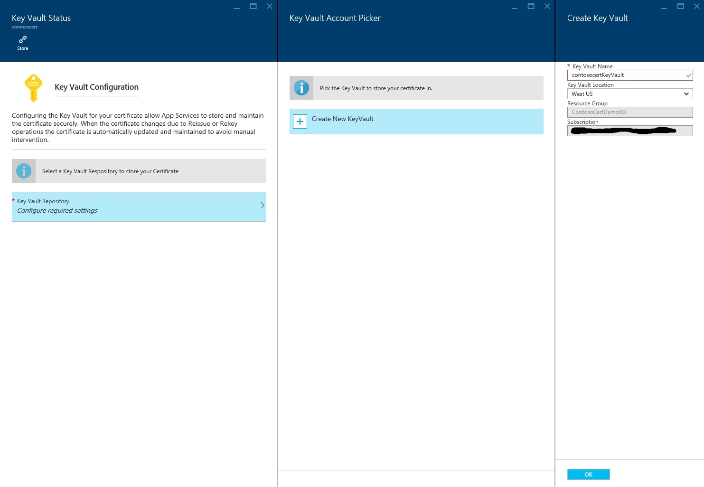
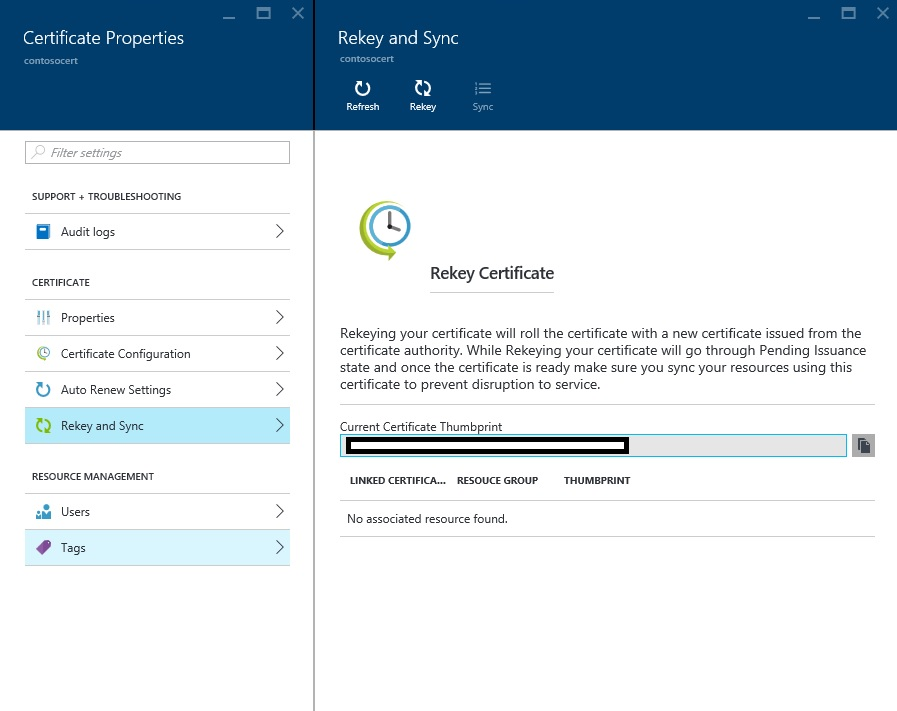

<properties
    pageTitle="購買和 Azure 服務應用程式中設定 SSL 憑證"
    description="瞭解如何購買和 Azure 服務應用程式中設定 SSL 憑證。"
    services="app-service"
    documentationCenter=".net"
    authors="apurvajo"
    manager="stefsch"
    editor="cephalin"
    tags="buy-ssl-certificates"/>

<tags
    ms.service="app-service"
    ms.workload="na"
    ms.tgt_pltfrm="na"
    ms.devlang="na"
    ms.topic="article"
    ms.date="09/19/2016"
    ms.author="apurvajo"/>

#購買和 Azure 服務應用程式中設定 SSL 憑證

> [AZURE.SELECTOR]
- [購買 Azure 中的 SSL 憑證](web-sites-purchase-ssl-web-site.md)
- [從其他地方使用 SSL 憑證](web-sites-configure-ssl-certificate.md)

根據預設， **[Azure 應用程式服務](http://go.microsoft.com/fwlink/?LinkId=529714)**已啟用 HTTPS web 應用程式與*的萬用字元憑證。 azurewebsites.net 網域。如果您不打算設定自訂網域，您可以可以從預設的 HTTPS 憑證。不過，例如所有*[萬用字元網域](https://casecurity.org/2014/02/26/pros-and-cons-of-single-domain-multi-domain-and-wildcard-certificates)，不安全的自訂網域使用您自己的憑證。 Azure 應用程式服務現在可讓您很簡單的方法來購買並直接從 Azure 入口網站管理 SSL 憑證，不需要離開入口網站。  
本文說明如何購買和**[Azure 應用程式服務](http://go.microsoft.com/fwlink/?LinkId=529714)**簡單的步驟 3 中設定 SSL 憑證。 

> [AZURE.NOTE]
> 使用免費，共用的 web 應用程式無法使用的自訂網域名稱的 SSL 憑證。 您必須設定 web 應用程式的基本、 標準或進階模式，可能會變更多少向您收費，您的訂閱。 如需詳細資訊，請參閱**[Web 應用程式定價詳細資料](https://azure.microsoft.com/pricing/details/web-sites/)**。

##概觀
> [AZURE.NOTE]
> 請不要嘗試購買 SSL 憑證使用沒有作用中的信用卡卡與其相關聯的訂閱。 這可能會導致您停用的訂閱。 

##<a>購買、 儲存並指派您的自訂網域的 SSL 憑證</a>
若要啟用 HTTPS 的自訂網域，例如 contoso.com，您必須先執行**[Azure 應用程式服務中設定自訂網域名稱。](web-sites-custom-domain-name.md)**

前要求 SSL 憑證，您必須先決定要保護的網域名稱的憑證。 這將會決定您必須取得何種類型的憑證。 如果您只需要一個網域名稱，例如 contoso.com 或 www.contoso.com （基本） 的標準的安全性憑證已足夠。 如果您需要安全多個網域名稱，例如 contoso.com、 www.contoso.com 及 mail.contoso.com，然後您可以取得**[萬用字元憑證](http://en.wikipedia.org/wiki/Wildcard_certificate)**

##步驟 0︰ 訂單 SSL 憑證

在此步驟中，您將學習如何將您所選擇的 SSL 憑證的順序。

1.  在**[Azure 入口網站](https://portal.azure.com/)**中，按一下 [瀏覽與搜尋] 列中輸入 「 應用程式服務的憑證 」，選取 」 應用程式服務的憑證 」] 結果，並按一下 [新增]。 

    ![使用瀏覽] 來建立的插入圖像](./media/app-service-web-purchase-ssl-web-site/browse.jpg)

    ![使用瀏覽] 來建立的插入圖像](./media/app-service-web-purchase-ssl-web-site/add.jpg)

2.  輸入您的 SSL 憑證**好記的名稱**。

3.  輸入 [**主機名稱**
> [AZURE.NOTE]
    這是最重要的部分的購買程序的其中一個。 請務必輸入您想要使用這個憑證保護的正確主機名稱 （自訂的網域）。 **執行**附加為 WWW，主機名稱。 例如，如果您的自訂網域名稱有 www.contoso.com，然後只在 [主機名稱] 欄位中輸入 contoso.com，問題的憑證會保護 www 和根網域。 
    
4.  選取您的**訂閱**。 

    如果您有多個訂閱，然後確定建立您的自訂網域或 Web 應用程式使用同一份訂閱的 SSL 憑證問題。
       
5.  選取或建立**資源群組**]。

    資源群組可讓您管理相關的 Azure 資源為單位，並建立您的應用程式的角色型存取控制 (RBAC) 規則時，很有用。 如需詳細資訊，請參閱管理您的 Azure 資源。
     
6.  選取**憑證 SKU** 

    最後，選取符合您需求的 SKU 的憑證，然後按一下 [建立]。 現在，Azure 應用程式服務可讓您購買兩個不同的 Sku • S1 – 1 年有效性與自動更新的標準憑證  
           • W1 – 1 年的有效性和自動續約萬用字元憑證      
    如需詳細資訊，請參閱**[Web 應用程式定價詳細資料](https://azure.microsoft.com/pricing/details/web-sites/)**。

> [AZURE.NOTE]
> 建立 SSL 憑證可能需要從 1-10 分鐘的時間。 此程序是很難手動執行的背景中執行多個步驟。  

##步驟 1: Azure 金鑰保存庫中儲存憑證

在此步驟中，您將學習如何將儲存到您所選擇的 Azure 金鑰保存庫您購買的 SSL 憑證。

1.  一旦完成 SSL 憑證購買您需要手動瀏覽至一次 (請參閱上述的步驟 1) 開啟**應用程式服務的憑證**資源刀   

    

    您會發現憑證狀態是**「 擱置發行 」** ，有幾個步驟，您必須完成之前，您可以開始使用這個憑證。
 
2. 按一下**「 憑證**設定 「 憑證內容刀和中，按一下 [將這個憑證 Azure 金鑰保存庫中的 [ **」 步驟 1:: 儲存]** 。

3.  從**「 金鑰保存庫狀態 」**刀，按一下 [選擇現有的金鑰保存庫來儲存此憑證**或者 「 建立新的金鑰保存庫 」**來建立新的金鑰保存庫相同的訂閱和資源群組內的**「 金鑰保存庫存放庫 」** 。
 
    
 
    > [AZURE.NOTE]
    Azure 鍵保存庫有儲存這個憑證的很小費用。 如需詳細資訊，請參閱**[Azure 金鑰保存庫定價詳細資料](https://azure.microsoft.com/pricing/details/key-vault/)**。

4. 一旦您已選取儲存在這個憑證金鑰保存庫存放庫，請繼續，並將其儲存按一下**」 鍵保存庫狀態 」**刀頂端的**[儲存]**按鈕。  

    這樣就完成步驟，以儲存您所選擇的 Azure 金鑰保存庫與您購買的憑證。 在重新整理刀，您應該會看到綠色核取此步驟也針對標示。
    
##步驟 2︰ 確認網域擁有權

在此步驟中，您將學習如何執行網域擁有權驗證的 SSL 憑證，您只是放置的順序。 

1.  按一下**」 步驟 2︰ 確認 「**從**「 憑證設定 「**刀的步驟。 有 4 類型的受支援的應用程式服務的憑證驗證的網域。

    * **應用程式服務驗證** 
    
        * 這是最方便的程序，如果您已經有**您指派給應用程式服務應用程式的自訂網域。** 這個方法會列出查看所有應用程式服務應用程式符合此準則。 
           例如，在此情況下， **contosocertdemo.com**指派給應用程式服務應用程式稱為**「 ContosoCertDemo 」**的自訂網域，而因此的是唯一列於此處的應用程式服務應用程式。 如果有多區域部署，然後其會列出這些整個區域。
        
           驗證方法，才可供購買標準 （基本） 的憑證。 萬用字元憑證，請略過，然後移至 B、 C 或 D 下的選項。
        * 按一下 [完成此步驟的**「 驗證 」** ] 按鈕。
        * 按一下**[重新整理]**以完成驗證後，更新憑證狀態。 可能需要幾分鐘，以供驗證，才能完成。
        
             

    * **網域驗證** 

        * 這是最方便的程序，**如果**您有**[從 Azure 應用程式服務購買您的自訂網域。](custom-dns-web-site-buydomains-web-app.md)**
        
        * 按一下 [完成此步驟的**「 驗證 」** ] 按鈕。
        
        * 按一下**[重新整理]**以完成驗證後，更新憑證狀態。 可能需要幾分鐘，以供驗證，才能完成。

    * **郵件驗證**
        
        * 驗證電子郵件已傳送到此自訂網域相關聯的電子郵件地址。
         
        * 開啟電子郵件，按一下 [驗證] 連結，以完成電子郵件驗證步驟。 
        
        * 如果您要重新傳送驗證電子郵件中，按一下**[重新傳送電子郵件]**按鈕。
         
    * **手動驗證**    
                 
        1. **HTML 網頁驗證**
        
            * 建立名為**{網域驗證 Token}**.html （您可以從他網域驗證狀態刀複製權杖） 的 HTML 檔案
            
            * 內容此檔案的應完全相同名稱的**權杖網域驗證**。
            
            * 在 [管理您網域的網頁伺服器的根目錄此檔案上傳。
            
            * 按一下**[重新整理]**以完成驗證後，更新憑證狀態。 可能需要幾分鐘，以供驗證，才能完成。
            
            例如，如果您要購買的網域驗證 Token **'cAGgQrKc'** contosocertdemo.com 的標準憑證然後 web 要求對**'http://contosocertdemo.com/cAGgQrKc.html'**應傳回**cAGgQrKc。**
        2. **DNS TXT 記錄驗證**

            * 使用 [DNS 管理員中，建立 TXT 記錄值**'DZC'**子網域上等於**網域驗證 Token。**
            
            * 按一下**[重新整理]**以完成驗證後，更新憑證狀態。 可能需要幾分鐘，以供驗證，才能完成。
                              
            例如，才能使用 [主機名稱萬用字元憑證執行驗證**\*。 contosocertdemo.com**或**\*。 subdomain.contosocertdemo.com**和網域驗證 Token **cAGgQrKc**，您需要建立 TXT 記錄值 dzc.contosocertdemo.com **cAGgQrKc。**     

##步驟 3︰ 將憑證指派給應用程式服務應用程式

在此步驟中，您將學習如何指派此新購買憑證至您的應用程式服務應用程式。 

> [AZURE.NOTE]
> 之前執行此區段中的步驟，您必須有相關的自訂網域名稱與您的應用程式。 如需詳細資訊，請參閱**[設定 web 應用程式的自訂網域名稱](web-sites-custom-domain-name.md)**

1.  在瀏覽器中，開啟 [ ** [Azure 入口網站。](https://portal.azure.com/)**
2.  按一下 [左側的**應用程式服務**選項的頁面]。
3.  按一下您要指派這個憑證的應用程式的名稱。 
4.  在**設定**]，按一下 [ **SSL 憑證**
5.  按一下 [**匯入應用程式服務的憑證**，然後選取您剛剛購買的憑證

    

6. 在**ssl 繫結**] 區段中的，按一下 [**新增連結**
7. 在**新增 SSL 繫結**刀使用下拉式清單，選取要與 SSL 憑證使用安全的網域名稱。 您也可以選取是否要使用 [**[伺服器名稱的指示 (SNI)](http://en.wikipedia.org/wiki/Server_Name_Indication)** ，或以 SSL IP。

    

       •    IP based SSL associates a certificate with a domain name by mapping the dedicated public IP address of the server to the domain name. This requires each domain name (contoso.com, fabricam.com, etc.) associated with your service to have a dedicated IP address. This is the traditional          method of associating SSL certificates with a web server.
       •    SNI based SSL is an extension to SSL and **[Transport Layer Security](http://en.wikipedia.org/wiki/Transport_Layer_Security)** (TLS) that allows multiple domains to share the same IP address, with separate security certificates for each domain. Most modern browsers (including Internet Explorer, Chrome, Firefox and Opera) support SNI, however older browsers may not support SNI. For more information on SNI, see the **[Server Name Indication](http://en.wikipedia.org/wiki/Server_Name_Indication)** article on Wikipedia.
       
7. 按一下 [**新增繫結**至儲存變更，並啟用 SSL]。

如果您選取 [**以 SSL IP** ，而且您的自訂網域設定使用 A 記錄，您必須執行下列額外的步驟︰

* 您已設定後 IP SSL 繫結，固定的 IP 位址已指派給您的應用程式。 您可以在 [設定您的應用程式，上面 [**主機名稱**] 區段底下的 [**自訂網域**] 頁面上尋找這個 IP 位址。 會列為**外部 IP 位址**
    
    

    請注意，此 IP 位址會不同於先前用來設定您的網域的 A 記錄的虛擬 IP 位址。 如果您已設定為使用 SNI SSL，或未設定為使用 SSL，沒有地址便會列出針對此項目。
    
2. 使用您的網域名稱註冊機構提供的工具，修改您的自訂網域名稱的前一個步驟，指向的 IP 位址的 A 記錄。
此時，您應該可以瀏覽您的應用程式，而不 HTTP:// 使用 HTTPS://，以驗證憑證已正確設定。

##重設金鑰，同步處理的憑證

1. 基於安全性理由，如果您需要重設金鑰您的憑證然後只要**重新鍵入和同步處理]**中選取選項**」 憑證內容 」**刀。 

2. 按一下**[重新鍵入 「** ] 按鈕以啟動程序。 此程序可能需要 1-10 分鐘，才能完成。 

    

3. 重設您的憑證會將新的憑證從憑證授權單位發出的憑證。
4. 您不需要付費的憑證存留重設金鑰。 
5. 重設您的憑證，都會經過擱置發佈狀態。 
6. 憑證後請確定您同步處理您避免中斷服務使用這個憑證的資源。
7. 同步處理] 選項不適用於 Web 應用程式不尚未指派的憑證。 

## 更多資源 ##
- [啟用 HTTPS Azure 應用程式服務中的應用程式](web-sites-configure-ssl-certificate.md)
- [購買和 Azure 應用程式服務中設定自訂網域名稱](custom-dns-web-site-buydomains-web-app.md)
- [Microsoft Azure 信任中心](/support/trust-center/security/)
- [解除鎖定 Azure 的網站 」 中的設定選項](http://azure.microsoft.com/blog/2014/01/28/more-to-explore-configuration-options-unlocked-in-windows-azure-web-sites/)
- [Azure 管理入口網站](https://manage.windowsazure.com)

>[AZURE.NOTE] 如果您想要開始使用 Azure 應用程式服務註冊 Azure 帳戶之前，請移至[嘗試應用程式服務](http://go.microsoft.com/fwlink/?LinkId=523751)，可以讓您立即建立短暫入門 web 應用程式在應用程式服務。 必要; 沒有信用卡沒有承諾。

