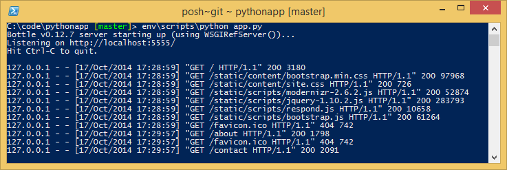

<properties 
    pageTitle="Python web 應用程式搭配 Azure 中的多" 
    description="教學課程，會向您介紹 Azure 應用程式服務 Web 應用程式中執行 Python web 應用程式。" 
    services="app-service\web" 
    documentationCenter="python" 
    tags="python"
    authors="huguesv" 
    manager="wpickett" 
    editor=""/>

<tags 
    ms.service="app-service-web" 
    ms.workload="web" 
    ms.tgt_pltfrm="na" 
    ms.devlang="python" 
    ms.topic="article" 
    ms.date="02/19/2016"
    ms.author="huvalo"/>

# 使用多 Azure 中建立 web 應用程式

本教學課程說明如何開始執行 Python Azure 應用程式服務 Web 應用程式中。 Web 應用程式提供有限的免費裝載與快速部署，並且您可以使用 Python ！ 當您的應用程式規模擴大時，您可以切換至付費主機服務，您也可以使用的所有其他 Azure 服務整合。

您將會建立使用多 web 架構的 web 應用程式 （請參閱本教學課程中的其他版本[Django](web-sites-python-create-deploy-django-app.md)和[Flask](web-sites-python-create-deploy-flask-app.md)）。 建立 web 應用程式從 Azure Marketplace，就可以給部署設定並複製本機存放庫。 然後您會在本機上執行的 web 應用程式、 進行變更、 認可並傳送至[Azure 應用程式服務 Web 應用程式](http://go.microsoft.com/fwlink/?LinkId=529714)。 教學課程介紹如何從 Windows 或 Mac/Linux 執行此動作。

[AZURE.INCLUDE [create-account-and-websites-note](../../includes/create-account-and-websites-note.md)]

>[AZURE.NOTE] 如果您想要開始使用 Azure 應用程式服務註冊 Azure 帳戶之前，請移至[嘗試應用程式服務](http://go.microsoft.com/fwlink/?LinkId=523751)，可以讓您立即建立短暫入門 web 應用程式在應用程式服務。 必要; 沒有信用卡沒有承諾。

## 必要條件

- Windows、 Mac 或 Linux
- Python 2.7 或 3.4
- setuptools pip，virtualenv (Python 2.7)
- 給
- [Python 工具 2.2 Visual studio]-請注意︰ 此為選用步驟

**附註**︰ TFS 發佈目前不支援 Python 專案。

### Windows

如果您還沒有 Python 2.7 或 3.4 安裝 （32 位元），我們建議您安裝[Python 2.7 Azure SDK]或[Azure SDK Python 3.4]使用 Web 平台安裝程式。 這會安裝 32 位元版本的 Python、 setuptools、 pip、 virtualenv 等 （32 位元 Python 是什麼 Azure 主機電腦上安裝）。 或者，您也可以從[python.org]取得 Python。

給，建議[給 for Windows] ] 或 [ [GitHub Windows]。 如果您使用 Visual Studio 時，您可以使用整合式的給支援人員。

我們也建議您安裝[的 Visual Studio Python 工具 2.2]。 此為選用步驟，但如果您有[Visual Studio]，包括免費 Visual Studio 社群 2013年或 Visual Studio Express 版 2013 網頁，然後這可讓您很棒的 Python IDE。

### Mac/Linux

您應該 Python，就可以給已經安裝，但請確定您有 Python 2.7 或 3.4。

## Azure 入口網站上建立 web 應用程式

建立您的應用程式的第一步是建立 web 應用程式，透過[Azure 入口網站](https://portal.azure.com)。  

1. 登入 Azure 入口網站，並按一下左上角的 [**新增**] 按鈕。 
3. 在 [搜尋] 方塊中，輸入 「 python 」。
4. 在搜尋結果中，選取**多**，然後按一下 [**建立**]。
5. 設定新的多應用程式，例如，建立新的應用程式服務計劃和新的資源群組。 然後按一下 [**建立**]。
6. 設定給發佈新建立的 web 應用程式在[本機給部署至 Azure 應用程式服務](app-service-deploy-local-git.md)的指示執行。
 
## 應用程式概觀

### 給存放庫的內容

以下是您可以找到初始給存放庫中，我們會在下一節中複製的檔案的概觀。

    \routes.py
    \static\content\
    \static\fonts\
    \static\scripts\
    \views\about.tpl
    \views\contact.tpl
    \views\index.tpl
    \views\layout.tpl

主應用程式的來源。 包含 3 與母片的版面配置頁面 （相關連絡人索引）。  靜態內容和指令碼包含啟動安裝程式、 jquery、 modernizr 和回覆。

    \app.py

本機開發伺服器支援。 使用此選項在本機上執行應用程式。

    \BottleWebProject.pyproj
    \BottleWebProject.sln

[Visual Studio Python 工具]搭配專案檔案。

    \ptvs_virtualenv_proxy.py

虛擬環境和 PTVS 遠端偵錯支援 IIS proxy。

    \requirements.txt

這個應用程式所需的外部套件。 部署指令碼會 pip 安裝此檔案中所列的套件。
 
    \web.2.7.config
    \web.3.4.config

IIS 設定檔。 部署指令碼會使用適當的 web.x.y.config，並將它複製為 web.config。

### 選擇性檔案-自訂部署

[AZURE.INCLUDE [web-sites-python-customizing-deployment](../../includes/web-sites-python-customizing-deployment.md)]

### 選擇性檔案-Python 執行階段

[AZURE.INCLUDE [web-sites-python-customizing-runtime](../../includes/web-sites-python-customizing-runtime.md)]

### 在伺服器上的其他檔案

有些檔案存在於伺服器上，但不是會新增至給存放庫。 以下被建立部署指令碼。

    \web.config

IIS 設定檔。 建立在每個部署 web.x.y.config。

    \env\

Python 虛擬環境。 建立部署時，如果在 web 應用程式上尚不存在相容的虛擬環境。  Requirements.txt 中所列的封包 pip 安裝，但 pip 會略過安裝，如果已經安裝套件。

下一步 3 的各節說明如何繼續進行下 3 不同環境 web 應用程式開發︰

- Windows 中，使用 Visual studio Python 工具
- Windows 中，以命令列
- Mac/Linux，命令列

## Visual studio web 應用程式開發-Windows-Python 工具

### 複製儲存機制

首先，請複製使用 url 提供 Azure 入口網站上存放庫。 如需詳細資訊，請參閱[Azure 應用程式服務的本機給部署](app-service-deploy-local-git.md)。

開啟存放庫的根目錄中所包含的解決方案檔案 (.sln)。

### 建立虛擬環境

現在，我們會建立本機開發的虛擬環境。 以滑鼠右鍵按一下**Python 環境**選取**新增虛擬環境**。

- 請確定環境的名稱是`env`。

- 選取 [基底手語翻譯]。 請務必使用同一版本的已選取的 Python web app （在 runtime.txt 或 web 應用程式中 Azure 入口網站**應用程式設定**刀）。

- 請確定已核取 [下載並安裝套件] 選項。

按一下 [**建立**]。 這會建立虛擬環境中，並安裝 requirements.txt 中所列的相依性。

### 使用開發伺服器執行

按 F5 開始偵錯，然後使用網頁瀏覽器，則會至本機執行的頁面會自動開啟。

您可以設定中斷點來源，請使用 [監看視窗] 等。[Python Visual Studio 文件的工具]，如需詳細資訊，請參閱的各種功能。

### 進行變更

現在您可以嘗試變更應用程式來源及/或範本。

您已測試您的變更後，認可給存放庫︰

### 安裝更多的套件

您的應用程式可能會有 Python 與多以外的相依性。

您可以安裝其他封包使用 pip。 安裝套件，請以滑鼠右鍵按一下在虛擬環境，然後選取 [**安裝 Python 套件**。

例如，若要安裝 Azure SDK python，可讓您存取 Azure 儲存空間、 服務匯流排和其他 Azure 服務，請輸入`azure`:

以滑鼠右鍵按一下在虛擬環境，然後選取**產生 requirements.txt**更新 requirements.txt。

然後，認可 requirements.txt 至給存放庫所做的變更。

### 部署至 Azure

若要觸發在部署，按一下**同步處理**或**推入**。 同步處理會同時推入和擷取。

第一次部署會需要一些時間，因為它會建立一個虛擬環境、 安裝套件等。

Visual Studio 不會顯示部署的進度。 如果您想要檢閱輸出，請參閱[疑難排解-部署](#troubleshooting-deployment)上。

瀏覽至 Azure URL，以檢視您的變更。

## Web 應用程式開發-Windows-命令線條

### 複製儲存機制

首先，請複製使用 URL 提供 Azure 入口網站上存放庫，並將 Azure 存放庫新增為遠端。 如需詳細資訊，請參閱[Azure 應用程式服務的本機給部署](app-service-deploy-local-git.md)。

    git clone <repo-url>
    cd <repo-folder>
    git remote add azure <repo-url> 

### 建立虛擬環境

我們會建立新的虛擬環境進行開發 （執行不將其新增至存放庫）。 虛擬環境中 Python 並不可重置，，所以使用應用程式開發人員將會建立自己本機。

請務必使用同一版本的已選取的 Python web app （在 runtime.txt 或 web 應用程式中 Azure 入口網站應用程式設定刀）

Python 2.7:

    c:\python27\python.exe -m virtualenv env

Python 3.4:

    c:\python34\python.exe -m venv env

安裝應用程式所需的任何外部套件。 在虛擬環境中安裝套件，您可以將存放庫根目錄使用 requirements.txt 檔案︰

    env\scripts\pip install -r requirements.txt

### 使用開發伺服器執行

您可以在啟動的應用程式開發伺服器使用下列命令︰

    env\scripts\python app.py

主控台會顯示 URL 和接聽伺服器的連接埠︰

然後，開啟網頁瀏覽器的 url。

### 進行變更

現在您可以嘗試變更應用程式來源及/或範本。

您已測試您的變更後，認可給存放庫︰

    git add <modified-file>
    git commit -m "<commit-comment>"

### 安裝更多的套件

您的應用程式可能會有 Python 與多以外的相依性。

您可以安裝其他封包使用 pip。 例如，安裝 Azure SDK python，可讓您存取 Azure 儲存空間、 服務匯流排和其他 Azure 服務，請輸入︰

    env\scripts\pip install azure

請務必一併更新 requirements.txt:

    env\scripts\pip freeze > requirements.txt

認可變更︰

    git add requirements.txt
    git commit -m "Added azure package"

### 部署至 Azure

若要觸發在部署，請將變更推入 Azure:

    git push azure master

您會看到部署指令碼，包括虛擬環境建立]，安裝套件，建立 web.config 的輸出。

瀏覽至 Azure URL，以檢視您的變更。

## Web 應用程式開發 Mac/Linux-命令列

### 複製儲存機制

首先，請複製使用 URL 提供 Azure 入口網站上存放庫，並將 Azure 存放庫新增為遠端。 如需詳細資訊，請參閱[Azure 應用程式服務的本機給部署](app-service-deploy-local-git.md)。

    git clone <repo-url>
    cd <repo-folder>
    git remote add azure <repo-url> 

### 建立虛擬環境

我們會建立新的虛擬環境進行開發 （執行不將其新增至存放庫）。 虛擬環境中 Python 並不可重置，，所以使用應用程式開發人員將會建立自己本機。

請務必使用同一版本的已選取的 Python web app （在 runtime.txt 或 web 應用程式中 Azure 入口網站應用程式設定刀）。

Python 2.7:

    python -m virtualenv env

Python 3.4:

    python -m venv env
或 pyvenv 信封

安裝應用程式所需的任何外部套件。 在虛擬環境中安裝套件，您可以將存放庫根目錄使用 requirements.txt 檔案︰

    env/bin/pip install -r requirements.txt

### 使用開發伺服器執行

您可以在啟動的應用程式開發伺服器使用下列命令︰

    env/bin/python app.py

主控台會顯示 URL 和接聽伺服器的連接埠︰

然後，開啟網頁瀏覽器的 url。

### 進行變更

現在您可以嘗試變更應用程式來源及/或範本。

您已測試您的變更後，認可給存放庫︰

    git add <modified-file>
    git commit -m "<commit-comment>"

### 安裝更多的套件

您的應用程式可能會有 Python 與多以外的相依性。

您可以安裝其他封包使用 pip。 例如，安裝 Azure SDK python，可讓您存取 Azure 儲存空間、 服務匯流排和其他 Azure 服務，請輸入︰

    env/bin/pip install azure

請務必一併更新 requirements.txt:

    env/bin/pip freeze > requirements.txt

認可變更︰

    git add requirements.txt
    git commit -m "Added azure package"

### 部署至 Azure

若要觸發在部署，請將變更推入 Azure:

    git push azure master

您會看到部署指令碼，包括虛擬環境建立]，安裝套件，建立 web.config 的輸出。

瀏覽至 Azure URL，以檢視您的變更。

## 疑難排解-套件的安裝

[AZURE.INCLUDE [web-sites-python-troubleshooting-package-installation](../../includes/web-sites-python-troubleshooting-package-installation.md)]

## 疑難排解-虛擬環境

[AZURE.INCLUDE [web-sites-python-troubleshooting-virtual-environment](../../includes/web-sites-python-troubleshooting-virtual-environment.md)]

## 後續步驟

請遵循這些連結，進一步瞭解多和 Python 工具 for Visual Studio: 
 
- [多文件]
- [Visual Studio 文件的 Python 工具]

如需使用 Azure 資料表儲存體和 MongoDB 資訊︰

- [多和 MongoDB 上 Azure Visual studio Python 工具]
- [多和 Azure Visual studio Python 工具上的 Azure 資料表儲存體]

## 變更的項目
* 若要變更的指南，從網站應用程式服務請參閱︰ [Azure 應用程式服務與程式影響現有 Azure 服務](http://go.microsoft.com/fwlink/?LinkId=529714)

<!--Link references-->
[多和 MongoDB 上 Azure Visual studio Python 工具]: web-sites-python-ptvs-bottle-table-storage.md
[多和 Azure Visual studio Python 工具上的 Azure 資料表儲存體]: web-sites-python-ptvs-bottle-table-storage.md

<!--External Link references-->
[Azure SDK Python 2.7]: http://go.microsoft.com/fwlink/?linkid=254281
[Azure SDK Python 3.4]: http://go.microsoft.com/fwlink/?linkid=516990
[python.org]: http://www.python.org/
[在 Windows 版的給]: http://msysgit.github.io/
[在 Windows 版的 GitHub]: https://windows.github.com/
[Visual Studio Python 工具]: http://aka.ms/ptvs
[Python 的 Visual Studio 工具 2.2]: http://go.microsoft.com/fwlink/?LinkID=624025
[Visual Studio]: http://www.visualstudio.com/
[Visual Studio 文件的 Python 工具]: http://aka.ms/ptvsdocs 
[多文件]: http://bottlepy.org/docs/dev/index.html
 
