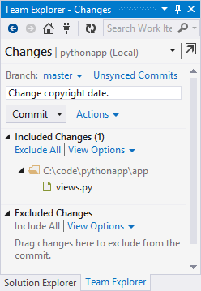
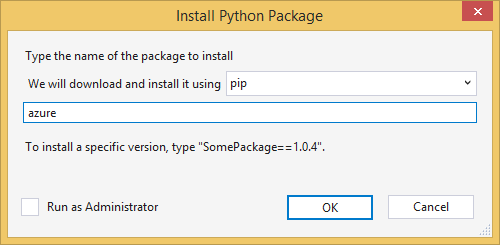
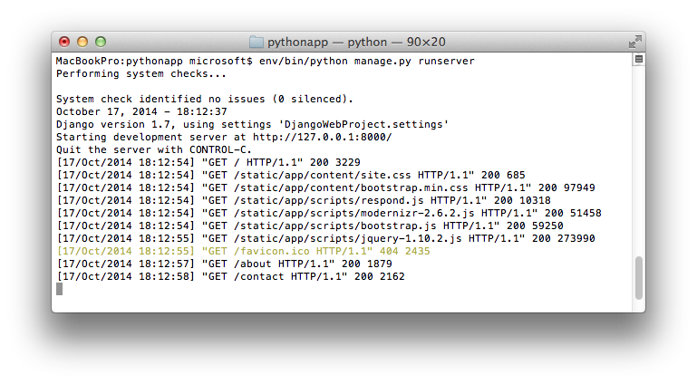

<properties
    pageTitle="使用 Django Azure 中建立 web 應用程式"
    description="教學課程，會向您介紹 Azure 應用程式服務 Web 應用程式中執行 Python web 應用程式。"
    services="app-service\web"
    documentationCenter="python"
    tags="python"
    authors="huguesv" 
    manager="wpickett" 
    editor=""/>

<tags
    ms.service="app-service-web"
    ms.workload="web"
    ms.tgt_pltfrm="na"
    ms.devlang="python"
    ms.topic="hero-article" 
    ms.date="02/19/2016"
    ms.author="huvalo"/>

# 使用 Django Azure 中建立 web 應用程式

本教學課程說明如何開始使用[Azure 應用程式服務 Web 應用程式](http://go.microsoft.com/fwlink/?LinkId=529714)上執行 Python。 Web 應用程式提供有限的免費裝載與快速部署，並且您可以使用 Python ！ 當您的應用程式規模擴大時，您可以切換至付費主機服務，您也可以使用的所有其他 Azure 服務整合。

您將建立使用 Django web 架構的應用程式 （請參閱本教學課程中的其他版本[Flask](web-sites-python-create-deploy-flask-app.md)和[多](web-sites-python-create-deploy-bottle-app.md)）。 建立 web 應用程式從 Azure Marketplace，就可以給部署設定並複製本機存放庫。 然後您會在本機上執行應用程式、 進行變更，認可並傳送至 Azure。 教學課程介紹如何從 Windows 或 Mac/Linux 執行此動作。

[AZURE.INCLUDE [create-account-and-websites-note](../../includes/create-account-and-websites-note.md)]

>[AZURE.NOTE] 如果您想要開始使用 Azure 應用程式服務註冊 Azure 帳戶之前，請移至[嘗試應用程式服務](http://go.microsoft.com/fwlink/?LinkId=523751)，可以讓您立即建立短暫入門 web 應用程式在應用程式服務。 必要; 沒有信用卡沒有承諾。

## 必要條件

- Windows、 Mac 或 Linux
- Python 2.7 或 3.4
- setuptools pip，virtualenv (Python 2.7)
- 給
- [Visual Studio Python 工具]-請注意︰ 此為選用步驟

**附註**︰ TFS 發佈目前不支援 Python 專案。

### Windows

如果您還沒有 Python 2.7 或 3.4 安裝 （32 位元），我們建議您安裝[Python 2.7 Azure SDK]或[Azure SDK Python 3.4]使用 Web 平台安裝程式。 這會安裝 32 位元版本的 Python、 setuptools、 pip、 virtualenv 等 （32 位元 Python 是什麼 Azure 主機電腦上安裝）。 或者，您也可以從[python.org]取得 Python。

給，建議[給 for Windows] ] 或 [ [GitHub Windows]。 如果您使用 Visual Studio 時，您可以使用整合式的給支援人員。

我們也建議您安裝[的 Visual Studio Python 工具 2.2]。 此為選用步驟，但如果您有[Visual Studio]，包括免費 Visual Studio 社群 2013年或 Visual Studio Express 版 2013 網頁，然後這可讓您很棒的 Python IDE。

### Mac/Linux

您應該 Python，就可以給已經安裝，但請確定您有 Python 2.7 或 3.4。

## 在入口網站上建立 web 應用程式

建立您的應用程式的第一步是建立 web 應用程式，透過[Azure 入口網站](https://portal.azure.com)。

1. 登入 Azure 入口網站，並按一下左上角的 [**新增**] 按鈕。
3. 在 [搜尋] 方塊中，輸入 「 python 」。
4. 在搜尋結果中，選取**Django** （發佈 PTVS），然後按一下 [**建立**]。
5. 設定新的 Django 應用程式，例如，建立新的應用程式服務計劃和新的資源群組。 然後按一下 [**建立**]。
6. 設定給發佈新建立的 web 應用程式在[本機給部署至 Azure 應用程式服務](app-service-deploy-local-git.md)的指示執行。

## 應用程式概觀

### 給存放庫的內容

以下是您可以找到初始給存放庫中，我們會在下一節中複製的檔案的概觀。

    \app\__init__.py
    \app\forms.py
    \app\models.py
    \app\tests.py
    \app\views.py
    \app\static\content\
    \app\static\fonts\
    \app\static\scripts\
    \app\templates\about.html
    \app\templates\contact.html
    \app\templates\index.html
    \app\templates\layout.html
    \app\templates\login.html
    \app\templates\loginpartial.html
    \DjangoWebProject\__init__.py
    \DjangoWebProject\settings.py
    \DjangoWebProject\urls.py
    \DjangoWebProject\wsgi.py

主應用程式的來源。 包含 3 與母片的版面配置頁面 （相關連絡人索引）。 靜態內容和指令碼包含啟動安裝程式、 jquery、 modernizr 和回覆。

    \manage.py

本機管理及開發伺服器支援。 使用此選項在本機上執行應用程式、 資料庫等同步處理。

    \db.sqlite3

預設的資料庫。 包含必要的資料表，若要執行，應用程式，但不含任何 （同步處理建立使用者的資料庫） 的使用者。

    \DjangoWebProject.pyproj
    \DjangoWebProject.sln

[Visual Studio Python 工具]搭配專案檔案。

    \ptvs_virtualenv_proxy.py

虛擬環境和 PTVS 遠端偵錯支援 IIS proxy。

    \requirements.txt

這個應用程式所需的外部套件。 部署指令碼會 pip 安裝此檔案中所列的套件。

    \web.2.7.config
    \web.3.4.config

IIS 設定檔。 部署指令碼會使用適當的 web.x.y.config，並將它複製為 web.config。

### 選擇性檔案-自訂部署

[AZURE.INCLUDE [web-sites-python-django-customizing-deployment](../../includes/web-sites-python-django-customizing-deployment.md)]

### 選擇性檔案-Python 執行階段

[AZURE.INCLUDE [web-sites-python-customizing-runtime](../../includes/web-sites-python-customizing-runtime.md)]

### 在伺服器上的其他檔案

有些檔案存在於伺服器上，但不是會新增至給存放庫。 以下被建立部署指令碼。

    \web.config

IIS 設定檔。 建立在每個部署 web.x.y.config。

    \env\

Python 虛擬環境。 建立部署時，如果在 web 應用程式上尚不存在相容的虛擬環境。 Requirements.txt 中所列的封包 pip 安裝，但 pip 會略過安裝，如果已經安裝套件。

下一步 3 的各節說明如何繼續進行下 3 不同環境 web 應用程式開發︰

- Windows 中，使用 Visual studio Python 工具
- Windows 中，以命令列
- Mac/Linux，命令列

## Visual Studio 的 web 應用程式開發-Windows-Python 工具

### 複製儲存機制

首先，請複製使用 URL 提供 Azure 入口網站上存放庫。 如需詳細資訊，請參閱[Azure 應用程式服務的本機給部署](app-service-deploy-local-git.md)。

開啟存放庫的根目錄中所包含的解決方案檔案 (.sln)。

### 建立虛擬環境

現在，我們會建立本機開發的虛擬環境。 以滑鼠右鍵按一下**Python 環境**選取**新增虛擬環境**。

- 請確定環境的名稱是`env`。

- 選取 [基底手語翻譯]。 請務必使用同一版本的已選取的 Python web app （在 runtime.txt 或 web 應用程式中 Azure 入口網站**應用程式設定**刀）。

- 請確定已核取 [下載並安裝套件] 選項。

按一下 [**建立**]。 這會建立虛擬環境中，並安裝 requirements.txt 中所列的相依性。

### 建立 superuser

隨附的應用程式資料庫並沒有任何 superuser 定義。 若要使用應用程式或 Django 管理員介面中 （如果您決定要啟用它） 的登入 」 功能，必須建立 superuser。

執行此從命令列從專案資料夾︰

    env\scripts\python manage.py createsuperuser

依提示設定的使用者名稱、 密碼等。

### 使用開發伺服器執行

按 F5 開始偵錯，然後使用網頁瀏覽器，則會至本機執行的頁面會自動開啟。

您可以設定中斷點來源，請使用 [監看視窗] 等。[Python Visual Studio 文件的工具]，如需詳細資訊，請參閱的各種功能。

### 進行變更

現在您可以嘗試變更應用程式來源及/或範本。

您已測試您的變更後，認可給存放庫︰

### 安裝更多的套件

您的應用程式可能會有 Python 與 Django 以外的相依性。

您可以安裝其他封包使用 pip。 安裝套件，請以滑鼠右鍵按一下在虛擬環境，然後選取 [**安裝 Python 套件**。

例如，若要安裝 Azure SDK python，可讓您存取 Azure 儲存空間、 服務匯流排和其他 Azure 服務，請輸入`azure`:

以滑鼠右鍵按一下在虛擬環境，然後選取**產生 requirements.txt**更新 requirements.txt。

然後，認可 requirements.txt 至給存放庫所做的變更。

### 部署至 Azure

若要觸發在部署，按一下**同步處理**或**推入**。 同步處理會同時推入和擷取。

第一次部署會需要一些時間，因為它會建立一個虛擬環境、 安裝套件等。

Visual Studio 不會顯示部署的進度。 如果您想要檢閱輸出，請參閱[疑難排解-部署](#troubleshooting-deployment)上。

瀏覽至 Azure URL，以檢視您的變更。

## Web 應用程式開發-Windows-命令列

### 複製儲存機制

首先，請複製使用 URL 提供 Azure 入口網站上存放庫，並將 Azure 存放庫新增為遠端。 如需詳細資訊，請參閱[Azure 應用程式服務的本機給部署](app-service-deploy-local-git.md)。

    git clone <repo-url>
    cd <repo-folder>
    git remote add azure <repo-url>

### 建立虛擬環境

我們會建立新的虛擬環境進行開發 （執行不將其新增至存放庫）。 虛擬環境中 Python 並不可重置，，所以使用應用程式開發人員將會建立自己本機。

請務必使用同一版本的已選取的 Python web app （在 runtime.txt 或 web 應用程式中 Azure 入口網站應用程式設定刀）。

Python 2.7:

    c:\python27\python.exe -m virtualenv env

Python 3.4:

    c:\python34\python.exe -m venv env

安裝應用程式所需的任何外部套件。 在虛擬環境中安裝套件，您可以將存放庫根目錄使用 requirements.txt 檔案︰

    env\scripts\pip install -r requirements.txt

### 建立 superuser

隨附的應用程式資料庫並沒有任何 superuser 定義。 若要使用應用程式或 Django 管理員介面中 （如果您決定要啟用它） 的登入 」 功能，必須建立 superuser。

執行此從命令列從專案資料夾︰

    env\scripts\python manage.py createsuperuser

依提示設定的使用者名稱、 密碼等。

### 使用開發伺服器執行

您可以在啟動的應用程式開發伺服器使用下列命令︰

    env\scripts\python manage.py runserver

主控台會顯示 URL 和接聽伺服器的連接埠︰

然後，開啟網頁瀏覽器的 url。

### 進行變更

現在您可以嘗試變更應用程式來源及/或範本。

您已測試您的變更後，認可給存放庫︰

    git add <modified-file>
    git commit -m "<commit-comment>"

### 安裝更多的套件

您的應用程式可能會有 Python 與 Django 以外的相依性。

您可以安裝其他封包使用 pip。 例如，安裝 Azure SDK python，可讓您存取 Azure 儲存空間、 服務匯流排和其他 Azure 服務，請輸入︰

    env\scripts\pip install azure

請務必一併更新 requirements.txt:

    env\scripts\pip freeze > requirements.txt

認可變更︰

    git add requirements.txt
    git commit -m "Added azure package"

### 部署至 Azure

若要觸發在部署，請將變更推入 Azure:

    git push azure master

您會看到部署指令碼，包括虛擬環境建立]，安裝套件，建立 web.config 的輸出。

瀏覽至 Azure URL，以檢視您的變更。

## Web 應用程式開發 Mac/Linux-命令列

### 複製儲存機制

首先，請複製使用 URL 提供 Azure 入口網站上存放庫，並將 Azure 存放庫新增為遠端。 如需詳細資訊，請參閱[Azure 應用程式服務的本機給部署](app-service-deploy-local-git.md)。

    git clone <repo-url>
    cd <repo-folder>
    git remote add azure <repo-url>

### 建立虛擬環境

我們會建立新的虛擬環境進行開發 （執行不將其新增至存放庫）。 虛擬環境中 Python 並不可重置，，所以使用應用程式開發人員將會建立自己本機。

請務必使用同一版本的已選取的 Python web app （在 runtime.txt 或 web 應用程式中 Azure 入口網站應用程式設定刀）。

Python 2.7:

    python -m virtualenv env

Python 3.4:

    python -m venv env

或

    pyvenv env

安裝應用程式所需的任何外部套件。 在虛擬環境中安裝套件，您可以將存放庫根目錄使用 requirements.txt 檔案︰

    env/bin/pip install -r requirements.txt

### 建立 superuser

隨附的應用程式資料庫並沒有任何 superuser 定義。 若要使用應用程式或 Django 管理員介面中 （如果您決定要啟用它） 的登入 」 功能，必須建立 superuser。

執行此從命令列從專案資料夾︰

    env/bin/python manage.py createsuperuser

依提示設定的使用者名稱、 密碼等。

### 使用開發伺服器執行

您可以在啟動的應用程式開發伺服器使用下列命令︰

    env/bin/python manage.py runserver

主控台會顯示 URL 和接聽伺服器的連接埠︰

然後，開啟網頁瀏覽器的 url。

### 進行變更

現在您可以嘗試變更應用程式來源及/或範本。

您已測試您的變更後，認可給存放庫︰

    git add <modified-file>
    git commit -m "<commit-comment>"

### 安裝更多的套件

您的應用程式可能會有 Python 與 Django 以外的相依性。

您可以安裝其他封包使用 pip。 例如，安裝 Azure SDK python，可讓您存取 Azure 儲存空間、 服務匯流排和其他 Azure 服務，請輸入︰

    env/bin/pip install azure

請務必一併更新 requirements.txt:

    env/bin/pip freeze > requirements.txt

認可變更︰

    git add requirements.txt
    git commit -m "Added azure package"

### 部署至 Azure

若要觸發在部署，請將變更推入 Azure:

    git push azure master

您會看到部署指令碼，包括虛擬環境建立]，安裝套件，建立 web.config 的輸出。

瀏覽至 Azure URL，以檢視您的變更。

## 疑難排解-套件的安裝

[AZURE.INCLUDE [web-sites-python-troubleshooting-package-installation](../../includes/web-sites-python-troubleshooting-package-installation.md)]

## 疑難排解-虛擬環境

[AZURE.INCLUDE [web-sites-python-troubleshooting-virtual-environment](../../includes/web-sites-python-troubleshooting-virtual-environment.md)]

## 疑難排解-靜態檔案

Django 有收集靜態檔案的概念。 這會將所有靜態，將檔案從其原始位置，並將其複製到單一資料夾。 這個應用程式中，複製到`/static`。

這是因為靜態檔案可能來自不同 Django 」 應用程式]。 例如，從 Django 管理員介面靜態檔案位於虛擬環境中的 Django 文件庫的子資料夾中。 這個應用程式所定義的靜態檔案位於`/app/static`。 當您使用多個 Django 」 應用程式 」，則必須在多個位置的靜態檔案。

當偵錯模式中執行應用程式，應用程式就會是從其原始位置的靜態檔案。

應用程式時發行模式中執行應用程式，並**不**服務靜態檔案。 負責處理檔案的網頁伺服器。 這個應用程式，IIS 會服務靜態檔案從`/static`。

靜態檔案的集合會為組件的部署指令碼，清除先前收集檔案的自動完成。 這表示，就會在每個部署中，部署減慢而已，但它可以確保過時的檔案無法使用]，可避免潛在安全性問題。

如果您想要略過 Django 應用程式的靜態檔案的集合︰

    \.skipDjango

然後，您必須執行您的本機電腦上，手動集合︰

    env\scripts\python manage.py collectstatic

然後移除`\static`從資料夾`.gitignore`並將其新增至給存放庫。

## 疑難排解-設定

應用程式的各種設定可以變更的`DjangoWebProject/settings.py`。

開發人員方便已啟用偵錯模式。 一個好側效果的是您可以執行，而不必收集靜態檔案時，看到的圖片和其他靜態內容。

若要停用偵錯模式︰

    DEBUG = False

當偵錯] 會停用、 的值`ALLOWED_HOSTS`需要更新包含 Azure 主機名稱。 例如︰

    ALLOWED_HOSTS = (
        'pythonapp.azurewebsites.net',
    )

或在啟用任何︰

    ALLOWED_HOSTS = (
        '*',
    )

在練習中，您可能會想要更複雜處理切換偵錯和發行模式]，並取得主機名稱的項目。

您可以設定環境變數，透過 Azure 入口網站**設定**] 頁面上，在 [**應用程式設定**] 區段中。  這可能是很適合用於設定您要可能不會出現在來源 （連線字串、 密碼等），或您想要以不同方式設定 Azure 與您的本機電腦之間的值。 在 [ `settings.py`，您可以查詢使用的環境變數`os.getenv`。

## 使用資料庫

隨附於應用程式的資料庫是 sqlite 資料庫。 視不需要幾乎任何設定，這是使用於開發、 方便且實用的預設資料庫。 資料庫會儲存於 db.sqlite3 檔案，在 [專案] 資料夾。

Azure 提供容易使用的 Django 應用程式資料庫服務。 使用[SQL 資料庫]及[MySQL] Django 應用程式的教學課程顯示建立資料庫服務，變更的資料庫設定的必要步驟`DjangoWebProject/settings.py`，並安裝所需的文件庫。

當然，如果您想要管理自己的資料庫伺服器，您可以使用 [Windows] 或 [Linux Azure 上執行的虛擬機器。

## Django 管理員介面

一旦您開始建立您的模型，您會想要填入含有一些資料的資料庫。 若要使用 Django 管理介面就能輕鬆新增並編輯內容互動的方式。

管理員介面的程式碼會加上註解中的應用程式來源，但清楚標示，您可以輕鬆地將它啟用 （搜尋 「 系統 」）。

已啟用之後，同步處理資料庫、 執行應用程式，並瀏覽至`/admin`。

## 後續步驟

請遵循這些連結，進一步瞭解 Django 和 Python 工具 for Visual Studio:

- [Django 文件]
- [Visual Studio 文件的 Python 工具]

使用 SQL 資料庫及 MySQL 資訊︰

- [Django 和 MySQL 上 Azure Visual studio Python 工具]
- [Django 和在 Visual studio Python 工具 Azure SQL 資料庫]

如需詳細資訊，請參閱[Python 開發人員中心](/develop/python/)。

## 變更的項目
* 若要變更的指南，從網站應用程式服務請參閱︰ [Azure 應用程式服務與程式影響現有 Azure 服務](http://go.microsoft.com/fwlink/?LinkId=529714)

<!--Link references-->
[Django 和 MySQL 上 Azure Visual studio Python 工具]: web-sites-python-ptvs-django-mysql.md
[Django 和在 Visual studio Python 工具 Azure SQL 資料庫]: web-sites-python-ptvs-django-sql.md
[SQL 資料庫]: web-sites-python-ptvs-django-sql.md
[MySQL]: web-sites-python-ptvs-django-mysql.md

<!--External Link references-->
[Azure SDK Python 2.7]: http://go.microsoft.com/fwlink/?linkid=254281
[Azure SDK Python 3.4]: http://go.microsoft.com/fwlink/?linkid=516990
[python.org]: http://www.python.org/
[在 Windows 版的給]: http://msysgit.github.io/
[在 Windows 版的 GitHub]: https://windows.github.com/
[Visual Studio Python 工具]: http://aka.ms/ptvs
[Python 的 Visual Studio 工具 2.2]: http://go.microsoft.com/fwlink/?LinkID=624025
[Visual Studio]: http://www.visualstudio.com/
[Visual Studio 文件的 Python 工具]: http://aka.ms/ptvsdocs
[Django 文件]: https://www.djangoproject.com/
