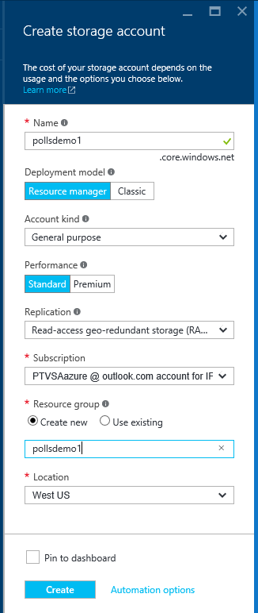
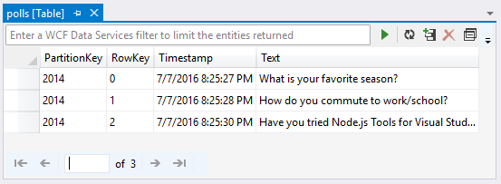
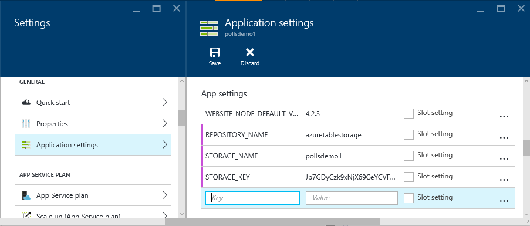
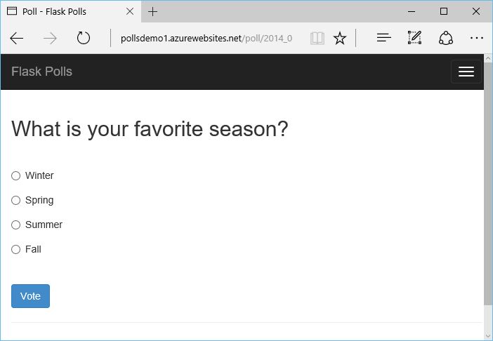

<properties 
    pageTitle="Flask 和 Azure Python 工具 2.2 Visual studio 上的 Azure 資料表儲存體" 
    description="瞭解如何使用 Visual studio Python 工具來建立 Flask web 應用程式在 Azure 資料表儲存體中儲存資料，並將其部署到 Azure 應用程式服務 Web 應用程式。" 
    services="app-service\web"
    tags="python"
    documentationCenter="python" 
    authors="huguesv" 
    manager="wpickett" 
    editor=""/>

<tags 
    ms.service="app-service-web" 
    ms.workload="web" 
    ms.tgt_pltfrm="na" 
    ms.devlang="python" 
    ms.topic="article" 
    ms.date="07/07/2016"
    ms.author="huvalo"/>

# Flask 和 Azure Python 工具 2.2 Visual studio 上的 Azure 資料表儲存體 

在本教學課程中，我們將使用[Visual Studio Python 工具]建立簡單的投票 web 應用程式使用其中一個 PTVS 範例範本。 本教學課程也是以[視訊](https://www.youtube.com/watch?v=qUtZWtPwbTk)形式提供。

投票 web 應用程式定義抽象其存放庫，如，讓您可以輕鬆地切換不同類型的存放庫 (記憶體內，Azure 資料表儲存體，MongoDB)。

我們將學習如何建立 Azure 儲存體帳戶、 如何設定 web 應用程式使用 Azure 資料表儲存體，以及如何將 web 應用程式發佈到[Azure 應用程式服務 Web 應用程式](http://go.microsoft.com/fwlink/?LinkId=529714)。

請參閱更多文章涵蓋 Azure 應用程式服務 Web 應用程式與 PTVS MongoDB、 Azure 資料表儲存體、 MySQL 和 SQL 資料庫服務中使用多 Flask 與 Django web 架構的開發[Python 開發人員中心]。 本文著重於應用程式服務，同時開發[Azure 雲端服務]時的步驟是類似。

## 必要條件

 - Visual Studio 2015
 - [Python 的 Visual Studio 工具 2.2]
 - [Python 的 Visual Studio 範例 VSIX 工具 2.2]
 - [Azure SDK 工具與 2015]
 - [Python 2.7 32 位元]或[Python 3.4 32 位元]

[AZURE.INCLUDE [create-account-and-websites-note](../../includes/create-account-and-websites-note.md)]

>[AZURE.NOTE] 如果您想要開始使用 Azure 應用程式服務註冊 Azure 帳戶之前，請移至[嘗試應用程式服務](http://go.microsoft.com/fwlink/?LinkId=523751)，可以讓您立即建立短暫入門 web 應用程式在應用程式服務。 必要; 沒有信用卡沒有承諾。

## 建立專案

在此區段中，我們會建立 Visual Studio 專案使用範例範本。 我們會建立一個虛擬環境，並安裝所需的封裝。 然後，我們會執行本機使用預設記憶體內儲存機制的應用程式。

1.  在 Visual Studio 中，選取**檔案**，**新的專案**。

1.  下**Python****範例**可從[Python 工具 2.2 for Visual Studio 範例 VSIX]專案範本。 選取 [**投票 Flask Web 專案**]，然後按一下 [確定] 以建立專案]。

    ![新增專案] 對話方塊](./media/web-sites-python-ptvs-flask-table-storage/PollsFlaskNewProject.png)

1.  系統會提示安裝外部套件。 選取 [**將在虛擬環境安裝**]。

    ![外部套件] 對話方塊](./media/web-sites-python-ptvs-flask-table-storage/PollsFlaskExternalPackages.png)

1.  選取**Python 2.7**或**Python 3.4**做為基底手語翻譯。

    ![加入虛擬環境] 對話方塊](./media/web-sites-python-ptvs-flask-table-storage/PollsCommonAddVirtualEnv.png)

1.  確認 [應用程式的運作方式按`F5`。 根據預設，應用程式會使用記憶體內儲存機制會不需要任何設定。 停止網頁伺服器時，所有的資料都會遺失。

1.  按一下 [**建立範例輪詢的回覆**，然後按一下的投票和投票。

    

## 建立 Azure 儲存體帳戶

若要使用儲存空間作業，您需要 Azure 儲存體帳戶。 您可以依照下列步驟來建立儲存帳戶。

1.  登入[Azure 入口網站](https://portal.azure.com/)。

2. 按一下頂端的 [**新增**] 圖示左上入口網站，然後按一下 [**資料 + 的儲存空間** > **儲存的帳戶**。 按一下 [**建立**]，然後為儲存帳戶唯一的名稱，並為其建立新的[資源群組](../azure-resource-manager/resource-group-overview.md)。

    

    儲存帳戶建立之後，[**通知**] 按鈕的閃爍綠色**成功**並儲存帳戶的刀已開啟，以顯示它屬於您建立的新資源群組。

5. 按一下 [儲存帳戶的刀**便捷鍵**組件]。 請注意帳戶名稱] 和 [key1。

    

    我們會需要此資訊來設定您的專案中下一節。

## 設定專案

在此區段中，我們會使用我們剛剛建立的儲存空間帳戶我們應用程式設定。 我們會看到如何從 Azure 入口網站取得連線設定。 然後，我們會在本機上執行應用程式。

1.  在 Visual Studio 中，以滑鼠右鍵按一下您的專案節點，在方案總管中，選取 [**內容]**。 按一下 [**偵錯**] 索引標籤。

    

1.  設定環境變數**偵錯伺服器] 命令**，**環境**中的應用程式所需的值。

        REPOSITORY_NAME=azuretablestorage
        STORAGE_NAME=<storage account name>
        STORAGE_KEY=<primary access key>

    這會將環境變數當您**啟動偵錯**。 如果您希望當您**啟動不偵錯**，設定相同的值底下**執行伺服器] 命令**，也要設定的變數。

    或者，您可以定義環境變數使用 Windows [控制台]。 如果您想要避免在程式碼中儲存的認證 / 專案檔案，這是一個更好的選項。 請注意，您需要重新啟動新的環境值的 Visual Studio 可供使用的應用程式。

1.  實作 Azure 資料表儲存體存放庫的程式碼位於**models/azuretablestorage.py**。 請參閱如何使用表格 Python 服務的詳細資訊的[文件]。

1.  執行應用程式與`F5`。 建立投票送出的資料與**建立範例投票**的投票序列化中 Azure 資料表儲存體。

    > [AZURE.NOTE] Python 2.7 虛擬環境可能會導致在 Visual Studio 中的例外狀況符號。  按下`F5`繼續載入 web 專案。

1.  瀏覽至驗證應用程式會使用**Azure 資料表儲存體**存放庫的 [**關於**] 頁面。

    

## 探索 Azure 資料表儲存體

您可以輕鬆檢視和編輯儲存在 Visual Studio 中使用雲端檔案總管的資料表。 本節中，我們將使用伺服器總管檢視投票應用程式資料表的內容。

> [AZURE.NOTE] 需要 Microsoft Azure 工具安裝，也就是使用[.NET Azure SDK]的一部分。

1.  開啟**雲端檔案總管]**。 展開**儲存帳戶**，您儲存的帳戶，然後**資料表**。

    

1.  按兩下**投票**或**選擇**表格中的文件] 視窗中，以及新增/移除/編輯項目檢視資料表的內容。

    

## 將 web 應用程式發佈到 Azure 應用程式服務

Azure.NET SDK 提供簡單的方法將您的 web 應用程式部署到 Azure 應用程式服務。

1.  在**方案總管]**中，以滑鼠右鍵按一下專案節點，然後選取 [**發佈]**。

    ![發佈 Web] 對話方塊](./media/web-sites-python-ptvs-bottle-table-storage/PollsCommonPublishWebSiteDialog.png)

1.  按一下 [ **Microsoft Azure Web 應用程式**。

1.  按一下 [**新增**]，建立新 web 應用程式。

1.  填寫下列欄位，然後按一下 [**建立**]。
    -   **Web 應用程式名稱**
    -   **應用程式服務計劃**
    -   **資源群組**
    -   **區域**
    -   將**資料庫伺服器**設定為 [**無資料庫**

1.  接受所有其他的預設值，然後按一下 [**發佈**]。

1.  發佈的 web 應用程式會自動開啟網頁瀏覽器。 如果您瀏覽至關於] 頁面，您會看到它使用**記憶體內**儲存機制，而不**Azure 資料表儲存體**存放庫。

    這是因為環境變數上未設定 Web 應用程式中的執行個體 Azure 應用程式服務，讓它使用**settings.py**中指定的預設值。

## 設定 Web 應用程式執行個體

在此區段中，我們會設定 Web 應用程式執行個體的環境變數。

1.  在[Azure 入口網站](https://portal.azure.com)，請按一下 [**瀏覽**，web 應用程式的刀開啟 > **應用程式服務**> web 應用程式名稱。

1.  在您的 web 應用程式刀按一下**所有設定**]，然後按一下**應用程式設定**。

1.  捲動到 [**應用程式設定**] 區段，並設定的值**存放庫\_名稱**，**儲存\_名稱**和**儲存\_鍵**上述**設定專案**的一節所述。

    

1.  按一下 [**儲存**]。 您收到已套用變更的通知之後，按一下 [上**瀏覽**從 Web 應用程式主刀。

1.  您應該會看到未能正常運作，使用**Azure 資料表儲存體**存放庫的 web 應用程式。

    恭喜您 ！

    

## 後續步驟

請遵循這些連結，瞭解更多關於 Python 工具 Visual Studio、 Flask 和 Azure 資料表儲存體。

- [Visual Studio 文件的 Python 工具]
  - [Web 專案]
  - [雲端服務的專案]
  - [Microsoft Azure 遠端偵錯]
- [Flask 文件]
- [Azure 儲存體]
- [Azure SDK Python]
- [如何使用從 Python 表格儲存服務]

## 變更的項目
* 若要變更的指南，從網站應用程式服務請參閱︰ [Azure 應用程式服務與程式影響現有 Azure 服務](http://go.microsoft.com/fwlink/?LinkId=529714)

<!--Link references-->
[Python 開發人員中心]: /develop/python/
[Azure 雲端服務]: ../cloud-services-python-ptvs.md
[文件]: ../storage-python-how-to-use-table-storage.md
[如何使用從 Python 表格儲存服務]: ../storage-python-how-to-use-table-storage.md

<!--External Link references-->
[Azure Portal]: https://portal.azure.com
[Azure SDK.NET]: http://azure.microsoft.com/downloads/
[Visual Studio Python 工具]: http://aka.ms/ptvs
[Python 的 Visual Studio 工具 2.2]: http://go.microsoft.com/fwlink/?LinkID=624025
[Python 的 Visual Studio 範例 VSIX 工具 2.2]: http://go.microsoft.com/fwlink/?LinkID=624025
[Azure SDK 工具與 2015]: http://go.microsoft.com/fwlink/?linkid=518003
[Python 2.7 32 位元]: http://go.microsoft.com/fwlink/?LinkId=517190 
[Python 3.4 32 位元]: http://go.microsoft.com/fwlink/?LinkId=517191
[Visual Studio 文件的 Python 工具]: http://aka.ms/ptvsdocs
[Flask 文件]: http://flask.pocoo.org/
[Microsoft Azure 遠端偵錯]: http://go.microsoft.com/fwlink/?LinkId=624026
[Web 專案]: http://go.microsoft.com/fwlink/?LinkId=624027
[雲端服務的專案]: http://go.microsoft.com/fwlink/?LinkId=624028
[Azure 儲存體]: http://azure.microsoft.com/documentation/services/storage/
[Azure SDK Python]: https://github.com/Azure/azure-sdk-for-python
 
