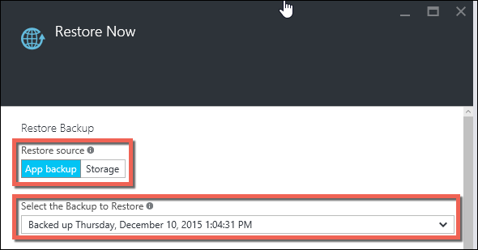

<properties 
    pageTitle="還原 Azure 中的應用程式" 
    description="瞭解如何從備份檔案還原您的應用程式。" 
    services="app-service" 
    documentationCenter="" 
    authors="cephalin" 
    manager="wpickett" 
    editor="jimbe"/>

<tags 
    ms.service="app-service" 
    ms.workload="na" 
    ms.tgt_pltfrm="na" 
    ms.devlang="na" 
    ms.topic="article" 
    ms.date="07/06/2016" 
    ms.author="cephalin"/>

# 還原 Azure 中的應用程式

本文將說明如何還原[Azure 應用程式服務](../app-service/app-service-value-prop-what-is.md)，您先前已備份 （請參閱[備份您的應用程式中 Azure](web-sites-backup.md)） 中的應用程式。 您可以將其連結的資料庫 （SQL 資料庫或 MySQL） 視需要使用應用程式還原至先前的狀態，或建立新的應用程式，根據原始應用程式的備份的其中一個。 建立新的應用程式所執行的最新版本的平行可以用來 A / B 測試。

在 [**一般**] 及 [**進階版**層中執行的應用程式使用從備份還原。 縮放比例設定您的應用程式的相關資訊，請參閱[不按比例縮放設定 Azure 中的應用程式](web-sites-scale.md)。 **進階版**層可讓更多的**標準**層比執行每日備份。

## 從現有的備份還原應用程式

1. 按一下 [**設定**防禦在 Azure 入口網站應用程式，以顯示**備份**刀的**備份**。 然後按一下 [**還原立即**命令列中。 
    
    ![選擇 [立即還原][ChooseRestoreNow]

3. **還原**刀，在第一次選取備份的來源。 

    
    
    [**應用程式備份**] 選項會顯示您目前的應用程式，所有現有的備份，您可以輕鬆地選取其中一個。 
    [**儲存**] 選項可讓您從任何現有的 Azure 儲存體帳戶和您的訂閱中的容器中選取任何備份的 ZIP 檔案。 
    如果您想要還原的備份的另一個應用程式，使用 [**儲存**] 選項。

4. 還原**目的地**，然後指定應用程式還原的目的地。

    
    
    >[AZURE.WARNING] 如果您選擇**覆寫**，則會清除您目前的應用程式中的所有現有資料。 按一下**[確定**] 之前，請務必它完全您想要做什麼。
    
    您可以選取**現有的應用程式**的應用程式備份還原到相同的 [資源] 群組中的另一個應用程式。 使用此選項之前，您應該已經建立另一個應用程式與鏡像到其中的定義在應用程式備份的資料庫設定資源群組中。 
    
5. 按一下**[確定]**。

## 下載或刪除儲存帳戶的備份
    
1. 從主要**瀏覽**的刀 Azure 入口網站中，選取 [**儲存帳戶**。
    
    會顯示您現有的儲存空間帳戶清單。 
    
2. 選取包含您想要下載或刪除備份的儲存空間帳戶。
    
    儲存帳戶刀隨即出現。

3. 在 [儲存 accountn 刀中，選取 [您想要的容器
    
    ![檢視容器][ViewContainers]

4. 選取您要下載或刪除的備份檔案。

    

5. 按一下 [**下載**或**刪除**取決於您想要做什麼。  

## 監控還原作業
    
1. 若要查看的成功或失敗的應用程式還原作業的詳細資料，瀏覽至 Azure 入口網站中的**稽核記錄**刀。 
    
    **稽核記錄**刀顯示的所有作業，以及層級、 狀態、 資源及時間詳細資料。
    
2. 若要尋找所要的還原作業，並按一下以選取該向下捲動。

詳細資料刀會顯示可用與還原作業相關的資訊。
    
## 後續步驟

您也可以備份及還原使用 REST API 的應用程式服務應用程式 （請參閱[使用其餘備份和還原應用程式服務應用程式](websites-csm-backup.md)）。

>[AZURE.NOTE] 如果您想要開始使用 Azure 應用程式服務註冊 Azure 帳戶之前，請移至[嘗試應用程式服務](http://go.microsoft.com/fwlink/?LinkId=523751)，可以讓您立即建立短暫入門 web 應用程式在應用程式服務。 必要; 沒有信用卡沒有承諾。

<!-- IMAGES -->
[ChooseRestoreNow]: ./media/web-sites-restore/02ChooseRestoreNow.png
[ViewContainers]: ./media/web-sites-restore/03ViewContainers.png
[StorageAccountFile]: ./media/web-sites-restore/02StorageAccountFile.png
[BrowseCloudStorage]: ./media/web-sites-restore/03BrowseCloudStorage.png
[StorageAccountFileSelected]: ./media/web-sites-restore/04StorageAccountFileSelected.png
[ChooseRestoreSettings]: ./media/web-sites-restore/05ChooseRestoreSettings.png
[ChooseDBServer]: ./media/web-sites-restore/06ChooseDBServer.png
[RestoreToNewSQLDB]: ./media/web-sites-restore/07RestoreToNewSQLDB.png
[NewSQLDBConfig]: ./media/web-sites-restore/08NewSQLDBConfig.png
[RestoredContosoWebSite]: ./media/web-sites-restore/09RestoredContosoWebSite.png
[DashboardOperationLogsLink]: ./media/web-sites-restore/10DashboardOperationLogsLink.png
[ManagementServicesOperationLogsList]: ./media/web-sites-restore/11ManagementServicesOperationLogsList.png
[DetailsButton]: ./media/web-sites-restore/12DetailsButton.png
[OperationDetails]: ./media/web-sites-restore/13OperationDetails.png
 
