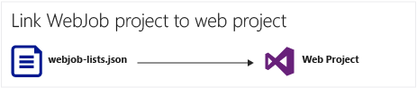

<properties 
    pageTitle="部署 WebJobs 使用 Visual Studio" 
    description="瞭解如何 Azure 應用程式服務 Web 應用程式使用 Visual Studio 中部署 Azure WebJobs。" 
    services="app-service" 
    documentationCenter="" 
    authors="tdykstra" 
    manager="wpickett" 
    editor="jimbe"/>

<tags 
    ms.service="app-service" 
    ms.devlang="dotnet" 
    ms.topic="article" 
    ms.tgt_pltfrm="na" 
    ms.workload="na" 
    ms.date="04/27/2016" 
    ms.author="tdykstra"/>

# 部署 WebJobs 使用 Visual Studio

## 概觀

本主題說明如何使用 Visual Studio 中[應用程式服務](http://go.microsoft.com/fwlink/?LinkId=529714) [Azure WebJob](http://go.microsoft.com/fwlink/?LinkId=390226)web 應用程式部署主控台應用程式專案。 有關如何使用[Azure 入口網站](https://portal.azure.com)中部署 WebJobs 的資訊，請參閱[WebJobs 執行背景工作](web-sites-create-web-jobs.md)。

當 Visual Studio 中部署 WebJobs 啟用主控台應用程式專案時，它會執行兩項工作︰

* 執行階段檔案複製到*App_Data/工作/連續*的連續 WebJobs （ *App_Data/工作/觸發*的排程與視 WebJobs） 的 web 應用程式中適當的資料夾。
* 設定[Azure 排程器作業](#scheduler)的排程要執行在特定時間的 WebJobs。 （這不是需要的連續 WebJobs。）

WebJobs 啟用專案具有新增下列項目︰

* [Microsoft.Web.WebJobs.Publish](http://www.nuget.org/packages/Microsoft.Web.WebJobs.Publish/) NuGet 套件。
* [Webjob 發佈 settings.json](#publishsettings)檔案包含部署及排程器設定。 

您可以將這些項目新增至現有的主控台應用程式專案，或使用範本建立新的 WebJobs 啟用主控台應用程式專案。 

您可以為 WebJob 部署專案，本身，或將其連結至 web 專案，以便自動部署每當您部署 web 專案。 若要連結的專案，Visual Studio 會包含在 web 專案中[webjobs list.json](#webjobslist)檔案中 WebJobs 啟用專案的名稱。

## 必要條件

WebJobs 部署功能時，可在 Visual Studio 2015 中為.NET 安裝 Azure SDK:

* [Azure SDK.NET (Visual Studio 2015)](http://go.microsoft.com/fwlink/?linkid=518003)。

## 啟用現有主控台應用程式專案 WebJobs 部署

您有兩個選項︰

* [啟用自動部署 web 專案](#convertlink)。

    設定現有專案主控台應用程式，使其自動部署為 WebJob 部署 web 專案時。 當您想要在其中執行相關的 web 應用程式的相同 web 應用程式中執行您 WebJob 時，請使用這個選項。

* [啟用部署不含 web 專案]](#convertnolink)。

    設定現有的主控台應用程式專案部署為 WebJob 單獨使用任何專案連結的網頁。 當您想要在 web 應用程式中執行 WebJob 本身沒有在 web 應用程式中執行的 web 應用程式時，請使用這個選項。 您可能會想要執行此動作才能擴充 web 應用程式資源亦 WebJob 資源。

### 啟用自動 WebJobs 部署與 web 專案
  
1. Web 專案在**方案總管]**中，以滑鼠右鍵按一下，然後按一下 [**新增** > **Azure WebJob 現有專案**。

    
    
    [[新增 Azure WebJob](#configure) ] 對話方塊隨即出現。

1. 在**專案名稱**] 下拉式清單中，選取 [新增為 WebJob 主控台應用程式專案]。

    ![選取 [新增 Azure WebJob] 對話方塊中的 [專案](./media/websites-dotnet-deploy-webjobs/aaw1.png)

2. 完成[新增 Azure WebJob](#configure) ] 對話方塊，然後按一下**[確定]**。 

### 啟用 WebJobs 部署不含 web 專案
  
1. 主控台應用程式中的專案**總管**] 中，以滑鼠右鍵按一下，然後按一下 [**發佈為 Azure WebJob**。 

    
    
    [[新增 Azure WebJob](#configure) ] 對話方塊隨即出現，使用 [**專案名稱**] 方塊中選取的專案。

2.  完成[新增 Azure WebJob](#configure) ] 對話方塊中，然後再按一下**[確定]**。

    **發佈網站**精靈 」 隨即出現。  如果您不想要立即發佈、 關閉精靈。 當您執行要[部署專案](#deploy)時，會針對儲存您輸入的設定。

## 建立新的 WebJobs 啟用專案

若要建立新的 WebJobs 啟用專案，您可以使用主控台應用程式專案範本，並啟用 WebJobs 部署[前一節](#convert)所述。 或者，您可以使用 WebJobs 新專案範本︰

* [使用獨立的 WebJob WebJobs 新專案範本](#createnolink)

    建立專案並將它設定為部署為 WebJob，使用任何專案連結的網頁。 當您想要在 web 應用程式中執行 WebJob 本身沒有在 web 應用程式中執行的 web 應用程式時，請使用這個選項。 您可能會想要執行此動作才能擴充 web 應用程式資源亦 WebJob 資源。

* [使用連結至 web 專案 WebJob WebJobs 新專案範本](#createlink)

    建立可設定成自動為 WebJob 部署相同的方案中的 web 專案時的專案。 當您想要在其中執行相關的 web 應用程式的相同 web 應用程式中執行您 WebJob 時，請使用這個選項。

> [AZURE.NOTE] WebJobs 新專案範本會自動安裝 NuGet 套件，並包含*Program.cs* [WebJobs SDK](http://www.asp.net/aspnet/overview/developing-apps-with-windows-azure/getting-started-with-windows-azure-webjobs)的程式碼。 如果您不想要使用 WebJobs sdk，您可以或不想要使用排程，而不是連續 WebJob，移除或變更`host.RunAndBlock`中*Program.cs*陳述式。

### 使用獨立的 WebJob WebJobs 新專案範本
  
1. 按一下 [**檔案** > **新專案**，然後按一下 [在**新的專案**] 對話方塊中的 [**雲端** > **Microsoft Azure WebJob**。

    ![顯示 WebJob 範本的新專案] 對話方塊](./media/websites-dotnet-deploy-webjobs/np.png)
    
2. 依照先前顯示進行[專案獨立的 WebJobs 專案主控台應用程式](#convertnolink)的指示。

### 使用連結至 web 專案 WebJob WebJobs 新專案範本

1. Web 專案在**方案總管]**中，以滑鼠右鍵按一下，然後按一下 [**新增** > **新 Azure WebJob 專案**。

    ![新增 Azure WebJob 專案] 功能表項目](./media/websites-dotnet-deploy-webjobs/nawj.png)

    [[新增 Azure WebJob](#configure) ] 對話方塊隨即出現。

2. 完成[新增 Azure WebJob](#configure) ] 對話方塊中，然後再按一下**[確定]**。

## 新增 Azure WebJob] 對話方塊

**新增 Azure WebJob** ] 對話方塊可讓您輸入 WebJob 名稱] 和 [排程您 WebJob 的設定。 

![新增 Azure WebJob] 對話方塊](./media/websites-dotnet-deploy-webjobs/aaw2.png)

這個對話方塊中的欄位會對應到 Azure 入口網站的 [**新工作**] 對話方塊上的欄位。 如需詳細資訊，請參閱[WebJobs 執行背景工作](web-sites-create-web-jobs.md)。

（不適用於連續 WebJobs) 排程 WebJob 的 Visual Studio 建立[Azure Scheduler](/services/scheduler/)工作集合如果其中一個不存在，且該集合中建立工作︰

* 名為排程工作集合*WebJobs-{regionname}*其中*{regionname}*指的是區域網路應用程式裝載於。 例如︰ WebJobs WestUS。
* 排程器工作名稱為*{webappname}-{webjobname}*。 例如︰ MyWebApp MyWebJob。 
 
>[AZURE.NOTE]
> 
>* 命令列部署的相關資訊，請參閱[啟用命令列或的 Azure WebJobs 連續傳送](/blog/2014/08/18/enabling-command-line-or-continuous-delivery-of-azure-webjobs/)。
>* 如果您設定**週期性工作**，並將數個分鐘的週期頻率，不免費 Azure 排程器服務。 其他頻率 （小時、 日期等） 免費提供。
>* 如果您部署 WebJob，然後決定您想要變更類型 WebJob 及重新部署的機會，您會需要刪除 webjobs 發佈 settings.json 檔案。 這可讓 Visual Studio 再次顯示的發佈選項，讓您可以變更的 WebJob 類型。
>* 如果您部署 WebJob，變更執行的模式稍後從 [接續本頁] 分到非連續或反向操作時，Visual Studio 建立新的 WebJob Azure 中當您重新部署。 如果您變更排程的其他設定，但保留執行相同的模式或排程與隨選之間切換，Visual Studio 更新現有的工作，而非建立新的範本。

## webjob 發佈 settings.json

當您設定 WebJobs 部署主控台應用程式時，Visual Studio 安裝[Microsoft.Web.WebJobs.Publish](http://www.nuget.org/packages/Microsoft.Web.WebJobs.Publish/) NuGet 套件，並將排程資訊儲存*webjob 發佈 settings.json*檔案 WebJobs 專案的專案*屬性*] 資料夾中。 以下是該檔案的範例︰

        {
          "$schema": "http://schemastore.org/schemas/json/webjob-publish-settings.json",
          "webJobName": "WebJob1",
          "startTime": "2014-06-23T00:00:00-08:00",
          "endTime": "2014-06-27T00:00:00-08:00",
          "jobRecurrenceFrequency": "Minute",
          "interval": 5,
          "runMode": "Scheduled"
        }

您可以直接編輯此檔案，並 Visual Studio 提供 IntelliSense。 檔案結構描述已儲存在[http://schemastore.org](http://schemastore.org/schemas/json/webjob-publish-settings.json) ，並那里可檢視。  

>[AZURE.NOTE]
>
>* 如果您設定**週期性工作**，並將數個分鐘的週期頻率，不免費 Azure 排程器服務。 其他頻率 （小時、 日期等） 免費提供。

## webjobs list.json

當您將 WebJobs 啟用專案連結至 web 專案時，Visual Studio 會*webjobs list.json* web 專案的 [*屬性*] 資料夾中檔案中儲存 WebJobs 專案的名稱。 清單包含多個 WebJobs 專案，如下列範例所示︰

        {
          "$schema": "http://schemastore.org/schemas/json/webjobs-list.json",
          "WebJobs": [
            {
              "filePath": "../ConsoleApplication1/ConsoleApplication1.csproj"
            },
            {
              "filePath": "../WebJob1/WebJob1.csproj"
            }
          ]
        }

您可以直接編輯此檔案，並 Visual Studio 提供 IntelliSense。 檔案結構描述已儲存在[http://schemastore.org](http://schemastore.org/schemas/json/webjobs-list.json) ，並那里可檢視。
  
## 部署 WebJobs 專案

您已連線到 web 專案 WebJobs project 自動部署與 web 專案。 Web 專案部署的相關資訊，請參閱[如何將 Web 應用程式部署](web-sites-deploy.md)。

若要部署本身 WebJobs 專案，以滑鼠右鍵按一下 [專案**總管**] 中的，按一下 [**發佈為 Azure WebJob**。 

    
獨立 WebJob，用於 web 專案的**發佈網站**精靈隨即出現，但設定少變更。

## 後續步驟

本文說明如何使用 Visual Studio 中部署 WebJobs。 如需有關如何部署 Azure WebJobs 的詳細資訊，請參閱[Azure WebJobs-建議資源-部署](http://www.asp.net/aspnet/overview/developing-apps-with-windows-azure/azure-webjobs-recommended-resources#deploying)。
