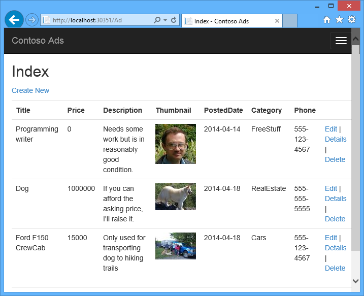
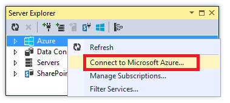
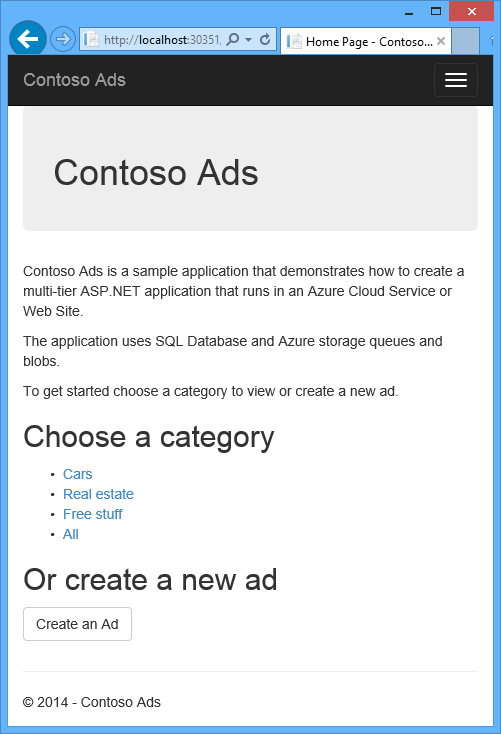
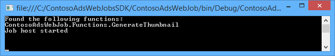
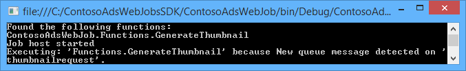

<properties
    pageTitle="Azure 應用程式服務中建立.NET WebJob |Microsoft Azure"
    description="建立使用 ASP.NET MVC 和 Azure 多層應用程式。 使用正面與結束就會執行，在 Azure 應用程式服務中的 web 應用程式和後端中會以 WebJob。 應用程式使用實體架構與 SQL 資料庫和 Azure 儲存佇列二進位大型物件。"
    services="app-service"
    documentationCenter=".net"
    authors="tdykstra"
    manager="wpickett"
    editor="mollybos"/>

<tags
    ms.service="app-service"
    ms.workload="na"
    ms.tgt_pltfrm="na"
    ms.devlang="na"
    ms.topic="article"
    ms.date="10/28/2016"
    ms.author="tdykstra"/>

# Azure 應用程式服務中建立.NET WebJob

本教學課程中會顯示如何撰寫簡單的多層 ASP.NET MVC 5 應用程式使用[WebJobs SDK](websites-dotnet-webjobs-sdk.md)的程式碼。

[WebJobs SDK](websites-webjobs-resources.md)的目的，是以簡化 WebJob 可以執行，例如圖像處理、 佇列處理撰寫的一般工作的程式碼、 RSS 彙總、 檔案維護及傳送電子郵件。 WebJobs SDK 有使用 Azure 儲存體和服務匯流排的、 排程的工作，以及處理錯誤，以及其他許多常見的案例的內建功能。 此外，它用來擴充功能，而且沒有[開啟來源存放庫的擴充](https://github.com/Azure/azure-webjobs-sdk-extensions/wiki/Binding-Extensions-Overview)。

範例應用程式是廣告公佈欄。 使用者可以上傳的廣告、 圖像和後端處理程序將圖像轉換成縮圖。 Ad 的 [清單] 頁面會顯示縮圖，並 ad 詳細資料] 頁面顯示完整大小的圖像。 以下是螢幕擷取畫面︰

此範例應用程式可用於[Azure 佇列](http://www.asp.net/aspnet/overview/developing-apps-with-windows-azure/building-real-world-cloud-apps-with-windows-azure/queue-centric-work-pattern)和[Azure blob](http://www.asp.net/aspnet/overview/developing-apps-with-windows-azure/building-real-world-cloud-apps-with-windows-azure/unstructured-blob-storage)。 教學課程介紹如何部署到[Azure 應用程式服務](http://go.microsoft.com/fwlink/?LinkId=529714)和[Azure SQL 資料庫](http://msdn.microsoft.com/library/azure/ee336279)應用程式。

## 必要條件

教學課程，假設您已經知道如何在 Visual Studio [ASP.NET MVC 5](http://www.asp.net/mvc/tutorials/mvc-5/introduction/getting-started)專案的共同作業。

Visual Studio 2013 撰寫教學課程。 如果您沒有已安裝 Visual Studio，它將會安裝您自動安裝 Azure SDK.net 時。

教學課程可供使用 Visual Studio 2015，但在應用程式之前本機您必須變更`Data Source`Web.config 和 App.config 檔案中的 SQL Server LocalDB 連線字串的部分`Data Source=(localdb)\v11.0`至`Data Source=(LocalDb)\MSSQLLocalDB`。 

> [AZURE.NOTE] 您必須完成本教學課程 Azure 帳戶︰
  >
  > + 您可以[開啟 Azure 帳戶免費](https://azure.microsoft.com/pricing/free-trial/?WT.mc_id=A261C142F)︰ 取得貸項總計試用付費 Azure 服務，您可以使用和即使使用這些之後最多，您可以將該帳戶，然後使用免費 Azure 服務，例如網站。 您的信用卡不需要付費，除非您明確地變更您的設定，並要求付費。
  >
  > + 您可以[啟動 MSDN 訂閱者優惠](https://azure.microsoft.com/pricing/member-offers/msdn-benefits-details/?WT.mc_id=A261C142F)︰ 您的 MSDN 訂閱可讓您貸項總計付費 Azure 服務，您可以使用每個月。
  >
  >如果您想要開始使用 Azure 應用程式服務註冊 Azure 帳戶之前，請移至[嘗試應用程式服務](http://go.microsoft.com/fwlink/?LinkId=523751)，可以讓您立即建立短暫入門 web 應用程式在應用程式服務。 必要; 沒有信用卡沒有承諾。

## 您將學習

教學課程介紹如何執行下列工作︰

* 啟用您的電腦 Azure 開發安裝 Azure SDK。
* 建立部署相關聯的 web 專案時，會自動部署為 Azure WebJob 主控台應用程式專案。
* 測試 WebJobs SDK 後端本機開發電腦上。
* 發佈具有 WebJobs 後端的應用程式至應用程式服務中的 web 應用程式。
* 上傳檔案並將它們儲存在 Azure Blob 服務。
* 使用 Azure WebJobs SDK 處理 Azure 儲存體佇列和二進位大型物件。

## 應用程式結構

範例應用程式使用[佇列中為中心的工作模式](http://www.asp.net/aspnet/overview/developing-apps-with-windows-azure/building-real-world-cloud-apps-with-windows-azure/queue-centric-work-pattern)off-load 建立後端處理程序的縮圖的需要大量 CPU 的工作。

應用程式會在 SQL 資料庫中，使用來建立資料表及存取資料的實體架構的程式碼第一個儲存廣告。 每個 ad，資料庫會儲存兩個 Url︰ 一個用於完整大小的圖像，一個縮圖。

當使用者上傳的圖像時，web 應用程式將圖像儲存在[Azure blob](http://www.asp.net/aspnet/overview/developing-apps-with-windows-azure/building-real-world-cloud-apps-with-windows-azure/unstructured-blob-storage)，而且會儲存 ad 資訊在資料庫中以指向 blob 的 URL。 同時，它會將訊息的 Azure 佇列。 在執行 Azure WebJob 為後端程序，WebJobs SDK 輪詢佇列中的新郵件。 新的訊息出現時，WebJob 建立該圖像的縮圖，並更新該廣告縮圖的 [URL 資料庫] 欄位。 以下是圖表可顯示部分應用程式中互動的方式︰

[AZURE.INCLUDE [install-sdk](../../includes/install-sdk-2015-2013.md)]

教學課程的指示適用於.NET 2.7.1 Azure SDK 或更新版本。

## 建立 Azure 儲存體帳戶

Azure 儲存體帳戶提供資源儲存在雲端的佇列和 blob 的資料。 它也可供 WebJobs SDK 來儲存儀表板的記錄資料。

在真實世界應用程式中，您通常會建立與記錄資料，並在另一個帳戶測試資料的實際執行資料與應用程式的不同的帳戶。 在此教學課程中，您會使用只用一個帳戶。

1. Visual Studio 中開啟**伺服器總管**] 視窗。

2. **Azure**節點中，以滑鼠右鍵按一下，然後按一下 [**連線到 Microsoft Azure**。

3. 使用您的 Azure 認證登入。

5. 以滑鼠右鍵按一下 Azure 節點下的**儲存空間**，然後按一下 [**建立儲存帳戶**。

3. 在 [**建立儲存帳戶**] 對話方塊中，輸入儲存帳戶的名稱。

    名稱必須必須是唯一的 （沒有其他 Azure 儲存體帳戶可以有相同的名稱）。 如果您輸入的名稱已在使用您將有機會變更。

    存取您儲存的帳戶的 URL 會*{名稱}*。 core.windows.net。

5. 設定地區的 [**地區或相關性群組**下拉式清單中最接近您。

    此設定可以指定哪些 Azure 資料中心會裝載您儲存的帳戶。 在此教學課程中，您選擇不會進行顯著差異。 不過，生產 web 應用程式，您想要您的網頁伺服器的最小化延遲和資料出口費用相同的地區您儲存的帳戶。 Web 應用程式 （您稍後會建立） 資料中心應盡可能接近瀏覽器存取 web 應用程式才能最小化延遲。

6. 若要**從本機多餘**設定**複寫**下拉式清單。

    儲存帳戶啟用地理複寫時，會將儲存的內容複寫到次要的資料中心，以啟用容錯移轉的主要位置的主要損毀的情況下該位置。 地理複寫可以造成成本。 測試和開發的帳戶，您通常不想支付地理複寫。 如需詳細資訊，請參閱[建立、 管理，或刪除儲存的帳戶](../storage-create-storage-account/#replication-options)。

5. 按一下 [**建立**]。

    

## 下載應用程式

1. 下載並解壓縮[完成解決方案](http://code.msdn.microsoft.com/Simple-Azure-Website-with-b4391eeb)。

2. 啟動 [Visual Studio。

3. 從 [**檔案**] 功能表選擇**開啟 > 專案/方案**、 瀏覽至您已下載的方案，然後開啟方案檔案。

4. 按下 CTRL + SHIFT + B 建置解決方案。

    根據預設，Visual Studio 自動還原未包含在*.zip*檔案 NuGet 封裝內容。 如果沒有還原套件，請安裝，以手動方式移至 [**管理解決方案的 NuGet 套件**] 對話方塊，然後按一下右上方的 [**還原**] 按鈕。

5. 在**方案總管]**中，請確認已選取 [ **ContosoAdsWeb**為啟動專案。

## 應用程式設定成使用您儲存的帳戶

1. ContosoAdsWeb project 中開啟應用程式*Web.config*檔案。

    檔案含有 SQL 連線字串和使用二進位大型物件和佇列的 Azure 儲存連線字串。

    SQL 連接字串點到[SQL Server Express LocalDB](http://msdn.microsoft.com/library/hh510202.aspx)資料庫。

    儲存連線字串是有儲存體帳戶名稱和存取鍵的版面配置區的範例。 您會使用具有 [名稱] 和 [索引鍵的儲存空間帳戶的連線字串來取代。  

    <pre class="prettyprint">&lt;connectionStrings&gt;
   &lt;新增名稱 = 」 ContosoAdsContext 「 連接字串 = 「 資料來源 = (localdb) \v11.0;初始目錄 = ContosoAds;整合式安全性 = True;MultipleActiveResultSets = true 時，「 providerName="System.Data.SqlClient 」 /&gt;
   &lt;新增名稱 = 」 AzureWebJobsStorage 「 連接字串 = 」 DefaultEndpointsProtocol = https。AccountName =<mark>[accountname]</mark>。AccountKey =<mark>[accesskey]</mark>」 /&gt; 
    &lt;/connectionStrings      &gt;</pre>

    儲存連線字串是預設命名為 [AzureWebJobsStorage 因為那是 WebJobs SDK 用途的名稱。 因此您不必 Azure 環境中設定只有一個連接字串值時，會以下使用相同的名稱。

2. 在**伺服器總管**] 中，以滑鼠右鍵按一下**儲存空間**節點下，您儲存的帳戶，然後按一下**屬性**。

    

3. 在 [**屬性**] 視窗中，按一下 [**儲存帳戶金鑰**]，然後按一下省略符號。

    

4. 複製**連線字串**。

    ![儲存帳戶金鑰] 對話方塊](./media/websites-dotnet-webjobs-sdk-get-started/cpak.png)

5. 取代您剛才複製的連接字串*Web.config*檔案中的儲存空間連接字串。 請務必選取所有項目引號內，但不是包括之前貼上引號。

6. ContosoAdsWebJob project 中開啟*App.config*檔案。

    這個檔案的兩個儲存連接字串，應用程式資料的項目，一個用於記錄。 您可以使用不同的儲存帳戶的應用程式的資料] 和 [記錄]，然後您可以使用[多個資料的儲存空間帳戶](https://github.com/Azure/azure-webjobs-sdk/blob/master/test/Microsoft.Azure.WebJobs.Host.EndToEndTests/MultipleStorageAccountsEndToEndTests.cs)。 在此教學課程中，您會使用單一儲存的帳戶。 連接字串已儲存的帳戶金鑰的版面配置區。 
    <pre class="prettyprint">&lt;設定&gt;
    &lt;connectionStrings&gt;
   &lt;新增名稱 = 」 AzureWebJobsDashboard 「 連接字串 = 」 DefaultEndpointsProtocol = https。AccountName =<mark>[accountname]</mark>。AccountKey =<mark>[accesskey]</mark>」 /&gt;
   &lt;新增名稱 = 」 AzureWebJobsStorage 「 連接字串 = 」 DefaultEndpointsProtocol = https。AccountName =<mark>[accountname]</mark>。AccountKey =<mark>[accesskey]</mark>」 /&gt;
   &lt;新增名稱 = 」 ContosoAdsContext 「 連接字串 = 「 資料來源 = (localdb) \v11.0;初始目錄 = ContosoAds;整合式安全性 = True;MultipleActiveResultSets = True; 」/&gt; 
    &lt;/connectionStrings&gt;
   &lt;啟動&gt;
   &lt;好版本 = 」 v4.0 」 sku = 」。NETFramework、 版本 = v4.5 」 /&gt; 
    &lt;/startup&gt;
&lt;/configuration                             &gt;</pre>

    根據預設，WebJobs SDK 尋找 「 AzureWebJobsStorage AzureWebJobsDashboard 的連接字串。 或者，您可以[連線字串，但是您想要並傳遞中明確至存放區`JobHost`物件](websites-dotnet-webjobs-sdk-storage-queues-how-to.md#config)。

7. 取代您先前複製連線字串中的兩個儲存連接字串。

8. 儲存變更。

## 在本機上執行應用程式

1. 若要開始 web frontend 的應用程式，請按 CTRL + F5。

    預設的瀏覽器會開啟 [首頁] 頁面。 （web 專案執行因為您已經啟動專案）。

    

2. 若要開始 WebJob 後端的應用程式，ContosoAdsWebJob 專案在**方案總管]**中，以滑鼠右鍵按一下，然後按一下 [**偵錯** > **啟動新的執行個體**。

    主控台應用程式視窗開啟，並顯示記錄訊息表示 WebJobs SDK JobHost 物件已開始執行。

    

3. 在瀏覽器中，按一下 [**建立 Ad**。

4. 輸入某些測試資料並選取要上傳的圖像，然後按一下 [**建立**。

    

    應用程式移至 [索引] 頁面中，但因為尚未尚未發生程序不會顯示新的廣告的縮圖。

    同時之後簡短等待, 記錄郵件主控台應用程式視窗中的顯示佇列中郵件收到，而且已經處理。

    

5. 您看到主控台應用程式視窗中的記錄郵件之後，請重新整理 [索引] 頁面，以查看縮圖。

    

6. 按一下 [**詳細資料**的 ad 若要查看完整大小的圖像。

    ![詳細資料] 頁面](./media/websites-dotnet-webjobs-sdk-get-started/details.png)

您已在您的本機電腦上執行應用程式和所使用的 SQL Server 資料庫位於您的電腦，但適用於佇列和 blob 的雲端。 在 [動作] 區段會在應用程式在雲端，使用雲端資料庫，以及雲端 blob 和佇列。  

## 在雲端執行應用程式

您必須執行下列步驟，以在雲端執行應用程式︰

* 部署至 Web 應用程式。 Visual Studio 會自動建立新 web 應用程式，在應用程式服務和 SQL 資料庫執行個體。
* 設定 web 應用程式使用 Azure SQL 資料庫及儲存帳戶。

您在雲端中執行時建立一些廣告之後，您會檢視 WebJobs SDK 儀表板，請參閱 rtf 監視它所提供的功能。

### 部署至 Web 應用程式

1. 關閉瀏覽器和主控台應用程式視窗。

2. 在**方案總管]**中，ContosoAdsWeb 專案，以滑鼠右鍵按一下，然後再按一下 [**發佈**]。

3. 在 [**發佈**精靈] 的**設定檔**步驟中，按一下 [ **Microsoft Azure web 應用程式**]。

    

4. 如果您仍然無法登入，登入 Azure。

5. 按一下 [**新增**]。

    對話方塊看起來可能會根據您已安裝哪個版本的.NET Azure SDK 的位置略有不同。

    ![按一下 [新增]](./media/websites-dotnet-webjobs-sdk-get-started/clicknew.png)

6. 在 [ **Microsoft Azure 上的 [建立 web 應用程式**] 對話方塊中，輸入唯一的名稱，在**Web 應用程式名稱**] 方塊。

    完整的 URL 會包含什麼您在這裡輸入加號。 azurewebsites.net （如旁**Web 應用程式名稱**] 文字方塊中所示）。 例如，如果 ContosoAds web 應用程式的名稱，URL 會 ContosoAds.azurewebsites.net。

7. 在[應用程式服務方案](../app-service/azure-web-sites-web-hosting-plans-in-depth-overview.md)下拉式清單中選擇 [**建立新的應用程式服務方案**。 輸入應用程式服務方案，例如 ContosoAdsPlan 的名稱。

8. 在 [[資源群組](../azure-resource-manager/resource-group-overview.md)] 下拉式清單中選擇 [**建立新的資源群組**]。

9. 輸入 [資源] 群組中，例如 ContosoAdsGroup 的名稱。

10. 在 [**地區**] 下拉式清單中，選擇 [相同地區您選擇為您儲存的帳戶]。

    此設定可以指定 web 應用程式會以執行哪些 Azure 資料中心。 保持在相同的資料中心的 web 應用程式和儲存帳戶最小化延遲和資料出口費用。

11. 在 [**資料庫伺服器**] 下拉式清單中選擇 [**建立新的伺服器**]。

12. 輸入資料庫伺服器，例如 contosoadsserver + 數字或您的名稱，以使的伺服器名稱是唯一的名稱。 

    伺服器名稱必須是唯一的。 它可以包含英文小寫字母、 數字，然後連字號。 它不能包含尾端連字號。 

    或者，如果您的訂閱已經有伺服器，您就可以從下拉式清單選取該伺服器。

12. 輸入的系統管理員**資料庫的使用者名稱**和**資料庫密碼**。

    如果您選取現有的名稱和密碼，您無法輸入**新的 SQL 資料庫伺服器**時，您輸入的新名稱和密碼您現在定義以供日後使用，當您存取資料庫。 如果您選取您先前建立的伺服器時，系統會提示您輸入密碼，您建立的系統管理員的使用者帳戶。

13. 按一下 [**建立**]。

    ![在 Microsoft Azure] 對話方塊中建立 web 應用程式](./media/websites-dotnet-webjobs-sdk-get-started/newdb.png)

    Visual Studio 建立的方案、 web 專案、 web 應用程式中 Azure 和 Azure SQL 資料庫執行個體。

14. 在 [**發佈**精靈**連線**步驟中，按一下 [**下一步**]。

    

15. 在**設定**步驟中，清除 [**使用此階段的連線字串**] 核取方塊，，然後再按 [**下一步**]。

    

    您不需要設定 SQL 連接字串，因為您可以設定 Azure 環境中的值，稍後再使用 [發佈] 對話方塊。

    您可以略過此頁面上的警告。

    * 以正常方式儲存帳戶時所使用 Azure 中執行會不同於本機，執行時所使用的項目，但在本教學課程所用在兩種環境使用相同的項目。 因此 AzureWebJobsStorage 連線字串不需要轉換。 即使您想要使用不同的儲存帳戶在雲端，您就不需要轉換的連接字串，因為 Azure 中執行時，應用程式會使用 Azure 環境設定。 您會看到此教學課程中的更新版本。

    * 在此教學課程，您不打算使用 ContosoAdsContext 資料庫的資料模型進行變更，因此並不需要以用於部署的實體架構的程式碼的第一個移轉。 第一次程式碼會自動建立新的資料庫第一個時間，應用程式嘗試存取 SQL 資料。

    在此教學課程，**檔案發佈選項**] 下的選項的預設值是沒問題了。

16. 在**預覽**步驟中，按一下 [**開始預覽**]。

    

    您可以略過正發佈資料庫的警告。 實體架構的程式碼第一個會建立資料庫，例如︰它不需要發佈。

    [預覽] 視窗會顯示的二進位檔案和 WebJob 專案中的設定檔將會複製到 web 應用程式中的 [ *app_data\jobs\continuous* ] 資料夾。

    ![在 [預覽] 視窗中的 WebJobs 檔案](./media/websites-dotnet-webjobs-sdk-get-started/previewwjfiles.png)

17. 按一下 [**發佈**]。

    Visual Studio 部署應用程式，並開啟瀏覽器中的 [首頁] 頁面的 URL。

    您將無法使用 web 應用程式，直到您下一節中的 Azure 環境中設定的連接字串。 您會看到錯誤頁面或根據 web 應用程式和資料庫建立選項您先前所選擇的 [首頁] 頁面。

### 設定 web 應用程式使用 Azure SQL 資料庫及儲存帳戶。

則安全性的最佳作法來[避免將機密資訊，例如來源碼存放庫中儲存的檔案中的連接字串](http://www.asp.net/aspnet/overview/developing-apps-with-windows-azure/building-real-world-cloud-apps-with-windows-azure/source-control#secrets)。 Azure 提供的方式來執行這項作業︰ 您可以在 Azure 環境中，設定連線字串及其他設定值和 ASP.NET 組態 Api 自動選取這些值 Azure 中執行的應用程式時。 您可以使用**伺服器總管**、 Azure 入口網站、 Windows PowerShell 或跨平台命令列介面 Azure 中的檔案，以設定這些值。 如需詳細資訊，請參閱[如何應用程式字串和連線字串的工作](/blog/2013/07/17/windows-azure-web-sites-how-application-strings-and-connection-strings-work/)。

本節中，您會使用**伺服器總管**的 Azure 設定連線字串值。

7. 在 [**伺服器總管]**中，以滑鼠右鍵按一下您的 web 應用程式，在下**Azure > 應用程式服務 > {資源群組}**，然後按一下 [**檢視設定]**。

    **Azure Web App** ] 視窗隨即會開啟 [**設定**] 索引標籤。

9. 變更 ContosoAdsContext DefaultConnection 連線字串的名稱。

    Azure 會在您建立 web 應用程式的相關聯的資料庫，讓它既有正確的連接字串值時，自動建立此連線字串。 您要變更名稱至您的程式碼尋找的項目。

9. 新增兩個新的連接字串，「 AzureWebJobsStorage AzureWebJobsDashboard。 將類型設定為 [自訂]，並設定連線字串值與先前所用的*Web.config*和*App.config*檔案的相同的值。 （請確定您包含整個連接字串，而不只是便捷鍵，並不包括引號）。

    WebJobs sdk，您可以使用這些連接字串是應用程式資料的記錄。 當您先前所見，應用程式資料的項目也會使用 web 前端程式碼。

9. 按一下 [**儲存**]。

    

10. 在 [**伺服器總管]**中，web 應用程式中，以滑鼠右鍵按一下，然後按一下**停止**。

12. Web 應用程式停駐點之後，請以滑鼠右鍵按一下 web 應用程式，，然後再按一下 [**開始**。

    發佈，但會停止當您進行設定，變更時，自動啟動 WebJob。 若要重新啟動您可以重新啟動 web 應用程式，或重新 WebJob 啟動[Azure 入口網站](http://go.microsoft.com/fwlink/?LinkId=529715)中。 通常建議設定變更後請重新啟動 web 應用程式。

9. 重新整理瀏覽器視窗其網址列中包含的 web 應用程式的 URL。

    [首頁] 頁面隨即出現。

10. 如同您在本機上執行應用程式時，請建立廣告。

    [索引] 頁面會顯示不的第一個縮圖。

11. 重新整理頁面，數秒後，並顯示縮圖。

    如果沒有出現在縮圖，您可能必須等候幾分鐘，或重新啟動 WebJob 的。 如果之後的一些仍然沒有看見縮圖時重新整理頁面，WebJob 可能不會自動啟動。 在此情況下，請在 [[傳統入口網站](https://manage.windowsazure.com)] 頁面，web 應用程式，[WebJobs 索引標籤，然後按一下 [**開始**。

### 檢視 [WebJobs SDK 儀表板

1. 在[傳統的入口網站](https://manage.windowsazure.com)中，選取您的 web 應用程式。

2. 按一下 [ **WebJobs** ] 索引標籤。

3. 您 WebJob，請按一下 [記錄] 欄中的 URL。

    ![WebJobs] 索引標籤](./media/websites-dotnet-webjobs-sdk-get-started/wjtab.png)

    新的瀏覽器索引標籤會開啟 [WebJobs SDK 儀表板。 儀表板顯示 WebJob 正在執行，並顯示您 WebJobs SDK 觸發的程式碼中的函數清單。

4. 按一下其中一個函數以查看其執行的詳細資料]。

    

    

    在此頁面上的 [**重新執行函數**] 按鈕會使 WebJobs SDK 架構，再次呼叫的函數，其可讓您變更資料傳遞給函數的第一次。

>[AZURE.NOTE] 當您完成測試，刪除 web 應用程式和 SQL 資料庫執行個體。 Web 應用程式為免費，但 SQL 資料庫執行個體和儲存帳戶累算費用 （較小，因為最小）。 此外，如果您執行的 web 應用程式，尋找您的 URL 的任何人均可以建立和檢視廣告。 在 [傳統] 入口網站，移至 web 應用程式的 [**儀表板**] 索引標籤，然後按一下 [在頁面底部的 [**刪除**] 按鈕。 然後，您可以選取要刪除的 SQL 資料庫執行個體同時核取方塊。 如果您只是要暫時防止其他人存取 web 應用程式，按一下 [**停止**改為。 在此情況下，費用會繼續累算 SQL 資料庫並儲存的帳戶。 您可以遵循當您不再需要刪除 SQL 資料庫及儲存帳戶的類似程序。

## 從頭開始建立應用程式

此區段中，您必須執行下列工作︰

* 建立 web 專案的 Visual Studio 方案。
* 新增課程文件庫專案進行資料的存取層前端與後端之間共用。
* 新增 WebJobs 部署啟用主控台應用程式的後端，專案。
* 新增 NuGet 套件。
* 設定專案的參考。
* 複製下載您在前一節的教學課程中使用的應用程式中的應用程式碼和設定檔。
* 檢閱使用 Azure blob 佇列和 WebJobs SDK 的程式碼的部分。

### 建立 web 專案與類別庫專案的 Visual Studio 解決方案

1. 在 Visual Studio 中，選擇 [**新增** > 從 [**檔案**] 功能表的**專案**。

2. 在 [**新專案**] 對話方塊中，選擇 [ **Visual C#** > **Web** > **ASP.NET Web 應用程式**。

3. ContosoAdsWeb，名稱解決方案 ContosoAdsWebJobsSDK （變更的方案名稱，如果您置於下載方案的相同資料夾），專案的名稱，然後按一下**[確定]**。

    

5. 在 [**新的 ASP.NET 專案**] 對話方塊中選擇 MVC 範本，然後清除**在雲端的主機**] 核取方塊，在**Microsoft Azure**。

    選取**在雲端的主機**啟用自動建立新的 Azure web 應用程式的 Visual Studio 與 SQL 資料庫。 您已經建立這些較舊版本，因為您不需要立即時建立專案。 如果您想要建立新的 pin，請選取核取方塊。 您可以再設定新的 web 應用程式和 SQL 資料庫前述部署應用程式時相同的方式。

5. 按一下 [**變更授權**。

    

7. **變更驗證**] 對話方塊中，選擇 [**無驗證**]，然後按一下**[確定]**。

    

8. 在 [**新的 ASP.NET 專案**] 對話方塊中，按一下**[確定]**。

    Visual Studio 建立的解決方案並 web 專案。

9. 在**方案總管**解決方案 （非專案），以滑鼠右鍵按一下，然後選擇 [**新增** > **新的專案**。

11. 在 [**加入新的專案**] 對話方塊中，選擇 [ **Visual C#** > **Windows 桌面** > **類別文件庫**範本。  

10. *ContosoAdsCommon*，為專案的名稱，然後按一下**[確定]**。

    包含此專案的實體架構內容，會用來將前端與後端的資料模型。 另一個方法，可以在 web 專案中定義 EF 相關的類別，從 WebJob 專案參照該專案。 但接著 WebJob 專案必須它不需要的網頁組件的參考。

### 新增具有 WebJobs 部署啟用主控台應用程式專案

1. 以滑鼠右鍵按一下網頁專案 （不解決方案或類別庫專案），然後按一下 [**新增** > **新 Azure WebJob 專案**。

    

2. 在 [**新增 Azure WebJob** ] 對話方塊中，輸入 ContosoAdsWebJob 為**專案名稱**和**WebJob 名稱**。 [離開**WebJob 執行模式**設定為 [**持續執行**。

3.  按一下**[確定]**。

    Visual Studio 建立部署為 WebJob，每當您部署 web 專案的主控台應用程式。 若要執行這項作業，它會建立專案後執行以下工作︰

    * 新增*webjob 發佈 settings.json*檔案 WebJob 專案屬性] 資料夾中。
    * 新增 web 專案屬性] 資料夾中的*webjobs list.json*檔案。
    * 安裝 Microsoft.Web.WebJobs.Publish NuGet 套件 WebJob 專案中。

    如需有關這些變更的詳細資訊，請參閱[如何部署使用 Visual Studio WebJobs](websites-dotnet-deploy-webjobs.md)。

### 新增 NuGet 套件

WebJob 專案的新專案範本會自動安裝 WebJobs SDK NuGet 套件[Microsoft.Azure.WebJobs](http://www.nuget.org/packages/Microsoft.Azure.WebJobs)和其相依性。

會自動安裝 WebJob 專案中 WebJobs SDK 相依性是 Azure 儲存用戶端文件庫 (SCL)。 不過，您需要將其新增至網頁專案處理 blob 和佇列。

1. 開啟 [**管理 NuGet 套件**] 對話方塊的解決方案。

2. 在左窗格中，選取 [**已安裝套件**]。

3. 尋找*Azure 儲存體*套件，然後按一下 [**管理**。

4. 中**選取 [專案**] 方塊中，選取 [ **ContosoAdsWeb** ] 核取方塊，然後按一下**[確定]**。

    所有的三個專案使用實體架構使用 SQL 資料庫中的資料。

5. 在左窗格中，選取 [**線上**]。

6. 尋找*EntityFramework* NuGet 套件，並將其安裝在所有的三個專案。

### 設定專案參考

Web 和 WebJob 專案，使用 SQL 資料庫]，因此兩者都需要 ContosoAdsCommon 專案的參考。

1. 在 ContosoAdsWeb 專案中，設定 ContosoAdsCommon 專案的參考。 (ContosoAdsWeb 專案，以滑鼠右鍵按一下，然後按一下 [**新增** > **參照**。 在 [**參照管理員**] 對話方塊中，選取**方案** > **專案** > **ContosoAdsCommon**，然後按一下**[確定]**。)

1. 在 ContosoAdsWebJob 專案中，設定 ContosAdsCommon 專案的參考。

    WebJob 專案會需要參照和圖像相關操作，並以存取 [連線字串。

3. 在 ContosoAdsWebJob 專案中，設定為參照`System.Drawing`和`System.Configuration`。

### 新增程式碼和設定檔案

本教學課程中不會顯示如何[建立 MVC 控制器和使用臨時平台的檢視](http://www.asp.net/mvc/tutorials/mvc-5/introduction/getting-started)，如何[撰寫的搭配 SQL Server 資料庫的實體架構程式碼](http://www.asp.net/mvc/tutorials/getting-started-with-ef-using-mvc)] 或 [[非同步的基本概念程式設計 ASP.NET 4.5 中](http://www.asp.net/aspnet/overview/developing-apps-with-windows-azure/building-real-world-cloud-apps-with-windows-azure/web-development-best-practices#async)。 若要執行剩下，因此的就是從下載方案到新方案的複製程式碼和設定檔案。 執行這項作業後，下列各節會顯示，並說明主要部分的程式碼。

將檔案新增到專案或資料夾，請以滑鼠右鍵按一下專案或資料夾，然後按一下 [**新增** > **現有項目**。 選取您想要然後按一下 [**新增**的檔案。 如果詢問您是否要取代現有的檔案，請，按一下**[是]**。

1. 在 ContosoAdsCommon 專案中，刪除*Class1.cs*檔案並在其位置下列檔案從新增下載的專案。

    - *Ad.cs*
    - *ContosoAdscontext.cs*
    - *BlobInformation.cs*  

2. 在 ContosoAdsWeb 專案中，請從下載的專案中新增下列檔案。

    - *Web.config*
    - *Global.asax.cs*  
    - 在*控制站*資料夾︰ *AdController.cs*
    - 在 [ *Views\Shared*資料夾︰ *_Layout.cshtml*檔案
    - 在 [ *Views\Home*資料夾︰ *Index.cshtml*
    - 在 [ *Views\Ad*資料夾 （第一次建立資料夾）︰ 五個*.cshtml*檔案  

3. 在 ContosoAdsWebJob 專案中，請從下載的專案中新增下列檔案。

    - *App.config* （變更為 [**所有檔案**的檔案類型篩選）
    - *Program.cs*
    - *Functions.cs*

您現在可以建立、 執行及部署應用程式之前在教學課程中的指示。 您這麼做之前，不過，停止 WebJob 仍在執行您部署至第一個 web app 中。 否則，WebJob 會建立本機或應用程式全部都使用相同的儲存空間帳戶後，在新的 web 應用程式中，執行佇列中訊息處理。

## 檢視應用程式碼

下列各節說明使用 WebJobs SDK 和 Azure 儲存體 blob 和佇列相關的程式碼。

> [AZURE.NOTE] 程式碼特定 WebJobs sdk 的變更，請移至 [ [Program.cs] 及 [Functions.cs](#programcs)區段。

### ContosoAdsCommon-Ad.cs

Ad.cs 檔案定義 ad 類別列舉和 ad 資訊 POCO 實體類別。

        public enum Category
        {
            Cars,
            [Display(Name="Real Estate")]
            RealEstate,
            [Display(Name = "Free Stuff")]
            FreeStuff
        }

        public class Ad
        {
            public int AdId { get; set; }

            [StringLength(100)]
            public string Title { get; set; }

            public int Price { get; set; }

            [StringLength(1000)]
            [DataType(DataType.MultilineText)]
            public string Description { get; set; }

            [StringLength(1000)]
            [DisplayName("Full-size Image")]
            public string ImageURL { get; set; }

            [StringLength(1000)]
            [DisplayName("Thumbnail")]
            public string ThumbnailURL { get; set; }

            [DataType(DataType.Date)]
            [DisplayFormat(DataFormatString = "{0:yyyy-MM-dd}", ApplyFormatInEditMode = true)]
            public DateTime PostedDate { get; set; }

            public Category? Category { get; set; }
            [StringLength(12)]
            public string Phone { get; set; }
        }

### ContosoAdsCommon-ContosoAdsContext.cs

ContosoAdsContext 類別指定 DbSet 集合，其中的實體架構會儲存在 SQL 資料庫中使用 Ad 類別。

        public class ContosoAdsContext : DbContext
        {
            public ContosoAdsContext() : base("name=ContosoAdsContext")
            {
            }
            public ContosoAdsContext(string connString)
                : base(connString)
            {
            }
            public System.Data.Entity.DbSet<Ad> Ads { get; set; }
        }

類別有兩個建構函式。 第一個由 web 專案，並指定 web.config 或 Azure 執行階段環境中所儲存的連線字串的名稱。 第二個建構函式可讓您傳入實際的連接字串。 所需 WebJob 專案因為它沒有 Web.config 檔案。 您先前所見位置儲存此連線字串，，而且您會看到如何碼擷取連接字串時，會產生 DbContext 類別。

### ContosoAdsCommon-BlobInformation.cs

`BlobInformation`類別用來儲存在佇列中郵件的圖像 blob 的相關資訊。

        public class BlobInformation
        {
            public Uri BlobUri { get; set; }

            public string BlobName
            {
                get
                {
                    return BlobUri.Segments[BlobUri.Segments.Length - 1];
                }
            }
            public string BlobNameWithoutExtension
            {
                get
                {
                    return Path.GetFileNameWithoutExtension(BlobName);
                }
            }
            public int AdId { get; set; }
        }

### ContosoAdsWeb-Global.asax.cs

程式碼，稱為 [從`Application_Start`方法建立*圖像*blob 容器和*圖像*佇列如果已經不存在。 如此一來，可確保，每當您開始使用新的儲存空間帳戶，需要的 blob 容器和佇列中會自動建立。

程式碼會以存取儲存帳戶使用*Web.config*檔案或 Azure 執行階段環境中的儲存空間連線字串。

        var storageAccount = CloudStorageAccount.Parse
            (ConfigurationManager.ConnectionStrings["AzureWebJobsStorage"].ToString());

接著，取得*圖像*blob 容器的參照，然後建立容器，如果尚不存在，並將存取權限設定新的容器上。 根據預設新容器允許只用戶端與儲存帳戶認證來存取二進位大型物件。 Web 應用程式需求，讓它可以顯示圖像使用指向 [影像 blob 的 Url 是公用 blob。

        var blobClient = storageAccount.CreateCloudBlobClient();
        var imagesBlobContainer = blobClient.GetContainerReference("images");
        if (imagesBlobContainer.CreateIfNotExists())
        {
            imagesBlobContainer.SetPermissions(
                new BlobContainerPermissions
                {
                    PublicAccess = BlobContainerPublicAccessType.Blob
                });
        }

類似的程式碼取得*thumbnailrequest*佇列中的參照，並建立新的佇列。 在此情況下，需要沒有權限變更。 

        CloudQueueClient queueClient = storageAccount.CreateCloudQueueClient();
        var imagesQueue = queueClient.GetQueueReference("thumbnailrequest");
        imagesQueue.CreateIfNotExists();

### ContosoAdsWeb-_Layout.cshtml

*_Layout.cshtml*檔案中的頁首及頁尾]，設定應用程式的名稱，並建立 「 廣告] 功能表項目。

### ContosoAdsWeb-Views\Home\Index.cshtml

*Views\Home\Index.cshtml*檔案會顯示在 [首頁] 頁面上的類別連結。 連結傳遞的整數值`Category`廣告索引頁查詢字串變數中的列舉。

        <li>@Html.ActionLink("Cars", "Index", "Ad", new { category = (int)Category.Cars }, null)</li>
        <li>@Html.ActionLink("Real estate", "Index", "Ad", new { category = (int)Category.RealEstate }, null)</li>
        <li>@Html.ActionLink("Free stuff", "Index", "Ad", new { category = (int)Category.FreeStuff }, null)</li>
        <li>@Html.ActionLink("All", "Index", "Ad", null, null)</li>

### ContosoAdsWeb-AdController.cs

在*AdController.cs*檔案建構函式通話`InitializeStorage`方法，以建立可提供的 API 使用二進位大型物件和佇列 Azure 儲存用戶端文件庫物件。

然後程式碼會較舊版本中*Global.asax.cs*取得*圖像*blob 容器的參考。 時執行的動作，將其設定預設值，[再試一次原則](http://www.asp.net/aspnet/overview/developing-apps-with-windows-azure/building-real-world-cloud-apps-with-windows-azure/transient-fault-handling)適當的 web 應用程式。 預設的指數輪詢重試原則可能會超過一分鐘上重複重試暫時性錯誤的 web 應用程式。 在這裡指定重試原則會 3 秒後每嘗試的最多 3 次。

        var blobClient = storageAccount.CreateCloudBlobClient();
        blobClient.DefaultRequestOptions.RetryPolicy = new LinearRetry(TimeSpan.FromSeconds(3), 3);
        imagesBlobContainer = blobClient.GetContainerReference("images");

類似的程式碼取得*圖像*佇列中的參照。

        CloudQueueClient queueClient = storageAccount.CreateCloudQueueClient();
        queueClient.DefaultRequestOptions.RetryPolicy = new LinearRetry(TimeSpan.FromSeconds(3), 3);
        imagesQueue = queueClient.GetQueueReference("blobnamerequest");

使用 DbContext 類別的實體架構資料模型所使用的是大部分控制器程式碼。 例外狀況是 HttpPost`Create`方法上, 傳的檔案，並將它儲存在 blob 儲存體。 模型文件夾提供[HttpPostedFileBase](http://msdn.microsoft.com/library/system.web.httppostedfilebase.aspx)物件的方法。

        [HttpPost]
        [ValidateAntiForgeryToken]
        public async Task<ActionResult> Create(
            [Bind(Include = "Title,Price,Description,Category,Phone")] Ad ad,
            HttpPostedFileBase imageFile)

如果使用者選取要上傳的檔案，程式碼會上傳的檔案，將它儲存在 blob，並更新 Ad 資料庫記錄指向 blob 的 URL。

        if (imageFile != null && imageFile.ContentLength != 0)
        {
            blob = await UploadAndSaveBlobAsync(imageFile);
            ad.ImageURL = blob.Uri.ToString();
        }

上傳的程式碼是`UploadAndSaveBlobAsync`方法。 它會建立 blob 的 GUID 名稱、 上傳並儲存的檔案，並傳回儲存 blob 的參照。

        private async Task<CloudBlockBlob> UploadAndSaveBlobAsync(HttpPostedFileBase imageFile)
        {
            string blobName = Guid.NewGuid().ToString() + Path.GetExtension(imageFile.FileName);
            CloudBlockBlob imageBlob = imagesBlobContainer.GetBlockBlobReference(blobName);
            using (var fileStream = imageFile.InputStream)
            {
                await imageBlob.UploadFromStreamAsync(fileStream);
            }
            return imageBlob;
        }

之後 HttpPost`Create`方法上傳 blob 更新資料庫，它會建立佇列中郵件通知的後端程序圖像是否已轉換為縮圖。

        BlobInformation blobInfo = new BlobInformation() { AdId = ad.AdId, BlobUri = new Uri(ad.ImageURL) };
        var queueMessage = new CloudQueueMessage(JsonConvert.SerializeObject(blobInfo));
        await thumbnailRequestQueue.AddMessageAsync(queueMessage);

HttpPost 的程式碼`Edit`方法很類似，但如果使用者選了新的圖像檔案，必須刪除已存在於此 ad 任何二進位大型物件。

        if (imageFile != null && imageFile.ContentLength != 0)
        {
            await DeleteAdBlobsAsync(ad);
            imageBlob = await UploadAndSaveBlobAsync(imageFile);
            ad.ImageURL = imageBlob.Uri.ToString();
        }

以下是當您刪除 ad 刪除 blob 的程式碼︰

        private async Task DeleteAdBlobsAsync(Ad ad)
        {
            if (!string.IsNullOrWhiteSpace(ad.ImageURL))
            {
                Uri blobUri = new Uri(ad.ImageURL);
                await DeleteAdBlobAsync(blobUri);
            }
            if (!string.IsNullOrWhiteSpace(ad.ThumbnailURL))
            {
                Uri blobUri = new Uri(ad.ThumbnailURL);
                await DeleteAdBlobAsync(blobUri);
            }
        }
        private static async Task DeleteAdBlobAsync(Uri blobUri)
        {
            string blobName = blobUri.Segments[blobUri.Segments.Length - 1];
            CloudBlockBlob blobToDelete = imagesBlobContainer.GetBlockBlobReference(blobName);
            await blobToDelete.DeleteAsync();
        }

### ContosoAdsWeb-Views\Ad\Index.cshtml 和 Details.cshtml

*Index.cshtml*檔案會顯示縮圖的其他 ad 資料︰

        

*Details.cshtml*檔案會顯示完整大小的圖像︰

        

### ContosoAdsWeb-Views\Ad\Create.cshtml 和 Edit.cshtml

*Create.cshtml*和*Edit.cshtml*檔案指定表單編碼可取得控制器`HttpPostedFileBase`物件。

        @using (Html.BeginForm("Create", "Ad", FormMethod.Post, new { enctype = "multipart/form-data" }))

`<input>`項目會告訴瀏覽器，提供檔案的選取範圍] 對話方塊。

        <input type="file" name="imageFile" accept="image/*" class="form-control fileupload" />

### ContosoAdsWebJob-Program.cs

當 WebJob 啟動、`Main`方法呼叫 WebJobs SDK`JobHost.RunAndBlock`開始執行的方法觸發目前執行緒函數。

        static void Main(string[] args)
        {
            JobHost host = new JobHost();
            host.RunAndBlock();
        }

### ContosoAdsWebJob-Functions.cs-GenerateThumbnail 方法

WebJobs SDK 收到佇列中訊息時，呼叫這個方法。 方法建立的縮圖，並放在縮圖資料庫中的 URL。

        public static void GenerateThumbnail(
        [QueueTrigger("thumbnailrequest")] BlobInformation blobInfo,
        [Blob("images/{BlobName}", FileAccess.Read)] Stream input,
        [Blob("images/{BlobNameWithoutExtension}_thumbnail.jpg")] CloudBlockBlob outputBlob)
        {
            using (Stream output = outputBlob.OpenWrite())
            {
                ConvertImageToThumbnailJPG(input, output);
                outputBlob.Properties.ContentType = "image/jpeg";
            }

            // Entity Framework context class is not thread-safe, so it must
            // be instantiated and disposed within the function.
            using (ContosoAdsContext db = new ContosoAdsContext())
            {
                var id = blobInfo.AdId;
                Ad ad = db.Ads.Find(id);
                if (ad == null)
                {
                    throw new Exception(String.Format("AdId {0} not found, can't create thumbnail", id.ToString()));
                }
                ad.ThumbnailURL = outputBlob.Uri.ToString();
                db.SaveChanges();
            }
        }

* `QueueTrigger`屬性會引導 WebJobs SDK thumbnailrequest 佇列上接收新郵件時，呼叫這個方法。

        [QueueTrigger("thumbnailrequest")] BlobInformation blobInfo,

    `BlobInformation`佇列中訊息中的物件會自動將已還原序列化`blobInfo`參數。 方法完成時，會刪除佇列中的郵件。 如果方法無法在完成之前，不會刪除佇列中的郵件。10 分鐘租用到期之後，郵件是發行的挑選一次，並處理。 郵件一律會使例外狀況時，不會一直重複此順序。 5 失敗嘗試處理郵件之後，郵件會移到佇列中名為 {queuename}-有害。 最大次數是設定的。

* 兩個`Blob`屬性提供繫結至二進位大型物件的物件︰ 一個用於現有的圖像 blob，另一個方法會建立新的縮圖 blob。

        [Blob("images/{BlobName}", FileAccess.Read)] Stream input,
        [Blob("images/{BlobNameWithoutExtension}_thumbnail.jpg")] CloudBlockBlob outputBlob)

    Blob 名稱來自屬性`BlobInformation`佇列中郵件中收到的物件 (`BlobName`和`BlobNameWithoutExtension`)。 若要取得完整的功能，您可以使用的儲存空間用戶端文件庫`CloudBlockBlob`blob 所使用的類別。 如果您想要重複使用的程式碼，撰寫使用`Stream`物件，您可以使用`Stream`類別。

如需如何撰寫使用 WebJobs SDK 屬性的函數的詳細資訊，請參閱下列資源︰

* [如何使用 WebJobs SDK Azure 佇列中的儲存空間](websites-dotnet-webjobs-sdk-storage-queues-how-to.md)
* [如何使用 WebJobs SDK Azure blob 儲存體](websites-dotnet-webjobs-sdk-storage-blobs-how-to.md)
* [如何使用 WebJobs SDK Azure 資料表儲存體](websites-dotnet-webjobs-sdk-storage-tables-how-to.md)
* [如何使用 WebJobs SDK Azure 服務匯流排](websites-dotnet-webjobs-sdk-service-bus.md)

> [AZURE.NOTE]
>
> * 如果您的 web 應用程式執行多個 Vm 上，將會同時執行多個 WebJobs，並在某些情況下導致快速處理多次相同的資料。 如果您是使用內建的佇列中 blob，與服務匯流排引動程序，這是沒有問題。 SDK 可確保您函數將會一次處理針對每個訊息或 blob。
>
> * 若要瞭解如何實作正常的關閉，請參閱[正常的關閉](websites-dotnet-webjobs-sdk-storage-queues-how-to.md#graceful)。
>
> * 中的程式碼`ConvertImageToThumbnailJPG`（未顯示） 的方法使用中的類別`System.Drawing`簡單的命名空間。 不過，搭配 Windows 表單設計這個命名空間中的類別。 他們不支援的 Windows] 或 [ASP.NET 服務中使用。 如需處理選項的圖像的詳細資訊，請參閱[動態圖像產生](http://www.hanselman.com/blog/BackToBasicsDynamicImageGenerationASPNETControllersRoutingIHttpHandlersAndRunAllManagedModulesForAllRequests.aspx)及[深度內圖像調整大小](http://www.hanselminutes.com/313/deep-inside-image-resizing-and-scaling-with-aspnet-and-iis-with-imageresizingnet-author-na)。

## 後續步驟

在本教學課程中，您已經看到 WebJobs SDK 用於後端處理的簡單多層應用程式。 本節提供一些建議，進一步瞭解 ASP.NET 多層應用程式和 WebJobs。

### 遺失的功能

應用程式具有已保留簡單的快速入門教學課程。 在真實世界應用程式中您想要實作[相依性的插入](http://www.asp.net/mvc/tutorials/hands-on-labs/aspnet-mvc-4-dependency-injection)和[儲存機制和單位工作模式](http://www.asp.net/mvc/tutorials/getting-started-with-ef-using-mvc/advanced-entity-framework-scenarios-for-an-mvc-web-application#repo)、 使用[之記錄的介面](http://www.asp.net/aspnet/overview/developing-apps-with-windows-azure/building-real-world-cloud-apps-with-windows-azure/monitoring-and-telemetry#log)、 使用[EF 程式碼的第一個移轉](http://www.asp.net/mvc/tutorials/getting-started-with-ef-using-mvc/migrations-and-deployment-with-the-entity-framework-in-an-asp-net-mvc-application)來管理資料模型的變更，但[EF 連線恢復](http://www.asp.net/mvc/tutorials/getting-started-with-ef-using-mvc/connection-resiliency-and-command-interception-with-the-entity-framework-in-an-asp-net-mvc-application)管理暫時網路錯誤。

### 縮放比例 WebJobs

WebJobs web 應用程式的內容中執行，而且無法調整分別。 比方說，如果您有一個標準 web 應用程式執行個體，您只有一個執行個體背景程序執行，並使用，否則將無法使用服務 web 內容的伺服器資源 （CPU、 記憶體等） 的一些。

如果流量會因日或週、 天的時間，而且您必須執行可以等候後端處理，您可能會排程執行低流量時間，您 WebJobs。 如果載入仍得太高方案，您可以執行 WebJob 固定在個別的 web 應用程式後端的目的。 您可以再不按比例縮放後端 web 應用程式獨立您 frontend web 應用程式。

如需詳細資訊，請參閱[縮放 WebJobs](websites-webjobs-resources.md#scale)。

### 避免 web 應用程式會出現逾時關閉清單

若要確認您 WebJobs 一律執行，且您的 web 應用程式的所有執行個體上執行，都必須啟用[AlwaysOn](http://weblogs.asp.net/scottgu/archive/2014/01/16/windows-azure-staging-publishing-support-for-web-sites-monitoring-improvements-hyper-v-recovery-manager-ga-and-pci-compliance.aspx)功能。

### 使用外部 WebJobs WebJobs SDK

使用 WebJobs SDK 的程式沒有在 WebJob Azure 中執行。 在本機上，執行，也可以在雲端服務工作者角色或 Windows 服務等其他環境中執行。 不過，您可以透過 Azure web 應用程式只能存取 WebJobs SDK 儀表板。 若要使用儀表板，您必須將 web 應用程式連線到您使用的藉由設定 AzureWebJobsDashboard 連線字串，在 [傳統] 入口網站中的 [**設定**] 索引標籤上的儲存空間帳戶。 然後您可以前往儀表板使用下列的 URL:

https://{webappname}.scm.azurewebsites.net/azurejobs/#/functions

如需詳細資訊，請參閱[開始使用 WebJobs SDK 本機開發的儀表板](http://blogs.msdn.com/b/jmstall/archive/2014/01/27/getting-a-dashboard-for-local-development-with-the-webjobs-sdk.aspx)，，但請注意，它會顯示舊的連接字串名稱。

### 更多 WebJobs 文件

如需詳細資訊，請參閱[Azure WebJobs 文件的資源](http://go.microsoft.com/fwlink/?LinkId=390226)。
