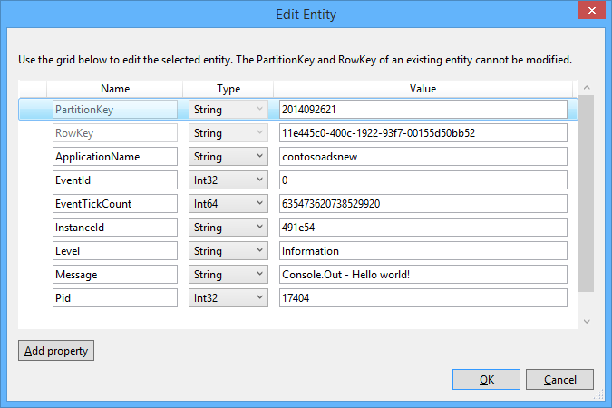

<properties 
    pageTitle="如何使用 WebJobs SDK Azure 佇列中的儲存空間" 
    description="瞭解如何使用 WebJobs SDK Azure 佇列中的儲存空間。 建立及刪除佇列;插入、 檢視、 取得，及刪除佇列中郵件及其他內容。" 
    services="app-service\web, storage" 
    documentationCenter=".net" 
    authors="tdykstra" 
    manager="wpickett" 
    editor="jimbe"/>

<tags 
    ms.service="app-service-web" 
    ms.workload="web" 
    ms.tgt_pltfrm="na" 
    ms.devlang="dotnet" 
    ms.topic="article" 
    ms.date="06/01/2016" 
    ms.author="tdykstra"/>

# <a name="how-to-use-azure-queue-storage-with-the-webjobs-sdk"></a>如何使用 WebJobs SDK Azure 佇列中的儲存空間

## <a name="overview"></a>概觀

本指南可提供 C# 程式碼範例，顯示如何使用 Azure WebJobs SDK 版本 1.x Azure 佇列中儲存服務使用。

本指南假設您已經知道[如何建立 WebJob 專案在 Visual Studio 中，指向您儲存的帳戶的連線字串](websites-dotnet-webjobs-sdk-get-started.md#configure-storage)或[多個儲存的帳戶](https://github.com/Azure/azure-webjobs-sdk/blob/master/test/Microsoft.Azure.WebJobs.Host.EndToEndTests/MultipleStorageAccountsEndToEndTests.cs)。

大部分的程式碼片段只顯示函數，不會建立的程式碼`JobHost`物件範例如下︰

        static void Main(string[] args)
        {
            JobHost host = new JobHost();
            host.RunAndBlock();
        }
        
本指南包含下列主題︰

-   [如何觸發程序時收到的佇列中郵件的函數](#trigger)
    - 字串佇列中的郵件
    - POCO 佇列中的郵件
    - 非同步函數
    - QueueTrigger 屬性可搭配使用的類型
    - 投票演算法
    - 多個執行個體
    - 平行執行
    - 取得佇列中郵件的中繼資料
    - 正常的關閉
-   [如何處理佇列中訊息建立佇列中的郵件](#createqueue)
    - 字串佇列中的郵件
    - POCO 佇列中的郵件
    - 建立多個訊息或非同步函數
    - 佇列中屬性可搭配使用的類型
    - 使用函數的內文中的 WebJobs SDK 屬性
-   [如何讀取和寫入 blob 處理佇列中訊息](#blobs)
    - 字串佇列中的郵件
    - POCO 佇列中的郵件
    - Blob 屬性可搭配使用的類型
-   [如何處理有害的郵件](#poison)
    - 自動有害訊息處理
    - 手動有害訊息處理
-   [如何設定的設定選項](#config)
    - 在 [程式碼中設定 SDK 連線字串
    - 設定 QueueTrigger 設定
    - 設定值 WebJobs SDK 建構函式參數程式碼
-   [如何手動觸發函數](#manual)
-   [如何寫入記錄檔](#logs) 
-   [如何處理錯誤，並設定逾時](#errors)
-   [後續步驟](#nextsteps)

## <a id="trigger"></a>如何觸發程序時收到的佇列中郵件的函數

若要撰寫 WebJobs SDK 通話時收到的佇列中郵件的函數，請使用`QueueTrigger`屬性。 屬性建構函式參數的字串指定以獲得佇列中的名稱。 您也可以[動態設定佇列名稱](#config)。

### <a name="string-queue-messages"></a>字串佇列中的郵件

下列範例中，在佇列中含有字串訊息，因此`QueueTrigger`會套用至一個名為字串參數`logMessage`其中包含佇列中郵件的內容。 函數[將記錄訊息至儀表板](#logs)。
 

        public static void ProcessQueueMessage([QueueTrigger("logqueue")] string logMessage, TextWriter logger)
        {
            logger.WriteLine(logMessage);
        }

除了`string`，參數可能是位元組陣列，`CloudQueueMessage`物件或由您定義 POCO。

### <a name="poco-plain-old-clr-objecthttpenwikipediaorgwikiplainoldclrobject-queue-messages"></a>POCO [(純文字舊的 CLR 物件](http://en.wikipedia.org/wiki/Plain_Old_CLR_Object)) 佇列郵件

在下列範例中，佇列中郵件中包含的 JSON`BlobInformation`物件包括`BlobName`屬性。 SDK 自動還原序列化物件。

        public static void WriteLogPOCO([QueueTrigger("logqueue")] BlobInformation blobInfo, TextWriter logger)
        {
            logger.WriteLine("Queue message refers to blob: " + blobInfo.BlobName);
        }

SDK 使用[Newtonsoft.Json NuGet 套件](http://www.nuget.org/packages/Newtonsoft.Json)序列化和還原序列化郵件。 如果您不是使用 WebJobs SDK 的程式中建立佇列中的郵件，您可以撰寫程式碼，如下列範例以建立可剖析 SDK POCO 佇列中訊息。 

        BlobInformation blobInfo = new BlobInformation() { BlobName = "log.txt" };
        var queueMessage = new CloudQueueMessage(JsonConvert.SerializeObject(blobInfo));
        logQueue.AddMessage(queueMessage);

### <a name="async-functions"></a>非同步函數

下列非同步函數[寫入記錄檔以儀表板](#logs)。

        public async static Task ProcessQueueMessageAsync([QueueTrigger("logqueue")] string logMessage, TextWriter logger)
        {
            await logger.WriteLineAsync(logMessage);
        }

非同步函數可能需要[取消權杖](http://www.asp.net/mvc/overview/performance/using-asynchronous-methods-in-aspnet-mvc-4#CancelToken)，可將複製 blob 下列範例所示。 (如需說明`queueTrigger`版面配置區，請參閱[Blob](#blobs)一節。)

        public async static Task ProcessQueueMessageAsyncCancellationToken(
            [QueueTrigger("blobcopyqueue")] string blobName, 
            [Blob("textblobs/{queueTrigger}",FileAccess.Read)] Stream blobInput,
            [Blob("textblobs/{queueTrigger}-new",FileAccess.Write)] Stream blobOutput,
            CancellationToken token)
        {
            await blobInput.CopyToAsync(blobOutput, 4096, token);
        }

### <a id="qtattributetypes"></a>QueueTrigger 屬性可搭配使用的類型

您可以使用`QueueTrigger`與下列類型︰

* `string`
* 序列化為 JSON POCO 類型
* `byte[]`
* `CloudQueueMessage`

### <a id="polling"></a>投票演算法

SDK 實作隨機指數返回關閉演算法以減少閒置佇列的投票，以在儲存交易成本的效果。  找到郵件時，SDK 等待兩秒，然後檢查有另一封郵件。找不到任何訊息時等待約四秒之前再試一次。 後續嘗試失敗收到佇列中的訊息之後, 等候持續增加，直到達到大等待的時間，預設為一分鐘。 [最大等待時間就可設定](#config)。

### <a id="instances"></a>多個執行個體

若您的 web 應用程式執行上多個執行個體，則連續的 WebJob 執行每個在電腦上，並每一部電腦會觸發程序，請等候嘗試執行函數。 WebJobs SDK 佇列中觸發程序會自動從處理佇列中訊息多次; 防止函數您沒有寫入冪函數。 不過，如果您想要確保只有一個執行個體函數會執行，即使在有多個執行個體的主機 web 應用程式，您可以使用`Singleton`屬性。 

### <a id="parallel"></a>平行執行

如果您有多個不同的佇列上接聽的函數，SDK 會撥打電話給平行時同時收到郵件。 

多封郵件都會收到的單一佇列也是一樣。 根據預設，SDK 取得 16 佇列中郵件的一批次，並執行平行處理這些函數。 [批次大小是設定](#config)。 當以批次大小的一半，向下取得正在處理的數字時，則 SDK 取得另一個批次，並開始處理這些訊息。 因此同步處理的郵件被每個函數的數目上限是一個與半形時間批次的大小。 這項限制適用於具有每個函數的個別`QueueTrigger`屬性。 

如果您不想在一個佇列中收到的郵件平行執行，您可以設定批次大小為 1。 另請參閱[Azure WebJobs SDK 1.1.0 RTM](/blog/azure-webjobs-sdk-1-1-0-rtm/)中的**更多的控制佇列中處理**。

### <a id="queuemetadata"></a>取得佇列中郵件的中繼資料

您可以取得下列訊息內容的方法簽章中加入參數︰

* `DateTimeOffset`expirationTime
* `DateTimeOffset`insertionTime
* `DateTimeOffset`nextVisibleTime
* `string`queueTrigger （包含郵件文字）
* `string`識別碼
* `string`popReceipt
* `int`dequeueCount

如果您想要直接使用 API Azure 儲存空間，您也可以新增`CloudStorageAccount`參數。

下列範例會將此中繼資料的所有資訊應用程式的記錄檔。 在範例中，同時 logMessage 和 queueTrigger 包含佇列中郵件的內容。

        public static void WriteLog([QueueTrigger("logqueue")] string logMessage,
            DateTimeOffset expirationTime,
            DateTimeOffset insertionTime,
            DateTimeOffset nextVisibleTime,
            string id,
            string popReceipt,
            int dequeueCount,
            string queueTrigger,
            CloudStorageAccount cloudStorageAccount,
            TextWriter logger)
        {
            logger.WriteLine(
                "logMessage={0}\n" +
            "expirationTime={1}\ninsertionTime={2}\n" +
                "nextVisibleTime={3}\n" +
                "id={4}\npopReceipt={5}\ndequeueCount={6}\n" +
                "queue endpoint={7} queueTrigger={8}",
                logMessage, expirationTime,
                insertionTime,
                nextVisibleTime, id,
                popReceipt, dequeueCount,
                cloudStorageAccount.QueueEndpoint,
                queueTrigger);
        }

以下是範例記錄撰寫程式碼範例︰

        logMessage=Hello world!
        expirationTime=10/14/2014 10:31:04 PM +00:00
        insertionTime=10/7/2014 10:31:04 PM +00:00
        nextVisibleTime=10/7/2014 10:41:23 PM +00:00
        id=262e49cd-26d3-4303-ae88-33baf8796d91
        popReceipt=AgAAAAMAAAAAAAAAfc9H0n/izwE=
        dequeueCount=1
        queue endpoint=https://contosoads.queue.core.windows.net/
        queueTrigger=Hello world!

### <a id="graceful"></a>正常的關閉

在連續的 WebJob 中執行的函數可以接受`CancellationToken`可以讓作業系統時 WebJob 即將終止通知函數的參數。 您可以使用此通知，請確定函數不會意外結束保留資料不一致的方式。

下列範例會示範如何檢查即將發生的 WebJob 終止函數中。

    public static void GracefulShutdownDemo(
                [QueueTrigger("inputqueue")] string inputText,
                TextWriter logger,
                CancellationToken token)
    {
        for (int i = 0; i < 100; i++)
        {
            if (token.IsCancellationRequested)
            {
                logger.WriteLine("Function was cancelled at iteration {0}", i);
                break;
            }
            Thread.Sleep(1000);
            logger.WriteLine("Normal processing for queue message={0}", inputText);
        }
    }

**附註︰**[狀態] 和 [輸出函數會關閉儀表板可能不正確顯示。
 
如需詳細資訊，請參閱[WebJobs 正常的關閉](http://blog.amitapple.com/post/2014/05/webjobs-graceful-shutdown/#.VCt1GXl0wpR)。   

## <a id="createqueue"></a>如何處理佇列中訊息建立佇列中的郵件

若要建立新的佇列中郵件的函數，請使用`Queue`屬性。 例如`QueueTrigger`、 您傳入佇列中名稱為字串，或者您也可以[動態設定佇列名稱](#config)。

### <a name="string-queue-messages"></a>字串佇列中的郵件

下列非非同步處理的程式碼範例會建立新的佇列中郵件佇列中名為 「 outputqueue 」 擁有相同的內容為佇列中已收到郵件佇列中名為 「 inputqueue 」。 (函數所使用的非同步`IAsyncCollector<T>`如下圖所示稍後此區段中。)


        public static void CreateQueueMessage(
            [QueueTrigger("inputqueue")] string queueMessage,
            [Queue("outputqueue")] out string outputQueueMessage )
        {
            outputQueueMessage = queueMessage;
        }
  
### <a name="poco-plain-old-clr-objecthttpenwikipediaorgwikiplainoldclrobject-queue-messages"></a>POCO [(純文字舊的 CLR 物件](http://en.wikipedia.org/wiki/Plain_Old_CLR_Object)) 佇列郵件

若要建立包含 POCO，而不是字串的佇列中郵件，傳送 POCO 類型為輸出參數`Queue`屬性建構函式。
 
        public static void CreateQueueMessage(
            [QueueTrigger("inputqueue")] BlobInformation blobInfoInput,
            [Queue("outputqueue")] out BlobInformation blobInfoOutput )
        {
            blobInfoOutput = blobInfoInput;
        }

SDK 自動序列化 JSON 物件。 永遠建立佇列中郵件，即使物件為 null。

### <a name="create-multiple-messages-or-in-async-functions"></a>建立多個訊息或非同步函數

若要建立多封郵件，讓 [輸出佇列中的參數類型`ICollector<T>`或`IAsyncCollector<T>`，如下列範例所示。

        public static void CreateQueueMessages(
            [QueueTrigger("inputqueue")] string queueMessage,
            [Queue("outputqueue")] ICollector<string> outputQueueMessage,
            TextWriter logger)
        {
            logger.WriteLine("Creating 2 messages in outputqueue");
            outputQueueMessage.Add(queueMessage + "1");
            outputQueueMessage.Add(queueMessage + "2");
        }

每個佇列中的訊息會立即建立時`Add`呼叫方法。

### <a name="types-that-the-queue-attribute-works-with"></a>佇列中屬性可搭配使用的類型

您可以使用`Queue`下列參數類型的屬性︰

* `out string`（如果參數值為非 null，此函數結束時，請建立佇列中的郵件）
* `out byte[]`(作用就像是`string`) 
* `out CloudQueueMessage`(作用就像是`string`) 
* `out POCO`（可序列化的類型，以建立郵件 null 物件函數結束時，如果參數 null）
* `ICollector`
* `IAsyncCollector`
* `CloudQueue`（手動建立郵件 Azure 儲存體直接使用 API）

### <a id="ibinder"></a>使用函數的內文中的 WebJobs SDK 屬性

如果您需要執行一些過您函數中的使用 WebJobs SDK 屬性，例如`Queue`， `Blob`，或`Table`，您可以使用`IBinder`介面。

下列範例會輸入的佇列訊息，而使用相同的內容輸出佇列中建立新郵件。 在函數內文中的程式碼設定輸出佇列中的名稱。

        public static void CreateQueueMessage(
            [QueueTrigger("inputqueue")] string queueMessage,
            IBinder binder)
        {
            string outputQueueName = "outputqueue" + DateTime.Now.Month.ToString();
            QueueAttribute queueAttribute = new QueueAttribute(outputQueueName);
            CloudQueue outputQueue = binder.Bind<CloudQueue>(queueAttribute);
            outputQueue.AddMessage(new CloudQueueMessage(queueMessage));
        }

`IBinder`介面也可使用`Table`和`Blob`屬性。

## <a id="blobs"></a>如何讀取和寫入處理佇列中訊息的二進位大型物件和表格

`Blob`和`Table`屬性可讓您讀取與寫入二進位大型物件和表格。 二進位大型物件套用此區段中的範例。 顯示如何觸發程序時建立或更新二進位大型物件的程式碼範例，請參閱[如何使用 Azure blob 儲存體與 WebJobs SDK](websites-dotnet-webjobs-sdk-storage-blobs-how-to.md)，及讀取和寫入資料表的程式碼範例，請參閱[如何使用與 WebJobs SDK Azure 資料表儲存體](websites-dotnet-webjobs-sdk-storage-tables-how-to.md)。

### <a name="string-queue-messages-triggering-blob-operations"></a>觸發 blob 作業字串佇列中的郵件

包含字串，佇列中郵件的`queueTrigger`是您可以使用中的版面配置區`Blob`屬性的`blobPath`參數包含訊息的內容。 

下列範例會使用`Stream`讀取和寫入二進位大型物件的物件。 佇列中郵件是位於 textblobs 容器 blob 的名稱。 與 blob 的複本 」-新增 「 附加至相同的容器中建立的名稱。 

        public static void ProcessQueueMessage(
            [QueueTrigger("blobcopyqueue")] string blobName, 
            [Blob("textblobs/{queueTrigger}",FileAccess.Read)] Stream blobInput,
            [Blob("textblobs/{queueTrigger}-new",FileAccess.Write)] Stream blobOutput)
        {
            blobInput.CopyTo(blobOutput, 4096);
        }

`Blob`屬性建構函式會花費`blobPath`參數會指定的容器和 blob 名稱。 如需此版面配置區的詳細資訊，請參閱[如何使用 Azure blob 儲存體與 WebJobs SDK](websites-dotnet-webjobs-sdk-storage-blobs-how-to.md)， 

當屬性來修飾`Stream`物件，另一個建構函式參數會指定`FileAccess`讀取、 寫入或讀/寫成的模式。 

下列範例會使用`CloudBlockBlob`刪除 blob 的物件。 佇列中郵件是 blob 的名稱。

        public static void DeleteBlob(
            [QueueTrigger("deleteblobqueue")] string blobName,
            [Blob("textblobs/{queueTrigger}")] CloudBlockBlob blobToDelete)
        {
            blobToDelete.Delete();
        }

### <a id="pocoblobs"></a>POCO [(純文字舊的 CLR 物件](http://en.wikipedia.org/wiki/Plain_Old_CLR_Object)) 佇列郵件

在佇列中郵件儲存為 JSON POCO，您可以使用版面配置區的名稱中的物件的屬性`Queue`屬性的`blobPath`參數。 您也可以使用[佇列中的中繼資料屬性名稱](#queuemetadata)為預留位置。 

下列範例會將 blob 複製到新 blob 以不同的副檔名。 佇列中郵件是`BlobInformation`物件，其中包含`BlobName`和`BlobNameWithoutExtension`屬性。 屬性名稱會作為版面配置區中的 blob 路徑`Blob`屬性。 
 
        public static void CopyBlobPOCO(
            [QueueTrigger("copyblobqueue")] BlobInformation blobInfo,
            [Blob("textblobs/{BlobName}", FileAccess.Read)] Stream blobInput,
            [Blob("textblobs/{BlobNameWithoutExtension}.txt", FileAccess.Write)] Stream blobOutput)
        {
            blobInput.CopyTo(blobOutput, 4096);
        }

SDK 使用[Newtonsoft.Json NuGet 套件](http://www.nuget.org/packages/Newtonsoft.Json)序列化和還原序列化郵件。 如果您不是使用 WebJobs SDK 的程式中建立佇列中的郵件，您可以撰寫程式碼，如下列範例以建立可剖析 SDK POCO 佇列中訊息。

        BlobInformation blobInfo = new BlobInformation() { BlobName = "boot.log", BlobNameWithoutExtension = "boot" };
        var queueMessage = new CloudQueueMessage(JsonConvert.SerializeObject(blobInfo));
        logQueue.AddMessage(queueMessage);

如果您需要執行一些您函數中之前繫結至物件的 blob 的工作，您可以使用的函數，[如下圖所示佇列屬性較舊版本的](#ibinder)本文中的屬性。

### <a id="blobattributetypes"></a>您可以使用具有 Blob 屬性的類型
 
`Blob`屬性，請使用下列類型︰

* `Stream`（已讀取或寫入，指定使用 FileAccess 建構函式參數）
* `TextReader`
* `TextWriter`
* `string`（唯讀）
* `out string`（撰寫; 字串參數的非 null 時，函數會傳回時，才會建立 blob）
* POCO （唯讀）
* 查看 POCO 撰寫; 一律會建立 blob (如果 POCO 參數，此函數會傳回就 null null 的物件會建立）
* `CloudBlobStream`（寫入）
* `ICloudBlob`（已讀取或寫入）
* `CloudBlockBlob`（已讀取或寫入） 
* `CloudPageBlob`（已讀取或寫入） 

## <a id="poison"></a>如何處理有害的郵件

其內容會導致失敗函數的郵件被稱為*有害的郵件*。 當函數失敗時，佇列中郵件不會刪除，並最後挑選一次，導致要重複循環圖。 SDK 可以自動中斷週期有限次數後，或您可以手動執行。

### <a name="automatic-poison-message-handling"></a>自動有害訊息處理

SDK 會 call 函數 5 倍處理佇列中的訊息。 如果第五嘗試失敗，郵件會移至有害佇列中。 [設定的次數上限](#config)。 

有害佇列中名稱為*{originalqueuename}*-有害。 您可以撰寫需要從有害的佇列中，使用這些記錄，或傳送通知給該手動處理程序郵件函數。 

在下列範例`CopyBlob`佇列中郵件包含不存在的 blob 的名稱時，函數將會失敗。 發生時，就會從 copyblobqueue 佇列中的郵件移至 copyblobqueue 位置佇列中。 `ProcessPoisonMessage`然後記錄有害的訊息。

        public static void CopyBlob(
            [QueueTrigger("copyblobqueue")] string blobName,
            [Blob("textblobs/{queueTrigger}", FileAccess.Read)] Stream blobInput,
            [Blob("textblobs/{queueTrigger}-new", FileAccess.Write)] Stream blobOutput)
        {
            blobInput.CopyTo(blobOutput, 4096);
        }
        
        public static void ProcessPoisonMessage(
            [QueueTrigger("copyblobqueue-poison")] string blobName, TextWriter logger)
        {
            logger.WriteLine("Failed to copy blob, name=" + blobName);
        }

處理有害的訊息時下, 圖顯示主控台輸出從這些函數。


### <a name="manual-poison-message-handling"></a>手動有害訊息處理

您可以藉由新增取得的次數郵件挑選處理`int`名為參數`dequeueCount`您函數。 然後，您可以檢查佇列中的字數統計函數的程式碼，並執行自己有害訊息處理時數超過閥值，如下列範例所示。

        public static void CopyBlob(
            [QueueTrigger("copyblobqueue")] string blobName, int dequeueCount,
            [Blob("textblobs/{queueTrigger}", FileAccess.Read)] Stream blobInput,
            [Blob("textblobs/{queueTrigger}-new", FileAccess.Write)] Stream blobOutput,
            TextWriter logger)
        {
            if (dequeueCount > 3)
            {
                logger.WriteLine("Failed to copy blob, name=" + blobName);
            }
            else
            {
            blobInput.CopyTo(blobOutput, 4096);
            }
        }

## <a id="config"></a>如何設定的設定選項

您可以使用`JobHostConfiguration`設定下列設定選項的類型︰

* 在 [程式碼設定 SDK 連接字串。
* 設定`QueueTrigger`設定，例如 [最大值取消佇列計數。
* 從設定取得佇列中的名稱。

### <a id="setconnstr"></a>在 [程式碼中設定 SDK 連線字串

程式碼中設定 SDK 連接字串可讓您使用自己的連線字串名稱，在設定檔或環境變數，如下列範例所示。

        static void Main(string[] args)
        {
            var _storageConn = ConfigurationManager
                .ConnectionStrings["MyStorageConnection"].ConnectionString;
        
            var _dashboardConn = ConfigurationManager
                .ConnectionStrings["MyDashboardConnection"].ConnectionString;
        
            var _serviceBusConn = ConfigurationManager
                .ConnectionStrings["MyServiceBusConnection"].ConnectionString;
        
            JobHostConfiguration config = new JobHostConfiguration();
            config.StorageConnectionString = _storageConn;
            config.DashboardConnectionString = _dashboardConn;
            config.ServiceBusConnectionString = _serviceBusConn;
            JobHost host = new JobHost(config);
            host.RunAndBlock();
        }

### <a id="configqueue"></a>設定 QueueTrigger 設定

您可以設定套用至佇列中郵件處理下列設定︰

- 挑選同時執行平行的佇列中郵件的最大的數字 （預設為 16）。
- 次數之前佇列訊息會傳送至有害佇列中的最大值 （預設為 5）。
- 最大值，請等候前投票，以再次時佇列空白的時間 （預設值為 1 分鐘）。

下列範例會示範如何設定這些設定︰

        static void Main(string[] args)
        {
            JobHostConfiguration config = new JobHostConfiguration();
            config.Queues.BatchSize = 8;
            config.Queues.MaxDequeueCount = 4;
            config.Queues.MaxPollingInterval = TimeSpan.FromSeconds(15);
            JobHost host = new JobHost(config);
            host.RunAndBlock();
        }

### <a id="setnamesincode"></a>設定值 WebJobs SDK 建構函式參數程式碼

有時候您想要指定佇列名稱、 blob 的名稱或容器，或表格中的程式碼，而不是硬式編碼將其命名。 例如，您可能會想指定的佇列名稱`QueueTrigger`設定檔案或環境變數中。 

您可以執行的透過傳入`NameResolver`物件至`JobHostConfiguration`類型。 包含特殊的版面配置區周圍百分比 （%） 符號中 WebJobs SDK 屬性建構函式參數，以及您`NameResolver`程式碼會指定要用來代替這些版面配置區的實際值。

例如，假設您想要使用 「 logqueuetest 測試環境中生產環境中的一個命名的 logqueueprod 佇列。 您想要指定名稱中的項目，而不是硬式編碼佇列中的名稱，`appSettings`有實際佇列名稱的集合。 如果`appSettings`機 logqueue，您函數看起來應該像下列範例。

        public static void WriteLog([QueueTrigger("%logqueue%")] string logMessage)
        {
            Console.WriteLine(logMessage);
        }

您`NameResolver`類別然後取得佇列名稱從`appSettings`如下列範例所示︰

        public class QueueNameResolver : INameResolver
        {
            public string Resolve(string name)
            {
                return ConfigurationManager.AppSettings[name].ToString();
            }
        }

您將`NameResolver`課程中，以`JobHost`物件在下列範例所示。

        static void Main(string[] args)
        {
            JobHostConfiguration config = new JobHostConfiguration();
            config.NameResolver = new QueueNameResolver();
            JobHost host = new JobHost(config);
            host.RunAndBlock();
        }
 
**附註︰**每次呼叫函數，但 blob 容器名稱解析只有在應用程式啟動時，則會解析佇列中、 表格和 blob 名稱。 執行工作時，您無法變更 blob 容器名稱。 

## <a id="manual"></a>如何手動觸發函數

若要手動觸發函數，使用`Call`或`CallAsync`上的方法`JobHost`物件和`NoAutomaticTrigger`屬性函數，如下列範例所示。 

        public class Program
        {
            static void Main(string[] args)
            {
                JobHost host = new JobHost();
                host.Call(typeof(Program).GetMethod("CreateQueueMessage"), new { value = "Hello world!" });
            }
        
            [NoAutomaticTrigger]
            public static void CreateQueueMessage(
                TextWriter logger, 
                string value, 
                [Queue("outputqueue")] out string message)
            {
                message = value;
                logger.WriteLine("Creating queue message: ", message);
            }
        }

## <a id="logs"></a>如何寫入記錄檔

儀表板顯示兩個位置中的記錄︰ 頁面 WebJob，並在特定的 WebJob 呼叫頁面。 


從主控台或的方法在函數呼叫中輸出`Main()`方法會出現在 WebJob 的儀表板頁面，而不在特定的方法叫用的頁面。 從您取得參數的方法簽名 TextWriter 物件輸出會出現在方法叫用的儀表板頁面。

主控台輸出無法連結至特定的方法引動，因為主控台單一執行緒時可能會同時執行許多工作函數。 這就是為什麼 SDK 提供使用自己的唯一的記錄編寫器物件呼叫的每個函數。

若要撰寫[應用程式追蹤記錄](web-sites-dotnet-troubleshoot-visual-studio.md#logsoverview)，請使用`Console.Out`（建立記錄標示為資訊） 和`Console.Error`（建立記錄標示為錯誤）。 另一個方法是使用[追蹤或 TraceSource](http://blogs.msdn.com/b/mcsuksoldev/archive/2014/09/04/adding-trace-to-azure-web-sites-and-web-jobs.aspx)，提供除了資訊與錯誤的詳細資訊，警告，並要徑層級。 應用程式追蹤記錄會出現在 web 應用程式記錄檔，Azure 資料表，或 Azure blob 取決於您如何設定 Azure web 應用程式。 之後的所有主控台輸出，則為 true，最近的 100 的應用程式記錄也會出現在儀表板頁面上的 WebJob，而不是在的函數呼叫的頁面。 

主控台輸出會出現在儀表板程式中 Azure WebJob，除非在本機執行程式時，才或一些其他環境。

停用高處理量案例的儀表板的記錄。 根據預設，SDK 寫入記錄檔儲存空間，並此活動可能會降低效能，當您正在處理多郵件。 若要停用記錄，設定為 null，如下列範例所示的儀表板連接字串。

        JobHostConfiguration config = new JobHostConfiguration();       
        config.DashboardConnectionString = "";        
        JobHost host = new JobHost(config);
        host.RunAndBlock();

下列範例顯示數種方式可寫入記錄檔︰

        public static void WriteLog(
            [QueueTrigger("logqueue")] string logMessage,
            TextWriter logger)
        {
            Console.WriteLine("Console.Write - " + logMessage);
            Console.Out.WriteLine("Console.Out - " + logMessage);
            Console.Error.WriteLine("Console.Error - " + logMessage);
            logger.WriteLine("TextWriter - " + logMessage);
        }

在 WebJobs SDK 儀表板的輸出`TextWriter`函數引動物件顯示當您移至特定頁面，然後按一下 [**切換輸出**︰


WebJobs SDK 儀表板中最近的 100 行主控台的輸出顯示向上移至頁面的 WebJob （不適用於函數引動），按一下 [**切換輸出**。
 


連續的 WebJob，在應用程式記錄顯示在/資料/工作/連續 /*{webjobname}*/job_log.txt web 應用程式檔案系統中。

        [09/26/2014 21:01:13 > 491e54: INFO] Console.Write - Hello world!
        [09/26/2014 21:01:13 > 491e54: ERR ] Console.Error - Hello world!
        [09/26/2014 21:01:13 > 491e54: INFO] Console.Out - Hello world!

在 Azure blob 應用程式記錄看起來像這樣︰ 2014年-09-26T21:01:13,Information,contosoadsnew,491e54,635473620738373502,0,17404,17,Console.Write-好 ！、 2014年-09-26T21:01:13,Error,contosoadsnew,491e54,635473620738373502,0,17404,19,Console.Error-好 ！、 2014年-09-26T21:01:13,Information,contosoadsnew,491e54,635473620738529920,0,17404,17,Console.Out-好 ！，

和 Azure 資料表`Console.Out`和`Console.Error`記錄看起來像這樣︰




如果您想要插入自己記錄器，請參閱[此範例](http://github.com/Azure/azure-webjobs-sdk-samples/blob/master/BasicSamples/MiscOperations/Program.cs)。

## <a id="errors"></a>如何處理錯誤，並設定逾時

WebJobs SDK 也包含[逾時](http://github.com/Azure/azure-webjobs-sdk-samples/blob/master/BasicSamples/MiscOperations/Functions.cs)屬性，您可以使用導致如果取消函數不會在指定的時間內完成。 如果您想要在一段時間內的太多錯誤發生時發出警示，您可以使用`ErrorTrigger`屬性。 以下是[ErrorTrigger 範例](https://github.com/Azure/azure-webjobs-sdk-extensions/wiki/Error-Monitoring)。

```
public static void ErrorMonitor(
[ErrorTrigger("00:01:00", 1)] TraceFilter filter, TextWriter log,
[SendGrid(
    To = "admin@emailaddress.com",
    Subject = "Error!")]
 SendGridMessage message)
{
    // log last 5 detailed errors to the Dashboard
   log.WriteLine(filter.GetDetailedMessage(5));
   message.Text = filter.GetDetailedMessage(1);
}
```

您也會動態可以停用，並啟用函數來控制是否他們可以觸發，使用的應用程式設定或環境變數名稱可能是設定參數。 程式碼範例，請參閱`Disable` [WebJobs SDK 範例存放庫](https://github.com/Azure/azure-webjobs-sdk-samples/blob/master/BasicSamples/MiscOperations/Functions.cs)中的屬性。

## <a id="nextsteps"></a>後續步驟

本指南已提供程式碼範例，顯示如何處理 Azure 佇列所使用的常見的案例。 如需有關如何使用 Azure WebJobs 和 WebJobs SDK 的詳細資訊，請參閱[Azure WebJobs 建議資源](http://go.microsoft.com/fwlink/?linkid=390226)。
 
