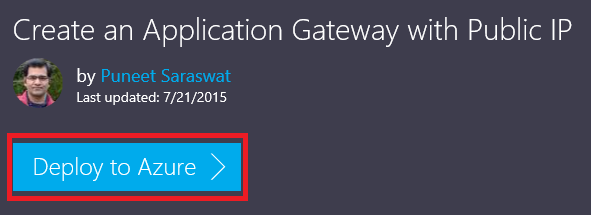

<properties
   pageTitle="使用 Azure 資源管理員範本建立應用程式閘道 |Microsoft Azure"
   description="本頁面提供指示建立 Azure 應用程式閘道使用 Azure 資源管理員範本"
   documentationCenter="na"
   services="application-gateway"
   authors="georgewallace"
   manager="carmonm"
   editor="tysonn"/>
<tags
   ms.service="application-gateway"
   ms.devlang="na"
   ms.topic="article"
   ms.tgt_pltfrm="na"
   ms.workload="infrastructure-services"
   ms.date="10/25/2016"
   ms.author="gwallace"/>

# 使用 Azure 資源管理員範本建立應用程式閘道器

> [AZURE.SELECTOR]
- [Azure 入口網站](application-gateway-create-gateway-portal.md)
- [Azure 資源管理員 PowerShell](application-gateway-create-gateway-arm.md)
- [Azure 傳統 PowerShell](application-gateway-create-gateway.md)
- [Azure 資源管理員範本](application-gateway-create-gateway-arm-template.md)
- [Azure CLI](application-gateway-create-gateway-cli.md)

Azure 應用程式閘道是有 7 層負載平衡器。 是否位於雲端或內部部署，它會提供容錯移轉時，效能路由 HTTP 要求之間不同的伺服器。 應用程式的閘道器提供許多的應用程式傳送控制器 (ADC) 的功能，包括 HTTP 負載平衡、 cookie 為基礎的工作階段相關性、 安全通訊端層 (SSL) 卸載自訂健康探查、 支援多重網站和許多其他。 若要尋找的受支援功能的完整清單，請造訪[應用程式閘道器概觀](application-gateway-introduction.md)

您瞭解如何下載及修改現有的 Azure 資源管理員範本從 GitHub 及部署從 GitHub、 PowerShell 和 Azure CLI 範本。

如果您只部署 Azure 資源管理員範本，直接從 GitHub 不進行任何變更，請跳至部署 GitHub 範本。

## 案例

在這個案例中，您將會︰

- 建立兩個執行個體的應用程式閘道器。
- 建立名為 VirtualNetwork1 10.0.0.0/16 保留 CIDR 區塊的虛擬網路。
- 建立名為其 CIDR 區塊使用 10.0.0.0/28 的 Appgatewaysubnet 子網路。
- 設定兩個先前設定後端 IPs，針對您想要負載平衡網頁伺服器的流量。 範本，在本例後端 IPs 而 10.0.1.10 10.0.1.11。

>[AZURE.NOTE] 這些設定會是此範本的參數。 若要自訂範本，您可以變更規則、 接聽程式，以及開啟 azuredeploy.json SSL。

## 下載並瞭解 Azure 資源管理員範本

您可以下載從 GitHub 建立虛擬網路和兩個子網路，進行任何變更，您可能會想要並重複使用現有的 Azure 資源管理員範本。 若要這麼做，請使用下列步驟︰

1. 瀏覽至[建立應用程式的閘道器](https://github.com/Azure/azure-quickstart-templates/tree/master/101-application-gateway-create)。
2. 按一下 [ **azuredeploy.json**，，然後按一下 [ **RAW**。
3. 在您的電腦上，將檔案儲存至本機資料夾。
4. 如果您熟悉 Azure 資源管理員範本，請跳到步驟 7。
5. 開啟您儲存的檔案，然後查看 [列 5 中的**參數**下的內容。 Azure 資源管理員範本參數提供可以填寫部署期間的值的版面配置區。

  	| 參數 | 描述 |
  	|---|---|
  	| **位置** | Azure 區域建立應用程式閘道器的位置 |
  	| **VirtualNetwork1** | 新的虛擬網路名稱 |
  	| **addressPrefix** | 虛擬網路，CIDR 格式的位址空間 |
  	| **ApplicationGatewaysubnet** | 應用程式的閘道器子網路的名稱 |
  	| **subnetPrefix** | 應用程式的閘道器子網路 CIDR 區塊 |
  	| **skuname** | SKU 執行個體大小 |
  	| **容量** | 執行個體數目 |
  	| **backendaddress1** | 第一個網頁伺服器 IP 位址 |
  	| **backendaddress2** | 第二個網頁伺服器 IP 位址 |

    >[AZURE.IMPORTANT] Azure 資源管理員範本中 GitHub 維持可以變更一段時間。 請確定您使用之前，先檢查範本。

6. 核取 [**資源**] 下的內容，請注意下列動作︰

    - [**類型**]。 範本所建立的資源類型。 在此情況下，則類型為**Microsoft.Network/applicationGateways**，代表應用程式閘道器。
    - **名稱**。 資源名稱。 請注意， **[parameters('applicationGatewayName')]**，這表示的名稱做為輸入您或參數檔案期間所部署使用。
    - [**屬性**]。 資源屬性的清單。 此範本是在應用程式的閘道器建立時使用的虛擬網路及公用的 IP 位址。

7. 瀏覽回[https://github.com/Azure/azure-quickstart-templates/blob/master/101-application-gateway-create/](https://github.com/Azure/azure-quickstart-templates/blob/master/101-application-gateway-create)。
8. 按一下 [ **azuredeploy paremeters.json**，，然後按一下 [ **RAW**。
9. 在您的電腦上，將檔案儲存至本機資料夾。
10. 開啟您儲存的檔案，並編輯參數的值。 您可以使用下列的值來部署案例中所述的應用程式閘道器。

        {
        "$schema": "http://schema.management.azure.com/schemas/2015-01-01/deploymentParameters.json#",
        {
        "location" : {
        "value" : "West US"
        },
        "addressPrefix": {
        "value": "10.0.0.0/16"
        },
        "subnetPrefix": {
        "value": "10.0.0.0/24"
        },
        "skuName": {
        "value": "Standard_Small"
        },
        "capacity": {
        "value": 2
        },
        "backendIpAddress1": {
        "value": "10.0.1.10"
        },
        "backendIpAddress2": {
        "value": "10.0.1.11"
        }
        }

11. 儲存檔案。 您可以使用線上 JSON 驗證工具，例如[JSlint.com](http://www.jslint.com/)測試 JSON 範本與範本參數。

## 部署使用 PowerShell 的 Azure 資源管理員範本

如果您從未使用 PowerShell 的 Azure，請參閱[如何安裝和設定 PowerShell 的 Azure](../powershell-install-configure.md) ，並遵循指示登入 Azure 並選取您的訂閱。

### 步驟 1

    Login-AzureRmAccount

### 步驟 2

核取訂閱的帳戶。

    Get-AzureRmSubscription

系統會提示您的認證以進行驗證。

### 步驟 3

選擇您要使用的 Azure 訂閱。

    Select-AzureRmSubscription -Subscriptionid "GUID of subscription"

### 步驟 4

如有需要請使用**新增 AzureResourceGroup**指令程式來建立資源群組。 在下列範例中，您可以建立可美國位置中名為 AppgatewayRG 資源群組。

    New-AzureRmResourceGroup -Name AppgatewayRG -Location "East US"

**新增 AzureRmResourceGroupDeployment**指令程式來使用上述範本和參數檔案您下載並修改部署新的虛擬網路。

    New-AzureRmResourceGroupDeployment -Name TestAppgatewayDeployment -ResourceGroupName AppgatewayRG `
        -TemplateFile C:\ARM\azuredeploy.json -TemplateParameterFile C:\ARM\azuredeploy-parameters.json

## 使用 Azure CLI 部署 Azure 資源管理員範本

若要部署您下載使用 Azure CLI Azure 資源管理員範本，請遵循下列步驟︰

### 步驟 1

如果您從未使用 Azure CLI，請參閱[安裝及設定 Azure CLI](../xplat-cli-install.md)並遵循指示，選取您的 Azure 帳戶及訂閱為止。

### 步驟 2

執行**azure config 模式**命令以切換到資源管理員模式，如下所示。

    azure config mode arm

以下是預期的輸出上方的命令︰

    info:   New mode is arm

### 步驟 3

如果有需要，請執行**azure 群組建立**命令來建立新的 [資源] 群組中，如下所示。 請注意命令的輸出。 顯示後輸出說明所用的參數的清單。 如需有關資源群組的詳細資訊，請造訪[Azure 資源管理員的概觀](../azure-resource-manager/resource-group-overview.md)。

    azure group create -n appgatewayRG -l eastus

**-n （或--名稱）**。 新的資源群組的的名稱。 我們案例中，則*appgatewayRG*。

**-l （或--位置）**。 Azure 的區域，建立新的資源群組的位置。 我們案例中，則*eastus*。

### 步驟 4

執行**azure 群組部署建立**cmdlet 部署新的虛擬網路使用的範本和參數的檔案您下載並修改上方。 顯示後輸出說明所用的參數的清單。

    azure group deployment create -g appgatewayRG -n TestAppgatewayDeployment -f C:\ARM\azuredeploy.json -e C:\ARM\azuredeploy-parameters.json

## 使用部署按一下部署 Azure 資源管理員範本

按一下 [部署是使用 Azure 資源管理員範本的另一種方法。 很容易地使用 Azure 入口網站中的範本。

### 步驟 1

移至 [[建立公用 IP 應用程式閘道](https://azure.microsoft.com/documentation/templates/101-application-gateway-public-ip/)。

### 步驟 2

按一下 [**部署至 Azure**]。

### 步驟 3

填寫入口網站上的部署範本的參數，然後按一下**[確定**]。

### 步驟 4

選取 [**法律條款**，然後按一下 [**購買**]。

### 步驟 5

在 [自訂部署刀中，按一下 [**建立**]。

## 後續步驟

如果您想要設定 SSL 卸載，請參閱[設定應用程式的閘道 SSL 卸載](application-gateway-ssl.md)。

如果您想要設定為用於內部負載平衡器應用程式閘道器，請參閱[建立內部負載平衡器 (ILB) 應用程式閘道](application-gateway-ilb.md)。

如果您想要深入瞭解一般負載平衡的選項，請造訪︰

- [Azure 負載平衡器](https://azure.microsoft.com/documentation/services/load-balancer/)
- [Azure 流量管理員](https://azure.microsoft.com/documentation/services/traffic-manager/)
