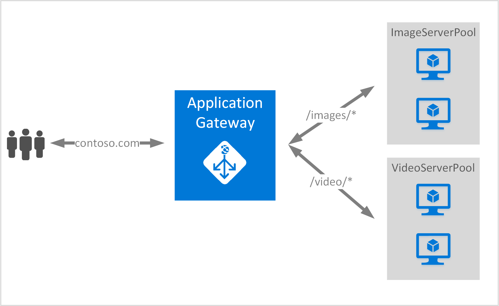

<properties
   pageTitle="建立使用 URL 路由規則使用應用程式閘道 |Microsoft Azure"
   description="本頁面提供指示建立、 設定使用 URL 路由規則 Azure 應用程式閘道器"
   documentationCenter="na"
   services="application-gateway"
   authors="georgewallace"
   manager="jdial"
   editor="tysonn"/>
<tags
   ms.service="application-gateway"
   ms.devlang="na"
   ms.topic="article"
   ms.tgt_pltfrm="na"
   ms.workload="infrastructure-services"
   ms.date="10/25/2016"
   ms.author="gwallace"/>

# 建立使用路徑路由應用程式閘道器 

> [AZURE.SELECTOR]
- [Azure 入口網站](application-gateway-create-url-route-portal.md)
- [Azure 資源管理員 PowerShell](application-gateway-create-url-route-arm-ps.md)

URL 路徑路由，可讓您建立根據 Http 要求的 URL 路徑路由之間的關聯。 它會檢查是否有傳送至 URL 清單，在 [應用程式閘道設定後端資料庫，並網路流量傳送至已定義的後端資料庫。 常用的 URL 為基礎的路由是負載平衡要求的不同的內容類型，以不同的後端伺服器集區。

URL 為基礎的路由至應用程式閘道介紹新規則類型。 應用程式閘道具有兩種規則類型︰ 基本和 PathBasedRouting。 基本規則類型循環為提供服務時 PathBasedRouting 後端資料庫，除了循環通訊群組，也會考慮要求 URL 路徑模式時選擇後端資料庫。

>[AZURE.IMPORTANT] PathPattern︰ 以符合路徑圖樣的清單。 每個必須開始 / 和唯一 」\*」 允許在結尾。 /Xyz /xyz*或 /xyz/*是有效的範例。 送至路徑 matcher 字串後第一個不包含任何文字 」？ 」 或 「 # 」，以及這些字元不允許。 

## 案例
在下列範例中，應用程式的閘道器服務 contoso.com 的流量與兩個後端伺服器集區︰ 視訊 server 集區和圖像 server 集區。

要求 http://contoso.com/image*傳閱圖像 server 資料庫 (pool1)，並 http://contoso.com/video*傳閱視訊 server 集區 (pool2)。 如果路徑圖樣都不相符，已選取預設 server 集區 (pool1)。

## 開始之前

1. 使用 Web 平台安裝程式，安裝最新版 Azure PowerShell cmdlet。 您可以從下載並安裝最新版本的**Windows PowerShell**一節的[下載頁面](https://azure.microsoft.com/downloads/)。
2. 您可以建立的虛擬網路和子網路應用程式的閘道器。 請確認沒有虛擬機器或雲端部署使用子網路。 應用程式閘道器必須是單獨子虛擬網路。
3. 新增至後端資料庫，若要使用的應用程式閘道器的伺服器，必須存在或其結束點建立虛擬網路或公用 IP/VIP 指派。

## 若要建立的應用程式閘道器的必要條件為何？

- **後端伺服器集區︰**後端伺服器 IP 位址清單。 列出的 IP 位址應該是屬於虛擬網路的子網路或應該公用 IP/VIP。
- **後端伺服器資料庫設定︰**每個資料庫有設定，例如連接埠與通訊協定，cookie 為基礎的相關性。 這些設定會連結到資料庫]，就會套用到所有資料庫中的伺服器。
- **前端連接埠︰**此連接埠是開啟應用程式閘道器公用連接埠。 流量碰到此連接埠]，然後會被重新導向至其中一個後端伺服器。
- **接聽︰**接聽具有前端連接埠通訊協定 （Http 或 Https，這些是區分大小寫），以及的 SSL 憑證名稱 （如果設定 SSL 卸載）。
- **規則︰**此規則繫結的後端伺服器集區接聽程式，並定義流量在時叫接聽會導向至的後端伺服器集區。

## 建立應用程式閘道器

使用 Azure 傳統和 Azure 資源管理員之間的差異是您建立的應用程式閘道器的與項目需要設定的順序。

與資源管理員，請使用應用程式閘道的所有項目是個別設定，然後將放在一起，建立應用程式閘道器資源。

若要建立應用程式閘道所需的步驟如下︰

1. 建立資源群組的 [資源管理員。
2. 建立虛擬網路的子網路，與應用程式閘道器的公用 IP。
3. 建立應用程式閘道器組態物件。
4. 建立應用程式閘道器資源。

## 建立資源群組的 [資源管理員

請確認您使用的最新版的 PowerShell 的 Azure。 [使用 Windows PowerShell 與資源管理員](../powershell-azure-resource-manager.md)的詳細資訊。

### 步驟 1

登入 Azure

    Login-AzureRmAccount

系統會提示您的認證以進行驗證。 

### 步驟 2

核取訂閱的帳戶。

    Get-AzureRmSubscription

### 步驟 3

選擇您要使用的 Azure 訂閱。  

    Select-AzureRmSubscription -Subscriptionid "GUID of subscription"

### 步驟 4

建立資源群組 （略過此步驟如果您使用現有的資源群組）。

    New-AzureRmResourceGroup -Name appgw-RG -Location "West US"

或者您也可以建立應用程式的閘道器的資源群組的標記︰
    
    $resourceGroup = New-AzureRmResourceGroup -Name appgw-RG -Location "West US" -Tags @{Name = "testtag"; Value = "Application Gateway URL routing"} 

Azure 資源管理員需要所有資源群組都指定的位置。 這用於做為預設位置的 [資源] 群組中的資源。 請確認所有命令來建立應用程式閘道都使用相同的資源群組。

在上述範例中，我們建立名為 「 appgw 路由 」 和 「 西部美國 」 的位置的資源群組。

>[AZURE.NOTE] 如果您需要設定自訂檢查您的應用程式閘道器，請參閱[建立自訂探查使用 PowerShell 應用程式閘道](application-gateway-create-probe-ps.md)。 查看[自訂探查和健康監視](application-gateway-probe-overview.md)的詳細資訊。

## 建立虛擬網路和應用程式閘道器的子網路

下列範例會示範如何使用資源管理員建立虛擬網路。

### 步驟 1

指定要用來建立虛擬網路的子網路變數地址範圍 10.0.0.0/24。

    $subnet = New-AzureRmVirtualNetworkSubnetConfig -Name subnet01 -AddressPrefix 10.0.0.0/24

### 步驟 2

建立虛擬網路的子網路 10.0.0.0/24 搭配使用前置詞 10.0.0.0/16 西美國地區具名資源群組 」 appgw-路由 」 中的 「 appgwvnet 」。

    $vnet = New-AzureRmVirtualNetwork -Name appgwvnet -ResourceGroupName appgw-RG -Location "West US" -AddressPrefix 10.0.0.0/16 -Subnet $subnet

### 步驟 3

指定子網路變數的下一個步驟中，建立應用程式閘道器。

    $subnet=$vnet.Subnets[0]

## 建立前端設定的公用 IP 位址

建立公用 IP 資源 」 publicIP01 」 資源群組 」 appgw-路由 」 西美國區域中。

    $publicip = New-AzureRmPublicIpAddress -ResourceGroupName appgw-RG -name publicIP01 -location "West US" -AllocationMethod Dynamic

啟動服務的 IP 位址被分派給應用程式閘道器。

## 建立應用程式閘道器組態

設定的所有項目必須先建立應用程式閘道器設定。 下列步驟建立所需的應用程式閘道器資源設定項目。

### 步驟 1

建立名為 「 gatewayIP01 」 應用程式的閘道器 IP 設定。 應用程式閘道啟動時，它會挑選子網路設定中的 IP 位址，並將網路流量路由傳送後端 IP 集區中的 IP 位址。 請記住，每個執行個體需要一個 IP 位址。

    $gipconfig = New-AzureRmApplicationGatewayIPConfiguration -Name gatewayIP01 -Subnet $subnet

### 步驟 2

設定名為 「 pool01 」 和 「 pool2 」 的 IP 位址的後端 IP 位址集區 」 134.170.185.46，134.170.188.221,134.170.185.50 」 的 「 pool1 」 和 「 134.170.186.46，134.170.189.221,134.170.186.50 」 的 「 pool2 」。

    $pool1 = New-AzureRmApplicationGatewayBackendAddressPool -Name pool01 -BackendIPAddresses 134.170.185.46, 134.170.188.221,134.170.185.50

    $pool2 = New-AzureRmApplicationGatewayBackendAddressPool -Name pool02 -BackendIPAddresses 134.170.186.46, 134.170.189.221,134.170.186.50

在此範例中，有兩個後端資料庫，將 URL 路徑基礎網路流量。 集區接收流量的 URL 路徑 」 / 視訊 」 與其他資料庫接收來自路徑流量 」 / 圖像 」。 取代先前的 IP 位址，若要新增您自己的應用程式 IP 位址端點。 

### 步驟 3

設定應用程式閘道器設定 「 poolsetting01 」 和 「 poolsetting02 」 負載平衡網路流量後端資料庫中。 在此範例中，您設定不同的後端資料庫後端資料庫。 每個後端資料庫可以有自己的後端資料庫設定值。

    $poolSetting01 = New-AzureRmApplicationGatewayBackendHttpSettings -Name "besetting01" -Port 80 -Protocol Http -CookieBasedAffinity Disabled -RequestTimeout 120

    $poolSetting02 = New-AzureRmApplicationGatewayBackendHttpSettings -Name "besetting02" -Port 80 -Protocol Http -CookieBasedAffinity Enabled -RequestTimeout 240

### 步驟 4

設定公用 IP 端點前端 IP。

    $fipconfig01 = New-AzureRmApplicationGatewayFrontendIPConfig -Name "frontend1" -PublicIPAddress $publicip

### 步驟 5 

設定應用程式閘道器的前端連接埠。

    $fp01 = New-AzureRmApplicationGatewayFrontendPort -Name "fep01" -Port 80
### 步驟 6

設定接聽程式。 此步驟中設定的公用 IP 位址和連接埠用來接收內送的網路流量的接聽程式。 
 
    $listener = New-AzureRmApplicationGatewayHttpListener -Name "listener01" -Protocol Http -FrontendIPConfiguration $fipconfig01 -FrontendPort $fp01

### 步驟 7 

設定 URL 規則路徑的後端資料庫。 此步驟設定應用程式的閘道器用來定義 URL 路徑和處理的內送的流量指派的後端資料庫之間的對應的相對路徑。

下列範例會建立兩個規則︰ 一個用於 「 / 圖像 / 」 路徑路由流量後端 」 pool1 」 和 「 / 視訊 / 」 路徑路由流量到後端 」 pool2 」 的另一個。
    
    $imagePathRule = New-AzureRmApplicationGatewayPathRuleConfig -Name "pathrule1" -Paths "/image/*" -BackendAddressPool $pool1 -BackendHttpSettings $poolSetting01

    $videoPathRule = New-AzureRmApplicationGatewayPathRuleConfig -Name "pathrule2" -Paths "/video/*" -BackendAddressPool $pool2 -BackendHttpSettings $poolSetting02

如果路徑不符合任何預先定義的路徑規則規則路徑地圖設定也會設定預設位址後端資料庫。 

    $urlPathMap = New-AzureRmApplicationGatewayUrlPathMapConfig -Name "urlpathmap" -PathRules $videoPathRule, $imagePathRule -DefaultBackendAddressPool $pool1 -DefaultBackendHttpSettings $poolSetting02

### 步驟 8

建立規則的設定。 此步驟會設定為使用路由 URL 路徑為基礎的應用程式閘道器。

    $rule01 = New-AzureRmApplicationGatewayRequestRoutingRule -Name "rule1" -RuleType PathBasedRouting -HttpListener $listener -UrlPathMap $urlPathMap

### 步驟 9

設定數執行個體和應用程式閘道器的大小。

    $sku = New-AzureRmApplicationGatewaySku -Name "Standard_Small" -Tier Standard -Capacity 2

## 建立應用程式的閘道器

從先前的步驟的所有設定物件都建立應用程式閘道器。

    $appgw = New-AzureRmApplicationGateway -Name appgwtest -ResourceGroupName appgw-RG -Location "West US" -BackendAddressPools $pool1,$pool2 -BackendHttpSettingsCollection $poolSetting01, $poolSetting02 -FrontendIpConfigurations $fipconfig01 -GatewayIpConfigurations $gipconfig -FrontendPorts $fp01 -HttpListeners $listener -UrlPathMaps $urlPathMap -RequestRoutingRules $rule01 -Sku $sku

## 取得應用程式閘道器 DNS 名稱

閘道器建立後下, 一步是設定通訊前端。 使用時的公用 IP，應用程式閘道需要不是易記的動態指派的 DNS 名稱。 若要確保使用者可以按下應用程式閘道器的 CNAME 記錄可以用來指向應用程式閘道器公用端點。 [設定 Azure 中的自訂網域名稱](../cloud-services/cloud-services-custom-domain-name-portal.md)。 若要這麼做，擷取的應用程式閘道器使用 PublicIPAddress 項目附加到應用程式閘道及其相關聯的 IP/DNS 名稱的詳細資料。 應用程式閘道器的 DNS 名稱應用於建立指向這個 DNS 名稱將兩個 web 應用程式的 CNAME 記錄。 不建議使用 A 記錄，因為 VIP 可能會在重新啟動應用程式的閘道器的變更。
    
    Get-AzureRmPublicIpAddress -ResourceGroupName appgw-RG -Name publicIP01
        
    Name                     : publicIP01
    ResourceGroupName        : appgw-RG
    Location                 : westus
    Id                       : /subscriptions/<subscription_id>/resourceGroups/appgw-RG/providers/Microsoft.Network/publicIPAddresses/publicIP01
    Etag                     : W/"00000d5b-54ed-4907-bae8-99bd5766d0e5"
    ResourceGuid             : 00000000-0000-0000-0000-000000000000
    ProvisioningState        : Succeeded
    Tags                     : 
    PublicIpAllocationMethod : Dynamic
    IpAddress                : xx.xx.xxx.xx
    PublicIpAddressVersion   : IPv4
    IdleTimeoutInMinutes     : 4
    IpConfiguration          : {
                                 "Id": "/subscriptions/<subscription_id>/resourceGroups/appgw-RG/providers/Microsoft.Network/applicationGateways/appgwtest/frontendIP
                               Configurations/frontend1"
                               }
    DnsSettings              : {
                                 "Fqdn": "00000000-0000-xxxx-xxxx-xxxxxxxxxxxx.cloudapp.net"
                               }

## 後續步驟

如果您想要進一步瞭解安全通訊端層 (SSL) 卸載，請參閱[設定應用程式的閘道 SSL 卸載](application-gateway-ssl-arm.md)。