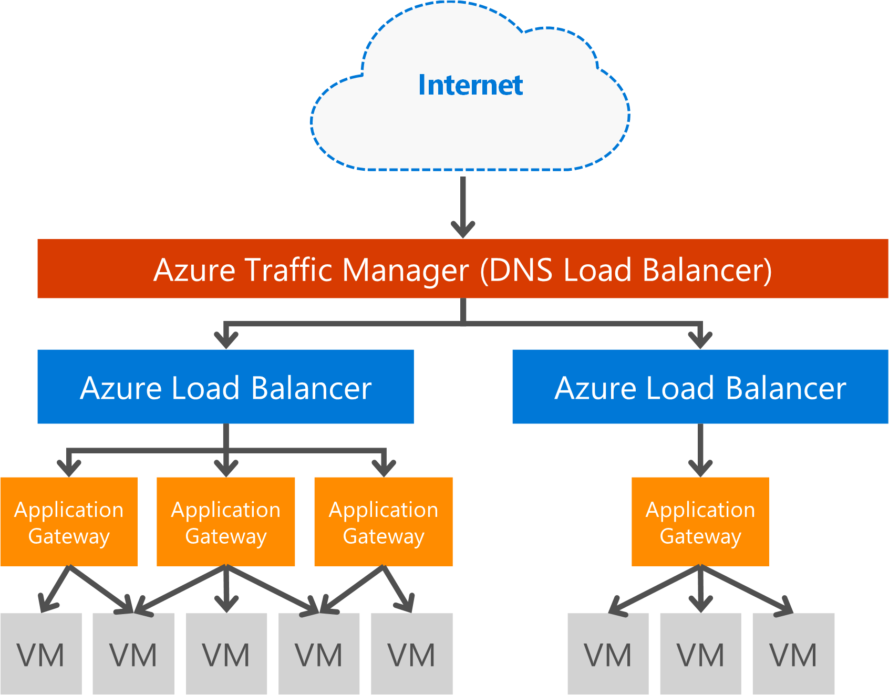

<properties
   pageTitle="應用程式閘道簡介 |Microsoft Azure"
   description="此頁面將概略說明應用程式的閘道器服務負載平衡圖層 7，包括閘道器大小、 HTTP 負載平衡、 cookie 為基礎的工作階段相關性和 SSL 卸載。"
   documentationCenter="na"
   services="application-gateway"
   authors="georgewallace"
   manager="carmonm"
   editor="tysonn"/>
<tags
   ms.service="application-gateway"
   ms.devlang="na"
   ms.topic="hero-article"
   ms.tgt_pltfrm="na"
   ms.workload="infrastructure-services"
   ms.date="10/25/2016"
   ms.author="gwallace"/>

# 應用程式閘道器概觀

## 什麼是應用程式的閘道器

Microsoft Azure 應用程式的閘道器提供應用程式傳送控制器 (ADC) 為服務，提供各種不同的圖層 7 負載平衡應用程式的功能。 讓客戶的應用程式閘道 CPU 大量 SSL 終止最佳化網頁伺服器陣列生產力。 同時也會提供其他圖層 7 路由功能包括連入流量的循環分配的 cookie 工作階段相關性、 URL 路徑基礎路由和主控前一個應用程式閘道器的多個網站的能力。 應用程式的閘道器也有 web 應用程式防火牆 (WAF) 來保護您的應用程式，針對大部分的 OWASP 前 10 個常見網頁的弱點。 應用程式的閘道器可以設定為網際網路具閘道、 內部只閘道或兩者的組合。 應用程式的閘道器已完全 Azure 管理，可調整和高度可用。 它會提供更佳的管理能力的豐富的診斷和記錄功能。 應用程式的閘道器可用於虛擬機器、 雲端服務和內部或外部具 web 應用程式。

應用程式閘道專用的虛擬應用裝置應用程式並分成多個延展性和可用性的工作者執行個體。 當您建立的應用程式閘道時，端點 （公用 VIP 或內部 ILB IP） 相關聯，並用於輸入網路流量。 此 VIP 或 ILB IP 提供 Azure 負載平衡器工作傳輸層級 (TCP/UDP)，而且無法負載平衡應用程式閘道工作者執行個體的所有內送網路流量。 應用程式的閘道器 [HTTP/HTTPS 流量根據其組態是否虛擬機器，而雲端服務，內部或外部 IP 位址。 針對 SLA 和價格，請參閱 [ [SLA](https://azure.microsoft.com/support/legal/sla/)與[價格](https://azure.microsoft.com/pricing/details/application-gateway/)] 頁面。

## 功能

應用程式的閘道器目前支援下列功能的圖層 7 應用程式傳送︰

- **[Web 應用程式防火牆 （預覽版本）](application-gateway-webapplicationfirewall-overview.md)** Azure 應用程式的閘道器的 web 應用程式防火牆 (WAF) 會從網頁的一般攻擊，例如 SQL 插入、 跨網站指令碼攻擊和工作階段倘若保護 web 應用程式。
- **HTTP 負載平衡**應用程式的閘道器提供循環負載平衡。 負載平衡在圖層 7，並用於僅 HTTP (S) 的流量。
- **Cookie 為基礎的工作階段相關性**這項功能時，您想要在相同的後端上保留使用者工作階段。 藉由使用受管理的閘道器 cookie，應用程式閘道器無法將相同的處理後端使用者工作階段從後續流量導向。 這項功能很重要的工作階段狀態儲存在本機的後端伺服器使用者工作階段的情況。
- **[安全通訊端層 (SSL) 卸載](application-gateway-ssl-arm.md)**-這項功能需要解密 HTTPS 關閉您的網頁伺服器的流量昂貴的工作。 在應用程式閘道 SSL 連線並轉接伺服器未加密的要求，是由解密 unburdened 網頁伺服器。  應用程式閘道重新加密回應，然後再傳送以用戶端。 此功能的情況下後端位於相同安全虛擬的網路應用程式閘道器 Azure 中的位置。
- **[端對端 SSL](application-gateway-backend-ssl.md)**應用程式閘道支援資料傳輸的端對端的加密。 應用程式的閘道器會在應用程式閘道 SSL 連線。 閘道器適用於流量路由規則、 重新加密封包，然後轉送至適當的後端根據所定義的路由規則封包。 網頁伺服器的任何回應會回到使用者經歷的相同程序。
- **[URL 型傳閱內容以](application-gateway-url-route-overview.md)**-這項功能提供這項功能可以使用不同的後端伺服器不同的流量。 網頁伺服器上的資料夾或 cdn 到底流量可以路由至不同後端，減少不需要的負載不提供特定內容的 backends。
- **[多網站路由](application-gateway-multi-site-overview.md)**-閘道器可讓您可以在單一應用程式的閘道器的 20 網站最合併彙算的應用程式。
- **[Websocket 支援](application-gateway-websocket.md)**-另一個很棒的應用程式閘道功能是 Websocket 原生支援。
- **[健康監視](application-gateway-probe-overview.md)**的應用程式的閘道器提供預設狀況後端資源的監控和自訂探查監控更具體的案例。

## 優點

應用程式的閘道器是很適合用於︰

- 需要達到相同的後端虛擬機器相同的使用者/用戶端工作階段要求的應用程式。 購物車應用程式與 web 電子郵件伺服器，便購物這些應用程式的範例。
- 要開放 SSL 終止開銷從網頁伺服器陣列的應用程式。
- 需要多個路由傳送或載入的相同長 TCP 連接 HTTP 要求平衡到不同的後端伺服器應用程式，例如內容傳遞網路。
- 支援 websocket 流量的應用程式
- 常見的 web 式攻擊保護 web 應用程式，例如 SQL 注入、 跨網站指令碼攻擊及倘若工作階段。

應用程式閘道負載平衡 Azure 受管理的服務允許的圖層 7 負載平衡器前 Azure 軟體負載平衡器佈建。 流量管理員可以用來完成此案例，如下圖所示。 流量管理員提供重新導向] 和 [可用性，負載平衡器提供地區延展性和顯示狀態，並應用程式的閘道器提供交叉區域圖層 7 負載平衡。

[AZURE.INCLUDE [load-balancer-compare-tm-ag-lb-include.md](../../includes/load-balancer-compare-tm-ag-lb-include.md)]

## 閘道器大小和執行個體

應用程式的閘道器目前提供三種大小︰ 小型、 中型企業版和大。 小型的執行個體大小是針對開發和測試案例。

目前有兩種應用程式的閘道器的 sku: WAF 及 [標準]。

您可以建立最多 50 應用程式閘道器，每個訂閱，而且每個應用程式閘道器能最多 10 個執行個體。 每個應用程式閘道器的最多可以包含 20 http 接聽程式。 應用程式閘道器限制的完整清單，請造訪[服務限制](../azure-subscription-service-limits.md#application-gateway)頁面。

下表顯示每個應用程式閘道執行個體平均效能處理能力︰

| 後端頁面回應 | 小型 | 媒體 | 大型|
|---|---|---|---|
| 6 K | 7.5 Mbps | 13 Mbps | 50 Mbps |
|100 K | 35 Mbps | 100 Mbps| 200 Mbps |

>[AZURE.NOTE] 這些值是大約應用程式的閘道器處理量值。 實際處理量取決於各種環境詳細資料，例如 average 頁面大小] 後端執行個體及處理時間服務頁面的位置。 完全效能的數字，您應該執行您自己的測試，這些值僅可用於容量規劃指南。

## 監控健康狀況

Azure 應用程式閘道器會自動監視透過基本的後端執行個體的狀況，或自訂健康探查。 藉由使用狀況探查，這可確保只有健全主機回應流量。 如需詳細資訊，請參閱[應用程式閘道狀況監控概觀](application-gateway-probe-overview.md)。

## 設定及管理

其端點，應用程式的閘道器可以有的公用 IP、 私人 IP，或兩者時已設定。 設定應用程式的閘道內自己子網路中的虛擬網路。 建立或使用應用程式的閘道器的子網路不能包含任何其他類型的資源，只資源所允許子網路中的其他應用程式閘道器。 若要保護您的後端資源後端伺服器可以包含在不同的子網路中相同的虛擬網路應用程式閘道器。 它不需要的後端應用程式中，只要應用程式閘道器的 ip 位址連絡其他子網路，應用程式的閘道器都能提供的後端伺服器 ADC 功能。

您可以建立並使用 REST Api、 PowerShell cmdlet、 Azure CLI 或[Azure 入口網站](https://portal.azure.com/)管理應用程式閘道器。

## 後續步驟

學習如何應用程式的閘道器之後, 您可以[建立應用程式閘道器](application-gateway-create-gateway-portal.md)或您可以[建立 SSL 卸載應用程式閘道器](application-gateway-ssl-arm.md)的負載平衡 HTTPS 連線。

若要瞭解如何建立使用 URL 型傳閱內容以應用程式閘道器，移至[建立使用 URL 為基礎的路由應用程式閘道器](application-gateway-create-url-route-arm-ps.md)的詳細資訊。

