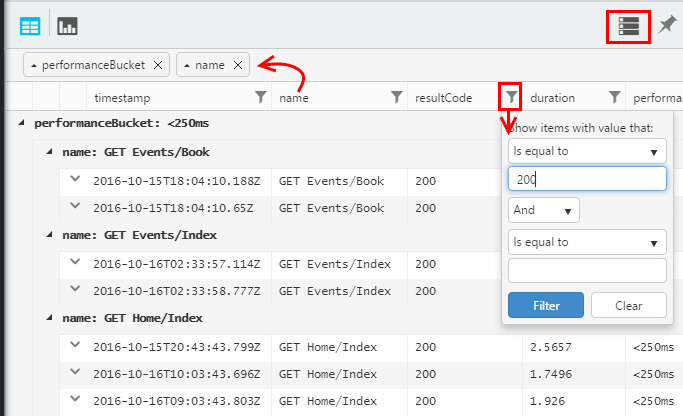
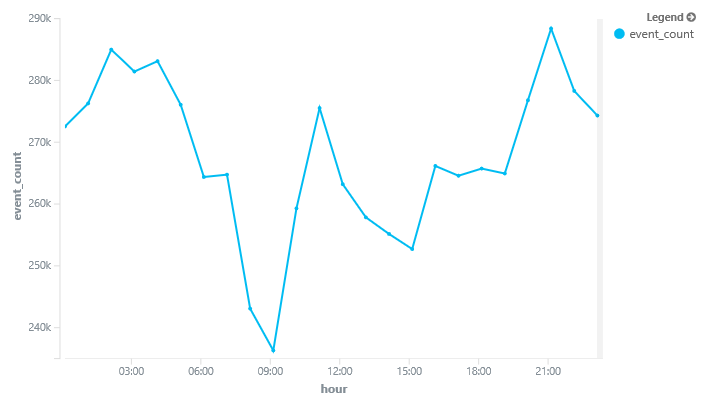
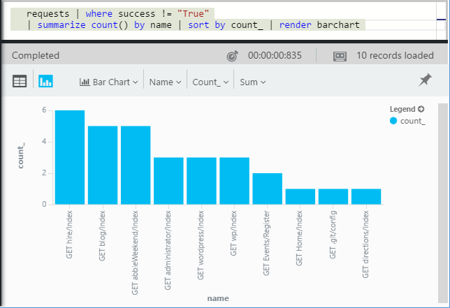
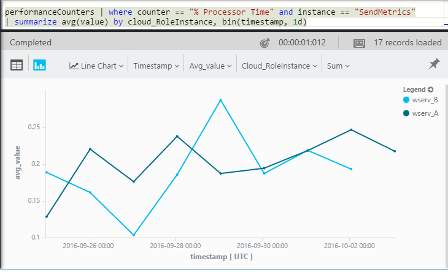

<properties 
    pageTitle="在應用程式的深入見解透過分析導覽 |Microsoft Azure" 
    description="簡短的分析，應用程式的深入見解的強大的搜尋工具中的所有主查詢範例。" 
    services="application-insights" 
    documentationCenter=""
    authors="alancameronwills" 
    manager="douge"/>

<tags 
    ms.service="application-insights" 
    ms.workload="tbd" 
    ms.tgt_pltfrm="ibiza" 
    ms.devlang="na" 
    ms.topic="article" 
    ms.date="10/15/2016" 
    ms.author="awills"/>


 
# <a name="a-tour-of-analytics-in-application-insights"></a>在 [應用程式的深入見解導覽的狀況分析


[分析](app-insights-analytics.md)是[應用程式的深入見解](app-insights-overview.md)的強大的搜尋功能。 這些頁面會說明分析查詢 lanquage。


* **[觀看簡介影片](https://applicationanalytics-media.azureedge.net/home_page_video.mp4)**。
* **[測試磁碟機上我們模擬的資料分析](https://analytics.applicationinsights.io/demo)**如果您的應用程式未傳送資料至應用程式的深入見解尚未。


讓我們逐步協助您入門的一些基本查詢。

## <a name="connect-to-your-application-insights-data"></a>連線到您的應用程式的深入見解資料

開啟您的應用程式中的應用程式的深入見解[概觀刀](app-insights-dashboards.md)分析︰

![開啟 portal.azure.com，開啟您的應用程式的深入見解的資源，然後按一下 [分析]。](./media/app-insights-analytics-tour/001.png)

    
## <a name="takeapp-insights-analytics-referencemdtake-operator-show-me-n-rows"></a>[採取](app-insights-analytics-reference.md#take-operator)︰ 顯示哪些資訊 n 個資料列

登入使用者作業 （通常是 HTTP 要求收到您的 web 應用程式） 的資料點會儲存在名為資料表`requests`。 每個資料列是從應用程式的深入見解 SDK 應用程式中收到的遙測資料點。

現在就讓我們先檢查幾個範例資料列的資料表︰


> [AZURE.NOTE] 將游標放在陳述式中，再按一下 [執行。 您可以在多個線條，分割的陳述式，但不將空白的行陳述式。 空白的行會保留在視窗中的數種不同的查詢方便的方式。


選取的欄位，將它們，[群組依據欄中，拖曳及篩選︰ 




展開以查看詳細資料的任何項目︰
 
![選擇 [表格]，然後使用設定資料行](./media/app-insights-analytics-tour/040.png)

> [AZURE.NOTE] 按一下 [標頭的資料行以重新排列在網頁瀏覽器中使用的結果。 但是請注意，大型結果集，下載至瀏覽器的資料列的數字是有限。 排序這種方式不會永遠顯示您的實際的最高或最低項目。 若要可靠的方式排序項目，請使用`top`或`sort`運算子。 

## <a name="topapp-insights-analytics-referencemdtop-operator-and-sortapp-insights-analytics-referencemdsort-operator"></a>[頂端](app-insights-analytics-reference.md#top-operator)和[排序](app-insights-analytics-reference.md#sort-operator)

`take`很有用快速範例的結果，但沒有顯示任何特定順序排列的資料表資料列。 若要排序的檢視，使用`top`（適用於樣本） 或`sort`（在整個表格中）。

顯示第 n 個資料列，以特定的資料行排序︰

```AIQL

    requests | top 10 by timestamp desc 
```

* *語法︰*大部分的運算子有關鍵字參數例如`by`。
* `desc`= 遞減順序， `asc` = 遞增。


`top...`更多的效能方法說的`sort ... | take...`。 我們可能已撰寫︰

```AIQL

    requests | sort by timestamp desc | take 10
```

結果就會相同，但它會以執行更速度緩慢。 (您也可以撰寫`order`，這是的別名`sort`。)

欄標題的表格檢視中也可以用於排序在螢幕上的結果。 但是當然，如果您已使用`take`或`top`以擷取特定部分的表格，您會只重新排列您所擷取的記錄。


## <a name="projectapp-insights-analytics-referencemdproject-operator-select-rename-and-compute-columns"></a>[專案](app-insights-analytics-reference.md#project-operator)︰ 選取 [重新命名與計算資料行

使用[`project`](app-insights-analytics-reference.md#project-operator)來挑選您想要的欄︰

```AIQL

    requests | top 10 by timestamp desc
             | project timestamp, name, resultCode
```


您也可以重新命名資料行，並定義新的文件︰

```AIQL

    requests 
  	| top 10 by timestamp desc 
  	| project  
            name, 
            response = resultCode,
            timestamp, 
            ['time of day'] = floor(timestamp % 1d, 1s)
```


* [資料行名稱](app-insights-analytics-reference.md#names)可以包含空格，或如果他們帶有括號符號像這樣︰`['...']`或`["..."]`
* `%`為主要的餘數運算子。 
* `1d`(這是一個數字，然後透過 「) 時段常值表示一天。 以下是一些詳細的時段常值︰ `12h`， `30m`， `10s`， `0.01s`。
* `floor`(別名`bin`) 將無條件捨位至最接近您所提供的基底值的值。 因此`floor(aTime, 1s)`將無條件捨位至最接近的第二個時間。

[運算式](app-insights-analytics-reference.md#scalars)可以包含所有的主要運算子 (`+`， `-`，...)，還有實用的函數的範圍。

    

## <a name="extendapp-insights-analytics-referencemdextend-operator-compute-columns"></a>[延長](app-insights-analytics-reference.md#extend-operator)︰ 計算資料行

如果您只是要將欄新增至現有的使用[`extend`](app-insights-analytics-reference.md#extend-operator):

```AIQL

    requests 
  	| top 10 by timestamp desc
  	| extend timeOfDay = floor(timestamp % 1d, 1s)
```

使用[`extend`](app-insights-analytics-reference.md#extend-operator)是比[`project`](app-insights-analytics-reference.md#project-operator)如果您想要保留現有的資料行。


## <a name="summarizeapp-insights-analytics-referencemdsummarize-operator-aggregate-groups-of-rows"></a>[摘要](app-insights-analytics-reference.md#summarize-operator)︰ 彙總的資料列的群組

`Summarize`適用於指定的*彙總函數*，在群組的資料列。 

您的 web 應用程式回覆邀請所花的時間] 欄位中的報告，例如`duration`。 讓我們來查看所有要求的平均回應時間︰


或我們無法分成不同名稱的邀請中的結果︰


`Summarize`收集資料流中的資料點的群組`by`子句評估平均。 在每個值`by`運算式-上面範例中每個作業名稱-產生結果資料表中的資料列。 

或我們無法以一天的時間分組結果︰


請注意，我們要使用`bin`函數 (又稱`floor`)。 如果我們使用`by timestamp`，每輸入一列會得到小群組中。 任何連續的純量，例如時間或數字，我們有連續的範圍分成可管理的數字的不連續的值，並`bin`-已其實熟悉四捨五入向`floor`函數-是進行簡單的方法。

我們可以使用相同技巧來減少的字串的範圍︰


請注意，您可以使用`name=`設定彙總運算式或 by 子句的結果資料行的名稱。

## <a name="counting-sampled-data"></a>計算取樣資料

`sum(itemCount)`是建議的彙總，來計算事件。 在許多情況下，itemCount = = 1，所以函數只會計算] 群組中的資料列數目。 但作業[取樣](app-insights-sampling.md)時，只有原始事件部分會保留為應用程式的深入見解中資料點，讓您看到各資料點，有`itemCount`事件。 

例如，如果取樣捨棄 75%的原始的事件，然後 itemCount = = 4 保留記錄-中也就是每個保留記錄沒有原始的四筆記錄。 

調整取樣會使 itemCount 為較高期間當您的應用程式正在重度使用。

ItemCount 彙總，因此可讓做好完善的評估的原始的數字的事件。


此外，還有`count()`彙總 （並計算作業），當您真的執行要計算] 群組中的資料列數目。


有[彙總函式](app-insights-analytics-reference.md#aggregations)的範圍。


## <a name="charting-the-results"></a>圖表的結果


```AIQL

    exceptions 
       | summarize count()  
         by bin(timestamp, 1d)
```

根據預設，結果會顯示為表格︰


我們如何比在表格檢視。 讓我們來看圖表檢視中的結果，與垂直列選項︰


請注意，雖然我們未排序結果的時間 （如 [表格顯示）、 圖表顯示永遠顯示固定的順序正確無誤。


## <a name="whereapp-insights-analytics-referencemdwhere-operator-filtering-on-a-condition"></a>[位置](app-insights-analytics-reference.md#where-operator)︰ 篩選條件

如果您已設定應用程式的深入見解監視的應用程式的[用戶端](app-insights-javascript.md)和伺服器邊，遙測資料庫中的某些來自瀏覽器中。

我們來看看只從瀏覽器報告的例外狀況︰

```AIQL

    exceptions 
  	| where client_Type == "Browser" 
  	|  summarize count() 
       by client_Browser, outerMessage 
```


`where`運算子會使用的布林運算式。 以下是一些相關的要點︰

 * `and``or`︰ 布林值運算子
 * `==``<>` ︰ 等於和不等於
 * `=~``!=` ︰ 不區分大小寫的字串，等於和不等於。 有很多個字串比較運算子。

所有瞭解[純量運算式](app-insights-analytics-reference.md#scalars)。

### <a name="filtering-events"></a>篩選事件

尋找失敗的要求︰

```AIQL

    requests 
  	| where isnotempty(resultCode) and toint(resultCode) >= 400
```

`responseCode`會有字串類型，因此我們必須[將它轉換](app-insights-analytics-reference.md#casts)數值的比較。

摘要總結不同的回應︰

```AIQL

    requests
  	| where isnotempty(resultCode) and toint(resultCode) >= 400
  	| summarize count() 
      by resultCode
```

## <a name="timecharts"></a>Timecharts

顯示有多少事件每日︰

```AIQL

    requests
      | summarize event_count=count()
        by bin(timestamp, 1d)
```

選取圖表的顯示選項︰


## <a name="multiple-series"></a>多個數列 

在多個運算式`summarize`建立多個資料行。

在多個運算式`by`子句會建立多個資料列，一個用於每個值的組合。


```AIQL

    requests
  	| summarize count(), avg(duration) 
      by bin(timestamp, 1d), client_StateOrProvince, client_City 
  	| order by timestamp asc, client_StateOrProvince, client_City
```


### <a name="segment-a-chart-by-dimensions"></a>由維度區段圖表

如果您的圖表有字串資料行和數字的資料行的資料表，字串可以用於數字的資料分成個別的一系列的點。 如果有多個字串資料行，您可以選擇要作為區分字元的欄。 


### <a name="display-multiple-metrics"></a>顯示多個指標

如果您的圖表表格的多個數值資料行，除了時間戳記，您可以顯示任何的組合。


您必須先選取不分割，然後您可以為顯示多個數值的資料行同時選取多個數值資料行，就無法分割字串資料行。 


## <a name="daily-average-cycle"></a>每日平均循環圖

如何會使用隨每天平均？

計算要求的時間，一天，模數 binned 將小時︰

```AIQL

    requests
  	| extend hour = floor(timestamp % 1d , 1h) 
          + datetime("2016-01-01")
  	| summarize event_count=count() by hour
```



>[AZURE.NOTE] 請注意，我們目前需要將時間工期轉換成日期時間，才能顯示在圖表。


## <a name="compare-multiple-daily-series"></a>比較多個每日的數列

如何會使用隨一天的時間不同國家/地區中？

```AIQL

 requests  | where tostring(operation_SyntheticSource)
     | extend hour= floor( timestamp % 1d , 1h)
           + datetime("2001-01-01")
     | summarize event_count=count() 
       by hour, client_CountryOrRegion 
     | render timechart
```


## <a name="plot-a-distribution"></a>繪製分配

還有多少工作階段長度不同？

```AIQL

    requests 
  	| where isnotnull(session_Id) and isnotempty(session_Id) 
  	| summarize min(timestamp), max(timestamp) 
      by session_Id 
  	| extend sessionDuration = max_timestamp - min_timestamp 
  	| where sessionDuration > 1s and sessionDuration < 3m 
  	| summarize count() by floor(sessionDuration, 3s) 
  	| project d = sessionDuration + datetime("2016-01-01"), count_
```

最後一行，才能將轉換成日期時間。 目前 x 軸的圖表會顯示為純量，才日期時間。

`where`子句排除簡單的工作階段 (sessionDuration = = 0)，並設定 x 軸的長度。


## <a name="percentilesapp-insights-analytics-referencemdpercentiles"></a>[百分位數](app-insights-analytics-reference.md#percentiles)

哪些範圍中的工期涵蓋不同百分比的工作階段？

使用上述查詢，但取代最後一行︰

```AIQL

    requests 
  	| where isnotnull(session_Id) and isnotempty(session_Id) 
  	| summarize min(timestamp), max(timestamp) 
      by session_Id 
  	| extend sesh = max_timestamp - min_timestamp 
  	| where sesh > 1s
  	| summarize count() by floor(sesh, 3s) 
  	| summarize percentiles(sesh, 5, 20, 50, 80, 95)
```

我們也移除上限在 where 子句，以取得正確的圖表，包括所有的工作階段與一個以上的要求︰


從我們可以看到的︰

* 5%的工作階段的工期都是 3 分鐘 34s; 
* 50%的工作階段最後小於 36 minnutes;
* 5%的工作階段最後超過 7 天

每個國家/地區，我們只需要將取得不同的分解 client_CountryOrRegion 欄分別兩者摘要運算子︰

```AIQL

    requests 
  	| where isnotnull(session_Id) and isnotempty(session_Id) 
  	| summarize min(timestamp), max(timestamp) 
      by session_Id, client_CountryOrRegion
  	| extend sesh = max_timestamp - min_timestamp 
  	| where sesh > 1s
  	| summarize count() by floor(sesh, 3s), client_CountryOrRegion
  	| summarize percentiles(sesh, 5, 20, 50, 80, 95)
      by client_CountryOrRegion
```


## <a name="joinapp-insights-analytics-referencemdjoin"></a>[加入](app-insights-analytics-reference.md#join)

我們可以存取多個資料表，包括要求和例外狀況。

若要尋找的例外狀況相關的要求，傳回失敗的回應，我們可以連結資料表的`session_Id`:

```AIQL

    requests 
  	| where toint(responseCode) >= 500 
  	| join (exceptions) on operation_Id 
  	| take 30
```


最好使用`project`以選取 [只需要之前執行聯結的資料行。
在同一個子句中，我們已重新命名時間戳記資料行。


## <a name="letapp-insights-analytics-referencemdlet-clause-assign-a-result-to-a-variable"></a>[讓](app-insights-analytics-reference.md#let-clause)︰ 指派給變數的結果

使用[讓](./app-insights-analytics-reference.md#let-statements)來分隔的部分的上一個運算式。 結果並不會變更︰

```AIQL

    let bad_requests = 
      requests
        | where  toint(resultCode) >= 500  ;
    bad_requests
  	| join (exceptions) on session_Id 
  	| take 30
```

> 提示︰ 在分析資料的用戶端，不將空白的行之間的部分。 請務必執行所有它。


## <a name="accessing-nested-objects"></a>存取巢狀的物件

您可以輕鬆地存取巢狀的物件。 例如，例外資料流中，您會看到結構化的物件，像這樣︰


您可以選擇您感興趣的屬性來簡它維設定︰

```AIQL

    exceptions | take 10
  	| extend method1 = tostring(details[0].parsedStack[1].method)
```

請注意，您需要使用[轉換](app-insights-analytics-reference.md#casts)成適當的類型。

## <a name="custom-properties-and-measurements"></a>自訂屬性和度量單位

如果您的應用程式將[自訂尺寸 （內容） 與自訂測量](app-insights-api-custom-events-metrics.md#properties)附加至事件，然後您會看到這些中`customDimensions`和`customMeasurements`物件。


例如，如果您的應用程式中包含︰

```C#

    var dimensions = new Dictionary<string, string> 
                     {{"p1", "v1"},{"p2", "v2"}};
    var measurements = new Dictionary<string, double>
                     {{"m1", 42.0}, {"m2", 43.2}};
    telemetryClient.TrackEvent("myEvent", dimensions, measurements);
```

若要擷取分析下列值︰

```AIQL

    customEvents
  	| extend p1 = customDimensions.p1, 
      m1 = todouble(customMeasurements.m1) // cast to expected type

``` 

## <a name="tables"></a>表格

從您的應用程式收到資料流是遙測的透過數個資料表。 可用的每個資料表的屬性的結構描述會顯示在左邊的視窗。

### <a name="requests-table"></a>要求資料表

您的 web 應用程式和 「 」 區段的頁面名稱計數 HTTP 要求︰


尋找失敗大部分的要求︰



### <a name="custom-events-table"></a>自訂事件表格

如果您使用[TrackEvent()](app-insights-api-custom-events-metrics.md#track-event)傳送您自己的事件，也可以從這個資料表閱讀。 

讓我們來看範例程式的應用程式碼其中包含下列行︰

```C#

    telemetry.TrackEvent("Query", 
       new Dictionary<string,string> {{"query", sqlCmd}},
       new Dictionary<string,double> {
           {"retry", retryCount},
           {"querytime", totalTime}})
```

顯示事件的頻率︰
 


擷取度量單位和維度的事件︰


### <a name="custom-metrics-table"></a>自訂指標表格

如果您使用[TrackMetric()](app-insights-api-custom-events-metrics.md#track-metric)傳送您的度量值，您會看到其結果**customMetrics**資料流中。 例如︰  


> [AZURE.NOTE] [指標檔案總管](app-insights-metrics-explorer.md)] 中所有自訂的度量單位，附加至任何類型的遙測會同時出現在使用所傳送的指標以及指標刀`TrackMetric()`。 但中分析，自訂的度量單位仍附加至何種類型的遙測已在的事件或要求等-中執行，而 TrackMetric 所傳送的指標出現在自己的資料流。

### <a name="performance-counters-table"></a>效能計數器表格

[效能計數器](app-insights-performance-counters.md)顯示應用程式，例如 CPU、 記憶體和網路使用的基本系統的指標。 您可以設定傳送其他計數器，包括自己的自訂計數器 SDK。

**PerformanceCounters**結構描述公開`category`，`counter`名稱，然後`instance`各個效能計數器的名稱。 [計數器執行個體名稱只適用於部分效能計數器，，通常表示計數與相關的程序的名稱。 在每個應用程式遙測，您會看到該應用程式的計數器。 例如，若要查看哪些計數器有︰ 


若要取得可用的記憶體圖表最近的期間︰ 


其他遙測，例如**performanceCounters**也有一個資料行`cloud_RoleInstance`，表示主機上用您的應用程式正在執行的身分識別。 例如，若要比較不同的電腦上的應用程式的效能︰ 




### <a name="exceptions-table"></a>例外狀況表格

[例外狀況報告您的應用程式](app-insights-asp-net-exceptions.md)，可在此表格中。 

若要尋找您的應用程式時引發例外狀況處理 HTTP 要求，請在 operation_Id 上加入︰


### <a name="browser-timings-table"></a>在瀏覽器時間表格

`browserTimings`顯示使用者的瀏覽器中收集的頁面載入資料。

[設定您的應用程式的用戶端遙測](app-insights-javascript.md)，請參閱下列指標。 

結構描述中有[指標指出不同階段的 [載入程序] 頁面的長度](app-insights-javascript.md#page-load-performance)。 （不表示您的使用者閱讀頁面的時間長度。）  

顯示不同的頁面的 popularities 並載入時間的每一個頁面︰


### <a name="availbility-results-table"></a>Availbility 結果表格

`availabilityResults`顯示的[web 測試](app-insights-monitor-web-app-availability.md)結果。 每次執行您測試的每個測試位置會分別報告。 


### <a name="dependencies-table"></a>相依性表格

包含打電話資料庫及 REST Api，對您的應用程式，以及其他呼叫 TrackDependency() 的結果。

### <a name="traces-table"></a>追蹤表

包含傳送您的應用程式使用 TrackTrace() 或[其他記錄架構](app-insights-asp-net-trace-logs.md)遙測。

## <a name="dashboards"></a>儀表板

若要將所有您最重要的圖表和表格，您可以固定的儀表板結果。

* [Azure 共用儀表板](app-insights-dashboards.md#share-dashboards)︰ 按一下圖釘圖示。 這麼做之前，您必須在共用儀表板。 在 Azure 入口網站，開啟或建立儀表板，然後按一下 [共用]。
* [Power BI 儀表板](app-insights-export-power-bi.md)︰ 按一下 [匯出]、 [Power BI 查詢。 此替代的優點是，您可以顯示您同時其他從廣泛的結果來源的查詢。


## <a name="next-steps"></a>後續步驟

* [分析語言參考](app-insights-analytics-reference.md)

[AZURE.INCLUDE [app-insights-analytics-footer](../../includes/app-insights-analytics-footer.md)]


