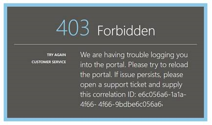
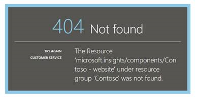

<properties 
    pageTitle="疑難排解分析-的應用程式的深入見解的強大的搜尋工具 |Microsoft Azure" 
    description="使用應用程式的深入見解分析時遇到問題？ 從這裡開始。 " 
    services="application-insights" 
    documentationCenter=""
    authors="alancameronwills" 
    manager="douge"/>

<tags 
    ms.service="application-insights" 
    ms.workload="tbd" 
    ms.tgt_pltfrm="ibiza" 
    ms.devlang="na" 
    ms.topic="article" 
    ms.date="07/11/2016" 
    ms.author="awills"/>

# 疑難排解在應用程式的深入見解的狀況分析

使用[應用程式的深入見解分析](app-insights-analytics.md)時遇到問題？ 從這裡開始。 分析是強大的搜尋工具的 Visual Studio 應用程式獲得深入見解。

## 限制

* 在簡報，查詢結果限於只超過一週之前的資料。
* 我們測試的瀏覽器︰ 最新版本的 Chrome、 邊緣和 Internet Explorer。

## 已知不相容的瀏覽器副檔名

* Ghostery

停用的分機號碼，或使用不同的瀏覽器。

##「 意外的錯誤 」

![意外的錯誤] 畫面](./media/app-insights-analytics-troubleshooting/010.png)

在入口網站執行階段 – 處理的例外狀況發生內部錯誤。

* 清除瀏覽器快取。 

## 403...請嘗試重新載入

驗證相關 （驗證或期間存取權杖代），會發生錯誤。 入口網站可能無法復原，而不變更瀏覽器設定。

* 確認 [在瀏覽器中的 [[啟用第三方 cookie](#cookies) ]。 

## 403...驗證安全性區域

驗證相關 （驗證或期間存取權杖代），會發生錯誤。 入口網站可能無法復原，而不變更瀏覽器設定。

1. 確認 [在瀏覽器中的 [[啟用第三方 cookie](#cookies) ]。 

2. 是否以開啟 [分析] 入口網站使用的最愛項目，書籤或已儲存的連結？ 您登入您儲存該連結時，使用不同的認證嗎？

2. 請嘗試使用私人/incognito 瀏覽器視窗 （後，關閉所有這類視窗）。 您必須提供您的認證。 

2. 開啟另一個 （一般） 的瀏覽器視窗，移至[Azure](https://portal.azure.com)。 登出。 然後開啟連結，並以正確的認證登入。

2. 不支援受信任的區域設定時邊緣與 Internet Explorer 的使用者也可以取得這個錯誤。

    確認同時[分析入口網站](https://analytics.applicationinsights.io)和[Azure Active Directory 入口網站](https://portal.azure.com)是在相同的安全性區域︰

 * 在 Internet Explorer 中開啟 [**網際網路選項**、**安全性**、**信任的網站**、**網站**︰

    ![網際網路選項] 對話方塊中，將網站新增至信任的網站](./media/app-insights-analytics-troubleshooting/033.png)

    在 [網站] 清單中，是否有包含下列的 Url，請確定其他人會包含也︰

    https://analytics.applicationinsights.io 
   https://login.microsoftonline.com 
   https://login.windows.net

## 404...找不到的資源

應用程式資源已遭刪除的應用程式的深入見解，然後再也無法使用。 如果您儲存至 [分析] 頁面的 URL，也可能會發生。

## 403...沒有授權

您沒有權限，以開啟 [分析] 中的 [這個應用程式。

* 您從其他人取得連結？ 請要求他們，請確定您是在[讀者或參與者此資源群組](app-insights-resources-roles-access-control.md)。
* 您並未儲存使用不同的認證的連結？ 開啟[Azure 入口網站](https://portal.azure.com)，登出，然後再試一次，提供正確的認證這個連結。

## 403...Html5 版的儲存空間

我們入口網站使用 HTML5 localStorage 和 sessionStorage。

* Chrome︰ 設定]，[隱私權] 內容設定。
* Internet Explorer︰ 網際網路選項 [進階] 索引標籤，安全性、 啟用 DOM 儲存空間

## 404...找不到訂閱

URL 不正確。 

* 在[應用程式的深入見解入口網站](https://portal.azure.com)中開啟應用程式資源。 然後使用 [分析] 按鈕。

## 404...不存在的頁面

URL 不正確。

* 在[應用程式的深入見解入口網站](https://portal.azure.com)中開啟應用程式資源。 然後使用 [分析] 按鈕。

## 啟用第三方 cookie

  瞭解[如何停用第三方 cookie](http://www.digitalcitizen.life/how-disable-third-party-cookies-all-major-browsers)，但請注意，我們需要**啟用**。

## 如果所有其他失敗    

請[與我們連絡](app-insights-get-dev-support.md)。
 
[AZURE.INCLUDE [app-insights-analytics-footer](../../includes/app-insights-analytics-footer.md)]

