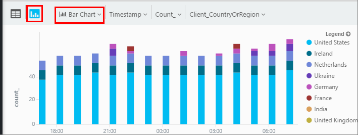
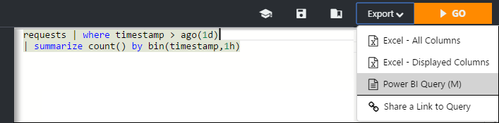

<properties 
    pageTitle="使用狀況分析-的應用程式的深入見解的強大的搜尋工具 |Microsoft Azure" 
    description="使用狀況分析，應用程式的深入見解的強大的診斷搜尋工具。 " 
    services="application-insights" 
    documentationCenter=""
    authors="danhadari" 
    manager="douge"/>

<tags 
    ms.service="application-insights" 
    ms.workload="tbd" 
    ms.tgt_pltfrm="ibiza" 
    ms.devlang="na" 
    ms.topic="article" 
    ms.date="10/21/2016" 
    ms.author="awills"/>

# 在 [應用程式的深入見解中使用狀況分析

[分析](app-insights-analytics.md)是[應用程式的深入見解](app-insights-overview.md)的強大的搜尋功能。 這些頁面會說明分析查詢語言。

* **[觀看影片簡介](https://applicationanalytics-media.azureedge.net/home_page_video.mp4)**。
* **[測試磁碟機上我們模擬的資料分析](https://analytics.applicationinsights.io/demo)**如果您的應用程式未傳送資料至應用程式的深入見解尚未。

## 開啟狀況分析

從您的應用程式首頁中應用程式的深入見解的資源，請按一下 [分析]。

![開啟 portal.azure.com，開啟您的應用程式的深入見解的資源，然後按一下 [分析]。](./media/app-insights-analytics-using/001.png)

內嵌教學課程，可讓您瞭解您可以採取一些想法。

有[以下更廣泛的導覽](app-insights-analytics-tour.md)。

## 查詢您的遙測

### 撰寫的查詢

開始的任何列在左邊的 （或[範圍](app-insights-analytics-reference.md#range-operator)] 或 [[聯集](app-insights-analytics-reference.md#union-operator)運算子） 上的資料表名稱。 使用`|`建立的[運算子](app-insights-analytics-reference.md#queries-and-operators)。 IntelliSense 會提示您與運算子的一些您可以使用運算式項目。

請參閱[分析語言概觀](app-insights-analytics-tour.md)與[語言參考](app-insights-analytics-reference.md)。

### 執行查詢

1. 您可以在查詢中使用單一分行符號。
2. 將游標放內，或您想要執行的查詢的結尾。
3. 按一下 [移至執行查詢。
4. 不要在您的查詢放置空白行。 您可以將一個查詢] 索引標籤中的分隔的多個查詢，並使用空白行。 執行的游標項目。

### 儲存查詢

1. 儲存目前的查詢檔案。
2. 開啟已儲存的查詢檔案。
3. 建立新的查詢檔案。

## 查看詳細資料

展開的結果，若要查看其完整的內容清單中任何資料列。 您可以進一步展開任何屬性，例如是結構化的值-、 自訂尺寸或堆疊清單例外狀況。

 

## 排列結果

您可以排序、 篩選、 分頁，和分組查詢所傳回的結果。

> [AZURE.NOTE] 排序、 群組及篩選瀏覽器中不會重新執行查詢。 他們只能重新排列您上次的查詢所傳回的結果。 
> 
> 之前會傳回結果，請在伺服器執行這些工作，請使用[排序](app-insights-analytics-reference.md#sort-operator)[摘要](app-insights-analytics-reference.md#summarize-operator)與[位置](app-insights-analytics-reference.md#where-operator)運算子撰寫您的查詢。

挑選您想要查看，請拖曳欄標題，若要重新排列它們，然後拖曳框線來調整大小的資料行的資料行。

### 排序及篩選的項目

按一下 [標頭的資料行排序結果。 若要以的其他方式排序，再按一下，然後按一下 [第三個時間，以還原成原始查詢所傳回的順序。

您可以使用 [篩選] 圖示來縮小搜尋範圍。

### 群組項目

若要依據多個欄排序，使用群組。 先啟用，，然後拖曳欄標題的表格上方的空間。

### 遺漏某些結果？

有關於 10 k 列，將結果傳回入口網站上的限制。 警告會顯示您是否移上限制。 此時，排序結果資料表中的不會永遠顯示您所有的實際第一個或最後一個結果。 

是好的做法，若要避免的限制。 使用運算子如下所示︰

* [位置的時間戳記 > ago(3d)](app-insights-analytics-reference.md#where-operator)
* [前 100 個的時間戳記](app-insights-analytics-reference.md#top-operator) 
* [需要 100](app-insights-analytics-reference.md#take-operator)
* [摘要](app-insights-analytics-reference.md#summarize-operator) 

## 圖表

選取您想要的圖表類型︰

如果您有多個欄的右邊的類型，您可以選擇 x 和 y 座標軸維度分割結果所依據的欄。

根據預設，結果為表格，一開始顯示，且您手動選取圖表。 但您可以使用[轉譯指示詞](app-insights-analytics-reference.md#render-directive)的結尾的查詢來選取圖表。

## 釘選至儀表板

您可以固定圖表或表格到其中一個您[共用的儀表板](app-insights-dashboards.md)-只要按一下 [釘選。 （您可能需要[升級您的應用程式的價格套件](app-insights-pricing.md)以開啟此功能。） 

這表示，當您將放在一起，協助您監控效能或您的 web 服務使用情況的儀表板，您可以包含很複雜的分析，同時其他指標。 

如果有四個或更少的資料行，您可以固定至儀表板，表格。 只有前七個資料列會顯示。

#### 儀表板重新整理

釘選到儀表板的圖表會再次執行查詢約每隔半小時會自動重新整理。

#### 自動簡單化

在某些情況下，某些簡單化會套用至圖表，當您將其固定的儀表板。

當 pin 顯示不連續區間 （通常是橫條圖），較少填入區間大量的圖表會自動群組成一個 」 其他人 「 區間。 例如，下列查詢︰

    requests | summarize count_search = count() by client_CountryOrRegion

在分析中看起來像這樣︰

不過，當您將其固定的儀表板，它看起來像這樣︰

## 匯出至 Excel

您已執行查詢後，您可以下載.csv 檔案。 按一下 [**匯出至 Excel**]。

## 匯出至 Power BI

將游標放在查詢中，然後選擇 [**匯出至 Power BI**]。

Power BI 中執行查詢。 您可以設定讓它重新整理排程。

使用 Power BI，您可以建立儀表板，將資料從各種不同的來源。

[進一步瞭解 Power bi 的匯出](app-insights-export-power-bi.md)

[AZURE.INCLUDE [app-insights-analytics-footer](../../includes/app-insights-analytics-footer.md)]

