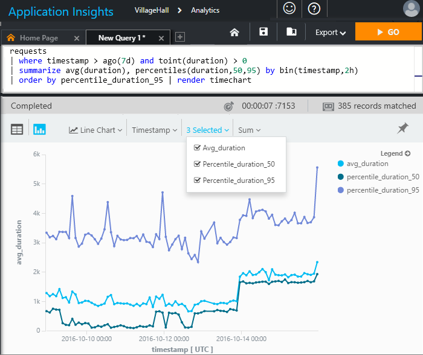

<properties 
    pageTitle="分析-的應用程式的深入見解的強大的搜尋工具 |Microsoft Azure" 
    description="分析，功能強大的診斷搜尋工具應用程式的深入見解的概觀。 " 
    services="application-insights" 
    documentationCenter=""
    authors="alancameronwills" 
    manager="douge"/>

<tags 
    ms.service="application-insights" 
    ms.workload="tbd" 
    ms.tgt_pltfrm="ibiza" 
    ms.devlang="na" 
    ms.topic="article" 
    ms.date="07/26/2016" 
    ms.author="awills"/>


# <a name="analytics-in-application-insights"></a>在 [應用程式的深入見解的狀況分析


[分析](app-insights-analytics.md)是[應用程式的深入見解](app-insights-overview.md)的強大的搜尋功能。 這些頁面會說明分析查詢 lanquage。 

* **[觀看影片簡介](https://applicationanalytics-media.azureedge.net/home_page_video.mp4)**。
* **[測試磁碟機上我們模擬的資料分析](https://analytics.applicationinsights.io/demo)**如果您的應用程式未傳送資料至應用程式的深入見解尚未。

## <a name="queries-in-analytics"></a>分析中的查詢
 
一般查詢是*來源*表格，後面接著一系列的*運算子*分隔`|`。 

例如，讓我們來找出的 Hyderabad 試用我們的 web 應用程式的時間。 雖然我們有，讓我們來看看何種結果程式碼會傳回 HTTP 要求。 

```AIQL

    requests      // Table of events that log HTTP requests.
  	| where timestamp > ago(7d) and client_City == "Hyderabad"
  	| summarize clients = dcount(client_IP) 
      by tod_UTC=bin(timestamp % 1d, 1h), resultCode
  	| extend local_hour = (tod_UTC + 5h + 30min) % 24h + datetime("2001-01-01") 
```

我們會計算過去 7 天的日期的小時分組方式不同的用戶端 IP 位址。 

讓我們來顯示橫條圖簡報後，選擇 [堆疊的結果不同回應代碼結果︰

![選擇 [橫條圖、 x 和 y 座標軸]，再分割](./media/app-insights-analytics/020.png)

看來我們應用程式是最常用午休時間和 Hyderabad 花的時間。 （與我們應該調查 500 代碼）。


在另外一些功能強大的統計作業︰




語言有很多美觀的功能︰

* [篩選](app-insights-analytics-reference.md#where-operator)您的原始應用程式遙測任何欄位，包括您的自訂屬性和指標。
* [加入](app-insights-analytics-reference.md#join-operator)追蹤多個資料表 – 關聯起來要求] 頁面檢視、 與相依性通話、 例外狀況記錄。
* 強大的統計[彙總](app-insights-analytics-reference.md#aggregations)。
* 威力 SQL，但更複雜的查詢:，巢狀陳述式，而非您管道下一步] 將資料從一個基本作業。
* 立即和功能強大的視覺效果。


## <a name="connect-to-your-application-insights-data"></a>連線到您的應用程式的深入見解資料


開啟您的應用程式中的應用程式的深入見解[概觀刀](app-insights-dashboards.md)分析︰ 

![開啟 portal.azure.com，開啟您的應用程式的深入見解的資源，然後按一下 [分析]。](./media/app-insights-analytics/001.png)


## <a name="limits"></a>限制

在簡報，查詢結果限於只在一週的過去的資料。


[AZURE.INCLUDE [app-insights-analytics-footer](../../includes/app-insights-analytics-footer.md)]


## <a name="next-steps"></a>後續步驟


* 我們建議您與[語言教學課程](app-insights-analytics-tour.md)開始。