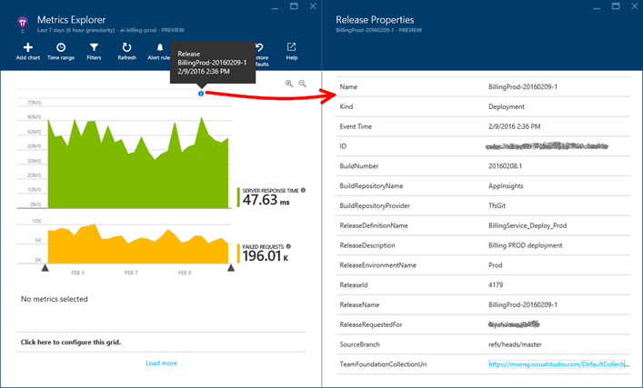

<properties
    pageTitle="放開應用程式的深入見解的註解 |Microsoft Azure"
    description="新增部署，或建立您在應用程式的深入見解的指標總管圖表的資料標記。"
    services="application-insights"
    documentationCenter=".net"
    authors="alancameronwills"
    manager="douge"/>

<tags
    ms.service="application-insights"
    ms.workload="tbd"
    ms.tgt_pltfrm="ibiza"
    ms.devlang="na"
    ms.topic="article"
    ms.date="06/28/2016"
    ms.author="awills"/>

# 在 [應用程式的深入見解的發行版本註釋

請在放開[指標總管](app-insights-metrics-explorer.md)圖表顯示部署新建立的位置上的註解。 方便若要查看您的變更是否有任何效果的應用程式的效能。 他們可以自動建立的[Visual Studio 小組 Services 建立系統](https://www.visualstudio.com/en-us/get-started/build/build-your-app-vs)、，您也可以[建立從 PowerShell](#create-annotations-from-powershell)。

發行註釋是以雲端為基礎建立的功能，然後放開 service 的 Visual Studio 小組 Services]。 

## 安裝註釋副檔名 （一次）

若要建立版本註釋，必須安裝 Visual Studio Marketplace 提供許多小組服務副檔名。

1. 登入您的[Visual Studio 小組 Services](https://www.visualstudio.com/en-us/get-started/setup/sign-up-for-visual-studio-online)專案。
2. 在 Visual Studio Marketplace，[取得發行註釋分機號碼](https://marketplace.visualstudio.com/items/ms-appinsights.appinsightsreleaseannotations)，並將其新增至您的小組服務帳戶。

![在頂端右邊的小組服務網頁上，開啟服務商場。 選取 [視覺小組服務，然後在 [建立和發行] 請選擇 [請參閱更多。](./media/app-insights-annotations/10.png)

您只需要執行一次 Visual Studio 小組服務帳戶。 在您帳戶中的任何專案時，您可以立即設定發行註釋。 

## 從應用程式的深入見解取得 API 金鑰

您需要的每個您想要建立版本註釋的發行範本執行這個動作。

1. 登入[Microsoft Azure 入口網站](https://portal.azure.com)，並開啟 [監視應用程式的應用程式的深入見解資源。 （或[現在建立簽名](app-insights-overview.md)，如果您尚未這麼做尚未）。
2. 開啟**API 的存取權**，及執行**應用程式的深入見解識別碼**的複本。

    ![在 portal.azure.com，開啟您的應用程式的深入見解的資源，然後選擇 [設定]。 開啟 API 的存取權。 複製應用程式識別碼](./media/app-insights-annotations/20.png)

2. 在另一個瀏覽器視窗中，開啟 （或建立） 從 Visual Studio 小組服務管理您的部署發行範本。 

    新增任務，然後從功能表選取 [應用程式的深入見解發行註釋工作]。

    貼上您複製的 API 的存取刀**應用程式識別碼**。

    ![在 Visual Studio 小組服務中，開啟版本、 選取發行定義，並選擇 [編輯]。 按一下 [新增工作]，然後選取 [應用程式的深入見解發行註釋。 貼上應用程式的深入見解識別碼。](./media/app-insights-annotations/30.png)

3. 設定 [ **APIKey** ] 欄位為變數`$(ApiKey)`。

4. 回到 API 的存取防禦，以建立新的 API 金鑰，請一份。

    ![在 API 的存取把刀 Azure 視窗中，按一下 [建立 API 金鑰。 提供註解，核取 [寫入註釋]，按一下 [產生金鑰。 複製新的金鑰。](./media/app-insights-annotations/40.png)

4. 開啟發行範本的 [設定] 索引標籤。

    建立的變數定義`ApiKey`。

    貼上您的 API 金鑰以 ApiKey 變數定義。

    ![在小組服務] 視窗中，選取 [設定] 索引標籤，然後按一下 [加入變數。 設定名稱，以 ApiKey 和值中，貼上您剛剛所產生的金鑰。](./media/app-insights-annotations/50.png)

5. 最後，**儲存**的版本定義。

## 從 PowerShell 建立註釋

您也可以從任何您喜歡 （不使用與小組系統） 的程序建立註釋。 

取得[Powershell 指令碼，從 GitHub](https://github.com/Microsoft/ApplicationInsights-Home/blob/master/API/CreateReleaseAnnotation.ps1)。

您可以使用它就像這樣︰

    .\CreateReleaseAnnotation.ps1 `
      -applicationId "<applicationId>" `
      -apiKey "<apiKey>" `
      -releaseName "<myReleaseName>" `
      -releaseProperties @{
          "ReleaseDescription"="a description";
          "TriggerBy"="My Name" }

取得`applicationId`和`apiKey`從您的應用程式的深入見解的資源︰ 開啟設定、 API 的存取權，並複製應用程式識別碼。 然後按一下 [建立 API 金鑰，然後複製索引鍵。 

## 發行註釋

現在，當您使用的版本範本部署新的版本，應用程式獲得深入見解便會傳送註釋。 註解會出現在計量檔案總管中的圖表。

若要開啟的版本，包括要求者，來源控制分支的詳細資料的任何註解標記] 上按一下，放開定義、 環境，及其他功能。

