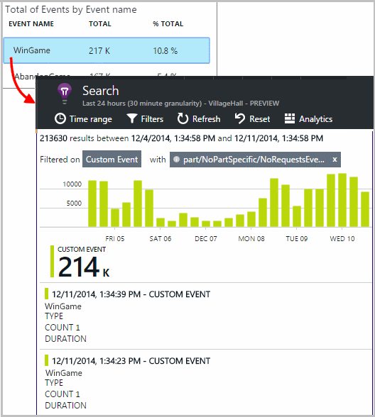

<properties 
    pageTitle="自訂事件和指標的應用程式的深入見解 API |Microsoft Azure" 
    description="在您的裝置或桌面應用程式、 網頁或服務，若要追蹤的使用和診斷問題插入幾行程式碼。" 
    services="application-insights"
    documentationCenter="" 
    authors="alancameronwills" 
    manager="douge"/>
 
<tags 
    ms.service="application-insights" 
    ms.workload="tbd" 
    ms.tgt_pltfrm="ibiza" 
    ms.devlang="multiple" 
    ms.topic="article" 
    ms.date="10/19/2016" 
    ms.author="awills"/>

# <a name="application-insights-api-for-custom-events-and-metrics"></a>自訂事件和指標的應用程式的深入見解 API 

*應用程式的深入見解位於預覽。*

在應用程式中，找出哪些使用者所執行的動作，或以協助診斷問題插入幾行程式碼。 您可以傳送遙測從裝置及桌面應用程式、 web 用戶端和網頁伺服器。 [Visual Studio 應用程式獲得深入見解](app-insights-overview.md)核心遙測 API 可讓您傳送自訂事件及指標，並標準遙測自己版本。 此 API 是相同的 API 使用標準的應用程式的深入見解資料收集器。

## <a name="api-summary"></a>API 摘要

在所有平，除了幾個小變化 API 是統一。

方法 | 用於
---|---
[`TrackPageView`](#page-views) | 頁面、 畫面、 刀或表單
[`TrackEvent`](#track-event) | 使用者動作及其他事件。 用來追蹤使用者的行為，或監控效能。
[`TrackMetric`](#track-metric) | 效能度量單位，例如特定事件與不相關的佇列長度
[`TrackException`](#track-exception)|診斷記錄例外。 追蹤，以便相對於其他事件發生和檢查堆疊追蹤。
[`TrackRequest`](#track-request)| 登入的頻率和效能分析的伺服器要求的期間。
[`TrackTrace`](#track-trace)|診斷記錄檔的郵件。 您也可以擷取 3rd 廠商記錄。
[`TrackDependency`](#track-dependency)|登入的持續時間及來電至您的應用程式所依賴外部元件的頻率。

您可以大部分的這些遙測呼叫[附加屬性和指標](#properties)。 


## <a name="prep"></a>在您開始之前

如果您還沒有尚未完成這些︰

* 將應用程式的深入見解 SDK 新增至您的專案︰
 * [ASP.NET 專案][greenbrown]
 * [Java 專案][java] 
 * [JavaScript 中的每個網頁][client]   

* 在您的裝置或網頁伺服器的程式碼，包括︰

    *C#:*`using Microsoft.ApplicationInsights;`

    *VB:*`Imports Microsoft.ApplicationInsights`

    *Java:*`import com.microsoft.applicationinsights.TelemetryClient;`

## <a name="construct-a-telemetryclient"></a>建構 TelemetryClient

建構 TelemetryClient 的執行個體 （除了 JavaScript 在網頁中）︰

*C# 中︰* 

    private TelemetryClient telemetry = new TelemetryClient();

*VB:* 

    Private Dim telemetry As New TelemetryClient

*Java*

    private TelemetryClient telemetry = new TelemetryClient();

TelemetryClient 是執行緒安全。

我們建議您使用的執行個體`TelemetryClient`應用程式的每一個模組。 例如，您可能有一個`TelemetryClient`在報告傳入 http 要求與另一個介軟體類別中報告的商務邏輯事件 web 服務。 您可以設定屬性，例如`TelemetryClient.Context.User.Id`追蹤使用者與工作階段，或`TelemetryClient.Context.Device.Id`識別電腦。 這項資訊會附加至執行個體所傳送的所有事件。


## <a name="track-event"></a>追蹤事件

在應用程式的深入見解*自訂事件*是資料的資料點，兩者都顯示在[標準檔案總管]中[metrics]彙總的計數，以及也[搜尋診斷]] 中的個別項目[diagnostic]。 （它不相關 MVC 或其他架構 [事件]。） 

插入 TrackEvent 呼叫頻率計算程式碼中，使用者選擇特定的功能，其達成特定目標的頻率或是不是讓特定類型的錯誤。 

例如，遊戲應用程式中，傳送事件時使用者獲勝︰ 

*JavaScript*

    appInsights.trackEvent("WinGame");

*C#*
    
    telemetry.TrackEvent("WinGame");

*VB*


    telemetry.TrackEvent("WinGame")

*Java*

    telemetry.trackEvent("WinGame");


### <a name="view-your-events-in-the-azure-portal"></a>Azure 入口網站中檢視您的事件

若要查看您的事件的計數，開啟[公制總管](app-insights-metrics-explorer.md)刀、 加上新的圖表，然後選取事件。  


若要比較不同事件的數量，圖表類型格線及群組來設定事件] 名稱︰


在方格中，按一下 [透過事件名稱，即可查看該事件的個別項目。



按一下 [若要查看更多詳細資料的任何項目。

若要將焦點放在 [搜尋] 或 [公制檔案總管中的特定事件，請將特篩選設定您感興趣的事件名稱︰

![開啟 [篩選、 展開事件] 名稱，並選取一或多個值](./media/app-insights-api-custom-events-metrics/06-filter.png)

## <a name="track-metric"></a>追蹤公制

使用 TrackMetric 傳送不附加至特定的事件的指標。 例如，您可以監控佇列長度定期間隔。 

指標會顯示為公制總管] 中的統計資料圖表，但不同於事件，您無法搜尋診斷的搜尋] 中的個別項目。

度量值應該是 > = 0，以正確顯示。


*JavaScript*

    appInsights.trackMetric("Queue", queue.Length);

*C#*

    telemetry.TrackMetric("Queue", queue.Length);

*VB*

    telemetry.TrackMetric("Queue", queue.Length)

*Java*

    telemetry.trackMetric("Queue", queue.Length);

事實上，您可能會在背景執行緒中執行此︰

*C#*

    private void Run() {
     var appInsights = new TelemetryClient();
     while (true) {
      Thread.Sleep(60000);
      appInsights.TrackMetric("Queue", queue.Length);
     }
    }


若要查看結果，開啟指標總管，將新的圖表。 設定讓它顯示您的度量。

![新增圖表或選取圖表中，選取 [自訂] 底下的 [您公制](./media/app-insights-api-custom-events-metrics/03-track-custom.png)

有您可以使用一些[標準數目的限制](#limits)。

## <a name="page-views"></a>頁面檢視

在裝置或網頁應用程式中，會在預設傳送頁面檢視遙測每個畫面或頁面載入時。 但您可以變更的追蹤頁面檢視在其他的或不同的時間。 例如索引標籤或刀所顯示的應用程式，您可能要每當使用者開啟新的刀追蹤 」 頁面 」。 


使用者與工作階段的資料會傳送為以及網頁] 檢視中的內容，好讓使用者與工作階段圖表傳送作用頁面檢視遙測時。

#### <a name="custom-page-views"></a>自訂網頁檢視

*JavaScript*

    appInsights.trackPageView("tab1");

*C#*

    telemetry.TrackPageView("GameReviewPage");

*VB*

    telemetry.TrackPageView("GameReviewPage")


如果您有不同的 HTML 頁面中的多個索引標籤，您可以太指定 URL:

    appInsights.trackPageView("tab1", "http://fabrikam.com/page1.htm");

#### <a name="timing-page-views"></a>預存時間] 頁面檢視

根據預設，在瀏覽器傳送邀請，直到稱為的瀏覽器頁面載入事件時從測量 」 頁面檢視載入時間 」 回報時間。

不過，您可以︰

* [TrackPageView](https://github.com/Microsoft/ApplicationInsights-JS/blob/master/API-reference.md#trackpageview)通話中設定明確的持續時間。
 * `appInsights.trackPageView("tab1", null, null, null, durationInMilliseconds);`
* 使用頁面檢視計時通話`startTrackPage`和`stopTrackPage`。

*JavaScript*

    // To start timing a page:
    appInsights.startTrackPage("Page1");

... 

    // To stop timing and log the page:
    appInsights.stopTrackPage("Page1", url, properties, measurements);

您要使用名稱為第一個參數之間建立關聯的開始及停止來電。 預設會為目前的頁面名稱。 

在公制總管] 中顯示的結果頁面載入工期所衍生的開始及停止來電之間的間隔。 是由您實際時間哪些間隔。

## <a name="track-request"></a>追蹤要求

使用伺服器 SDK 記錄 HTTP 要求。 

您也可以呼叫它自己如果您想要模擬內容中的要求您不具備執行的 web 服務模組。

*C#*

    // At start of processing this request:

    // Operation Id and Name are attached to all telemetry and help you identify
    // telemetry associated with one request:
    telemetry.Context.Operation.Id = Guid.NewGuid().ToString();
    telemetry.Context.Operation.Name = requestName;
    
    var stopwatch = System.Diagnostics.Stopwatch.StartNew();

    // ... process the request ...

    stopwatch.Stop();
    telemetry.TrackRequest(requestName, DateTime.Now,
       stopwatch.Elapsed, 
       "200", true);  // Response code, success


## <a name="operation-context"></a>作業內容

遙測項目可以在一起相關附加在這些共同作業的識別碼]。 標準要求追蹤模組負責這項工作的例外狀況及處理 HTTP 要求時傳送其他事件。 在[搜尋](app-insights-diagnostic-search.md)和[分析資料](app-insights-analytics.md)，您可以使用識別碼，輕鬆地找到邀請相關聯的任何事件。 

將 ID 設定最簡單的方法是使用這個模式來設定作業內容︰

    // Establish an operation context and associated telemetry item:
    using (var operation = telemetry.StartOperation<RequestTelemetry>("operationName"))
    {
        // Telemetry sent in here will use the same operation ID.
        ...
        telemetry.TrackEvent(...); // or other Track* calls
        ...
        // Set properties of containing telemetry item - for example:
        operation.Telemetry.ResponseCode = "200";
        
        // Optional: explicitly send telemetry item:
        telemetry.StopOperation(operation);

    } // When operation is disposed, telemetry item is sent.

設定作業的內容，以及`StartOperation`建立遙測類型的項目，並將它傳送當配置作業，或如果您明確呼叫`StopOperation`。 如果您是使用`RequestTelemetry`作為遙測類型，則其工期會設定為開始及停止的時間間隔。

無法巢狀作業內容。 如果已經有作業內容，它 ID 是與所有包含的項目，包括使用 StartOperation 建立的項目相關聯。

在 [搜尋] 作業內容用來建立相關項目清單︰


## <a name="track-exception"></a>追蹤例外狀況

傳送應用程式獲得深入見解的例外狀況︰ 若要[計算它們][metrics]，為問題; 的頻率的指示並[檢查個別項目][diagnostic]。 報表包含堆疊追蹤。

*C#*

    try
    {
        ...
    }
    catch (Exception ex)
    {
       telemetry.TrackException(ex);
    }

*JavaScript*

    try
    {
       ...
    }
    catch (ex)
    {
       appInsights.trackException(ex);
    }

自動，因此您永遠不必明確呼叫 TrackException 時，Sdk 將攔截多個例外狀況。

* ASP.NET︰[撰寫程式碼來擷取例外狀況](app-insights-asp-net-exceptions.md)
* J2EE︰[自動偵測到的例外狀況](app-insights-java-get-started.md#exceptions-and-request-failures)
* JavaScript︰ 自動狀況。 如果您想要停用自動的集合，請將您在網頁中插入程式碼片段新增線條︰

    ```
    ({
      instrumentationKey: "your key"
      , disableExceptionTracking: true
    })
    ```


## <a name="track-trace"></a>追蹤追蹤 

使用此選項協助診斷傳送軌跡瀏線索 」 應用程式獲得深入見解的問題。 您可以傳送診斷資料，區塊和[搜尋診斷]] 中檢查其[diagnostic]。 

 

[登入介面卡][trace]使用此 API 來傳送入口網站的協力廠商記錄。


*C#*

    telemetry.TrackTrace(message, SeverityLevel.Warning, properties);


您可以搜尋郵件內容，但是 （不同於屬性值） 中，您無法篩選在其上。

大小限制`message`遠高於屬性的限制。
TrackTrace 的優點是，您可以將超長資料放在郵件中。 例如，您可能會編碼那里張貼資料。  


此外，您可以新增您的郵件重要性層級。 與其他遙測，例如，您可以新增您可用來協助篩選或搜尋組不同的追蹤的屬性值。 例如︰


    var telemetry = new Microsoft.ApplicationInsights.TelemetryClient();
    telemetry.TrackTrace("Slow database response",
                   SeverityLevel.Warning,
                   new Dictionary<string,string> { {"database", db.ID} });

這會讓您在[搜尋]中[diagnostic]、 輕鬆篩選出特定的資料庫建立特定的重要性層級的所有郵件。

## <a name="track-dependency"></a>追蹤相依性

您可以使用這個呼叫來追蹤回應時間和成功率的來電至外部的程式碼。 結果會顯示在入口網站中的相依性圖表中。 

```C#

            var success = false;
            var startTime = DateTime.UtcNow;
            var timer = System.Diagnostics.Stopwatch.StartNew();
            try
            {
                success = dependency.Call();
            }
            finally
            {
                timer.Stop();
                telemetry.TrackDependency("myDependency", "myCall", startTime, timer.Elapsed, success);
            }
```

請記住，Sdk 包含[相依性模組](app-insights-dependencies.md)探索及追蹤特定相依性的伺服器會自動呼叫-例如資料庫並 REST Api。 您必須進行工作的模組伺服器上安裝代理程式。 如果您想要追蹤的電話，不會被自動追蹤，或如果您不想要安裝代理程式，您可以使用這個呼叫。

若要關閉的標準的相依性追蹤模組，請編輯[ApplicationInsights.config](app-insights-configuration-with-applicationinsights-config.md)並刪除參照`DependencyCollector.DependencyTrackingTelemetryModule`。


## <a name="flushing-data"></a>清除資料

以正常方式 SDK 傳送資料有時候選擇最小化對使用者的影響。 不過，在某些情況下可能會想要清除緩衝-例如，如果您使用 SDK 的應用程式，並關閉。

*C#*

    telemetry.Flush();

    // Allow some time for flushing before shutdown.
    System.Threading.Thread.Sleep(1000);

請注意，此函數非同步[伺服器遙測通道](https://www.nuget.org/packages/Microsoft.ApplicationInsights.WindowsServer.TelemetryChannel/)，但如果您選擇要使用的記憶體內頻道或[常設頻道](app-insights-api-filtering-sampling.md#persistence-channel)同步。


## <a name="authenticated-users"></a>已驗證的使用者

在 web 應用程式中，使用者會依預設以 cookie 區分。 如果他們存取您的應用程式從不同的電腦或瀏覽器中，或刪除 cookie，可能不只一次計算使用者。 

不過，如果使用者登入您的應用程式，您可以設定的瀏覽器程式碼的已驗證的使用者識別碼取得提供更精確的計算︰

*JavaScript*

```JS
    // Called when my app has identified the user.
    function Authenticated(signInId) {
      var validatedId = signInId.replace(/[,;=| ]+/g, "_");
      appInsights.setAuthenticatedUserContext(validatedId);
      ...
    }
```

ASP.NET web MVC 應用程式，例如︰

*Razor*

        @if (Request.IsAuthenticated)
        {
            <script>
                appInsights.setAuthenticatedUserContext("@User.Identity.Name
                   .Replace("\\", "\\\\")"
                   .replace(/[,;=| ]+/g, "_"));
            </script>
        }

不需要使用使用者的實際登入名稱。 僅限必須是唯一的使用者識別碼。 不能包含空格，或是任何字元`,;=|`。 

使用者識別碼也為設定中的工作階段 cookie，並傳送至伺服器。 如果安裝伺服器 SDK，經過驗證的使用者識別碼會傳送用戶端和伺服器遙測內容屬性的一部分，好讓您可以篩選和搜尋在其上。

如果您的應用程式會將使用者群組組成帳戶，您也可以傳遞識別項 （有相同的字元限制） 的帳戶。


      appInsights.setAuthenticatedUserContext(validatedId, accountId);

在[計量檔案總管]](app-insights-metrics-explorer.md)中，您可以建立計算**使用者經驗證**與**使用者帳戶**的圖表。 

您也可以[搜尋][diagnostic]特定的使用者名稱與帳戶的用戶端資料點。

## <a name="properties"></a>篩選、 搜尋及區段屬性的資料

您可以將屬性和度量單位附加至您的事件 （和也指標，頁面檢視、 例外] 及其他遙測資料）。

**屬性**是可以用來篩選您遙測使用情況報告中的字串值。 例如，如果您的應用程式提供數種遊戲，您會想要附加遊戲的名稱以每項事件，讓您可以看到哪些遊戲會更受歡迎。 

有關於 1 k 字串長度的限制。 （如果您要傳送大量資料，請使用訊息的參數[TrackTrace](#track-trace)）。

**計量**都可以以圖形方式呈現的數值。 例如，您可能要查看是否有獲得您投機者分數逐漸增加。 圖形可以分割來傳送與事件的屬性，讓您取得不同或堆疊直條圖不同運動會的圖表。

度量值應該是 > = 0，以正確顯示。


有一些您可以使用的[限制的內容、 屬性和指標數](#limits)。


*JavaScript*

    appInsights.trackEvent
      ("WinGame",
         // String properties:
         {Game: currentGame.name, Difficulty: currentGame.difficulty},
         // Numeric metrics:
         {Score: currentGame.score, Opponents: currentGame.opponentCount}
         );

    appInsights.trackPageView
        ("page name", "http://fabrikam.com/pageurl.html",
          // String properties:
         {Game: currentGame.name, Difficulty: currentGame.difficulty},
         // Numeric metrics:
         {Score: currentGame.score, Opponents: currentGame.opponentCount}
         );
          

*C#*

    // Set up some properties and metrics:
    var properties = new Dictionary <string, string> 
       {{"game", currentGame.Name}, {"difficulty", currentGame.Difficulty}};
    var metrics = new Dictionary <string, double>
       {{"Score", currentGame.Score}, {"Opponents", currentGame.OpponentCount}};

    // Send the event:
    telemetry.TrackEvent("WinGame", properties, metrics);


*VB*

    ' Set up some properties:
    Dim properties = New Dictionary (Of String, String)
    properties.Add("game", currentGame.Name)
    properties.Add("difficulty", currentGame.Difficulty)

    Dim metrics = New Dictionary (Of String, Double)
    metrics.Add("Score", currentGame.Score)
    metrics.Add("Opponents", currentGame.OpponentCount)

    ' Send the event:
    telemetry.TrackEvent("WinGame", properties, metrics)


*Java*
    
    Map<String, String> properties = new HashMap<String, String>();
    properties.put("game", currentGame.getName());
    properties.put("difficulty", currentGame.getDifficulty());
    
    Map<String, Double> metrics = new HashMap<String, Double>();
    metrics.put("Score", currentGame.getScore());
    metrics.put("Opponents", currentGame.getOpponentCount());
    
    telemetry.trackEvent("WinGame", properties, metrics);


> [AZURE.NOTE] 請注意未登入屬性的 [個人資訊。

**如果您使用的度量**，開啟公制檔案總管]，然後從 [自訂] 群組中選取 [公制︰


*如果您公制沒有出現，或 [自訂] 標題沒有，關閉選取刀再試。有時可能需要一眼管線彙總小時。*

**如果您使用的內容] 和 [指標**] 區段的公制的屬性︰


![設定群組]，然後選取 [群組依據] 下的 [屬性](./media/app-insights-api-custom-events-metrics/04-segment-metric-event.png)


**在診斷搜尋**，您可以檢視屬性和指標的事件的個別項目。


![選取 [執行個體，然後選取 [...]](./media/app-insights-api-custom-events-metrics/appinsights-23-customevents-4.png)


您可以使用 [搜尋] 欄位來查看發生次數與特定屬性值。


[深入了解搜尋運算式][diagnostic]。

#### <a name="alternative-way-to-set-properties-and-metrics"></a>若要設定屬性和指標的另一種方式

如果這是更方便，您可以收集事件在另一個物件的參數︰

    var event = new EventTelemetry();

    event.Name = "WinGame";
    event.Metrics["processingTime"] = stopwatch.Elapsed.TotalMilliseconds;
    event.Properties["game"] = currentGame.Name;
    event.Properties["difficulty"] = currentGame.Difficulty;
    event.Metrics["Score"] = currentGame.Score;
    event.Metrics["Opponents"] = currentGame.Opponents.Length;

    telemetry.TrackEvent(event);

> [AZURE.WARNING] 不重複使用相同的遙測項目執行個體 (`event`在此範例中) 若要多次呼叫 Track*()。 這可能會導致遙測傳送以不正確的設定。


## <a name="timed"></a>預存時間事件

有時候您想要花多久以執行某些動作的圖表。 例如，您可能會想知道多久使用者需要考慮的遊戲選項。 這是很有用的範例使用的度量單位參數。


*C#*

    var stopwatch = System.Diagnostics.Stopwatch.StartNew();

    // ... perform the timed action ...

    stopwatch.Stop();

    var metrics = new Dictionary <string, double>
       {{"processingTime", stopwatch.Elapsed.TotalMilliseconds}};

    // Set up some properties:
    var properties = new Dictionary <string, string> 
       {{"signalSource", currentSignalSource.Name}};

    // Send the event:
    telemetry.TrackEvent("SignalProcessed", properties, metrics);


## <a name="defaults"></a>自訂遙測的預設內容

如果您想要針對您撰寫的自訂事件的某些設定預設的屬性值時，您可以在 TelemetryClient 設定。 附加至每個寄件者的用戶端的遙測項目。 

*C#*

    using Microsoft.ApplicationInsights.DataContracts;

    var gameTelemetry = new TelemetryClient();
    gameTelemetry.Context.Properties["Game"] = currentGame.Name;
    // Now all telemetry will automatically be sent with the context property:
    gameTelemetry.TrackEvent("WinGame");
    
*VB*

    Dim gameTelemetry = New TelemetryClient()
    gameTelemetry.Context.Properties("Game") = currentGame.Name
    ' Now all telemetry will automatically be sent with the context property:
    gameTelemetry.TrackEvent("WinGame")

*Java*

    import com.microsoft.applicationinsights.TelemetryClient;
    import com.microsoft.applicationinsights.TelemetryContext;
    ...


    TelemetryClient gameTelemetry = new TelemetryClient();
    TelemetryContext context = gameTelemetry.getContext();
    context.getProperties().put("Game", currentGame.Name);
    
    gameTelemetry.TrackEvent("WinGame");


    
個別遙測通話可覆寫其屬性字典中的預設值。

**針對 JavaScript 網頁用戶端**，[使用 JavaScript 遙測初始](#js-initializer)。

**若要新增至所有遙測的內容**，包括標準集合模組中的資料[實作`ITelemetryInitializer`](app-insights-api-filtering-sampling.md#add-properties)。


## <a name="sampling-filtering-and-processing-telemetry"></a>取樣、 篩選及處理遙測 

您可以撰寫處理您的遙測傳送從 SDK 之前的程式碼。 處理程序包含從標準遙測模組，例如 HTTP 要求集合和相依性集合傳送資料。

* [新增內容](app-insights-api-filtering-sampling.md#add-properties)至實作遙測`ITelemetryInitializer`-，例如，若要新增的版本號碼，或從其他屬性計算的值。 
* [篩選](app-insights-api-filtering-sampling.md#filtering)可以修改檔案或放棄遙測，透過實作傳送從 SDK 之前`ITelemetryProcesor`。 您可以控制什麼傳送或捨棄，，但您必須考慮您指標的效果。 根據如何捨棄項目，您可能會遺失的功能相關項目之間瀏覽。
* [取樣](app-insights-api-filtering-sampling.md#sampling)是封裝的解決方案，以減少從您的應用程式傳送入口網站的資料量。 它會因此而不會影響顯示的指標，並不會影響相關的項目，例如例外狀況、 要求及頁面檢視之間瀏覽診斷問題的能力。

[深入瞭解](app-insights-api-filtering-sampling.md)


## <a name="disabling-telemetry"></a>停用遙測

若要**以動態方式停止和開始**集合及遙測傳輸︰

*C#*

```C#

    using  Microsoft.ApplicationInsights.Extensibility;

    TelemetryConfiguration.Active.DisableTelemetry = true;
```

若要**停用所選的標準收集**-，例如效能計數器、 HTTP 要求或相依性-刪除或註解中[ApplicationInsights.config]相關的各行[config]。 例如，如果您想要傳送 TrackRequest 資料，您可以這麼做。

## <a name="debug"></a>開發人員模式

偵錯期間，很有用，使您可以立即看到的結果，透過管線加速您遙測。 您也取得額外的訊息，可協助您追蹤遙測任何問題。 切換到關閉狀態實際時可能會降低應用程式。


*C#*
    
    TelemetryConfiguration.Active.TelemetryChannel.DeveloperMode = true;

*VB*

    TelemetryConfiguration.Active.TelemetryChannel.DeveloperMode = True


## <a name="ikey"></a>設定選取自訂遙測儀器按鍵

*C#*
    
    var telemetry = new TelemetryClient();
    telemetry.InstrumentationKey = "---my key---";
    // ...


## <a name="dynamic-ikey"></a>動態儀器索引鍵

若要避免混遙測開發、 測試和生產環境中，您可以[建立不同的應用程式的深入見解資源][create]並變更其金鑰根據環境。

而非從設定檔中取得儀器鍵，您可以將其程式碼。 初始設定方法，例如 global.aspx.cs ASP.NET 服務中設定機碼︰

*C#*

    protected void Application_Start()
    {
      Microsoft.ApplicationInsights.Extensibility.
        TelemetryConfiguration.Active.InstrumentationKey = 
          // - for example -
          WebConfigurationManager.Settings["ikey"];
      ...

*JavaScript*

    appInsights.config.instrumentationKey = myKey; 


在網頁，您可能想將它從網頁伺服器的狀態，而不是到指令碼如實編碼。 例如，在產生 ASP.NET 應用程式中的網頁︰

*在 [Razor JavaScript*

    <script type="text/javascript">
    // Standard Application Insights web page script:
    var appInsights = window.appInsights || function(config){ ...
    // Modify this part:
    }({instrumentationKey:  
      // Generate from server property:
      @Microsoft.ApplicationInsights.Extensibility.
         TelemetryConfiguration.Active.InstrumentationKey"
    }) // ...


## <a name="telemetrycontext"></a>TelemetryContext

TelemetryClient 具有內容屬性時，其中包含許多傳送以及所有遙測資料的值。 標準遙測模組中，以正常方式設定，但您也可以設定這些自己。 例如︰

    telemetry.Context.Operation.Name = "MyOperationName";

如果您自行這些值，請考慮相關行移除[ApplicationInsights.config][config]，以便您值和標準的值不取得混淆。

* **元件**識別應用程式和其版本
* **裝置**要在其執行應用程式的裝置的相關資料 （在 web 應用程式，這是遙測寄出的伺服器或用戶端裝置）
* **InstrumentationKey**將應用程式的深入見解資源識別中 Azure 遙測會出現的位置。 從 ApplicationInsights.config 通常挑選
* **位置**識別地理位置的裝置。
* **作業**在目前的 HTTP 要求的 web 應用程式。 在其他應用程式類型] 中，您可以設定此群組事件放在一起。
 * **識別碼**︰ 產生的值，好讓時檢查診斷搜尋中的任何事件時，您可以找到，與相關聯的不同事件 」 相關項目 」
 * **名稱**︰ 識別項，通常是空的 URL。 
 * **SyntheticSource**︰ 如果沒有空值或空白，此字串表示的要求來源已被識別為機器人或網頁的測試。 依預設將不會包含從指標檔案總管中的計算。
* **屬性**傳送所有的遙測資料的屬性。 您可以覆寫個別追蹤 * 來電。
* **工作階段**識別使用者的工作階段。 識別碼會設定為產生的值，當使用者尚未作用中的一些變更。
* **使用者**使用者資訊。 

## <a name="limits"></a>限制


[AZURE.INCLUDE [application-insights-limits](../../includes/application-insights-limits.md)]

*如何避免正中資料速度限制？*

* 使用[範例](app-insights-sampling.md)。

*多久是保留的資料？*

* 請參閱[資料保留資料和隱私權][data]。


## <a name="reference-docs"></a>參照文件

* [ASP.NET 參照](https://msdn.microsoft.com/library/dn817570.aspx)
* [Java 參照](http://dl.windowsazure.com/applicationinsights/javadoc/)
* [JavaScript 參照](https://github.com/Microsoft/ApplicationInsights-JS/blob/master/API-reference.md)
* [Android SDK](https://github.com/Microsoft/ApplicationInsights-Android)
* [iOS SDK](https://github.com/Microsoft/ApplicationInsights-iOS)


## <a name="sdk-code"></a>SDK 程式碼

* [ASP.NET 核心 SDK](https://github.com/Microsoft/ApplicationInsights-dotnet)
* [ASP.NET 5](https://github.com/Microsoft/ApplicationInsights-aspnet5)
* [Windows Server 的套件](https://github.com/Microsoft/applicationInsights-dotnet-server)
* [Java SDK](https://github.com/Microsoft/ApplicationInsights-Java)
* [JavaScript SDK](https://github.com/Microsoft/ApplicationInsights-JS)
* [所有的平台](https://github.com/Microsoft?utf8=%E2%9C%93&query=applicationInsights)

## <a name="questions"></a>問題

* *Track_() 通話可能引發例外狀況為何？*
    
    無。 您不需要將其嘗試攔截子句中。 如果 SDK 遇到問題，它將會記錄您會看到的訊息中偵錯主控台輸出，以及-如果郵件收到透過-診斷搜尋中。


* *有 REST API，若要從入口網站取得資料嗎？*

    是的即將推出。 同時，使用 [[接續本頁] 分匯出](app-insights-export-telemetry.md)]。

## <a name="next"></a>後續步驟


[搜尋事件和記錄檔][diagnostic]

[範例和逐步解說](app-insights-code-samples.md)

[疑難排解][qna]


<!--Link references-->

[client]: app-insights-javascript.md
[config]: app-insights-configuration-with-applicationinsights-config.md
[create]: app-insights-create-new-resource.md
[data]: app-insights-data-retention-privacy.md
[diagnostic]: app-insights-diagnostic-search.md
[exceptions]: app-insights-asp-net-exceptions.md
[greenbrown]: app-insights-asp-net.md
[java]: app-insights-java-get-started.md
[metrics]: app-insights-metrics-explorer.md
[qna]: app-insights-troubleshoot-faq.md
[trace]: app-insights-search-diagnostic-logs.md

 
