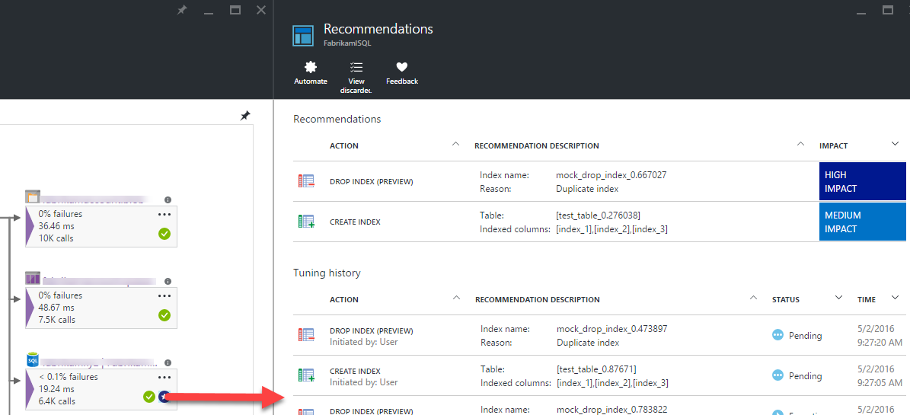
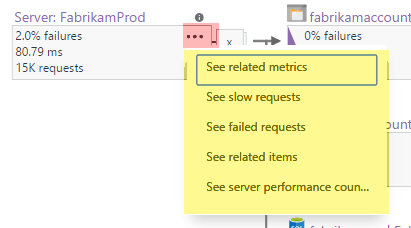

<properties 
    pageTitle="在 [應用程式的深入見解的應用程式對應 |Microsoft Azure" 
    description="以視覺呈現的應用程式元件之間的相依性標記 Kpi 和通知。" 
    services="application-insights" 
    documentationCenter=""
    authors="SoubhagyaDash" 
    manager="douge"/>

<tags 
    ms.service="application-insights" 
    ms.workload="tbd" 
    ms.tgt_pltfrm="ibiza" 
    ms.devlang="na" 
    ms.topic="article" 
    ms.date="06/15/2016" 
    ms.author="awills"/>
 
# 在 [應用程式的深入見解的應用程式對應

在[Visual Studio 應用程式獲得深入見解](app-insights-overview.md)應用程式對應仍是您的應用程式元件的相依性關聯的視覺版面配置。 每個元件都載入、 效能、 失敗次數和提醒等，以協助您發現任何造成效能問題或失敗的元件顯示 Kpi。 您可以按一下透過任何元件詳細診斷，兩者都要應用程式的深入見解，以及-如果您的應用程式使用 Azure 服務-Azure 診斷，例如 SQL 資料庫顧問建議。

其他圖表，例如，您可以固定至 Azure 的儀表板，則功能完整的應用程式對應。 

## 開啟應用程式地圖

開啟應用程式的概觀刀地圖︰

顯示地圖︰

* 可用性測試
* 用戶端端元件 （監視使用 JavaScript SDK）
* 伺服器端元件
* 用戶端和伺服器元件的相依性

您可以展開及摺疊相依性連結群組︰

 
如果您有大型的相依性 （SQL 等 HTTP） 一種類型的數字時，可能會顯示群組。 

 
 
## 找出問題

每個節點具有相關的效能指標，例如的載入、 效能及錯誤的工資率，該元件。 

警告圖示醒目提示可能發生的問題。 橘色警告表示失敗中要求] 頁面檢視] 或 [相依性來電。 紅色代表 5%失敗率。

 
作用中通知向上也顯示︰ 

 
如果您使用 SQL Azure，有圖示顯示何時有建議，您可以在如何提升效能。 

按一下任何圖示，以取得更多詳細資料︰

 
 
## 透過診斷按一下

在地圖上節點的每個使用者提供透過診斷的目標的按一下。 選項會根據節點的類型而有所不同。

 
Azure 中所裝載的元件，選項包括 [直接連結給他們。

## 篩選和時間範圍

根據預設，地圖摘要列出所有可用的所選的時間範圍內的資料。 但您可以篩選以包含只有特定作業名稱或相依性。

* 作業名稱︰ 這同時包含網頁檢視和伺服器端要求類型。 使用此選項，地圖會顯示為所選作業的伺服器/用戶端側節點 KPI。 它會顯示稱為特定作業的內容中的相依性。
* 相依性基底名稱︰ 包括 AJAX 瀏覽器側相依性和伺服器端相依性。 如果您的報表和 TrackDependency API 自訂相依性遙測，對方將會顯示以下。 您可以選取要在地圖上顯示的相依性。 請注意，此時，這將無法篩選伺服器端要求] 或用戶端側邊的頁面檢視。

 
 
## 將篩選儲存

若要儲存您已套用的篩選，將其釘選到[儀表板](app-insights-dashboards.md)篩選的檢視。

 

## 意見反應

請[提供意見反應透過入口網站的意見反應] 選項](app-insights-get-dev-support.md)。

