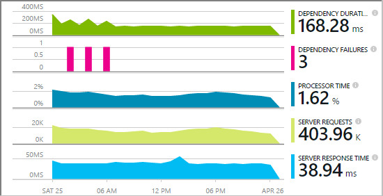
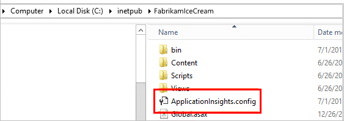
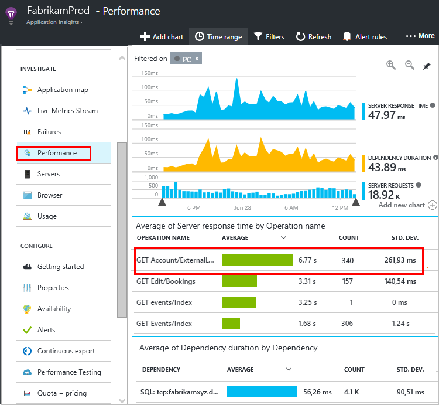

<properties 
    pageTitle="追蹤應用程式的深入見解的相依性" 
    description="分析使用狀況、 可用性和內部部署或 Microsoft Azure web 應用程式的應用程式的深入見解的效能。" 
    services="application-insights" 
    documentationCenter=".net"
    authors="alancameronwills" 
    manager="douge"/>

<tags 
    ms.service="application-insights" 
    ms.workload="tbd" 
    ms.tgt_pltfrm="ibiza" 
    ms.devlang="na" 
    ms.topic="article" 
    ms.date="10/24/2016" 
    ms.author="awills"/>


# <a name="set-up-application-insights-dependency-tracking"></a>設定應用程式的深入見解︰ 相依性追蹤


[AZURE.INCLUDE [app-insights-selector-get-started-dotnet](../../includes/app-insights-selector-get-started-dotnet.md)]


*相依性*是由您的應用程式稱為外部元件。 通常是稱為使用 HTTP] 或資料庫檔案系統的服務。 在 Visual Studio 深入見解應用程式，您可以輕鬆地查看應用程式會相依性等候多久和相依性通話失敗的頻率。



-現成的相依性監視器目前報告這些類型的相依性的來電︰

* ASP.NET
 * SQL 資料庫
 * ASP.NET web 和使用 HTTP 為基礎的繫結的 WCF 服務
 * 本機或遠端 HTTP 通話
 * Azure DocumentDb、 表格、 blob 儲存體，以及佇列中
* Java
 * 電話可透過[JDBC](http://docs.oracle.com/javase/7/docs/technotes/guides/jdbc/)驅動程式，例如 MySQL、 SQL Server、 PostgreSQL 或 SQLite 資料庫。
* 在網頁-JavaScript[網頁 SDK](app-insights-javascript.md)自動記錄 Ajax 通話為相依性。

您可以撰寫 SDK 來電監視使用[TrackDependency API](app-insights-api-custom-events-metrics.md#track-dependency)其他相依性。


## <a name="to-set-up-dependency-monitoring"></a>若要設定監控相依性

您需要[Microsoft Azure](http://azure.com)訂閱。

### <a name="if-your-app-runs-on-your-iis-server"></a>如果您的應用程式執行 IIS 伺服器上

如果您的 web 應用程式執行於.NET 4.6 或更新版本，您可以[安裝應用程式的深入見解 SDK](app-insights-asp-net.md)任一在您的應用程式，或安裝應用程式的深入見解狀態監視器。 您不需要同時。

否則，請在伺服器上安裝應用程式的深入見解狀態監視器︰

1. IIS 網頁伺服器，以系統管理員認證登入。
2. 下載並執行[狀態監視器安裝程式](http://go.microsoft.com/fwlink/?LinkId=506648)。
4. 在安裝精靈中，登入 Microsoft Azure。

    

    *連接錯誤？請參閱[疑難排解](#troubleshooting)。*

5. 選擇已安裝的 web 應用程式或您想要監視的網站，然後設定您要的應用程式的深入見解入口網站中查看結果的資源。

    

    一般而言，在您選擇設定新的資源與[資源群組][roles]。

    如果您已設定好[web 測試]，否則使用現有的資源[availability]為您的網站或[網頁用戶端監視][client]。

6. 重新啟動 IIS。

    ![選擇 [重新啟動頂端的對話方塊]。](./media/app-insights-asp-net-dependencies/appinsights-036-restart.png)

    您的 web 服務會短期受到打擾。

6. 請注意 ApplicationInsights.config 具有已插入您想要監視的 web 應用程式。

    

   還有 web.config 的一些變更。

#### <a name="want-to-reconfigure-later"></a>想要稍後 （重新） 設定？

完成精靈後，您可以在每當您想要重新設定代理程式。 您也可以使用此如果您有安裝代理程式，但沒有初始設定的一些問題。

![按一下工作列上的 [應用程式深入資訊] 圖示](./media/app-insights-asp-net-dependencies/appinsights-033-aicRunning.png)


### <a name="if-your-app-runs-as-an-azure-web-app"></a>如果您的應用程式執行 Azure Web app

Azure Web 應用程式的控制台] 中新增應用程式的深入見解副檔名。


### <a name="if-its-an-azure-cloud-services-project"></a>如果是 Azure 雲端服務的專案

[新增 web 及工作者角色指令碼](app-insights-cloudservices.md#dependencies)。 或[安裝.NET framework 4.6 或更新版本](../cloud-services/cloud-services-dotnet-install-dotnet.md)。

## <a name="diagnosis"></a>診斷相依性效能問題

若要評估您的伺服器要求的效能，開啟效能刀，向下捲動查看方格的要求︰



花費很長的上方的項目。 我們來看看我們可以瞭解花費的時間的位置。

按一下以查看個別的邀請事件該資料列︰


按一下要進一步檢查有任何長執行個體。

捲動到遠端相依性來電相關此要求︰


它看起來像大部分的時間服務要求花在本機的服務進行通話。 


選取該資料列，以取得詳細資訊︰


詳細資料包含足夠診斷問題的資訊。


在不同的情況下，不相依性通話長，但是切換至 [時間表] 檢視，我們可以看到我們內部處理中發生延遲的位置︰


## <a name="failures"></a>失敗

如果有失敗的要求，請按一下 [圖表]。


按一下 [透過要求類型和要求執行個體，若要尋找遠端相依性在失敗的通話]。


## <a name="custom-dependency-tracking"></a>追蹤自訂相依性

標準的相依性追蹤模組會自動探索資料庫等 REST Api 外部相依性。 但您可能會想以相同的方式處理某些其他元件。 

您可以撰寫程式碼會傳送相依性的資訊，請使用相同的[TrackDependency API](app-insights-api-custom-events-metrics.md#track-dependency)所使用的標準模組。

例如，如果您沒有撰寫您自己的組件建立您的程式碼，您可能會時間所有來電，找出哪些對您的回應時間的比重。 若要讓此應用程式的深入見解的相依性圖表中顯示的資料，並使用傳送`TrackDependency`。

```C#

            var startTime = DateTime.UtcNow;
            var timer = System.Diagnostics.Stopwatch.StartNew();
            try
            {
                success = dependency.Call();
            }
            finally
            {
                timer.Stop();
                telemetry.TrackDependency("myDependency", "myCall", startTime, timer.Elapsed, success);
            }
```

如果您想要切換標準的相依性追蹤模組，DependencyTrackingTelemetryModule 參照中移除[ApplicationInsights.config](app-insights-configuration-with-applicationinsights-config.md)。

## <a name="troubleshooting"></a>疑難排解

*相依性成功的旗標一律會顯示 true 或 false。*

* 升級至最新版的 SDK。 如果您的.NET 版本小於 4.6，安裝[狀態監視器](app-insights-monitor-performance-live-website-now.md)。

## <a name="next-steps"></a>後續步驟

- [例外狀況](app-insights-asp-net-exceptions.md)
- [使用者及頁面的資料][client]
- [顯示狀態](app-insights-monitor-web-app-availability.md)


<!--Link references-->

[api]: app-insights-api-custom-events-metrics.md
[apikey]: app-insights-api-custom-events-metrics.md#ikey
[availability]: app-insights-monitor-web-app-availability.md
[azure]: ../insights-perf-analytics.md
[client]: app-insights-javascript.md
[diagnostic]: app-insights-diagnostic-search.md
[metrics]: app-insights-metrics-explorer.md
[netlogs]: app-insights-asp-net-trace-logs.md
[portal]: http://portal.azure.com/
[qna]: app-insights-troubleshoot-faq.md
[redfield]: app-insights-asp-net-dependencies.md
[roles]: app-insights-resources-roles-access-control.md

 
