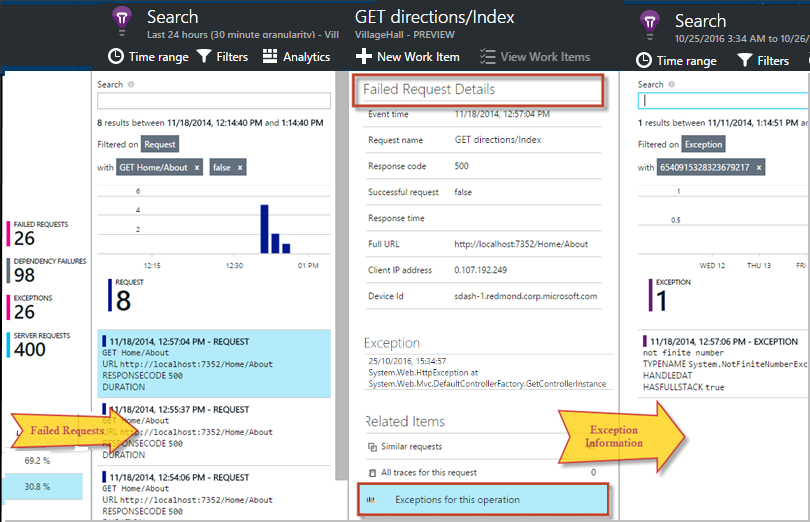
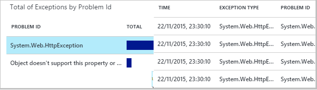

<properties 
    pageTitle="診斷失敗和使用應用程式的深入見解的 ASP.NET 應用程式中的例外狀況" 
    description="擷取 ASP.NET 應用程式，以及要求遙測的例外狀況。" 
    services="application-insights" 
    documentationCenter=".net"
    authors="alancameronwills" 
    manager="douge"/>

<tags 
    ms.service="application-insights" 
    ms.workload="tbd" 
    ms.tgt_pltfrm="ibiza" 
    ms.devlang="na" 
    ms.topic="article" 
    ms.date="10/27/2016" 
    ms.author="awills"/>


# <a name="set-up-application-insights-diagnose-exceptions"></a>設定應用程式的深入見解︰ 診斷例外狀況

[AZURE.INCLUDE [app-insights-selector-get-started-dotnet](../../includes/app-insights-selector-get-started-dotnet.md)]


來監控您的應用程式，使用[Visual Studio 應用程式獲得深入見解][start]，您可以建立之間的關係失敗的要求例外與用戶端和伺服器，其他事件，好讓您可以快速診斷原因。

若要監視 ASP.NET 應用程式，您必須[新增應用程式的深入見解 SDK] [greenbrown]至您的應用程式，或[安裝 IIS 伺服器上的狀態監視器][redfield]，或如果您的應用程式 Azure Web 應用程式，請將[應用程式的深入見解延伸](app-insights-azure-web-apps.md)。

## <a name="diagnosing-exceptions-using-visual-studio"></a>使用 Visual Studio 診斷例外狀況

為了協助偵錯的 Visual Studio 中開啟應用程式解決方案。

在伺服器上或使用 F5 開發電腦上，請執行應用程式。

在 Visual Studio 中，開啟 [應用程式的深入見解搜尋] 視窗，並將其設定為顯示您的應用程式的事件。 您偵錯時，您可以執行這個動作只要按一下 [應用程式深入資訊] 按鈕。


請注意，您也可以篩選的報表，以顯示只例外狀況。 

*顯示任何例外狀況？請參閱[擷取例外狀況](#exceptions)。*

按一下 [例外狀況報表，以顯示其堆疊追蹤]。


按一下 [堆疊追蹤，若要開啟相關的檔案中的列參照。  

## <a name="diagnosing-failures-using-the-azure-portal"></a>使用 [Azure 入口網站的診斷失敗

從應用程式的深入見解概觀應用程式]、 [失敗] 方塊會顯示圖例外狀況的並無法 HTTP 要求與邀請的清單會造成最常見的錯誤的 Url。


按一下其中一個失敗的要求類型清單中，前往失敗的個別項目。 從該位置，按一下 [透過例外或與其相關聯的任何追蹤資料︰




**或者，**您可以從啟動例外清單，您會發現往失敗刀。 請按一下 [直到最後移至個別的例外狀況。




*顯示任何例外狀況？請參閱[擷取例外狀況](#exceptions)。*

從這裡，您可以查看堆疊追蹤與每個例外狀況的詳細的內容，並尋找相關的記錄追蹤或其他事件。


[深入瞭解診斷搜尋][diagnostic]。


## <a name="dependency-failures"></a>相依性失敗

*相依性*是一項服務，您的應用程式，通常是透過呼叫 REST API 或資料庫的連線。 [應用程式的深入見解狀態監視器][redfield]自動監視各種類型的相依性通話，測量通話期間，成功或失敗。 

若要取得相依性的資料，您必須[安裝狀態監視器][ redfield] IIS 伺服器，或如果您的應用程式 Azure Web 應用程式，請使用[應用程式的深入見解延伸](app-insights-azure-web-apps.md)。 

失敗的來電至] 相依性，列於失敗刀，，您也可以找到這些相關的項目] 下方的邀請詳細資料和例外狀況的詳細資料。

*無相依性失敗？這是很好。但若要確認您收到相依性資料，請開啟效能刀並查看相依性工期圖表。*

 

## <a name="custom-tracing-and-log-data"></a>自訂追蹤和記錄資料

若要取得診斷資料特定應用程式，您可以插入程式碼，傳送遙測資料。 這同時要求、 檢視頁面及其他自動收集資料的診斷搜尋中顯示。 

您有幾個選項︰

* [TrackEvent()](app-insights-api-custom-events-metrics.md#track-event)通常用來監視使用模式，但它也會傳送資料自訂事件] 下會出現在診斷搜尋。 事件具名，並且可以執行字串屬性和數字的度量，您可以[篩選診斷搜尋][diagnostic]。
* [TrackTrace()](app-insights-api-custom-events-metrics.md#track-trace)可讓您傳送更長的時間的資料，例如文章的資訊。
* [TrackException()](#exceptions)傳送堆疊追蹤。 [深入瞭解例外狀況](#exceptions)。
* 如果您已使用 Log4Net 或 NLog 等的記錄架構，您可以[擷取這些記錄][ netlogs] ，查看這些診斷搜尋同時要求與例外狀況的資料。

若要查看這些事件，請開啟 [[搜尋][diagnostic]，開啟 [篩選]，接著再選擇 [自訂事件、 追蹤或例外狀況。


> [AZURE.NOTE] 如果您的應用程式會產生遙測很多，調整取樣模組會自動降低音量傳送入口網站的傳送代表分數的事件。 將選取或取消選取群組，讓您可以瀏覽相關事件之間屬於相同的作業的事件。 [深入了解範例。](app-insights-sampling.md)

### <a name="how-to-see-request-post-data"></a>若要查看要求文章資料的方式

邀請詳細資料不包含傳送到您的應用程式張貼通話中的資料。 若要讓此資料報告︰

* [安裝 SDK] [greenbrown]應用程式專案中。
* 撥打[Microsoft.ApplicationInsights.TrackTrace()]應用程式中插入程式碼[api]。 文章中的資料傳送訊息參數。 沒有限制，以允許的大小，因此您應該嘗試傳送重要的資料。
* 當您調查失敗的要求時，找出相關聯的追蹤。  


## <a name="exceptions"></a>擷取例外狀況和相關的診斷資料

首先，您才能看到入口網站中所有的應用程式中會導致失敗的例外狀況。 您會看到瀏覽器中的任何例外狀況 (如果您使用的[JavaScript SDK] [client]在網頁中)。 但大部分的伺服器例外狀況偵測到的 IIS，而且您具有撰寫的看到的程式碼。

您可以︰

* **明確記錄例外狀況**的例外狀況處理常式中插入程式碼，報告例外狀況。
* **自動擷取例外**，藉由設定您的 ASP.NET 架構。 新增必要的項目是架構的不同的不同類型。

## <a name="reporting-exceptions-explicitly"></a>明確報告例外狀況

若要插入 TrackException() 在通話中的例外狀況處理常式是最簡單的方法。

JavaScript

    try 
    { ...
    }
    catch (ex)
    {
      appInsights.trackException(ex, "handler loc",
        {Game: currentGame.Name, 
         State: currentGame.State.ToString()});
    }

C#

    var telemetry = new TelemetryClient();
    ...
    try 
    { ...
    }
    catch (Exception ex)
    {
       // Set up some properties:
       var properties = new Dictionary <string, string> 
         {{"Game", currentGame.Name}};

       var measurements = new Dictionary <string, double>
         {{"Users", currentGame.Users.Count}};

       // Send the exception telemetry:
       telemetry.TrackException(ex, properties, measurements);
    }

VB

    Dim telemetry = New TelemetryClient
    ...
    Try
      ...
    Catch ex as Exception
      ' Set up some properties:
      Dim properties = New Dictionary (Of String, String)
      properties.Add("Game", currentGame.Name)

      Dim measurements = New Dictionary (Of String, Double)
      measurements.Add("Users", currentGame.Users.Count)
  
      ' Send the exception telemetry:
      telemetry.TrackException(ex, properties, measurements)
    End Try

屬性和度量單位的參數是選擇性的但適用於[篩選及新增][diagnostic]額外資訊。 比方說，如果您有一個應用程式，可以執行數個遊戲，您無法找到特定遊戲相關的所有例外狀況報表。 您可以新增您要每個字典數目的項目。

## <a name="browser-exceptions"></a>在瀏覽器的例外狀況

大部分的瀏覽器例外狀況報告。

如果您的網頁上包含指令碼檔的內容傳遞網路或其他網域，請確定您的指令碼標記有屬性```crossorigin="anonymous"```，和伺服器傳送[CORS 標題](http://enable-cors.org/)。 這可讓您取得這些資源的 JavaScript 例外狀況的堆疊追蹤及詳細資料。

## <a name="web-forms"></a>網頁表單

網頁表單的 HTTP 模組能夠使用 CustomErrors 設定不重新導向時收集例外狀況。

但如果您有作用中的重新導向，新增下列幾行 Global.asax.cs Application_Error 函數。 （加入 Global.asax 檔案如果您還沒有一個時）。

*C#*

    void Application_Error(object sender, EventArgs e)
    {
      if (HttpContext.Current.IsCustomErrorEnabled && Server.GetLastError  () != null)
      {
         var ai = new TelemetryClient(); // or re-use an existing instance

         ai.TrackException(Server.GetLastError());
      }
    }


## <a name="mvc"></a>MVC

如果[CustomErrors](https://msdn.microsoft.com/library/h0hfz6fc.aspx)組態`Off`，例外狀況就會是用於收集[HTTP 模組](https://msdn.microsoft.com/library/ms178468.aspx)。 不過，如果是`RemoteOnly`（預設），或`On`，例外狀況就會是已清除，不適用於自動收集的應用程式深入資訊。 您可以修正的覆寫[System.Web.Mvc.HandleErrorAttribute 課程](http://msdn.microsoft.com/library/system.web.mvc.handleerrorattribute.aspx)]，並套用覆寫的類別，如下圖所示，不同 MVC 版本下方 （[github 來源](https://github.com/AppInsightsSamples/Mvc2UnhandledExceptions/blob/master/MVC2App/Controllers/AiHandleErrorAttribute.cs)）︰

    using System;
    using System.Web.Mvc;
    using Microsoft.ApplicationInsights;

    namespace MVC2App.Controllers
    {
      [AttributeUsage(AttributeTargets.Class | AttributeTargets.Method, Inherited = true, AllowMultiple = true)] 
      public class AiHandleErrorAttribute : HandleErrorAttribute
      {
        public override void OnException(ExceptionContext filterContext)
        {
            if (filterContext != null && filterContext.HttpContext != null && filterContext.Exception != null)
            {
                //If customError is Off, then AI HTTPModule will report the exception
                if (filterContext.HttpContext.IsCustomErrorEnabled)
                {   //or reuse instance (recommended!). see note above  
                    var ai = new TelemetryClient();
                    ai.TrackException(filterContext.Exception);
                } 
            }
            base.OnException(filterContext);
        }
      }
    }

#### <a name="mvc-2"></a>MVC 2

取代您的新屬性，在您的控制站 HandleError 屬性。

    namespace MVC2App.Controllers
    {
       [AiHandleError]
       public class HomeController : Controller
       {
    ...

[範例](https://github.com/AppInsightsSamples/Mvc2UnhandledExceptions)

#### <a name="mvc-3"></a>MVC 3

註冊`AiHandleErrorAttribute`Global.asax.cs 全域篩選條件︰

    public class MyMvcApplication : System.Web.HttpApplication
    {
      public static void RegisterGlobalFilters(GlobalFilterCollection filters)
      {
         filters.Add(new AiHandleErrorAttribute());
      }
     ...

[範例](https://github.com/AppInsightsSamples/Mvc3UnhandledExceptionTelemetry)


#### <a name="mvc-4-mvc5"></a>MVC 4，MVC5

註冊 AiHandleErrorAttribute FilterConfig.cs 全域篩選條件︰

    public class FilterConfig
    {
      public static void RegisterGlobalFilters(GlobalFilterCollection filters)
      {
        // Default replaced with the override to track unhandled exceptions
        filters.Add(new AiHandleErrorAttribute());
      }
    }

[範例](https://github.com/AppInsightsSamples/Mvc5UnhandledExceptionTelemetry)

## <a name="web-api-1x"></a>網頁 API 1.x


覆寫 System.Web.Http.Filters.ExceptionFilterAttribute:

    using System.Web.Http.Filters;
    using Microsoft.ApplicationInsights;

    namespace WebAPI.App_Start
    {
      public class AiExceptionFilterAttribute : ExceptionFilterAttribute
      {
        public override void OnException(HttpActionExecutedContext actionExecutedContext)
        {
            if (actionExecutedContext != null && actionExecutedContext.Exception != null)
            {  //or reuse instance (recommended!). see note above 
                var ai = new TelemetryClient();
                ai.TrackException(actionExecutedContext.Exception);    
            }
            base.OnException(actionExecutedContext);
        }
      }
    }

您無法將此覆寫的屬性新增至特定的控制站，或將其新增至全域的篩選設定 WebApiConfig 類別中︰ 

    using System.Web.Http;
    using WebApi1.x.App_Start;

    namespace WebApi1.x
    {
      public static class WebApiConfig
      {
        public static void Register(HttpConfiguration config)
        {
            config.Routes.MapHttpRoute(name: "DefaultApi", routeTemplate: "api/{controller}/{id}",
                defaults: new { id = RouteParameter.Optional });
            ...
            config.EnableSystemDiagnosticsTracing();

            // Capture exceptions for Application Insights:
            config.Filters.Add(new AiExceptionFilterAttribute());
        }
      }
    }

[範例](https://github.com/AppInsightsSamples/WebApi_1.x_UnhandledExceptions)

有的情況下無法處理的例外狀況篩選條件的數字。 例如︰

* 從控制器建構函式擲回的例外狀況。 
* 從郵件處理常式擲回的例外狀況。 
* 期間路由擲回例外狀況。 
* 回應內容序列化期間擲回的例外狀況。 

## <a name="web-api-2x"></a>網頁 API 2.x

新增 IExceptionLogger 實作︰

    using System.Web.Http.ExceptionHandling;
    using Microsoft.ApplicationInsights;

    namespace ProductsAppPureWebAPI.App_Start
    {
      public class AiExceptionLogger : ExceptionLogger
      {
        public override void Log(ExceptionLoggerContext context)
        {
            if (context !=null && context.Exception != null)
            {//or reuse instance (recommended!). see note above 
                var ai = new TelemetryClient();
                ai.TrackException(context.Exception);
            }
            base.Log(context);
        }
      }
    }

新增此 WebApiConfig 中的服務︰

    using System.Web.Http;
    using System.Web.Http.ExceptionHandling;
    using ProductsAppPureWebAPI.App_Start;

    namespace WebApi2WithMVC
    {
      public static class WebApiConfig
      {
        public static void Register(HttpConfiguration config)
        {
            // Web API configuration and services

            // Web API routes
            config.MapHttpAttributeRoutes();

            config.Routes.MapHttpRoute(
                name: "DefaultApi",
                routeTemplate: "api/{controller}/{id}",
                defaults: new { id = RouteParameter.Optional }
            );
            config.Services.Add(typeof(IExceptionLogger), new AiExceptionLogger()); 
        }
      }
  }

[範例](https://github.com/AppInsightsSamples/WebApi_2.x_UnhandledExceptions)

為替代方案，您可以︰

2. 僅限 ExceptionHandler 取代 IExceptionHandler 的自訂實作。 這只稱為架構時仍能選擇傳送 （不時中斷連線執行個體） 的回覆訊息 
3. 例外狀況篩選器 （所述 Web API 1.x 控制站上述區段）-在所有的情況下不呼叫。


## <a name="wcf"></a>WCF

新增延伸屬性和實作 IErrorHandler 和 IServiceBehavior 的類別。

    using System;
    using System.Collections.Generic;
    using System.Linq;
    using System.ServiceModel.Description;
    using System.ServiceModel.Dispatcher;
    using System.Web;
    using Microsoft.ApplicationInsights;

    namespace WcfService4.ErrorHandling
    {
      public class AiLogExceptionAttribute : Attribute, IErrorHandler, IServiceBehavior
      {
        public void AddBindingParameters(ServiceDescription serviceDescription,
            System.ServiceModel.ServiceHostBase serviceHostBase,
            System.Collections.ObjectModel.Collection<ServiceEndpoint> endpoints,
            System.ServiceModel.Channels.BindingParameterCollection bindingParameters)
        {
        }

        public void ApplyDispatchBehavior(ServiceDescription serviceDescription, 
            System.ServiceModel.ServiceHostBase serviceHostBase)
        {
            foreach (ChannelDispatcher disp in serviceHostBase.ChannelDispatchers)
            {
                disp.ErrorHandlers.Add(this);
            }
        }

        public void Validate(ServiceDescription serviceDescription, 
            System.ServiceModel.ServiceHostBase serviceHostBase)
        {
        }

        bool IErrorHandler.HandleError(Exception error)
        {//or reuse instance (recommended!). see note above 
            var ai = new TelemetryClient();

            ai.TrackException(error);
            return false;
        }

        void IErrorHandler.ProvideFault(Exception error, 
            System.ServiceModel.Channels.MessageVersion version, 
            ref System.ServiceModel.Channels.Message fault)
        {
        }
      }
    }

新增服務實作屬性︰

    namespace WcfService4
    {
        [AiLogException]
        public class Service1 : IService1 
        { 
         ...

[範例](https://github.com/AppInsightsSamples/WCFUnhandledExceptions)

## <a name="exception-performance-counters"></a>例外狀況效能計數器

如果您有[安裝狀態監視器][redfield]您在伺服器上，您可以取得的例外狀況率，以.net 圖表。 這包含已處理和處理.NET 例外狀況。

開啟公制總管刀、 加上新的圖表，然後選取**例外狀況工資率**，效能計數器下所列。 

.NET framework 計算工資率計算的例外狀況的時間間隔，除以間隔的長度。 

請注意，它會計算應用程式的深入見解入口網站，來計算 TrackException 報表的 [例外狀況 」 計算不同。 取樣間隔不同，而 SDK 不會將所有 TrackException 報表處理且無法處理的例外狀況。

<!--Link references-->

[api]: app-insights-api-custom-events-metrics.md
[client]: app-insights-javascript.md
[diagnostic]: app-insights-diagnostic-search.md
[greenbrown]: app-insights-asp-net.md
[netlogs]: app-insights-asp-net-trace-logs.md
[redfield]: app-insights-monitor-performance-live-website-now.md
[start]: app-insights-overview.md

 
