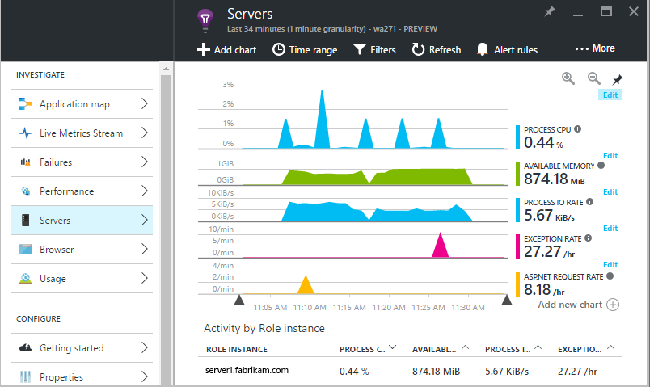
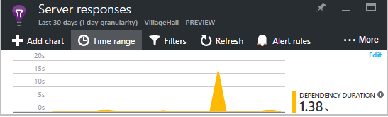

<properties 
    pageTitle="要善加運用應用程式的深入見解 |Microsoft Azure" 
    description="之後開始使用應用程式的深入見解，以下是您可以瀏覽的功能的摘要。" 
    services="application-insights" 
    documentationCenter=".net"
    authors="alancameronwills" 
    manager="douge"/>

<tags 
    ms.service="application-insights" 
    ms.workload="tbd" 
    ms.tgt_pltfrm="ibiza" 
    ms.devlang="na" 
    ms.topic="article" 
    ms.date="10/27/2016" 
    ms.author="awills"/>

# <a name="more-telemetry-from-application-insights"></a>從應用程式的深入見解的更多遙測

[新增應用程式獲得深入見解 ASP.NET 程式碼](app-insights-asp-net.md)之後，有幾個項目，您可以取得更多遙測。 

## <a name="if-your-app-runs-on-your-iis-server-"></a>如果您的應用程式執行 IIS 伺服器上...

如果您的應用程式裝載在您的控制項 IIS 伺服器上，安裝應用程式的深入見解狀態的監視器之伺服器上。 如果已安裝，您不需要執行任何動作。

1. 在每個 IIS 網頁伺服器上登入系統管理員認證。
2. 下載並執行[狀態監視器安裝程式](http://go.microsoft.com/fwlink/?LinkId=506648)。
3. 在安裝精靈中，登入 Microsoft Azure。

您不需要執行任何動作，但您可以監視已啟用您的應用程式來確認。


（您也可以使用狀態監視器若要[啟用監視在執行階段](app-insights-monitor-performance-live-website-now.md)，即使您未追蹤您的應用程式，在 Visual Studio 中的記錄。）

### <a name="what-do-you-get"></a>您收到？

如果您的伺服器電腦上安裝狀態監視器，您會收到一些額外的遙測︰

* 相依性遙測 （SQL 呼叫和您的應用程式所做的其餘部分通話）.NET 4.5 應用程式。 （.NET 的版本，狀態監視器則不需要的相依性遙測。） 
* 例外狀況堆疊追蹤顯示更多詳細資料。
* 效能計數器。 在 [應用程式的深入見解，這些計數器會出現在伺服器刀。 



若要查看更多或較少計數器，[編輯圖表](app-insights-metrics-explorer.md)。 如果您想要的效能計數器不在可用的設定，您可以[新增收集效能計數器模組的設定](app-insights-performance-counters.md)。

## <a name="if-its-an-azure-web-app-"></a>如果是 Azure web 應用程式...

如果您的應用程式執行 Azure web app，請移至 [應用程式或 VM Azure 控制台，然後開啟應用程式的深入見解刀。 

### <a name="what-do-you-get"></a>您收到？

* 例外狀況堆疊追蹤顯示更多詳細資料。
* 相依性遙測 （SQL 呼叫和您的應用程式所做的其餘部分通話）.NET 4.5 應用程式。 （.NET 的版本，擴充功能則不需要的相依性遙測。） 



（您也可以使用這個方法若要[啟用效能監視在執行階段](app-insights-monitor-performance-live-website-now.md)，即使您未追蹤您的應用程式，在 Visual Studio 中的記錄。）

## <a name="client-side-monitoring"></a>用戶端監控

您已安裝 SDK 傳送遙測資料從您的應用程式 （後端） 伺服器。 現在您可以新增用戶端監控。 可讓您的使用者、 工作階段、 頁面檢視與任何例外狀況或當機發生在瀏覽器中的資料。 您也能夠撰寫您自己的程式碼來追蹤您的使用者如何搭配您的應用程式，向右下按和按鍵詳細程度。

將應用程式的深入見解 JavaScript 片段新增至每個網頁，以取得遙測從用戶端的瀏覽器。

1. Azure 中開啟您的應用程式的應用程式的深入見解資源。
2. 開啟 [快速入門監視器用戶端，然後複製程式碼片段。
3. 貼上，讓它會出現在每個網頁-開頭通常是您可以將 [母片版面配置] 頁面的貼上。


請注意包含識別您的應用程式資源的儀器索引鍵的程式碼。

### <a name="what-do-you-get"></a>您收到？

* 您可以撰寫 JavaScript 以傳送[自訂遙測從您的網頁](app-insights-api-custom-events-metrics.md)，例如追蹤按一下按鈕。
* 在[分析](app-insights-analytics.md)中的資料中`pageViews`和 AJAX 資料`dependencies`。 
* [用戶端效能與使用情況資料](app-insights-javascript.md)的瀏覽器刀。


[進一步瞭解追蹤的網頁。](app-insights-web-track-usage.md)


## <a name="track-application-version"></a>追蹤應用程式版本

請確定`buildinfo.config`產生 MSBuild 程序。 在您.csproj 的檔案，加上︰  

```XML

    <PropertyGroup>
      <GenerateBuildInfoConfigFile>true</GenerateBuildInfoConfigFile>    <IncludeServerNameInBuildInfo>true</IncludeServerNameInBuildInfo>
    </PropertyGroup> 
```

有建立資訊，應用程式的深入見解 web 模組會自動新增**應用程式版本**為屬性遙測的每個項目。 可讓您篩選版，當執行[診斷搜尋](app-insights-diagnostic-search.md)或[瀏覽指標](app-insights-metrics-explorer.md)。 

不過，請注意，建立版本號碼產生只能由 MS 建立，不是在 Visual Studio 中的開發人員建立。


## <a name="availability-web-tests"></a>可用性 web 測試

定期從全球各地傳送您的 web 應用程式 HTTP 要求。 我們提醒您如果回應變得很慢或不可靠。

在您的應用程式的應用程式的深入見解資源，按一下 [可用性] 方塊，以新增、 編輯及檢視 web 測試。

您可以新增多個執行在多個位置的測試。


[深入瞭解](app-insights-monitor-web-app-availability.md)

## <a name="custom-telemetry-and-logging"></a>自訂遙測和記錄

您新增至您的程式碼的應用程式的深入見解套件提供 API，您可以從您的應用程式呼叫。

* [產生您自己的事件及指標](app-insights-api-custom-events-metrics.md)，例如，若要計算商務事件或監控效能。
* 從 Log4Net、 NLog 或 System.Diagnostics.Trace[擷取記錄追蹤](app-insights-asp-net-trace-logs.md)。
* [[篩選]，修改或擴充](app-insights-api-filtering-sampling.md)從您的應用程式傳送以撰寫遙測處理器標準遙測。 


## <a name="powerful-analysis-and-presentation"></a>功能強大的分析及簡報

有許多種方式瀏覽您的資料。 如果您最近已開始使用應用程式深入資訊，請查看下列文章︰

||
|---|---
|[**診斷搜尋執行個體資料**](app-insights-visual-studio.md)<br/>搜尋及篩選的事件，例如要求、 例外狀況、 相依性通話、 記錄追蹤，以及網頁檢視。 在 [Visual Studio 中，移至 [程式碼的堆疊追蹤。|
|[**指標 Explorer 彙總的資料**](app-insights-metrics-explorer.md)<br/>瀏覽、 篩選和區段彙總的資料，例如率邀請、 失敗次數及例外狀況。回應時間，頁面載入時間。|
|[**儀表板**](app-insights-dashboards.md#dashboards)<br/>混合來自多個資源的資料，以及與他人共用。 好的多元件的應用程式，並持續顯示小組聊天室。  |
|[**即時指標串流**](app-insights-metrics-explorer.md#live-metrics-stream)<br/>當您部署新組建時，請觀看這些附近即時效能標記，以確認一切運作正常。|
|[**分析**](app-insights-analytics.md)<br/>使用此功能強大的查詢語言接聽棘手的問題，瞭解您的應用程式效能及使用方式。|
|[**自動和手動通知**](app-insights-alerts.md)<br/>有之外的主要模式時，自動通知依照修改您的應用程式的遙測與觸發的標準模式。 您也可以在特定的層級的 [自訂] 或 [標準的指標設定通知。|

## <a name="data-management"></a>資料管理

|||
|---|---|
|[**連續的匯出**](app-insights-export-telemetry.md)<br/>讓您可以進行分析自己的方式，請複製到儲存空間的所有您遙測。|
|**資料存取 API**<br/>即將推出。|
|[**範例**](app-insights-sampling.md)<br/>減少資料工資率，協助您保持您價格層的限制。|