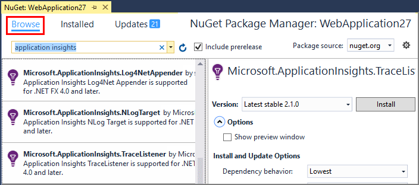

<properties 
    pageTitle="瀏覽應用程式的深入見解.NET 追蹤記錄" 
    description="搜尋與追蹤、 NLog 或 Log4Net 產生的記錄。" 
    services="application-insights" 
    documentationCenter=".net"
    authors="alancameronwills" 
    manager="douge"/>

<tags 
    ms.service="application-insights" 
    ms.workload="tbd" 
    ms.tgt_pltfrm="ibiza" 
    ms.devlang="na" 
    ms.topic="article" 
    ms.date="07/21/2016" 
    ms.author="awills"/>
 
# <a name="explore-net-trace-logs-in-application-insights"></a>瀏覽應用程式的深入見解.NET 追蹤記錄  

如果您是使用 NLog log4Net 或 System.Diagnostics.Trace 診斷追蹤 ASP.NET 應用程式中，您就可以讓您傳送[Visual Studio 應用程式]獲得深入見解的記錄[start]位置您可以瀏覽與搜尋筆記。 記錄會以來自您的應用程式，以便您可以找出相關聯服務每個使用者要求的追蹤並與其他事件和例外狀況報表建立它們的關聯的遙測合併。


> [AZURE.NOTE] 您需要的記錄檔擷取模組嗎？ 實用的介面卡的 3rd 廠商記錄程式，但如果您已經沒有使用 NLog、 log4Net 或 System.Diagnostics.Trace，請考慮只直接呼叫[應用程式的深入見解 TrackTrace()](app-insights-api-custom-events-metrics.md#track-trace) 。


## <a name="install-logging-on-your-app"></a>安裝登入您的應用程式

在專案中安裝您所選的記錄架構。 這樣應該 app.config 或 web.config 中的項目。

如果您使用的 System.Diagnostics.Trace，您需要將項目新增到 web.config:

```XML

    <configuration>
     <system.diagnostics>
       <trace autoflush="false" indentsize="4">
         <listeners>
           <add name="myListener" 
             type="System.Diagnostics.TextWriterTraceListener" 
             initializeData="TextWriterOutput.log" />
           <remove name="Default" />
         </listeners>
       </trace>
     </system.diagnostics>
   </configuration>
```

## <a name="configure-application-insights-to-collect-logs"></a>設定應用程式獲得深入見解收集記錄

**[新增至您的專案的應用程式深入資訊](app-insights-asp-net.md)**如果您還。 您會看到的選項，以包含記錄行程。

或以滑鼠右鍵按一下 [專案總管] 中的**設定應用程式深入資訊**。 選取要**設定追蹤集合**的選項。

*沒有應用程式的深入見解功能表或記錄行程選項？* 請嘗試[進行疑難排解](#troubleshooting)。


## <a name="manual-installation"></a>手動安裝

如果您的專案類型不支援的應用程式的深入見解安裝程式 （例如 Windows 桌面專案），請使用這個方法。 

1. 如果您打算使用 log4Net 或 NLog，則會安裝在您的專案。 
2. 在方案總管中，以滑鼠右鍵按一下您的專案，然後選擇 [**管理 NuGet 套件**。
3. 搜尋 」 應用程式獲得深入見解 」

    

4. 選取適當的套件-下列其中一項︰
  + Microsoft.ApplicationInsights.TraceListener （若要擷取 System.Diagnostics.Trace 來電）
  + Microsoft.ApplicationInsights.NLogTarget
  + Microsoft.ApplicationInsights.Log4NetAppender

NuGet 套件安裝必要的組件，也會修改 web.config 或 app.config。

## <a name="insert-diagnostic-log-calls"></a>插入診斷記錄通話

如果您使用 System.Diagnostics.Trace 時，會使用一般電話︰

    System.Diagnostics.Trace.TraceWarning("Slow response - database01");

如果您想 log4net 或 NLog:

    logger.Warn("Slow response - database01");


## <a name="using-the-trace-api-directly"></a>直接使用追蹤 API

您可以直接呼叫應用程式的深入見解追蹤 API。 記錄介面卡使用這個 API。 

例如︰

    var telemetry = new Microsoft.ApplicationInsights.TelemetryClient();
    telemetry.TrackTrace("Slow response - database01");

TrackTrace 的優點是，您可以將超長資料放在郵件中。 例如，您可能會編碼那里張貼資料。 

此外，您可以新增您的郵件重要性層級。 與其他遙測，例如，您可以新增您可用來協助篩選或搜尋組不同的追蹤的屬性值。 例如︰


    var telemetry = new Microsoft.ApplicationInsights.TelemetryClient();
    telemetry.TrackTrace("Slow database response",
                   SeverityLevel.Warning,
                   new Dictionary<string,string> { {"database", db.ID} });

這會讓您在[搜尋]中[diagnostic]、 輕鬆篩選出特定的資料庫建立特定的重要性層級的所有郵件。

## <a name="explore-your-logs"></a>瀏覽記錄

執行您的應用程式，在 [偵錯模式中，或將其部署即時。

在您的應用程式在[應用程式的深入見解入口網站]的概觀刀[portal]，選擇 [[搜尋]][diagnostic]。

![在 [應用程式的深入見解，選擇 [搜尋]](./media/app-insights-asp-net-trace-logs/020-diagnostic-search.png)


您可以，例如︰

* 篩選記錄追蹤，或特定內容的項目
* 檢查詳細資料的特定項的目。
* 尋找有關相同的使用者要求其他遙測 (也就是使用相同的 OperationId) 
* 將此頁面的設定儲存為最愛項目

> [AZURE.NOTE] **範例。** 如果您的應用程式傳送大量資料，您使用的應用程式的深入見解 SDK ASP.NET 版本 2.0.0-beta3 或更新版本，調整取樣功能可能運作，然後傳送您遙測的百分比。 [進一步瞭解範例。](app-insights-sampling.md)

## <a name="next-steps"></a>後續步驟

[診斷失敗和 ASP.NET 中的例外狀況][exceptions]

[深入了解搜尋][diagnostic]。


## <a name="troubleshooting"></a>疑難排解

### <a name="how-do-i-do-this-for-java"></a>如何執行動作這 java？

使用[Java 記錄介面卡](app-insights-java-trace-logs.md)。

### <a name="theres-no-application-insights-option-on-the-project-context-menu"></a>沒有專案快顯功能表上的 [應用程式深入資訊] 選項

* 核取此開發電腦上已安裝的應用程式的深入見解工具。 在 Visual Studio 功能表工具、 Extensions 和更新，尋找應用程式的深入見解工具。 如果不是在已安裝的索引標籤上，開啟 [線上] 索引標籤，並將其安裝。
* 這可能是專案的一種應用程式的深入見解工具不支援。 使用[手動安裝](#manual-installation)。

### <a name="no-log-adapter-option-in-the-configuration-tool"></a>在 [設定] 工具中沒有記錄介面卡選項

* 您必須先安裝記錄架構。
* 如果您使用的 System.Diagnostics.Trace，請確定您[在中設定`web.config`](https://msdn.microsoft.com/library/system.diagnostics.eventlogtracelistener.aspx)。
* 您已有最新版的應用程式的深入見解工具嗎？ 在 Visual Studio**工具**] 功能表中，選擇 [ **Extensions 和更新**，並開啟 [**更新**] 索引標籤。 如果應用程式的深入見解工具，按一下 [更新]。


### <a name="emptykey"></a>我收到 「 儀器鍵不是空白 」 錯誤

您沒有安裝應用程式的深入見解安裝記錄介面卡 Nuget 套件看起來。

在方案總管中，以滑鼠右鍵按一下`ApplicationInsights.config`，然後選擇 [**更新應用程式深入資訊**。 您會收到邀請您登入 Azure] 對話方塊，然後建立應用程式的深入見解資源，或重複使用現有的項目。 這樣應該修正問題。

### <a name="i-can-see-traces-in-diagnostic-search-but-not-the-other-events"></a>我可以看到追蹤診斷搜尋，但不其他事件

有時可能需要一段時間的所有事件和要求取得管線。

### <a name="limits"></a>要保留的資料量？

最多 500 個秒每個應用程式的事件。 仍會保留七天的事件。

### <a name="im-not-seeing-some-of-the-log-entries-that-i-expect"></a>我看不到部分預期的日誌項目

如果您的應用程式傳送大量資料，您使用的應用程式的深入見解 SDK ASP.NET 版本 2.0.0-beta3 或更新版本，調整取樣功能可能運作，然後傳送您遙測的百分比。 [進一步瞭解範例。](app-insights-sampling.md)

## <a name="add"></a>後續步驟

* [設定可用性和回應速度測試][availability]
* [疑難排解][qna]


<!--Link references-->

[availability]: app-insights-monitor-web-app-availability.md
[diagnostic]: app-insights-diagnostic-search.md
[exceptions]: app-insights-asp-net-exceptions.md
[portal]: https://portal.azure.com/
[qna]: app-insights-troubleshoot-faq.md
[start]: app-insights-overview.md

 
