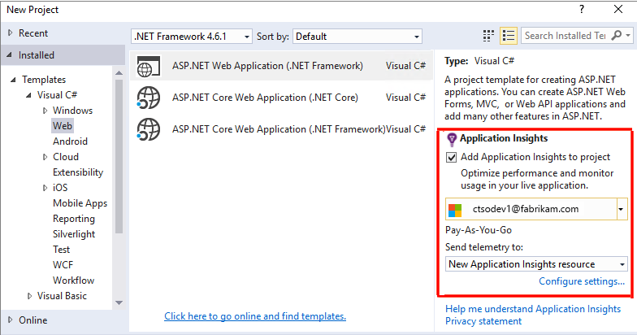

<properties 
    pageTitle="設定與應用程式的深入見解的 ASP.NET web 應用程式分析 |Microsoft Azure" 
    description="設定效能、 可用性及 ASP.NET 網站的使用狀況分析裝載於內部部署或 Azure 中。" 
    services="application-insights" 
    documentationCenter=".net"
    authors="NumberByColors" 
    manager="douge"/>

<tags 
    ms.service="application-insights" 
    ms.workload="tbd" 
    ms.tgt_pltfrm="ibiza" 
    ms.devlang="na" 
    ms.topic="get-started-article" 
    ms.date="10/13/2016" 
    ms.author="awills"/>


# <a name="set-up-application-insights-for-aspnet"></a>設定應用程式的深入見解 asp.net

[Visual Studio 應用程式獲得深入見解](app-insights-overview.md)監視即時應用程式，以協助您[偵測並診斷效能問題和例外狀況](app-insights-detect-triage-diagnose.md)，請與[探索您的應用程式的使用方式](app-insights-overview-usage.md)。  其運作方式的應用程式所裝載於您自己的內部部署 IIS 伺服器或雲端 Vm，以及 Azure web 應用程式。


## <a name="before-you-start"></a>在您開始之前

您需要︰

* Visual Studio 2013 更新 3 或更新版本。 稍後會更好。
* [Microsoft Azure](http://azure.com)訂閱。 如果您的小組或組織的 Azure 訂閱，可以新增您，使用您的[Microsoft 帳戶](http://live.com)。 

您有替代看，如果您有興趣的文章︰

* [在執行階段操作的 web 應用程式](app-insights-monitor-performance-live-website-now.md)
* [Azure 雲端服務](app-insights-cloudservices.md)

## <a name="ide"></a>1。 新增應用程式的深入見解 SDK


### <a name="if-its-a-new-project"></a>如果是新的專案...

請確定已選取應用程式的深入見解，當您在 Visual Studio 中建立新的專案。 





### <a name="-or-if-its-an-existing-project"></a>...如果它是現有的專案

以滑鼠右鍵按一下方案總管] 中的專案，然後選擇 [**新增應用程式的深入見解遙測**或**設定應用程式深入資訊**。


* ASP.NET 核心專案嗎？ -[請依照這些指示修正幾行程式碼](https://github.com/Microsoft/ApplicationInsights-aspnetcore/wiki/Getting-Started#add-application-insights-instrumentation-code-to-startupcs)。 


## <a name="run"></a>2.執行您的應用程式

F5 執行應用程式和試試看︰ 開啟產生一些遙測不同的頁面。

在 Visual Studio 中，您會看到事件記錄的計數。 

![Visual Studio 中，在 [應用程式深入資訊] 按鈕會顯示在偵錯時。](./media/app-insights-asp-net/54.png)

## <a name="3-see-your-telemetry"></a>3.請參閱您遙測...

### <a name="-in-visual-studio"></a>Visual Studio 中...

Visual Studio 中開啟應用程式的深入見解視窗︰ 按一下 [應用程式深入資訊] 按鈕，或以滑鼠右鍵按一下 [專案總管] 中︰

![Visual Studio 中，在 [應用程式深入資訊] 按鈕會顯示在偵錯時。](./media/app-insights-asp-net/55.png)

此檢視會顯示在您的應用程式的伺服器端中產生的遙測。 嘗試使用 [篩選]，然後按一下以查看更多詳細資料的任何事件]。

[深入瞭解應用程式的深入見解 Visual Studio 中的工具](app-insights-visual-studio.md)。

<a name="monitor"></a> 
### <a name="-in-the-portal"></a>入口網站中的...

除非您選擇*安裝 SDK，*您也可以查看在應用程式的深入見解入口網站遙測。 

入口網站有更多圖表、 分析工具和儀表板比 Visual Studio。 


[Azure 入口網站](https://portal.azure.com/)中，開啟您的應用程式的深入見解的資源。


入口網站會在您的應用程式從遙測的檢視開啟︰

* 第一個遙測會出現在[即時指標資料流](app-insights-metrics-explorer.md#live-metrics-stream)。
* 個別的事件會出現在**搜尋**(1)。 資料可能需要幾分鐘的時間顯示。 按一下以查看其內容的任何事件。 
* 彙總的指標出現在圖表 (2)。 可能需要一或兩資料才會出現以下的分鐘。 按一下以開啟含有更多詳細資料的 [刀任何圖表類型。

[深入瞭解使用 Azure 入口網站中的應用程式深入資訊](app-insights-dashboards.md)。

## <a name="4-publish-your-app"></a>4.發佈您的應用程式

將您的應用程式發佈到 IIS 伺服器或 Azure。 觀看[即時指標串流](app-insights-metrics-explorer.md#live-metrics-stream)，請確定順利執行。

您會看到您的應用程式的深入見解入口網站，您可以用它來監控指標、 搜尋您的遙測，並設定[儀表板](app-insights-dashboards.md)中建立的遙測。 您也可以使用功能強大[的分析查詢語言](app-insights-analytics.md)的使用情況和效能分析或尋找特定的事件。 

您也可以繼續分析[Visual Studio](app-insights-visual-studio.md)中的您遙測工具，例如 [診斷搜尋和[趨勢](app-insights-visual-studio-trends.md)。

> [AZURE.NOTE] 如果您的應用程式傳送足夠遙測方法[節流限制](app-insights-pricing.md#limits-summary)，自動[取樣](app-insights-sampling.md)切換。 取樣減少遙測傳送您的應用程式，同時保留相關的資料進行診斷的數量。


##<a name="land"></a>未新增應用程式觀點做什麼？

應用程式的深入見解會從您的應用程式中遙測傳送應用程式的深入見解入口網站 （這裝載在 Microsoft Azure）︰


命令了三個項目︰

1. 新增應用程式的深入見解 Web SDK NuGet 封裝至您的專案。 若要查看其在 Visual Studio 中，以滑鼠右鍵按一下您的專案，然後選擇 [管理 NuGet 套件。
2. [Azure 入口網站](https://portal.azure.com/)中建立的應用程式的深入見解資源。 這是您會看到您的資料的位置。 它會擷取*儀器鍵，*用來識別資源。
3. 插入的儀器按鍵`ApplicationInsights.config`，如此 SDK 可以傳送遙測入口網站。

如果想要的話，可以執行下列步驟手動[ASP.NET 4](app-insights-windows-services.md)或[ASP.NET 核心](https://github.com/Microsoft/ApplicationInsights-aspnetcore/wiki/Getting-Started)。

### <a name="to-upgrade-to-future-sdk-versions"></a>升級至未來 SDK 版本

若要將升級為[SDK 的新版本](https://github.com/Microsoft/ApplicationInsights-dotnet-server/releases)，NuGet 封裝管理員再次開啟，並篩選已安裝套件。 選取 Microsoft.ApplicationInsights.Web，然後選擇 [升級]。

如果您對所做的任何自訂 ApplicationInsights.config，請在升級，並之後將您變更合併至新的版本之前儲存一份。

## <a name="add-more-telemetry"></a>新增更多遙測

### <a name="web-pages-and-single-page-apps"></a>網頁及單一頁面應用程式

1. [新增 JavaScript 片段](app-insights-javascript.md)至網頁亮起使用頁面檢視、 載入時間、 瀏覽器的例外狀況、 AJAX 通話效能，相關資料的瀏覽器及使用方式刀使用者與工作階段的計數。
2. 若要計算、 時間或量值的使用者動作[的程式碼自訂事件](app-insights-api-custom-events-metrics.md)。

### <a name="dependencies-exceptions-and-performance-counters"></a>相依性、 例外狀況和效能計數器

[安裝狀態監視器](app-insights-monitor-performance-live-website-now.md)上每個伺服器電腦，以取得您的應用程式的相關的其他遙測。 這是您所取得︰

* [效能計數器](app-insights-performance-counters.md) - 
CPU、 記憶體、 磁碟和其他效能計數器建立您的應用程式。 
* [例外狀況](app-insights-asp-net-exceptions.md)的詳細遙測的例外狀況。
* [相依性](app-insights-asp-net-dependencies.md)的來電至 REST API 或 SQL 服務。 找出外部元件變得很慢回應是否在您的應用程式中造成效能問題。 （如果您的應用程式執行於.NET 4.6，您不需要狀態監視器，以取得此遙測）。

### <a name="diagnostic-code"></a>診斷程式碼

有任何問題嗎？ 如果您想要插入程式碼，協助診斷該應用程式中，您會有幾個選項︰

* [擷取記錄追蹤](app-insights-asp-net-trace-logs.md)︰ 如果您已使用 Log4N、 NLog 或 System.Diagnostics.Trace 記錄追蹤事件，然後將輸出可以傳送應用程式獲得深入見解，好讓您可以要求關聯，瀏覽搜尋，並進行分析。 
* [自訂事件和指標](app-insights-api-custom-events-metrics.md)︰ 使用 TrackEvent() 和 TrackMetric() 伺服器或網頁程式碼。
* [與其他屬性的標籤遙測](app-insights-api-filtering-sampling.md#add-properties)

使用[搜尋](app-insights-diagnostic-search.md)來尋找特定的事件，並執行功能更強大的查詢的[分析](app-insights-analytics.md)相互關聯。

## <a name="alerts"></a>通知

為第一個知道您的應用程式是否有問題。 （不等到您的使用者，告訴您 ！） 

* [建立 web 測試](app-insights-monitor-web-app-availability.md)，以確定您的網站就會顯示在網頁上。
* [主動式診斷](app-insights-proactive-diagnostics.md)執行自動 （如果您的應用程式具有特定最少的流量）。 您不需要執行任何動作來設定。 會告訴您應用程式是否有失敗的要求異常率。
* [設定通知，公制](app-insights-alerts.md)為度量單位，如果交叉臨界值的警告。 您可以設定這些自訂指標的程式碼至您的應用程式。

根據預設，提醒通知會傳送到 Azure 訂閱的擁有者。 


## <a name="version-and-release-tracking"></a>版本和追蹤版本

### <a name="track-application-version"></a>追蹤應用程式版本

請確定`buildinfo.config`產生 MSBuild 程序。 在您.csproj 的檔案，加上︰  

```XML

    <PropertyGroup>
      <GenerateBuildInfoConfigFile>true</GenerateBuildInfoConfigFile>    <IncludeServerNameInBuildInfo>true</IncludeServerNameInBuildInfo>
    </PropertyGroup> 
```

有建立資訊，應用程式的深入見解 web 模組會自動新增**應用程式版本**為屬性遙測的每個項目。 可讓您篩選版，當執行[診斷搜尋](app-insights-diagnostic-search.md)或[瀏覽指標](app-insights-metrics-explorer.md)。 

不過，請注意，建立版本號碼產生只能由 MS 建立，不是在 Visual Studio 中的開發人員建立。

### <a name="release-annotations"></a>發行註釋

如果您使用 Visual Studio 小組服務，您可以[取得註解標記](app-insights-annotations.md)新增至您的圖表，每當您發行的新版本。


## <a name="next-steps"></a>後續步驟

| | 
|---|---
|**[使用 Visual Studio 中的應用程式深入資訊](app-insights-visual-studio.md)**<br/>以遙測診斷偵錯搜尋，鑽研至程式碼。|
|**[使用應用程式的深入見解入口網站](app-insights-dashboards.md)**<br/>儀表板功能強大的診斷和分析工具、 通知，您的應用程式與遙測匯出的即時相依性地圖。 |
|**[新增更多資料](app-insights-asp-net-more.md)**<br/>監視使用情況、 可用性、 相依性的例外狀況。 整合記錄架構的追蹤。 撰寫自訂遙測。 | 


