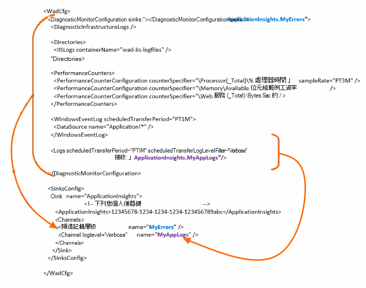

<properties
    pageTitle="應用程式獲得深入見解傳送 Azure 診斷記錄"
    description="設定 Azure 雲端服務診斷記錄傳送給應用程式的深入見解入口網站的詳細的資料。"
    services="application-insights"
    documentationCenter=".net"
    authors="sbtron"
    manager="douge"/>

<tags
    ms.service="application-insights"
    ms.workload="tbd"
    ms.tgt_pltfrm="ibiza"
    ms.devlang="na"
    ms.topic="article"
    ms.date="11/17/2015"
    ms.author="awills"/>

# <a name="configure-azure-diagnostic-logging-to-application-insights"></a>設定應用程式獲得深入見解 Azure 診斷記錄

當您設定 Cloud Services 專案] 或 [在[Azure 可以產生診斷記錄](../vs-azure-tools-diagnostics-for-cloud-services-and-virtual-machines.md)的 Microsoft Azure 虛擬機器。 您可以讓此傳送至應用程式的深入見解，好讓您可以傳送從應用程式的應用程式的深入見解 SDK 的診斷及使用方式遙測以及分析。 Azure 記錄管理的應用程式，例如開始、 停止、 當機，以及效能計數器包括事件。 登入也包含 System.Diagnostics.Trace 應用程式中的來電。

本文將說明診斷擷取的詳細資料的設定。

您需要安裝 Visual Studio 中 Azure SDK 2.8。

## <a name="get-an-application-insights-resource"></a>取得應用程式的深入見解的資源

最佳體驗，[新增應用程式的深入見解 SDK 每個角色 Cloud Services 應用程式](app-insights-cloudservices.md)，或[任何應用程式則會在您 VM 執行](app-insights-overview.md)。 您就可以傳送診斷要分析的資料，並顯示相同的應用程式的深入見解資源。

或者，如果您不想要使用 SDK-比方說，如果應用程式已經即時-您可以只[建立新的應用程式的深入見解資源](app-insights-create-new-resource.md)Azure 入口網站中。 選擇 [應用程式類型為 [ **Azure 診斷**]。


## <a name="send-azure-diagnostics-to-application-insights"></a>傳送 Azure 診斷應用程式獲得深入見解

如果您是在更新您的應用程式專案，然後在 Visual Studio 中選取 [每一個角色，選擇 [屬性，然後在 [設定] 索引標籤上，選取 [**傳送診斷應用程式獲得深入見解**。

如果您的應用程式是即時，使用 Visual Studio 伺服器總管或雲端服務檔案總管] 以開啟 [應用程式的內容。 選取 [**傳送診斷應用程式獲得深入見解**。

在每一種情況下會要求您所建立的應用程式的深入見解資源的詳細資料。

[深入瞭解應用程式獲得深入見解雲端服務應用程式的設定](app-insights-cloudservices.md)。

## <a name="configuring-the-azure-diagnostics-adapter"></a>設定 Azure 診斷卡

唯讀上是否您想要選取登入，傳送應用程式獲得深入見解的部分。 根據預設，所有項目傳送，包括︰ Microsoft Azure 事件。效能計數器;追蹤從應用程式中的來電至 System.Diagnostics.Trace。

Azure 診斷儲存至 Azure 儲存體資料表的資料。 不過，您也可以管道所有或應用程式獲得深入見解的資料子集 「 接收 」 和 「 頻道 」 中設定您的設定時使用 Azure 診斷副檔名 1.5 或更新版本。

### <a name="configure-application-insights-as-a-sink"></a>為接收設定應用程式的深入見解

當您使用的角色屬性設定 「 傳送資料至應用程式的深入見解 」 時，Azure SDK （2.8 或更新版本） 新增`<SinksConfig>`角色公用[Azure 診斷設定檔](https://msdn.microsoft.com/library/azure/dn782207.aspx)的項目。

`<SinksConfig>`定義 Azure 診斷資料可以傳送位置的其他接收。  範例`SinksConfig`看起來像這樣︰

```xml

    <SinksConfig>
     <Sink name="ApplicationInsights">
      <ApplicationInsights>{Insert InstrumentationKey}</ApplicationInsights>
      <Channels>
        <Channel logLevel="Error" name="MyTopDiagData"  />
        <Channel logLevel="Verbose" name="MyLogData"  />
      </Channels>
     </Sink>
    </SinksConfig>

```

`ApplicationInsights`項目會指定用來識別應用程式的深入見解資源將會傳送 Azure 診斷資料的儀器鍵。 當您選取資源時，會自動填入根據`APPINSIGHTS_INSTRUMENTATIONKEY`服務設定。 （如果您想要進行手動設定，取得金鑰從基本功能] 下拉式清單的資源。）

`Channels`定義會傳送至接收的資料。 頻道就像是 [篩選器。 `loglevel`屬性可讓您指定的記錄層級，將傳送給該頻道。 可用的值是︰ `{Verbose, Information, Warning, Error, Critical}`。

### <a name="send-data-to-the-sink"></a>傳送資料至接收

傳送資料至應用程式的深入見解接收加入 DiagnosticMonitorConfiguration 節點下的接收屬性。 將接收項目新增至每個節點，指定要從該節點並將其傳送至指定的接收底下的任何節點收集的資料。

例如，Azure SDK 所建立的預設值是要傳送所有的 Azure 診斷資料︰

```xml

    <DiagnosticMonitorConfiguration overallQuotaInMB="4096" sinks="ApplicationInsights">
```

但如果您想要傳送錯誤記錄檔只，接收使用限定名稱的頻道名稱︰

```xml

    <DiagnosticMonitorConfiguration overallQuotaInMB="4096" sinks="ApplicationInsights.MyTopDiagdata">
```

請注意，我們使用我們所定義，我們上方所定義的頻道的名稱與接收的名稱。

如果您只想要傳送應用程式獲得深入見解的詳細資訊的應用程式的記錄，然後您可以新增要接收屬性`Logs`節點。

```xml

    <Logs scheduledTransferPeriod="PT1M" scheduledTransferLogLevelFilter="Verbose" sinks="ApplicationInsights.MyLogData"/>
```

您也可以包含多個接收在階層中的不同層級設定。 在此情況下，指定在階層的最上層的接收做為通用設定，指定在個別的項目項目動作和通用設定覆寫相同。

以下是 [公用的設定檔應用程式獲得深入見解所傳送的所有錯誤的完整的範例 (在指定`DiagnosticMonitorConfiguration`節點)，此外詳細層級記錄應用程式記錄 (指定在`Logs`節點)。

```xml

    <WadCfg>
     <DiagnosticMonitorConfiguration overallQuotaInMB="4096"
       sinks="ApplicationInsights.MyTopDiagData"> <!-- All info below sent to this channel -->
      <DiagnosticInfrastructureLogs />
      <PerformanceCounters>
        <PerformanceCounterConfiguration counterSpecifier="\Processor(_Total)\% Processor Time" sampleRate="PT3M" sinks="ApplicationInsights.MyLogData/>
        <PerformanceCounterConfiguration counterSpecifier="\Memory\Available MBytes" sampleRate="PT3M" />
        <PerformanceCounterConfiguration counterSpecifier="\Web Service(_Total)\Bytes Total/Sec" sampleRate="PT3M" />
      </PerformanceCounters>
      <WindowsEventLog scheduledTransferPeriod="PT1M">
        <DataSource name="Application!*" />
      </WindowsEventLog>
      <Logs scheduledTransferPeriod="PT1M" scheduledTransferLogLevelFilter="Verbose"
            sinks="ApplicationInsights.MyLogData"/>
       <!-- This specific info sent to this channel -->
     </DiagnosticMonitorConfiguration>

     <SinksConfig>
      <Sink name="ApplicationInsights">
        <ApplicationInsights>{Insert InstrumentationKey}</ApplicationInsights>
        <Channels>
          <Channel logLevel="Error" name="MyTopDiagData"  />
          <Channel logLevel="Verbose" name="MyLogData"  />
        </Channels>
      </Sink>
     </SinksConfig>
    </WadCfg>
```



有一些限制，瞭解使用此功能︰

* 頻道只是要使用的記錄類型和不效能計數器。 如果您指定頻道與效能計數器項目也會忽略。
* 頻道記錄層級不得超過什麼收集的 Azure 診斷記錄層的級。 例如︰ 您無法收集記錄項目中的應用程式記錄檔錯誤，並嘗試傳送詳細資訊記錄檔給應用程式充分同步處理。 ScheduledTransferLogLevelFilter 屬性必須永遠收集等於或大於記錄其他記錄想要傳送至接收。
* 您無法傳送任何 blob 資料收集 Azure 診斷延伸到應用程式獲得深入見解。 例如任何項目] 底下所指定目錄節點。 當機傾印的實際當機傾印則仍會傳送給 blob 儲存體，只產生損毀傾印通知將會傳送至應用程式的深入見解。

## <a name="related-topics"></a>相關的主題

* [使用應用程式的深入見解的監控 Azure 雲端服務](app-insights-cloudservices.md)
* [使用 PowerShell 來傳送 Azure 診斷應用程式獲得深入見解](app-insights-powershell-azure-diagnostics.md)
* [Azure 診斷設定檔案](https://msdn.microsoft.com/library/azure/dn782207.aspx)
