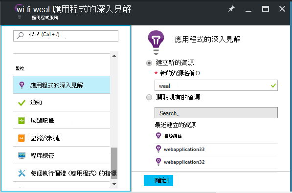
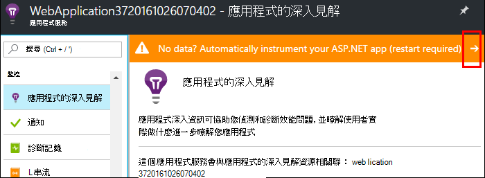
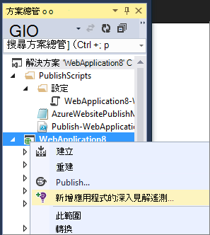
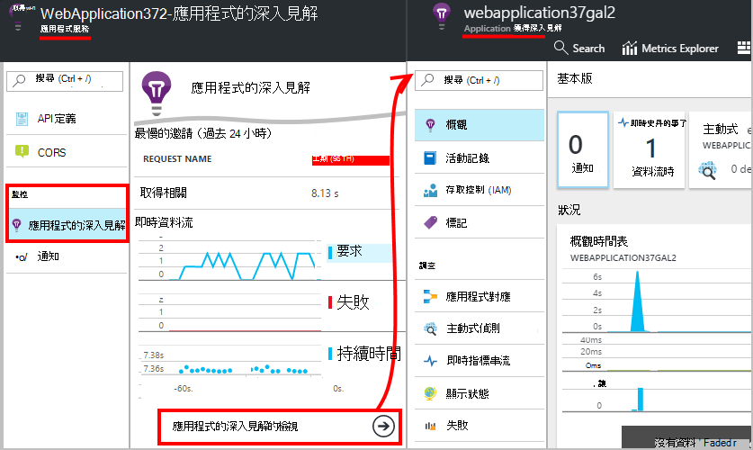
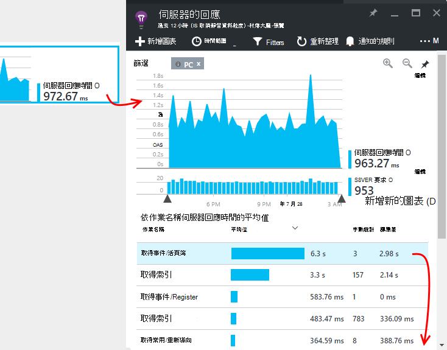

<properties
    pageTitle="監控 Azure web 應用程式的效能 |Microsoft Azure"
    description="應用程式的效能監視 Azure web 應用程式。 圖表載入] 和 [回應] 時間、 相依資訊以及設定通知的效能。"
    services="application-insights"
    documentationCenter=".net"
    authors="alancameronwills"
    manager="douge"/>

<tags
    ms.service="azure-portal"
    ms.workload="na"
    ms.tgt_pltfrm="na"
    ms.devlang="na"
    ms.topic="article"
    ms.date="10/24/2016"
    ms.author="awills"/>

# 監控 Azure web 應用程式的效能

[Azure 入口網站](https://portal.azure.com)中，您可以設定應用程式效能監視您[Azure web 應用程式](../app-service-web/app-service-web-overview.md)。 [Visual Studio 應用程式獲得深入見解](app-insights-overview.md)instruments 遙測其活動資訊傳送到應用程式的深入見解服務，它會在此儲存並分析您的應用程式。 那里，公制的圖表和搜尋工具可協助診斷問題、 改善效能，以及評估使用方式。

## 執行階段，或建立時間

您可以設定監視的操作的應用程式中的兩種方法之一︰

* **執行階段**-您可以選取效能監視擴充 web 應用程式已即時時。 您不需重建或重新安裝您的應用程式。 您收到一組標準的套件的監控回應時間、 成功率，例外狀況、 相依性，等等。 
 
* **建立時間**-您可以在開發應用程式中安裝套件。 這個選項會更多功能。 除了相同的標準套件，您可以撰寫程式碼自訂遙測，或傳送自己遙測。 您可以在特定的活動或根據您的應用程式網域的語意記錄事件記錄。 

## 執行與應用程式的深入見解的時間儀器

如果您已經 Azure 中執行的 web 應用程式，您已經取得一些監控︰ 要求和錯誤。 新增應用程式以取得更多，例如回應時間的深入見解、 監控的來電至] 相依性智慧偵測和功能強大的分析查詢語言。 

1. Web app Azure [控制台] 中**選取 [應用程式深入資訊**。

    

 * 除非您已設定此應用程式的應用程式的深入見解資源另一個路由，請選擇 [建立新的資源，]。

2. **樂器 web 應用程式**之後已安裝應用程式的深入見解。 

    

3. **監控您的應用程式**。  [Expore 資料](#explore-the-data)。

之後，您可以建立並重新部署與應用程式的深入見解的應用程式，如果您想要。

*如何移除應用程式的深入見解，或切換到傳送給其他資源？*

* Azure 中開啟 web 應用程式控制項刀，並在開發工具] 下開啟**副檔名**。 刪除應用程式的深入見解副檔名。 然後在監控，選擇 [應用程式的深入見解和建立或選取您要的資源。

## 建立應用程式的深入見解應用程式

應用程式的深入見解可以提供更詳細的遙測安裝 SDK 到您的應用程式。 特別是，您可以收集追蹤記錄檔，[撰寫自訂遙測](../application-insights/app-insights-api-custom-events-metrics.md)、，並取得更詳細的例外狀況報告。

1. **在 Visual Studio 中**（2013年更新 2 或更新版本），將應用程式的深入見解 SDK 新增至您的專案。

    

    如果系統要求您登入，請 Azure 帳戶使用認證。

    作業有兩個效果︰

 1. Azure 儲存、 分析和顯示遙測位置中建立的應用程式的深入見解資源。
 2. 新增應用程式的深入見解 NuGet 封裝至程式碼，並設定其傳送至 Azure 資源的遙測。

2. **測試遙測**的方法是在您的部署電腦 (F5) 中執行的應用程式。

3. 依照平常的方式中 Azure 至**發佈應用程式**。 

*如何切換傳送到不同的應用程式的深入見解資源？*

* 在 Visual Studio 中，以滑鼠右鍵按一下專案，選擇 [**應用程式的深入見解 > 設定**，然後選擇您要的資源。 您收到建立新的資源的選項。 重建並重新部署。

## 探索資料

1. 在 web 應用程式控制台應用程式的深入見解刀，您會看到即時指標，其中顯示要求與失敗中第二個或兩項發生。 當您要重新發佈應用程式-您可以立即看到任何問題時，就很有用的顯示。

2. 完整的應用程式的深入見解資源，按一下 [完成]。

    
    

    您也可以那里前往或直接從 Azure 資源功能。

2. 按一下 [透過任何圖表，好讓更多詳細資料︰

    

    您可以[自訂指標刀](../application-insights/app-insights-metrics-explorer.md)。

3. 按一下 [透過進一步，請參閱個別事件和其屬性︰

    ![按一下 [事件類型]，開啟 [搜尋篩選的類型](./media/app-insights-azure-web-apps/08-requests.png)

    請注意 [...] 連結以開啟 [所有內容。

    您可以[自訂搜尋](../application-insights/app-insights-diagnostic-search.md)。

在您遙測功能更強大的搜尋，請使用[狀況分析查詢語言](../application-insights/app-insights-analytics-tour.md)。

## 後續步驟

* [啟用 Azure 診斷](app-insights-azure-diagnostics.md)傳送到應用程式的深入見解。
* [監視服務健康狀況指標](../monitoring-and-diagnostics/insights-how-to-customize-monitoring.md)，請確定您的服務是可用和回應。
* [接收提醒通知](../monitoring-and-diagnostics/insights-receive-alert-notifications.md)作業事件發生時或指標交互臨界值。
* 取得用戶端遙測造訪的網頁瀏覽器中使用[JavaScript 應用程式和網頁應用程式深入資訊](app-insights-web-track-usage.md)。
* 若要收到您的網站是否向下，[設定可用性 web 測試](app-insights-monitor-web-app-availability.md)。
