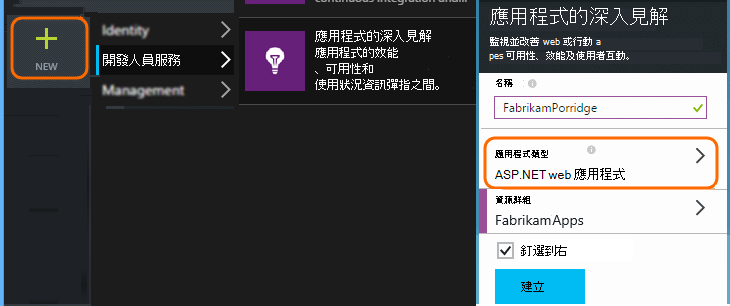
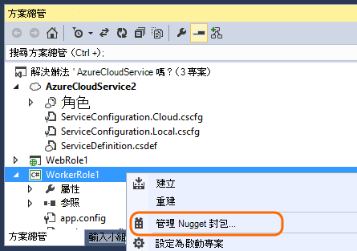

<properties
   pageTitle="Azure 雲端服務應用程式深入資訊"
   description="監控您的網頁和背景工作角色有效地使用應用程式的深入見解"
   services="application-insights"
   documentationCenter=""
   authors="soubhagyadash"
   manager="douge"
   editor="alancameronwills"/>

<tags
   ms.service="application-insights"
   ms.devlang="na"
   ms.tgt_pltfrm="ibiza"
   ms.topic="article"
   ms.workload="tbd"
   ms.date="03/02/2016"
   ms.author="sdash"/>

# <a name="application-insights-for-azure-cloud-services"></a>Azure 雲端服務應用程式深入資訊


*應用程式的深入見解位於預覽*

[Microsoft Azure 雲端服務應用程式](https://azure.microsoft.com/services/cloud-services/)可以監視的[Visual Studio 應用程式獲得深入見解][start]可用性、 效能、 失敗及使用方式。 您取得效能和您的應用程式的相關肆虐的意見反應，您可以在每個開發週期讓謹慎的選擇設計的方向。


您需要[Microsoft Azure](http://azure.com)的訂閱。 使用 Microsoft 帳戶，您可能會有 Windows、 XBox Live 或其他 Microsoft 雲端服務的登入。 


#### <a name="sample-application-instrumented-with-application-insights"></a>使用應用程式的深入見解檢測範例應用程式

看看的應用程式的深入見解會新增至雲端服務裝載於 Azure 中的兩個工作者角色與此[範例應用程式](https://github.com/Microsoft/ApplicationInsights-Home/tree/master/Samples/AzureEmailService)。 

以下會告訴您如何修改您的雲端服務專案以相同的方式。

## <a name="create-an-application-insights-resource-for-each-role"></a>建立應用程式的深入見解資源的每一個角色

應用程式的深入見解資源是分析並顯示遙測資料。  

1.  [Azure 入口網站]中[portal]，建立新的應用程式的深入見解資源。 應用程式類型，選擇 [ASP.NET 應用程式]。 

    

2.  需要儀器索引鍵的複本。 您需要此引進了設定 SDK。

    


最好通常會[建立不同的資源的每個網頁和背景工作角色中的資料](app-insights-separate-resources.md)。 

或者，您可以從各種角色傳送資料，只要資源，但設定[預設的屬性][ apidefaults] ，讓您可以篩選或群組每一個角色的結果。

## <a name="sdk"></a>每個專案中安裝 SDK


1. Visual Studio 中，在 [編輯您的雲端應用程式專案的 NuGet 套件。

    


2. 新增 web 角色[Web 應用程式深入資訊](http://www.nuget.org/packages/Microsoft.ApplicationInsights.Web)NuGet 套件。 這個版本的 SDK 包含新增伺服器內容，例如角色資訊的模組。 如需工作者角色使用[應用程式的深入見解 Windows 伺服器](https://www.nuget.org/packages/Microsoft.ApplicationInsights.WindowsServer/)。

    


3. 設定傳送資料至應用程式的深入見解資源 SDK。

    設定為 [組態設定儀器鍵，檔案中`ServiceConfiguration.Cloud.cscfg`。 （[範例](https://github.com/Microsoft/ApplicationInsights-Home/blob/master/Samples/AzureEmailService/AzureEmailService/ServiceConfiguration.Cloud.cscfg)）。
 
    ```XML
     <Role name="WorkerRoleA"> 
      <Setting name="APPINSIGHTS_INSTRUMENTATIONKEY" value="YOUR IKEY" /> 
     </Role>
    ```
 
    在適當的啟動函數中，設定儀器鍵從設定的設定︰

    ```C#
     TelemetryConfiguration.Active.InstrumentationKey = RoleEnvironment.GetConfigurationSettingValue("APPINSIGHTS_INSTRUMENTATIONKEY");
    ```

    請注意，相同的名稱`APPINSIGHTS_INSTRUMENTATIONKEY`設定的設定將會使用 Azure 診斷報告。 


    執行此動作的每個應用程式中的角色。 請參閱範例︰
 
 * [網頁角色](https://github.com/Microsoft/ApplicationInsights-Home/blob/master/Samples/AzureEmailService/MvcWebRole/Global.asax.cs#L27)
 * [工作者角色](https://github.com/Microsoft/ApplicationInsights-Home/blob/master/Samples/AzureEmailService/WorkerRoleA/WorkerRoleA.cs#L232)
 * [網頁](https://github.com/Microsoft/ApplicationInsights-Home/blob/master/Samples/AzureEmailService/MvcWebRole/Views/Shared/_Layout.cshtml#L13)   

4. 設定永遠複製到輸出目錄 ApplicationInsights.config 檔案。 

    （在.config 檔案中，您會看到那里放置儀器鍵詢問您的郵件。 不過，雲端應用程式最好是將它從.cscfg 檔案。 這可確保角色會正確識別入口網站中。）


#### <a name="run-and-publish-the-app"></a>執行及發佈應用程式

執行您的應用程式，並登入 Azure。 開啟您建立的應用程式的深入見解資源，您會看到出現在 [[搜尋](app-insights-diagnostic-search.md)] 中的個別資料點，然後彙總[公制檔案總管](app-insights-metrics-explorer.md)中的資料。 

新增更多遙測-請參閱下方的節，然後將發佈您的應用程式取得即時診斷及使用方式的意見反應。 


#### <a name="no-data"></a>沒有資料？

* 開啟[搜尋][diagnostic]磚，以查看個別的事件。
* 使用應用程式，使其產生一些遙測開啟不同的頁面。
* 請稍候，然後按一下 [重新整理]。
* 請參閱[疑難排解][qna]。


## <a name="more-telemetry"></a>更多遙測

以下各節說明如何從不同層面的應用程式取得其他遙測。


## <a name="track-requests-from-worker-roles"></a>追蹤要求工作者角色的存取

在 web 角色，要求模組自動收集 HTTP 要求的相關資料。 請參閱[範例 MVCWebRole](https://github.com/Microsoft/ApplicationInsights-Home/tree/master/Samples/AzureEmailService/MvcWebRole)如需如何覆寫預設集合行為的範例。 

您可以追蹤他們的 HTTP 要求相同的方式來擷取的來電至工作者角色的效能。 在 [應用程式的深入見解要求遙測類型測量已命名的伺服器端工作可以逾時，並可獨立成功或失敗的單位。 雖然 SDK 會自動擷取 HTTP 要求，您可以插入自己工作者角色以追蹤要求的程式碼。

請參閱檢測報表的要求的兩個範例工作者角色︰ [WorkerRoleA](https://github.com/Microsoft/ApplicationInsights-Home/tree/master/Samples/AzureEmailService/WorkerRoleA)和[WorkerRoleB](https://github.com/Microsoft/ApplicationInsights-Home/tree/master/Samples/AzureEmailService/WorkerRoleB)

## <a name="azure-diagnostics"></a>Azure 診斷程式

[Azure 診斷程式](../vs-azure-tools-diagnostics-for-cloud-services-and-virtual-machines.md)的資料包含角色管理事件、 效能計數器與應用程式的記錄。 讓您可以看到他們同時您遙測，其餘容易診斷問題，您可以讓這些應用程式獲得深入見解傳送。

如果角色意外，或無法啟動，azure 診斷是特別有用。

1. 以滑鼠右鍵按一下要開啟其內容的角色 （非專案 ！），然後選取 [**啟用診斷**，**傳送應用程式獲得深入見解的診斷**。

    

    **或已發佈及執行您的應用程式時**，開啟伺服器總管或雲端總管] 中，以滑鼠右鍵按一下您的應用程式，然後選取相同的選項。

3.  選取您其他遙測相同的應用程式的深入見解資源。

    如果您想，您就可以在不同的服務設定雲端 （本機），協助保留開發資料的即時資料分開設定不同的資源。

3. 您也可以[排除某些 Azure 診斷](app-insights-azure-diagnostics.md)要轉寄應用程式獲得深入見解。 預設為所有項目。

### <a name="view-azure-diagnostic-events"></a>檢視 Azure 診斷事件

若要尋找診斷位置︰

* 效能計數器會顯示為自訂指標。 
* Windows 事件記錄檔會顯示為追蹤及自訂的事件。
* 應用程式的記錄、 ETW 記錄，以及任何診斷基礎結構的記錄會顯示為追蹤。

若要查看正在及事件的數量，請開啟[指標檔案總管]](app-insights-metrics-explorer.md)並新增圖表︰


使用[搜尋](app-insights-diagnostic-search.md)在各種 Azure 診斷所傳送的追蹤記錄檔中搜尋。 例如，如果您有 unhanded 例外狀況角色導致當機和資源回收角色、，資訊就會出現在應用程式頻道的 Windows 事件記錄檔。 若要查看的 Windows 事件記錄檔錯誤，並讓您尋找問題的根本原因的例外狀況，取得完整的堆疊追蹤，您可以使用搜尋功能。


## <a name="app-diagnostics"></a>應用程式診斷程式

Azure 診斷會自動包含您的應用程式會產生使用 System.Diagnostics.Trace 的日誌項目。 

但如果您已使用 Log4N 或 NLog 架構，您也可以[擷取其記錄追蹤][netlogs]。

[追蹤自訂事件和指標][api]用戶端或伺服器或兩者，若要深入瞭解應用程式的效能及使用方式。

## <a name="dependencies"></a>相依性

應用程式的深入見解 SDK 可以報告您的應用程式進行 REST api 和 SQL server 等外部相依性的電話。 這個選項可讓您查看特定的相依性是否會造成變得很慢的回應或失敗。

如果您的應用程式使用.NET framework 4.6 或更新版本，您不需要執行任何動作。 

否則，設定與[應用程式的深入見解代理程式](app-insights-monitor-performance-live-website-now.md)也稱為 「 狀態監視器 」 的 web/工作者角色。

若要使用的應用程式的深入見解代理程式與您的 web/工作者角色︰

* 將[AppInsightsAgent](https://github.com/Microsoft/ApplicationInsights-Home/tree/master/Samples/AzureEmailService/WorkerRoleA/AppInsightsAgent)資料夾及其中的兩個檔案中將其新增至網頁/工作者角色專案。 請務必將其建立內容，使它們永遠複製到輸出目錄。 這些檔案安裝代理程式。
* 新增為 [顯示[以下](https://github.com/Microsoft/ApplicationInsights-Home/tree/master/Samples/AzureEmailService/AzureEmailService/ServiceDefinition.csdef#L18)設定任務開始 CSDEF 檔案。
* 注意︰*工作者角色*為顯示[以下](https://github.com/Microsoft/ApplicationInsights-Home/tree/master/Samples/AzureEmailService/AzureEmailService/ServiceDefinition.csdef#L44)需要三個環境變數。 這不是必要的 web 角色。

### <a name="dependency-reports"></a>相依性的報表

以下是您在應用程式的深入見解入口網站中所看到的情況範例︰

* 使用自動相關的要求和相依性的 rtf 診斷︰

    

* 效能的 web 角色、 相依性的資訊︰

    

* 以下是在邀請和相依性資訊工作者角色的螢幕擷取畫面︰

    

## <a name="exceptions"></a>例外狀況

您可以在如何從不同的 web 應用程式類型收集處理的例外狀況的詳細資訊，請參閱[監視應用程式的深入見解的例外狀況](app-insights-asp-net-exceptions.md)。

範例網頁角色具有 MVC5 及網頁 API 2 控制器。 以下列擷取到 2 未處理的例外狀況︰

* [AiHandleErrorAttribute](https://github.com/Microsoft/ApplicationInsights-Home/blob/master/Samples/AzureEmailService/MvcWebRole/Telemetry/AiHandleErrorAttribute.cs)設定[以下](https://github.com/Microsoft/ApplicationInsights-Home/blob/master/Samples/AzureEmailService/MvcWebRole/App_Start/FilterConfig.cs#L12)MVC5 控制站
* [AiWebApiExceptionLogger](https://github.com/Microsoft/ApplicationInsights-Home/blob/master/Samples/AzureEmailService/MvcWebRole/Telemetry/AiWebApiExceptionLogger.cs)設定[以下](https://github.com/Microsoft/ApplicationInsights-Home/blob/master/Samples/AzureEmailService/MvcWebRole/App_Start/WebApiConfig.cs#L25)Web API 2 控制站

工作者角色，有兩種方式來追蹤例外狀況。

* TrackException(ex)
* 如果您已新增應用程式的深入見解追蹤接聽 NuGet 套件，您可以使用 System.Diagnostics.Trace 登入的例外狀況。 [程式碼範例。](https://github.com/Microsoft/ApplicationInsights-Home/blob/master/Samples/AzureEmailService/WorkerRoleA/WorkerRoleA.cs#L107)

## <a name="performance-counters"></a>效能計數器

依預設收集下列計數器︰

    * \Process(??APP_WIN32_PROC??)\%處理器時間
    * \Memory\Available 位元組
    * \.網路 CLR Exceptions(??APP_CLR_PROC??)\# Exceps 擲回 / 秒的
    * \Process （？。APP_WIN32_PROC？)\Private 位元組
    * \Process （？。APP_WIN32_PROC？)\IO 資料秒位元組
    * \Processor(_Total)\%處理器時間

此外，下列也收集的 web 角色︰

    * \ASP.NET 應用程式 （？。APP_W3SVC_PROC？)\Requests/Sec    
    * \ASP.NET 應用程式 （？。APP_W3SVC_PROC？)\Request 執行時間
    * \ASP.NET 應用程式 （？。APP_W3SVC_PROC？)在 [應用程式佇列中 \Requests

您可以指定其他自訂或其他 windows 效能計數器顯示[以下](https://github.com/Microsoft/ApplicationInsights-Home/blob/master/Samples/AzureEmailService/WorkerRoleA/ApplicationInsights.config#L14)

  

## <a name="correlated-telemetry-for-worker-roles"></a>相互關聯的遙測的工作者角色

當您可以看到導致失敗] 或 [高延遲要求時，則豐富的診斷體驗。 使用 web 角色 SDK 會自動設定相關遙測之間的關聯性。 工作者角色，您可以使用的自訂遙測初始設定，若要設定要達到此目標的所有遙測常見 Operation.Id 內容屬性。 這會允許您看到 [延遲/失敗問題所造成的相依性或程式碼，概覽 ！ 

以下是如何︰

* 設定為 [顯示[以下](https://github.com/Microsoft/ApplicationInsights-Home/blob/master/Samples/AzureEmailService/WorkerRoleA/WorkerRoleA.cs#L36)的相互關聯識別碼到 CallContext。 在此案例中，我們使用的 「 要求識別碼的相互關聯識別碼
* 新增自訂的 TelemetryInitializer 實作，會設定設為以上的相互關聯識別碼 Operation.Id。 此處所示︰ [ItemCorrelationTelemetryInitializer](https://github.com/Microsoft/ApplicationInsights-Home/blob/master/Samples/AzureEmailService/WorkerRoleA/Telemetry/ItemCorrelationTelemetryInitializer.cs#L13)
* 新增自訂的遙測初始設定。 您可以執行或程式碼中 ApplicationInsights.config 檔案，以顯示[以下](https://github.com/Microsoft/ApplicationInsights-Home/blob/master/Samples/AzureEmailService/WorkerRoleA/WorkerRoleA.cs#L233)

這樣就可以 ！ 入口網站的經驗已固定可協助您查看所有相關聯的遙測概覽︰


## <a name="client-telemetry"></a>用戶端遙測

[新增至網頁的 JavaScript SDK] [ client] ，取得瀏覽器為基礎的遙測，例如頁面檢視計算、 頁面載入時間、 指令碼例外]，並可讓您在頁面指令碼撰寫自訂遙測。

## <a name="availability-tests"></a>可用性測試

[設定 web 測試][availability]以確定您的應用程式保持即時和回應。


## <a name="example"></a>範例

[範例](https://github.com/Microsoft/ApplicationInsights-Home/tree/master/Samples/AzureEmailService)監視服務有網頁角色及兩個工作者角色。

## <a name="exception-method-not-found-on-running-in-azure-cloud-services"></a>例外狀況 」 找不到方法 」 上執行中 Azure 雲端服務

您建立的.NET 4.6 並未嗎？ Azure 雲端服務角色不會自動支援 4.6。 執行您的應用程式之前，先[安裝 4.6，每一個角色](../cloud-services/cloud-services-dotnet-install-dotnet.md)。

## <a name="related-topics"></a>相關的主題

* [設定應用程式獲得深入見解傳送 Azure 診斷程式](app-insights-azure-diagnostics.md)
* [使用 PowerShell 來傳送 Azure 診斷應用程式獲得深入見解](app-insights-powershell-azure-diagnostics.md)


[api]: app-insights-api-custom-events-metrics.md
[apidefaults]: app-insights-api-custom-events-metrics.md#default-properties
[apidynamicikey]: app-insights-separate-resources.md#dynamic-ikey
[availability]: app-insights-monitor-web-app-availability.md
[azure]: app-insights-azure.md
[client]: app-insights-javascript.md
[diagnostic]: app-insights-diagnostic-search.md
[netlogs]: app-insights-asp-net-trace-logs.md
[portal]: http://portal.azure.com/
[qna]: app-insights-troubleshoot-faq.md
[redfield]: app-insights-monitor-performance-live-website-now.md
[start]: app-insights-overview.md 
