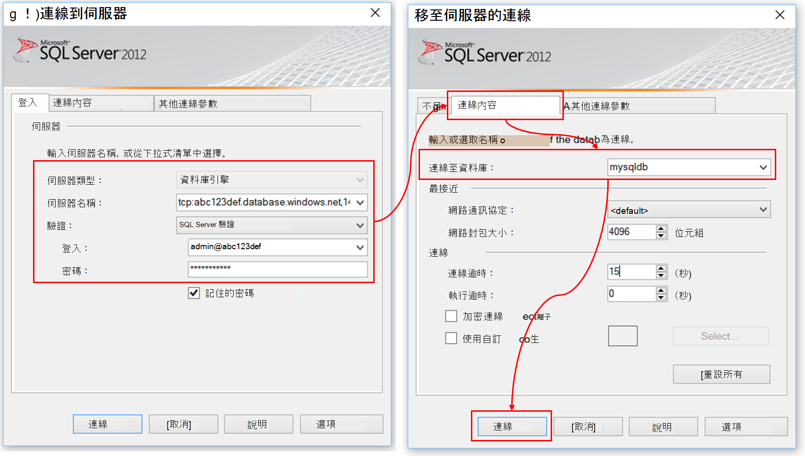
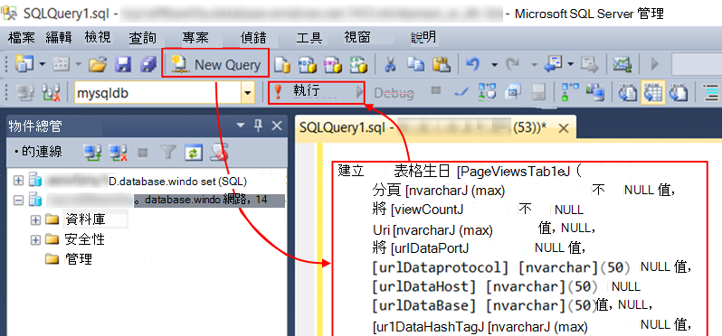

<properties 
    pageTitle="逐步解說︰ 從應用程式的深入見解將遙測匯出到 SQL 資料庫" 
    description="持續匯出至 SQL 使用串流分析的應用程式的深入見解的資料。" 
    services="application-insights" 
    documentationCenter=""
    authors="noamben" 
    manager="douge"/>

<tags 
    ms.service="application-insights" 
    ms.workload="tbd" 
    ms.tgt_pltfrm="ibiza" 
    ms.devlang="na" 
    ms.topic="article" 
    ms.date="03/06/2015" 
    ms.author="awills"/>
 
# <a name="walkthrough-export-to-sql-from-application-insights-using-stream-analytics"></a>從應用程式使用串流分析的深入見解的逐步解說︰ 匯出 sql

本文將示範如何移動遙測資料的[Visual Studio 應用程式獲得深入見解][start]至 Azure SQL 資料庫使用[連續匯出][export]和[Azure 資料流分析](https://azure.microsoft.com/services/stream-analytics/)。 

連續匯出進入 Azure 儲存體 JSON 格式遙測資料。 我們將會剖析使用 Azure 資料流分析 JSON 物件，建立資料庫資料表中的資料列。

（通常連續匯出為執行您自己的分析您的應用程式傳送應用程式獲得深入見解遙測的方式。 您可以採用此程式碼範例，若要執行其他動作，以匯出遙測，例如彙總的資料。）

我們開始假設您已經有您想要監視的應用程式。


在此範例中，我們會使用頁面檢視資料，但相同模式，可以延伸至其他資料類型，例如自訂事件和例外狀況。 


## <a name="add-application-insights-to-your-application"></a>將應用程式的深入見解新增至您的應用程式


若要開始使用︰

1. [設定應用程式獲得深入見解的網頁](app-insights-javascript.md)。 

    （在此範例中，我們將焦點放在處理頁面檢視資料，從用戶端的瀏覽器，但您也可以設定[Java](app-insights-java-get-started.md)或[ASP.NET](app-insights-asp-net.md)應用程式與程序要求、 相依性和其他伺服器遙測的伺服器端的應用程式深入資訊）。


5. 發佈您的應用程式，並觀看遙測資料出現在您的應用程式的深入見解的資源。


## <a name="create-storage-in-azure"></a>建立 Azure 中的儲存空間

連續匯出永遠輸出 Azure 儲存體帳戶、 資料，因此您需要先建立儲存空間。

1. 建立您的訂閱在[Azure 入口網站]中的儲存空間帳戶[portal]。

    ![在 Azure 入口網站中，選擇 [新增資料、 儲存空間]。 選取 [傳統，選擇 [建立]。 提供儲存空間的名稱。](./media/app-insights-code-sample-export-sql-stream-analytics/040-store.png)

2. 建立容器

    ![在新的儲存空間，選取 [容器，然後按一下 [容器] 方塊中，然後新增](./media/app-insights-code-sample-export-sql-stream-analytics/050-container.png)

3. 複製的儲存空間便捷鍵

    您必須將立即設定資料流分析服務輸入。

    ![在儲存空間，開啟 [設定] 鍵，並採取存取主索引鍵的複本](./media/app-insights-code-sample-export-sql-stream-analytics/21-storage-key.png)

## <a name="start-continuous-export-to-azure-storage"></a>啟動 [接續本頁] 分匯出至 Azure 儲存體

1. 在 Azure 入口網站中，瀏覽至您建立的應用程式的應用程式的深入見解資源。

    ![選擇 [瀏覽]，應用程式的深入見解，您的應用程式](./media/app-insights-code-sample-export-sql-stream-analytics/060-browse.png)

2. 建立連續的匯出。

    ![選擇 [設定]，[接續本頁] 分匯出] 新增](./media/app-insights-code-sample-export-sql-stream-analytics/070-export.png)


    選取您先前建立的儲存空間帳戶︰

    
    
    設定您想要查看的事件類型︰

    


3. 讓累積一些資料。 坐，讓您的應用程式，使用一段的人員。 遙測傳送，您會看到[公制檔案總管]](app-insights-metrics-explorer.md)中的統計圖表和[搜尋診斷](app-insights-diagnostic-search.md)] 中的個別事件。 

    此外，資料會匯出您的儲存空間。 

4. 檢查匯出資料，請在入口網站-選擇 [**瀏覽**，您儲存帳戶，依序選取 [**容器**-或 Visual Studio 中。 在 Visual Studio 中，選擇 [**檢視 / 雲端總管**，並開啟 Azure / 儲存空間。 (如果您沒有安裝此功能表選項，您需要安裝 Azure SDK︰ 開啟新的專案] 對話方塊，並開啟 Visual C# / 雲端 / Microsoft Azure SDK 取得.NET。)

    

    記下路徑名稱，衍生自應用程式名稱] 和 [儀器鍵常見的一部分。 

事件會寫入到 blob JSON 格式的檔案。 每個檔案可能包含一或多個事件。 因此我們想要閱讀的事件資料，並篩選出我們所要的欄位。 所有類型的資料，無法處理的項目，但我們計畫今天是使用串流分析，將資料移到 SQL 資料庫。 會讓您輕鬆地執行許多感興趣的查詢。

## <a name="create-an-azure-sql-database"></a>建立 Azure SQL 資料庫

重新啟動您的訂閱[Azure 入口網站]中[portal]，建立資料庫 (和新的伺服器，除非您已取得一個) 至您要寫資料。


確定資料庫伺服器允許存取 Azure 服務︰


## <a name="create-a-table-in-azure-sql-db"></a>Azure SQL 資料庫中建立表格

連線到前一節使用您慣用的管理工具中建立資料庫。 在此逐步解說，我們將會使用[SQL Server 管理工具](https://msdn.microsoft.com/ms174173.aspx)(SSMS)。



建立新的查詢，然後執行下列 T SQL:

```SQL

CREATE TABLE [dbo].[PageViewsTable](
    [pageName] [nvarchar](max) NOT NULL,
    [viewCount] [int] NOT NULL,
    [url] [nvarchar](max) NULL,
    [urlDataPort] [int] NULL,
    [urlDataprotocol] [nvarchar](50) NULL,
    [urlDataHost] [nvarchar](50) NULL,
    [urlDataBase] [nvarchar](50) NULL,
    [urlDataHashTag] [nvarchar](max) NULL,
    [eventTime] [datetime] NOT NULL,
    [isSynthetic] [nvarchar](50) NULL,
    [deviceId] [nvarchar](50) NULL,
    [deviceType] [nvarchar](50) NULL,
    [os] [nvarchar](50) NULL,
    [osVersion] [nvarchar](50) NULL,
    [locale] [nvarchar](50) NULL,
    [userAgent] [nvarchar](max) NULL,
    [browser] [nvarchar](50) NULL,
    [browserVersion] [nvarchar](50) NULL,
    [screenResolution] [nvarchar](50) NULL,
    [sessionId] [nvarchar](max) NULL,
    [sessionIsFirst] [nvarchar](50) NULL,
    [clientIp] [nvarchar](50) NULL,
    [continent] [nvarchar](50) NULL,
    [country] [nvarchar](50) NULL,
    [province] [nvarchar](50) NULL,
    [city] [nvarchar](50) NULL
)

CREATE CLUSTERED INDEX [pvTblIdx] ON [dbo].[PageViewsTable]
(
    [eventTime] ASC
)WITH (PAD_INDEX = OFF, STATISTICS_NORECOMPUTE = OFF, SORT_IN_TEMPDB = OFF, DROP_EXISTING = OFF, ONLINE = OFF, ALLOW_ROW_LOCKS = ON, ALLOW_PAGE_LOCKS = ON)

```



在此範例中，我們會使用頁面檢視] 中的資料。 若要查看可用的其他資料，請檢查您的 JSON 輸出，請參閱[匯出資料模型](app-insights-export-data-model.md)的。

## <a name="create-an-azure-stream-analytics-instance"></a>建立 Azure 資料流分析執行個體

[傳統 Azure 入口網站](https://manage.windowsazure.com/)中，選取 [Azure 資料流分析服務]，並建立新的資料流分析工作︰


建立新的工作時，展開 [詳細資料︰


#### <a name="set-blob-location"></a>設定 blob 位置

設定將會從您的連續匯出 blob 輸入︰


現在，您會從您先前所述的儲存空間帳戶需要存取主索引鍵。 設定此儲存帳戶索引鍵。


#### <a name="set-path-prefix-pattern"></a>設定路徑首碼圖樣 


請務必日期格式設定為 [ **YYYY MM DD** ，（含**連字號**）。

將路徑加上字首模式指定資料流分析存放區中尋找輸入的檔案的方式。 您需要將其設定為會對應到如何連續匯出儲存資料。 您可以將其像這樣︰

    webapplication27_12345678123412341234123456789abcdef0/PageViews/{date}/{time}

在此範例中︰

* `webapplication27`為**全部小寫**應用程式的深入見解資源的名稱。 
* `1234...`是的應用程式的深入見解資源**移除的虛線與**儀器鍵。 
* `PageViews`是我們想要分析的資料類型。 可用的類型而定您設定中連續的匯出篩選器。 匯出的資料，以查看其他可用的類型，請檢查，請參閱[匯出資料模型](app-insights-export-data-model.md)。
* `/{date}/{time}`圖樣如實撰寫。

若要取得 [名稱] 和 [應用程式的深入見解資源的 iKey，開啟基本版上的 [概觀] 頁面中，或開啟 [設定]。

#### <a name="finish-initial-setup"></a>完成初始設定

確認序列化格式︰


關閉精靈，並等待安裝完成。

>[AZURE.TIP] 使用範例函數來檢查您有正確設定輸入的路徑。 如果失敗︰ 檢查您選擇範例時間範圍內的儲存空間中有資料。 編輯輸入的定義，並核取您設定儲存帳戶、 路徑前置詞，正確的日期格式。

## <a name="set-query"></a>設定查詢

開啟 [查詢] 區段︰


取代預設查詢︰

```SQL

    SELECT flat.ArrayValue.name as pageName
    , flat.ArrayValue.count as viewCount
    , flat.ArrayValue.url as url
    , flat.ArrayValue.urlData.port as urlDataPort
    , flat.ArrayValue.urlData.protocol as urlDataprotocol
    , flat.ArrayValue.urlData.host as urlDataHost
    , flat.ArrayValue.urlData.base as urlDataBase
    , flat.ArrayValue.urlData.hashTag as urlDataHashTag
      ,A.context.data.eventTime as eventTime
      ,A.context.data.isSynthetic as isSynthetic
      ,A.context.device.id as deviceId
      ,A.context.device.type as deviceType
      ,A.context.device.os as os
      ,A.context.device.osVersion as osVersion
      ,A.context.device.locale as locale
      ,A.context.device.userAgent as userAgent
      ,A.context.device.browser as browser
      ,A.context.device.browserVersion as browserVersion
      ,A.context.device.screenResolution.value as screenResolution
      ,A.context.session.id as sessionId
      ,A.context.session.isFirst as sessionIsFirst
      ,A.context.location.clientip as clientIp
      ,A.context.location.continent as continent
      ,A.context.location.country as country
      ,A.context.location.province as province
      ,A.context.location.city as city
    INTO
      AIOutput
    FROM AIinput A
    CROSS APPLY GetElements(A.[view]) as flat


```

請注意，第幾個屬性特定頁面檢視資料。 匯出的其他遙測類型會有不同的屬性。 請參閱[詳細的內容類型與值的資料模型參考。](app-insights-export-data-model.md)

## <a name="set-up-output-to-database"></a>設定輸出至資料庫

選取輸出 SQL。


指定 SQL 資料庫。


關閉精靈，等待的通知，輸出設定。

## <a name="start-processing"></a>開始處理

從動作列中啟動工作︰


您可以選擇是否要開始處理從現在或開始使用舊版資料開始的資料。 後者是如果您有連續匯出已執行一段很有用。


請稍候幾分鐘，回到 [SQL Server 管理工具，並觀看傳送中的資料。 例如，使用查詢像這樣︰

    SELECT TOP 100 *
    FROM [dbo].[PageViewsTable]


## <a name="related-articles"></a>相關的文章

* [匯出至 SQL 使用工作者角色](app-insights-code-sample-export-telemetry-sql-database.md)
* [匯出至中使用資料流狀況分析](app-insights-export-power-bi.md)
* [詳細的資料模型的內容類型和值的參照。](app-insights-export-data-model.md)
* [在 [應用程式的深入見解的連續匯出](app-insights-export-telemetry.md)
* [應用程式的深入見解](https://azure.microsoft.com/services/application-insights/)

<!--Link references-->

[diagnostic]: app-insights-diagnostic-search.md
[export]: app-insights-export-telemetry.md
[metrics]: app-insights-metrics-explorer.md
[portal]: http://portal.azure.com/
[start]: app-insights-overview.md

 