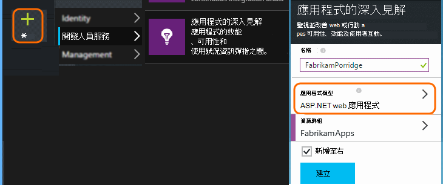
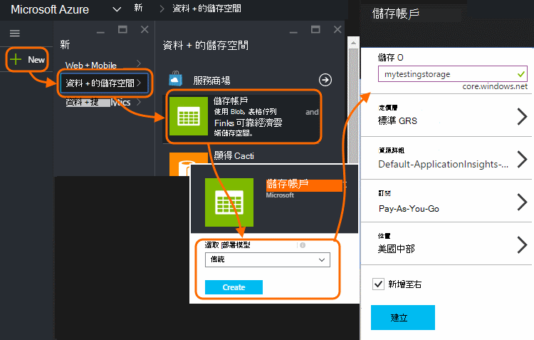
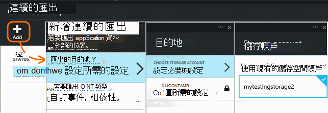
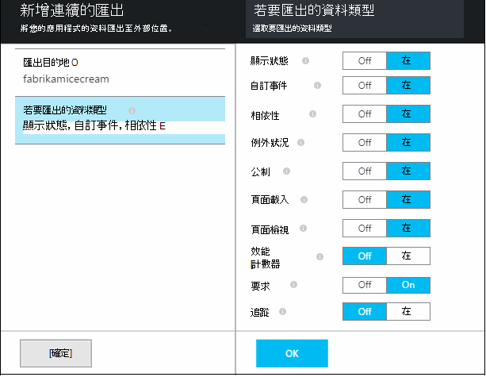
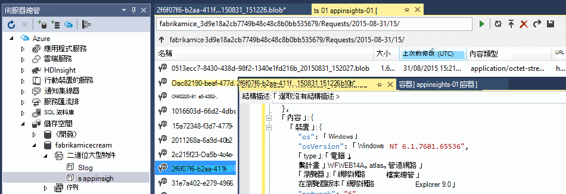
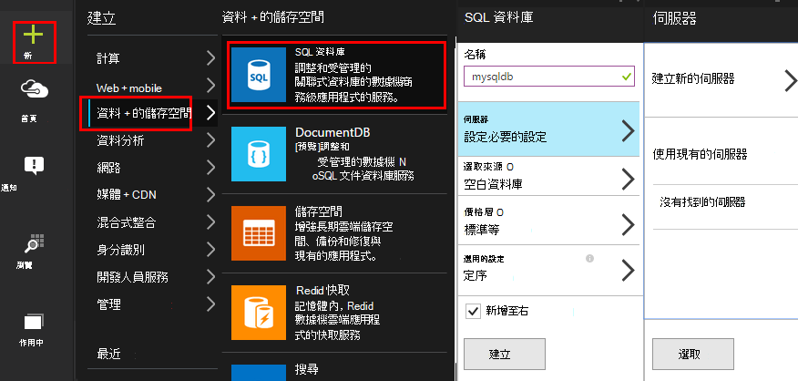
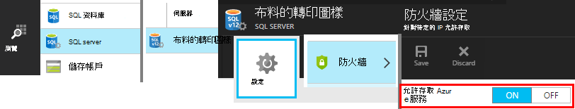
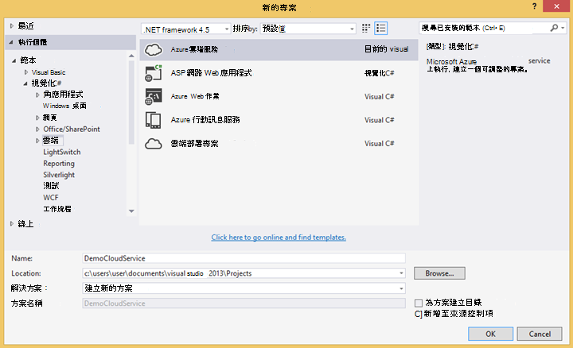

<properties 
    pageTitle="程式碼範例︰ 從應用程式的深入見解匯出資料剖析" 
    description="使用接續本頁] 分匯出功能的程式碼應用程式的深入見解中遙測的分析。 將資料儲存 SQL。" 
    services="application-insights" 
    documentationCenter=""
    authors="mazharmicrosoft" 
    manager="douge"/>

<tags 
    ms.service="application-insights" 
    ms.workload="tbd" 
    ms.tgt_pltfrm="ibiza" 
    ms.devlang="na" 
    ms.topic="article" 
    ms.date="01/05/2016" 
    ms.author="awills"/>
 
# 程式碼範例︰ 從應用程式的深入見解匯出資料剖析

本文將示範如何處理 JSON 從應用程式的深入見解匯出的資料。 例如，我們要撰寫從[Visual Studio 應用程式獲得深入見解]移動遙測資料的程式碼[start]至 Azure SQL 資料庫使用[連續匯出][export]。 （您也可以達到此[使用串流分析](app-insights-code-sample-export-sql-stream-analytics.md)，但我們的目的是顯示您的部分程式碼）。 

連續匯出進入您遙測 Azure 儲存體 JSON 格式，因此我們要撰寫程式碼來剖析 JSON 物件，並建立資料庫資料表中的資料列。

更多通常來說，連續匯出是執行您自己的分析您的應用程式傳送應用程式獲得深入見解遙測的方式。 您可以調整此程式碼範例，若要執行其他動作，以匯出遙測。

我們開始假設您已經有您想要監視的應用程式。

## 新增應用程式的深入見解 SDK

若要監控您的應用程式，您[新增的應用程式的深入見解 SDK] [start]應用程式。 有一些不同 Sdk 和其他平台、 Ide 和語言的協助工具。 您可以監視網頁、 Java 或 ASP.NET 網頁伺服器和行動裝置的幾種。 所有 Sdk 都傳送至[應用程式的深入見解入口網站]的遙測[portal]，便可使用我們的功能強大的分析和診斷工具，並將資料匯出至儲存空間。

若要開始使用︰

1. 取得[Microsoft Azure 中的帳戶](https://azure.microsoft.com/pricing/)。
2. [Azure 入口網站]中[portal]，新增您的應用程式的新應用程式的深入見解資源︰

    

    （您的應用程式類型和訂閱可能會不同。）
3. 開啟要尋找如何設定您的應用程式類型 SDK 的快速入門。

    ![選擇 [快速啟動]，然後依照指示](./media/app-insights-code-sample-export-telemetry-sql-database/020-quick.png)

    如果未列出您的應用程式類型，請參閱[快速入門][start]頁面。

4. 在此範例中，我們監控 web 應用程式，以安裝 SDK Visual Studio 中使用 Azure 工具。 我們告訴我們應用程式的深入見解資源的名稱︰

    ![在 Visual Studio 中，在 [新專案] 對話方塊中核取 [新增應用程式深入資訊和底下傳送遙測至] 下，選擇 [建立新的應用程式，或使用現有。](./media/app-insights-code-sample-export-telemetry-sql-database/030-new-project.png)

## 建立 Azure 中的儲存空間

從應用程式的深入見解的資料永遠會匯出 Azure 儲存體帳戶 JSON 格式。 它是由此儲存您的程式碼會讀取的資料。

1. 建立您的訂閱在[Azure 入口網站]中的 「 傳統 」 儲存帳戶[portal]。

    

2. 建立容器

    ![在新的儲存空間，選取 [容器，然後按一下 [容器] 方塊中，然後新增](./media/app-insights-code-sample-export-telemetry-sql-database/050-container.png)

## 啟動 [接續本頁] 分匯出至 Azure 儲存體

1. 在 Azure 入口網站中，瀏覽至您建立的應用程式的應用程式的深入見解資源。

    ![選擇 [瀏覽]，應用程式的深入見解，您的應用程式](./media/app-insights-code-sample-export-telemetry-sql-database/060-browse.png)

2. 建立連續的匯出。

    ![選擇 [設定]，[接續本頁] 分匯出] 新增](./media/app-insights-code-sample-export-telemetry-sql-database/070-export.png)

    選取您先前建立的儲存空間帳戶︰

    
    
    設定您想要查看的事件類型︰

    

3. 讓累積一些資料。 坐，讓您的應用程式，使用一段的人員。 遙測傳送，您會看到[公制檔案總管]](app-insights-metrics-explorer.md)中的統計圖表和[搜尋診斷](app-insights-diagnostic-search.md)] 中的個別事件。 

    此外，資料會匯出您的儲存空間。 

4. 檢查匯出的資料。 在 Visual Studio 中，選擇 [**檢視 / Cloud 總管**，並開啟 Azure / 儲存空間。 (如果您沒有安裝此功能表選項，您需要安裝 Azure SDK︰ 開啟新的專案] 對話方塊，並開啟 Visual C# / Cloud / Microsoft Azure SDK 取得.NET。)

    

    記下路徑名稱，衍生自應用程式名稱] 和 [儀器鍵常見的一部分。 

事件會寫入到 blob JSON 格式的檔案。 每個檔案可能包含一或多個事件。 因此我們想要閱讀的事件資料，並篩選出我們所要的欄位。 所有類型的資料，無法處理的項目，但我們計劃是撰寫程式碼來將資料移到 SQL 資料庫。 會讓您輕鬆地執行許多感興趣的查詢。

## 建立 Azure SQL 資料庫

例如，我們會撰寫程式碼推入資料庫的資料。

重新啟動您的訂閱[Azure 入口網站]中[portal]，建立資料庫 (和新的伺服器，除非您已取得一個) 至您要寫資料。

確定資料庫伺服器允許存取 Azure 服務︰

## 建立工作角色 

現在，最後一個我們撰寫[的部分程式碼](https://sesitai.codeplex.com/)來剖析 JSON 中匯出 blob，並在資料庫中建立的記錄。 由於匯出存放和資料庫都 Azure 中，我們會執行的程式碼 Azure 工作者角色。

將此程式碼自動擷取任何屬性會出現在 JSON。 屬性的說明，請參閱[匯出資料模型](app-insights-export-data-model.md)。

#### 建立工作角色專案

在 Visual Studio 中，建立新專案的工作者角色︰

![在新的雲端服務] 對話方塊中選擇 [Visual C# 工作者角色](./media/app-insights-code-sample-export-telemetry-sql-database/120-worker.png)

#### 連線至儲存帳戶

Azure 儲存體帳戶取得連線字串︰

![在儲存帳戶]，選取 [索引鍵，並複製主要的連線字串](./media/app-insights-code-sample-export-telemetry-sql-database/055-get-connection.png)

在 Visual Studio 中，設定工作者角色與儲存帳戶的連線字串︰

![在方案總管] 中，在雲端服務 project 中，展開 [角色] 並開啟您的工作者角色。 開啟 [設定] 索引標籤，選擇 [新增] 設定，並設定名稱 = StorageConnectionString，類型 = 連線字串，按一下要設定的值。 手動設定，並貼上的連接字串。](./media/app-insights-code-sample-export-telemetry-sql-database/130-connection-string.png)

#### 套件

在方案總管中，以滑鼠右鍵按一下 [背景工作角色專案，然後選擇 [管理 NuGet 套件。
搜尋並安裝這些套件︰ 

 * EntityFramework 6.1.2 或更新版本-我們會使用這產生 DB 資料表結構描述即時，根據 blob 中 JSON 的內容。
 * JsonFx-我們將使用此簡維 JSON C# 類別屬性。

使用這項工具來產生 C# 類別出我們單一 JSON 文件。 需要稍微修改一下像簡 JSON 陣列維到單一 C# 屬性開啟單一欄中資料庫資料表 (e x。 urlData_port) 

 * [JSON C# 類別產生器](http://jsonclassgenerator.codeplex.com/)

## 程式碼 

您可以將此程式碼`WorkerRole.cs`。

#### 匯入

    using Microsoft.WindowsAzure.Storage;

    using Microsoft.WindowsAzure.Storage.Blob;

#### 擷取儲存連線字串

    private static string GetConnectionString()
    {
      return Microsoft.WindowsAzure.CloudConfigurationManager.GetSetting("StorageConnectionString");
    }

#### 定期執行工作人員

取代現有的執行的方式，然後選擇您想要的時間間隔]。 它必須至少有一個小時，因為匯出功能小時內完成 JSON 物件。

    public override void Run()
    {
      Trace.TraceInformation("WorkerRole1 is running");

      while (true)
      {
        Trace.WriteLine("Sleeping", "Information");

        Thread.Sleep(86400000); //86400000=24 hours //1 hour=3600000
                
        Trace.WriteLine("Awake", "Information");

        ImportBlobtoDB();
      }
    }

#### 表格列的形式插入每個 JSON 物件

    public void ImportBlobtoDB()
    {
      try
      {
        CloudStorageAccount account = CloudStorageAccount.Parse(GetConnectionString());

        var blobClient = account.CreateCloudBlobClient();
        var container = blobClient.GetContainerReference(FilterContainer);

        foreach (CloudBlobDirectory directory in container.ListBlobs())//Parent directory
        {
          foreach (CloudBlobDirectory subDirectory in directory.ListBlobs())//PageViewPerformance
          {
            foreach (CloudBlobDirectory dir in subDirectory.ListBlobs())//2015-01-31
            {
              foreach (CloudBlobDirectory subdir in dir.ListBlobs())//22
              {
                foreach (IListBlobItem item in subdir.ListBlobs())//3IAwm6u3-0.blob
                {
                  itemname = item.Uri.ToString();
                  ParseEachBlob(container, item);
                  AuditBlob(container, directory, subDirectory, dir, subdir, item);
                } //item loop
              } //subdir loop
            } //dir loop
          } //subDirectory loop
        } //directory loop
      }
      catch (Exception ex)
      {
        //handle exception
      }
    }

#### 剖析每個 blob

    private void ParseEachBlob(CloudBlobContainer container, IListBlobItem item)
    {
      try
      {
        var blob = container.GetBlockBlobReference(item.Parent.Prefix + item.Uri.Segments.Last());
    
        string json;
    
        using (var memoryStream = new MemoryStream())
        {
          blob.DownloadToStream(memoryStream);
          json = System.Text.Encoding.UTF8.GetString(memoryStream.ToArray());
    
          IEnumerable<string> entities = json.Split('\n').Where(s => !string.IsNullOrWhiteSpace(s));
    
          recCount = entities.Count();
          failureCount = 0; //resetting failure count
    
          foreach (var entity in entities)
          {
            var reader = new JsonFx.Json.JsonReader();
            dynamic output = reader.Read(entity);
    
            Dictionary<string, object> dict = new Dictionary<string, object>();
    
            GenerateDictionary((System.Dynamic.ExpandoObject)output, dict, "");
    
            switch (FilterType)
            {
              case "PageViewPerformance":
    
              if (dict.ContainsKey("clientPerformance"))
                {
                  GenerateDictionary(((System.Dynamic.ExpandoObject[])dict["clientPerformance"])[0], dict, "");
                }
    
              if (dict.ContainsKey("context_custom_dimensions"))
              {
                if (dict["context_custom_dimensions"].GetType() == typeof(System.Dynamic.ExpandoObject[]))
                {
                  GenerateDictionary(((System.Dynamic.ExpandoObject[])dict["context_custom_dimensions"])[0], dict, "");
                }
              }
    
            PageViewPerformance objPageViewPerformance = (PageViewPerformance)GetObject(dict);
    
            try
            {
              using (var db = new TelemetryContext())
              {
                db.PageViewPerformanceContext.Add(objPageViewPerformance);
                db.SaveChanges();
              }
            }
            catch (Exception ex)
            {
              failureCount++;
            }
            break;
    
            default:
            break;
          }
        }
      }
    }
    catch (Exception ex)
    {
      //handle exception 
    }
    }

#### 準備字典的每個 JSON 文件

    private void GenerateDictionary(System.Dynamic.ExpandoObject output, Dictionary<string, object> dict, string parent)
        {
            try
            {
                foreach (var v in output)
                {
                    string key = parent + v.Key;
                    object o = v.Value;

                    if (o.GetType() == typeof(System.Dynamic.ExpandoObject))
                    {
                        GenerateDictionary((System.Dynamic.ExpandoObject)o, dict, key + "_");
                    }
                    else
                    {
                        if (!dict.ContainsKey(key))
                        {
                            dict.Add(key, o);
                        }
                    }
                }
            }
            catch (Exception ex)
            {
            //handle exception 
            }
        }

#### 轉換成 C# 類別遙測物件屬性 JSON 文件

     public object GetObject(IDictionary<string, object> d)
        {
            PropertyInfo[] props = null;
            object res = null;

            try
            {
                switch (FilterType)
                {
                    case "PageViewPerformance":

                        props = typeof(PageViewPerformance).GetProperties();
                        res = Activator.CreateInstance<PageViewPerformance>();
                        break;

                    default:
                        break;
                }

                for (int i = 0; i < props.Length; i++)
                {
                    if (props[i].CanWrite && d.ContainsKey(props[i].Name))
                    {
                        props[i].SetValue(res, d[props[i].Name], null);
                    }
                }
            }
            catch (Exception ex)
            {
            //handle exception 
            }

            return res;
        }

#### 登出 JSON 文件產生 PageViewPerformance 類別檔案

    public class PageViewPerformance
    {
        [DatabaseGenerated(DatabaseGeneratedOption.Identity)]
        public Guid Id { get; set; }

        public string url { get; set; }

        public int urlData_port { get; set; }

        public string urlData_protocol { get; set; }

        public string urlData_host { get; set; }

        public string urlData_base { get; set; }

        public string urlData_hashTag { get; set; }

        public double total_value { get; set; }

        public double networkConnection_value { get; set; }

        public double sendRequest_value { get; set; }

        public double receiveRequest_value { get; set; }

        public double clientProcess_value { get; set; }

        public string name { get; set; }

        public string internal_data_id { get; set; }

        public string internal_data_documentVersion { get; set; }

        public DateTime? context_data_eventTime { get; set; }

        public string context_device_id { get; set; }

        public string context_device_type { get; set; }

        public string context_device_os { get; set; }

        public string context_device_osVersion { get; set; }

        public string context_device_locale { get; set; }

        public string context_device_userAgent { get; set; }

        public string context_device_browser { get; set; }

        public string context_device_browserVersion { get; set; }

        public string context_device_screenResolution_value { get; set; }

        public string context_user_anonId { get; set; }

        public string context_user_anonAcquisitionDate { get; set; }

        public string context_user_authAcquisitionDate { get; set; }

        public string context_user_accountAcquisitionDate { get; set; }

        public string context_session_id { get; set; }

        public bool context_session_isFirst { get; set; }

        public string context_operation_id { get; set; }

        public double context_location_point_lat { get; set; }

        public double context_location_point_lon { get; set; }

        public string context_location_clientip { get; set; }

        public string context_location_continent { get; set; }

        public string context_location_country { get; set; }

        public string context_location_province { get; set; }

        public string context_location_city { get; set; }
    }

#### DBcontext 實體架構的 SQL 互動

    public class TelemetryContext : DbContext
    {
        public DbSet<PageViewPerformance> PageViewPerformanceContext { get; set; }
        public TelemetryContext()
            : base("name=TelemetryContext")
        {
        }
    }

新增名稱 DB 連線字串`TelemetryContext`中`app.config`。

## 結構描述 （僅限資訊）

這是 PageView 會產生的資料表結構描述。

> [AZURE.NOTE] 您不必執行這個指令碼。 在 JSON 屬性決定資料表中的欄。

    CREATE TABLE [dbo].[PageViewPerformances](
    [Id] [uniqueidentifier] NOT NULL,
    [url] [nvarchar](max) NULL,
    [urlData_port] [int] NOT NULL,
    [urlData_protocol] [nvarchar](max) NULL,
    [urlData_host] [nvarchar](max) NULL,
    [urlData_base] [nvarchar](max) NULL,
    [urlData_hashTag] [nvarchar](max) NULL,
    [total_value] [float] NOT NULL,
    [networkConnection_value] [float] NOT NULL,
    [sendRequest_value] [float] NOT NULL,
    [receiveRequest_value] [float] NOT NULL,
    [clientProcess_value] [float] NOT NULL,
    [name] [nvarchar](max) NULL,
    [User] [nvarchar](max) NULL,
    [internal_data_id] [nvarchar](max) NULL,
    [internal_data_documentVersion] [nvarchar](max) NULL,
    [context_data_eventTime] [datetime] NULL,
    [context_device_id] [nvarchar](max) NULL,
    [context_device_type] [nvarchar](max) NULL,
    [context_device_os] [nvarchar](max) NULL,
    [context_device_osVersion] [nvarchar](max) NULL,
    [context_device_locale] [nvarchar](max) NULL,
    [context_device_userAgent] [nvarchar](max) NULL,
    [context_device_browser] [nvarchar](max) NULL,
    [context_device_browserVersion] [nvarchar](max) NULL,
    [context_device_screenResolution_value] [nvarchar](max) NULL,
    [context_user_anonId] [nvarchar](max) NULL,
    [context_user_anonAcquisitionDate] [nvarchar](max) NULL,
    [context_user_authAcquisitionDate] [nvarchar](max) NULL,
    [context_user_accountAcquisitionDate] [nvarchar](max) NULL,
    [context_session_id] [nvarchar](max) NULL,
    [context_session_isFirst] [bit] NOT NULL,
    [context_operation_id] [nvarchar](max) NULL,
    [context_location_point_lat] [float] NOT NULL,
    [context_location_point_lon] [float] NOT NULL,
    [context_location_clientip] [nvarchar](max) NULL,
    [context_location_continent] [nvarchar](max) NULL,
    [context_location_country] [nvarchar](max) NULL,
    [context_location_province] [nvarchar](max) NULL,
    [context_location_city] [nvarchar](max) NULL,
    CONSTRAINT [PK_dbo.PageViewPerformances] PRIMARY KEY CLUSTERED 
    (
     [Id] ASC
    )WITH (PAD_INDEX = OFF, STATISTICS_NORECOMPUTE = OFF, IGNORE_DUP_KEY = OFF, ALLOW_ROW_LOCKS = ON, ALLOW_PAGE_LOCKS = ON) ON [PRIMARY]
    ) ON [PRIMARY] TEXTIMAGE_ON [PRIMARY]

    GO

    ALTER TABLE [dbo].[PageViewPerformances] ADD  DEFAULT (newsequentialid()) FOR [Id]
    GO

若要查看此範例中的動作，[下載](https://sesitai.codeplex.com/)完成的工作程式碼，變更`app.config`設定並發佈 Azure 工作者角色。

## 相關的文章

* [匯出至 SQL 使用工作者角色](app-insights-code-sample-export-telemetry-sql-database.md)
* [在 [應用程式的深入見解的連續匯出](app-insights-export-telemetry.md)
* [應用程式的深入見解](https://azure.microsoft.com/services/application-insights/)
* [匯出資料模型](app-insights-export-data-model.md)
* [更多範例與逐步解說](app-insights-code-samples.md)

<!--Link references-->

[diagnostic]: app-insights-diagnostic-search.md
[export]: app-insights-export-telemetry.md
[metrics]: app-insights-metrics-explorer.md
[portal]: http://portal.azure.com/
[start]: app-insights-overview.md

 
