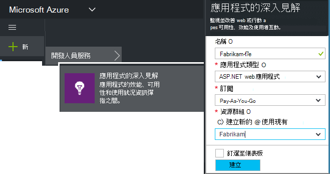

<properties 
    pageTitle="建立新的應用程式的深入見解資源 |Microsoft Azure" 
    description="設定應用程式的深入見解監控新即時應用程式。 Web 為基礎的方法。" 
    services="application-insights" 
    documentationCenter=""
    authors="alancameronwills" 
    manager="douge"/>

<tags 
    ms.service="application-insights" 
    ms.workload="tbd" 
    ms.tgt_pltfrm="ibiza" 
    ms.devlang="na" 
    ms.topic="article" 
    ms.date="08/26/2016" 
    ms.author="awills"/>

# 建立應用程式的深入見解資源

Visual Studio 應用程式深入資訊會顯示 Microsoft Azure*資源*中的應用程式的相關的資料。 建立新的資源因此是在[應用程式獲得深入見解監控新的應用程式設定][start]。 在許多情況下，這可透過自動 IDE 時，也就是可用的建議的方式。 但在某些情況下，您建立資源以手動方式。

建立資源之後，您會取得其儀器索引鍵，並使用該應用程式中設定 SDK。 這會遙測傳送給資源時。

## 登入，Microsoft Azure

如果您還沒有[Microsoft 帳戶，請立即申請](http://live.com)。 （如果您使用 Outlook.com、 OneDrive、 Windows Phone 中，或 XBox Live 等服務，您已經有 Microsoft 帳戶。）

您也必須[Microsoft Azure](http://azure.com)的訂閱。 如果您的小組或組織的 Azure 訂閱，擁有者可以將您加入，使用您的 Windows Live id。

或者，您可以建立新的訂閱。 免費的帳戶可讓您嘗試 Azure 中的所有項目。 在試用到期之後，您可能會發現 pay-as-you-go 訂閱適當，當您將不會扣免費服務。 

當您已有存取權的訂閱， [http://portal.azure.com](https://portal.azure.com)，在應用程式獲得深入見解的登入並使用您的 Live ID 登入。

## 建立應用程式的深入見解資源
  

在[portal.azure.com](https://portal.azure.com)中，新增應用程式的深入見解資源︰

* **應用程式類型**會影響您看到概觀刀和[公制的檔案總管]中可用的屬性[metrics]。 如果您沒有看到您的應用程式類型，選擇 [ASP.NET]。
* **資源群組**是方便使用管理內容等 access 控制項。 如果您已經建立其他 Azure 的資源，您可以選擇將此新資源放在同一個群組。
* **訂閱**的付款 Azure 帳戶。
* **位置**是我們保留您的資料的位置。 目前就無法變更。
* **新增至 startboard**會將您的資源的快速存取磚 Azure 首頁。 建議。

建立您的應用程式之後，隨即會開啟新的刀。 這是您會請參閱您的應用程式的效能與使用情況資料。 

若要取得上的一步]，下次您登入 Azure 看您的應用程式快速入門磚上開始區 （主畫面）。 或按一下 [瀏覽] 尋找它。

## 複製儀器索引鍵

儀器鍵識別您建立的資源。 您必須將提供 sdk 的變更。

## 在您的應用程式安裝 SDK

在您的應用程式上安裝應用程式的深入見解 SDK。 此步驟類型而定重度應用程式。 

若要設定[SDK，您安裝應用程式中]使用儀器鍵[start]。

SDK 包含標準傳送遙測您不必撰寫程式碼的模組。 若要追蹤使用者動作或診斷的更多詳細資料，請[使用 API]問題[api]傳送自己遙測。

## 請參閱遙測資料

關閉快速啟動刀返回您的應用程式刀 Azure 入口網站中。

按一下 [搜尋] 方塊，以查看[診斷搜尋][diagnostic]、 第一個事件會出現的位置。 

如果您預期更多資料，請按一下 [重新整理，數秒後的]。

## 自動建立資源

您可以撰寫自動建立資源的[PowerShell 指令碼](app-insights-powershell-script-create-resource.md)。

## 後續步驟

* [建立儀表板](app-insights-dashboards.md)
* [診斷搜尋](app-insights-diagnostic-search.md)
* [探索指標](app-insights-metrics-explorer.md)
* [撰寫查詢分析](app-insights-analytics.md)

<!--Link references-->

[api]: app-insights-api-custom-events-metrics.md
[diagnostic]: app-insights-diagnostic-search.md
[metrics]: app-insights-metrics-explorer.md
[start]: app-insights-overview.md

 