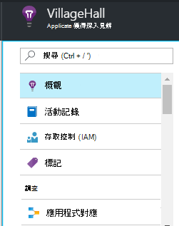

<properties
    pageTitle="儀表板和應用程式的深入見解入口網站中的導覽 |Microsoft Azure"
    description="建立您的主要 APM 圖表和查詢的檢視。"
    services="application-insights"
    documentationCenter=""
    authors="alancameronwills"
    manager="douge"/>

<tags
    ms.service="application-insights"
    ms.workload="tbd"
    ms.tgt_pltfrm="ibiza"
    ms.devlang="multiple"
    ms.topic="article" 
    ms.date="10/18/2016"
    ms.author="awills"/>

# 導覽和應用程式的深入見解入口網站中的儀表板

[設定專案的深入見解應用程式](app-insights-overview.md)之後，相關應用程式的效能及使用方式的遙測資料會出現在專案的應用程式的深入見解資源在[Azure 入口網站](https://portal.azure.com)中。

## 尋找您的遙測

登入[Azure 入口網站](https://portal.azure.com)，然後瀏覽至您的應用程式建立的應用程式的深入見解資源。

![按一下 [瀏覽]，選取 [應用程式的深入見解，然後您的應用程式]。](./media/app-insights-dashboards/00-start.png)

應用程式概觀刀 （頁面） 會顯示您的應用程式中，主要的診斷度量摘要，而是入口網站的其他功能的閘道器。

您可以自訂的任何其他圖表，並將其釘選的儀表板。 如此一來，您就可以將一起索引鍵的圖表從不同的應用程式。

## 儀表板

首先您看到您在登入[Microsoft Azure 入口網站](https://portal.azure.com)後的儀表板。 以下您可以運用您所有您 Azure 資源，包括從[Visual Studio 應用程式獲得深入見解](app-insights-overview.md)的遙測最重要的圖表。
 

1. **瀏覽至特定的資源**，例如您在應用程式的深入見解的應用程式︰ 使用左邊的列。
2. **傳回目前的儀表板**，或切換到其他最近檢視︰ 使用下拉式功能表在左上角。
3. **切換儀表板**︰ 使用儀表板標題下拉功能表
4. **建立、 編輯和共用儀表板**在儀表板工具列。
5. **編輯儀表板**︰ 將游標停留在一個磚，然後使用其上方的列移動、 自訂，或將其移除。

## 新增至 [儀表板

當您正在尋找刀或圖表的特別有趣的設定時，您可以固定至儀表板的複本。 您會看到您那里傳回的下一次。

![釘選圖表，將游標停留在它，然後按一下 [...] 標題中。](./media/app-insights-dashboards/33.png)

1. 釘選至儀表板的圖表。 圖表的複本會出現在儀表板。
2. 釘選至儀表板整個刀-] 圖磚，您可以透過按一下儀表板上會出現。
3. 按一下 [若要返回目前的儀表板左上的角。 然後您可以使用下拉式功能表，若要返回目前檢視。

請注意圖分為磚︰ 並排顯示最多可以包含一個以上的圖表。 您釘選至儀表板整個磚。

### 固定的任何查詢的分析

您也可以[共用](#share-dashboards-with-your-team)儀表板的[pin 分析](app-insights-analytics-using.md#pin-to-dashboard)圖表。 這個選項可讓您新增的任何任意查詢同時標準指標的圖表。 （沒有此功能的費用）。

## 調整儀表板上的磚

在儀表板] 方塊之後，您就可以進行調整。

1. 您可以新增圖表至] 方塊。 
2. 設定公制、 群組依據維度和圖表樣式 （[圖表中的 [資料表）。
3. 拖曳圖表以放大;按一下 [重設時段; [復原] 按鈕設定篩選的圖磚上圖表的屬性。
4. 設定磚的標題。

圖磚釘選從公制總管刀有更多編輯選項] 方塊的概觀刀釘選多。

[原始] 磚，釘選不受影響您的編輯。

## 儀表板之間切換

您可以儲存多個儀表板，並它們之間切換。 當您插入圖表或刀時，它們是將其新增至目前的儀表板。

![儀表板之間切換，請按一下 [儀表板，並選取已儲存的儀表板。 若要建立並儲存新的儀表板，按一下 [新增]。 若要重新排列，請按一下 [編輯]。](./media/app-insights-dashboards/32.png)

例如，您可能必須一個儀表板，來顯示 [小組聊天室，，另一個用於一般開發中的 [全螢幕。

在儀表板，刀會顯示] 圖磚︰ 按一下以移至刀。 圖表會將複製的圖表在其原始位置。

## 共用儀表板

當您建立儀表板時，您可以與其他使用者共用它。

![在儀表板標題中，按一下 [共用]](./media/app-insights-dashboards/41.png)

深入了解[角色和存取控制](app-insights-resources-roles-access-control.md)。

## 應用程式功能

概觀刀是閘道器至您的應用程式的相關詳細資訊。

* **任何圖表或磚**-按一下任一磚，或若要查看更多詳細資訊就會顯示的圖表。

### 概觀刀按鈕

* [**指標總管**](app-insights-metrics-explorer.md)-建立您自己的圖表的效能及使用方式。
* [**搜尋**](app-insights-diagnostic-search.md)-調查特定的執行個體的事件，例如要求]，[例外]，或登入的追蹤。
* [**分析**](app-insights-analytics.md)-透過您遙測功能強大的查詢。
* **時間範圍**-調整刀上的所有圖表所顯示的範圍。
* **刪除**-刪除此應用程式的應用程式的深入見解資源。 您也應該 [移除的應用程式的深入見解套件程式應用程式碼，或導向到不同的應用程式的深入見解資源遙測應用程式中編輯[儀器鍵](app-insights-create-new-resource.md#copy-the-instrumentation-key)。

### 基本資訊] 索引標籤

* [儀器鍵](app-insights-create-new-resource.md#copy-the-instrumentation-key)-識別此應用程式資源。 
* 價格-請功能可使用及設定大量大寫字。

### 導覽列

* **概觀**-應用程式概觀刀 return 鍵。
* **活動記錄**-通知和 Azure 管理的事件。
* [**存取控制**](app-insights-resources-roles-access-control.md)-提供給小組成員與其他人的存取權。
* [**標記**](../resource-group-using-tags.md)-將您的應用程式與其他人的使用標記。

調查

* [**應用程式對應**](app-insights-app-map.md)作用中的地圖，顯示應用程式的元件衍生自相依資訊。
* [**主動式診斷**](app-insights-proactive-diagnostics.md)-檢閱最近的效能通知。
* [**即時資料流**](app-insights-metrics-explorer.md#live-stream)-固定一組部署新組建時非常有用的附近立即計量或偵錯。
* [**可用性 / 網頁測試**](app-insights-monitor-web-app-availability.md)-一般要求傳送給您的 web app 從 world.* 周圍 
* [**失敗次數，效能**](app-insights-web-monitor-performance.md)-例外狀況失敗率和回應您的應用程式要求和從您的應用程式要求[相依性](app-insights-asp-net-dependencies.md)的時間。
* [**效能**](app-insights-web-monitor-performance.md)-回應時間、 相依性回應時間。 
* [伺服器](app-insights-web-monitor-performance.md)-效能計數器。 使用 if[安裝狀態監視器](app-insights-monitor-performance-live-website-now.md)。

* **在瀏覽器**-頁面檢視與 AJAX 效能。 使用 if 您[追蹤記錄您的網頁](app-insights-javascript.md)。
* 計算**使用**-頁面檢視]、 [使用者，以及 [工作階段。 使用 if 您[追蹤記錄您的網頁](app-insights-javascript.md)。

設定

* **快速入門**-內嵌教學課程。
* **屬性**-儀器鍵、 訂閱及資源識別碼。
* [通知](app-insights-alerts.md)-公制的通知設定。
* [[接續本頁匯出](app-insights-export-telemetry.md)-設定匯出遙測至 Azure 儲存體。
* [效能測試](app-insights-monitor-web-app-availability.md#performance-tests)-設定您的網站上的綜合載入。
* [配額和價格](app-insights-pricing.md)和[ingestion 取樣](app-insights-sampling.md)。
* **API 的存取**-建立[版本的註解](app-insights-annotations.md)及資料存取 API。
* [**工作項目**](app-insights-diagnostic-search.md#create-work-item)-連線到公司，以便您可以建立錯誤時檢查遙測追蹤系統。

設定

* [**鎖定**](..\resource-group-lock-resources.md)-鎖定 Azure 資源
* [**自動化指令碼**](app-insights-powershell.md)-匯出 Azure 資源的定義，讓您可以將其作為範本來建立新的資源。

支援

* **支援要求**-需要付費的訂閱。 另請參閱[取得說明](app-insights-get-dev-support.md)。

## 下一步是什麼？

||
|---|---
|[指標總管](app-insights-metrics-explorer.md) 篩選] 及 [線段的指標|
|[診斷搜尋](app-insights-diagnostic-search.md) 尋找並檢查 [事件] 相關的事件，並建立錯誤 |
|[分析](app-insights-analytics.md) 強大的查詢語言| 

