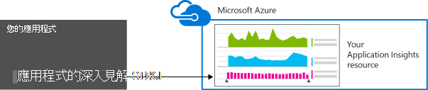
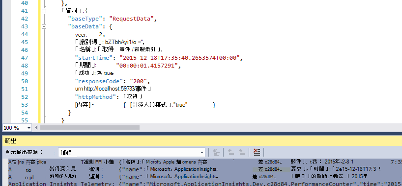

<properties 
    pageTitle="資料保留資料，在應用程式的深入見解的儲存空間" 
    description="保留和隱私權原則陳述式" 
    services="application-insights" 
    documentationCenter=""
    authors="alancameronwills" 
    manager="douge"/>

<tags 
    ms.service="application-insights" 
    ms.workload="tbd" 
    ms.tgt_pltfrm="ibiza" 
    ms.devlang="na" 
    ms.topic="article" 
    ms.date="05/17/2016" 
    ms.author="awills"/>

# 資料收集與保留在 [應用程式的深入見解的儲存空間 

*應用程式的深入見解位於預覽。*

當您安裝[Visual Studio 應用程式獲得深入見解][start]應用程式中的 sdk，您可以傳送您的應用程式的相關遙測至雲端。 當然，負責開發人員想要知道完全傳送的資料、 資料，會發生什麼事以及如何他們可以將它的控制項。 特別是無法傳送機密資料，在哪裡可以找到儲存，及如何保護是它？ 

首先，簡短的答案︰

* 標準遙測模組 「 不在方塊 」 執行的是不會傳送至服務的機密資料。 載入、 效能及使用方式的指標、 例外狀況報表和其他診斷資料被關於遙測。 主要使用者資料在診斷報告中顯示的 Url。但您的應用程式在任何情況下不應將機密資料放在 URL 中的 [純文字。
* 您可以撰寫程式碼，傳送給其他自訂遙測，以協助您使用的診斷與監控的使用方式。 （這個擴充是很棒的應用程式的深入見解功能）。它會就能誤，撰寫此程式碼，使其包含個人及其他機密資料。 如果您的應用程式會使用這類資料，您應該套用強式檢閱程序，您所撰寫的程式碼。
* 同時開發與測試您的應用程式，您可以輕鬆要檢查有什麼所傳送的 SDK。 資料會出現在 [偵錯輸出視窗 IDE 和瀏覽器。 
* 資料會保留在 [美國中的[Microsoft Azure](http://azure.com)伺服器。 （但您的應用程式可以執行任何位置）。Azure 有[強大的安全性程序，而符合法規遵循標準大範圍](https://azure.microsoft.com/support/trust-center/)。 只有您和您指定的小組有權存取您的資料。 Microsoft 員工可以有限制存取其只能在特定受限制的情況下使用您的知識。 它會加密傳輸，即使不在伺服器。

本文其餘更完整 elaborates 上上述問題的答案。 它具有專為獨立，以便您可以將它顯示不屬於您的團隊給同事。

## 什麼是應用程式的深入見解？

[Visual Studio 應用程式獲得深入見解][start]是由 Microsoft，協助您所提供的服務改善效能與您即時應用程式的可用性。 監視應用程式執行，於測試期間和已發佈或部署之後的所有時間。 應用程式的深入見解建立圖表和顯示，例如的資料表、 每天何時開始大多數使用者、 如何回應應用程式，以及如何提供任何依存的外部服務。 如果有當機、 失敗或效能問題，您可以搜尋遙測資料的診斷原因的詳細資料。 服務會傳送給您的電子郵件的顯示狀態和效能應用程式中的任何變更時。

若要取得這項功能，您可以安裝應用程式的深入見解 SDK 應用程式中，其成為其程式碼的組件。 執行您的應用程式時，SDK 監視作業，並將遙測傳送到應用程式的深入見解服務。 這是由[Microsoft Azure](http://azure.com)裝載雲端服務。 （但是應用程式的深入見解適用於任何應用程式，而不只是會裝載於 Azure 的人員）。

儲存應用程式的深入見解服務，以及分析遙測。 若要看到 [分析] 或 [儲存遙測搜尋，您登入您的 Azure 帳戶，然後開啟您的應用程式的應用程式的深入見解資源。 其他您的小組成員，或指定 Azure 訂閱者，您也可以共用資料的存取權。

您可以讓資料匯出從應用程式的深入見解服務，例如資料庫或外部工具。 您提供給您，取得服務的特殊鍵每項工具。 如有需要，可以撤銷索引鍵。 

應用程式的深入見解 Sdk 可供使用的應用程式類型的範圍︰ web 服務裝載在您自己 J2EE 或 ASP.NET 伺服器或 Azure;網頁用戶端-也就是在網頁上，執行的程式碼桌面應用程式與服務;例如，Windows Phone、，在 iOS 和 Android 裝置應用程式。 所有傳送遙測的同一個服務。

## 它會收集哪些資料？

### 如何的資料會收集嗎？

有三個資料來源︰

* SDK，您整合與您的應用程式[開發中](app-insights-asp-net.md)或[在執行階段](app-insights-monitor-performance-live-website-now.md)。 有不同的 Sdk，針對不同的應用程式類型。 此外，還有[SDK 網頁](app-insights-javascript.md)，它會將使用者的瀏覽器，以及網頁載入。

 * 每個 SDK 有[模組](app-insights-configuration-with-applicationinsights-config.md)，使用不同的技巧來收集不同類型的遙測的數字。
 * 如果您在開發安裝 SDK，您可以使用其 API 傳送自己遙測，除了標準模組。 此自訂遙測可以包含您想要傳送的任何資料。
* 在某些網頁伺服器，也有代理程式的執行同時應用程式，並傳送遙測相關 CPU、 記憶體和網路空間。 例如，Azure Vm、 Docker 主機和[J2EE 伺服器](app-insights-java-agent.md)可以有這類代理程式。
* [可用性測試](app-insights-monitor-web-app-availability.md)是由 Microsoft 執行程序在定期傳送至您的 web 應用程式的要求。 結果會傳送到應用程式的深入見解服務。

### 收集哪些類型的資料？

主要類別是︰

* [網頁伺服器遙測](app-insights-asp-net.md)-HTTP 要求。  Uri，邀請、 回應碼、 用戶端 IP 位址 [處理程序所需的時間。 工作階段的識別碼。
* [網頁](app-insights-javascript.md)-] 頁面，使用者與工作階段的計數。 頁面載入時間。 例外狀況。 Ajax 來電。
* 效能計數器-記憶體 CPU、 IO，網路進駐。
* 用戶端和伺服器內容-OS、 地區、 裝置類型、 瀏覽器、 螢幕解析度。
* [例外狀況](app-insights-asp-net-exceptions.md)和當機-**堆疊傾印**，建立 id，CPU 類型。 
* [相依性](app-insights-asp-net-dependencies.md)的來電至其餘部分中，SQL、 AJAX 等外部服務。 URI 或連線字串、 持續時間、 成功、] 命令。
* [可用性測試](app-insights-monitor-web-app-availability.md)-測試步驟，回覆的持續時間。
* [追蹤記錄](app-insights-search-diagnostic-logs.md)，並[自訂遙測](app-insights-api-custom-events-metrics.md) - **您到記錄或遙測程式碼的任何項目**。

[更多詳細資料](#data-sent-by-application-insights)]。

## 如何驗證收集什麼？

如果您開發使用 Visual Studio 應用程式，請在偵錯模式 (F5) 執行應用程式。 遙測會出現在 [輸出] 視窗。 從這裡，可以將其複製並設定其格式的簡單檢查 JSON。 

在 [診斷] 視窗中也有更易於閱讀的檢視。

為網頁，開啟您的瀏覽器偵錯] 視窗。

![按下 F12，並開啟 [網路] 索引標籤。](./media/app-insights-data-retention-privacy/08-browser.png)

### 我可以撰寫程式碼篩選遙測傳送之前嗎？

這是可能以撰寫[遙測處理器外掛程式](app-insights-api-filtering-sampling.md)。

## 多久是保留的資料？ 

原始資料點 （也就是項目，您可以檢查在診斷搜尋） 會保留 7 天。 如果您需要保留超過的資料，您可以使用[連續匯出](app-insights-export-telemetry.md)，將它複製到儲存帳戶。

彙總的資料 （也就是計算平均值與公制檔案總管] 中看到其他統計資料） 會保留在程度的 1 分鐘 30 天，及 1 小時或 1 天 （視類型而定），至少 90 天。

## 誰能夠存取資料？

資料是您能看到，如果您的組織帳戶，您的小組成員。 

匯出您和您的小組成員及無法將它複製到其他位置，並傳送至其他人。

#### 沒有 Microsoft 有什麼？ 我的應用程式會傳送給應用程式的深入見解的資訊

Microsoft 會使用資料僅才能提供服務給您。

## 保留資料的位置 

* 在 [美國。 

#### 可以儲存位置還，例如歐洲嗎？ 

* 不是在簡報。 

#### 這表示裝載在美國對我的應用程式嗎？

* [否]。 您的應用程式可以執行任何地方，在您的內部部署主機或雲端中。

## 如何安全是我的資料？  

應用程式的深入見解是在預覽中 Azure 服務。 而在預覽中，我們可使用根據保護您的資料，每個[Azure 安全性、 隱私權和法規遵循白皮書 （英文）](http://go.microsoft.com/fwlink/?linkid=392408)中所述的原則。

資料會儲存於 Microsoft Azure 伺服器。 Azure 入口網站中的帳戶的帳戶限制所述[Azure 安全性、 隱私權和法規遵循的文件](http://go.microsoft.com/fwlink/?linkid=392408)。 Visual Studio 小組 Services 入口網站中的帳戶，適用於[Visual Studio 小組服務資料保護](http://download.microsoft.com/download/8/E/E/8EE6A61C-44C2-4F81-B870-A267F1DF978C/MicrosoftVisualStudioOnlineDataProtection.pdf)文件。 

由 Microsoft 人員您資料的存取權受到限制。 我們會存取您的資料，只能搭配您的權限，是否支援您使用的應用程式的深入見解。 

在彙總 （例如資料工資率和追蹤的平均大小） 的所有客戶的應用程式中的資料用來改善應用程式的深入見解。

#### 其他人的遙測可能干擾我的應用程式的深入見解的資料嗎？

他們可以傳送至您的帳戶的其他遙測使用中的網頁程式碼的儀器金鑰。 有足夠的詳細資料，您的指標不正確代表您的應用程式效能及使用方式。

如果您與其他專案中共用的程式碼，請記得要移除您儀器鍵。

## 加密的資料 

不在目前的伺服器。

所有的資料已加密資料中心之間移動。

#### 從 [我的應用程式至應用程式的深入見解伺服器傳送加密的資料？

是的我們會傳送資料至入口網站中，從幾乎所有 Sdk，包括網頁伺服器、 裝置與 HTTPS 網頁使用 https。 唯一的例外是純文字 HTTP 網頁傳送資料。 

## 個人識別資訊

#### 無法應用程式獲得深入見解傳送個人識別資訊 (PII)？ 

是的可能是。 

為一般指導方針︰

* 大部分的標準遙測 （也就是遙測傳送，但您撰寫的任何程式碼） 不包含明確 PII。 不過，可能會識別個人來推斷從事件的集合。
* 例外狀況和追蹤訊息可能包含 PII
* 自訂遙測-也就是說，例如您在使用 API 或記錄追蹤程式碼中撰寫的 TrackEvent 呼叫-可以包含您所選擇的任何資料。

在這份文件結尾處的資料表包含收集資料的詳細的描述。

#### 我是否必須遵守法規就 PII？

[是]。 您必須負責確保的收集與使用資料符合法規，與 Microsoft 線上服務條款。

您應該相關應用程式會收集的資料，以及如何使用資料適當地通知您的客戶。

#### 我的使用者可以關閉應用程式的深入見解嗎？

並非直接。 我們不提供您的使用者可以運作若要關閉應用程式的深入見解的切換參數。

不過，您也可以在您的應用程式中執行這項功能。 所有 Sdk 都包含的關閉遙測集合 API 設定。 

#### 我的應用程式不小心收集機密資訊。 可以應用程式的深入見解刪除此資料，讓它並不會保留嗎？

應用程式的深入見解不篩選或刪除您的資料。 您應該適當地管理資料，並避免這類資料傳送到應用程式的深入見解。

## 傳送應用程式的深入見解的資料

Sdk 因平台，而且有幾個元件，您可以安裝。 (請參閱開始使用[應用程式的深入見解-][start]。)每個元件都傳送給不同的資料。

#### 在不同的情況下傳送資料的類別

您的動作  | 收集 （請參閱下一個資料表） 的資料類別
---|---
[新增應用程式的深入見解 SDK.NET web 專案][greenbrown] | ServerContext 推斷 效能計數器 要求 **例外狀況** 工作階段 使用者
[IIS 上安裝狀態監視器][redfield]|相依性 ServerContext 推斷 效能計數器
[新增應用程式的深入見解 SDK Java web 應用程式][java]|ServerContext 推斷 要求 工作階段 使用者
[將 JavaScript SDK 新增至網頁][client]|ClientContext  推斷 頁面 ClientPerf Ajax
[定義預設的屬性][apiproperties]|所有的標準和自訂事件的**內容**
[通話 TrackMetric][api]|數值 **屬性**
[通話追蹤 *][api]|事件名稱 **屬性**
[通話 TrackException][api]|**例外狀況** 堆疊傾印 **屬性**
SDK 無法收集的資料。 例如︰   -無法存取效能計數器  -遙測初始設定中的例外狀況 | SDK 診斷程式
 

針對[其他平台的 Sdk][platforms]，請參閱其文件。

#### 收集的資料的類別

收集的資料類別 | 包含 （不詳盡清單） 
---|---
**屬性**|**任何資料-取決於您的程式碼**
DeviceContext |識別碼、 IP、 地區設定的裝置型號、 網路、 網路類型、 OEM 名稱、 螢幕解析度，角色執行個體、 角色名稱、 裝置類型
ClientContext |作業系統地區設定，語言、 網路、 視窗解析度
工作階段 | 工作階段識別碼
ServerContext |電腦名稱、 地區設定，作業系統、 裝置、 使用者工作階段，使用者內容、 作業 
推斷 |從 [IP 位址、 時間戳記的作業系統、 瀏覽器的地理位置
指標 | 單位名稱和值
事件 | 事件名稱和值
PageViews | URL] 與 [頁面名稱或畫面名稱
用戶端效能 | URL/頁面名稱、 瀏覽器載入時間
Ajax | 從網頁伺服器 HTTP 呼叫
要求 |工期、 回應程式碼的 URL
相依性|類型 （SQL、 HTTP]，...）、 連線字串或 URI，同步處理/非同步、 持續時間、 成功 SQL 陳述式 （含狀態監視器）
**例外狀況** | 類型、**郵件**、 呼叫堆疊、 來源檔案和行號、 執行緒識別碼
當機 | 處理程序識別碼、 父程序識別碼、 當機執行緒識別碼。應用程式更新程式識別碼、 建立; 例外狀況類型、 地址、 原因。模糊的符號與登錄、 二進位開始和結束的地址、 二進位檔案名稱和路徑，cpu 類型
追蹤 | **訊息**及重要性層級
效能計數器 | 處理器時間、 可用的記憶體、 要求率、 例外狀況工資率、 程序私用位元組、 IO 工資率、 要求期間要求佇列長度
顯示狀態 | Web 測試回應程式碼，每個測試步驟測試名稱、 時間戳記、 成功、 回應時間、 的測試位置的持續時間
SDK 診斷程式 | 追蹤訊息或例外狀況 

您可以[關閉部分來編輯 ApplicationInsights.config 資料][config]

## 貸項總計

本產品包含 GeoLite2 所建立的資料提供[http://www.maxmind.com](http://www.maxmind.com)MaxMind。

## 視訊

#### 簡介

> [AZURE.VIDEO application-insights-introduction]

#### 快速入門

> [AZURE.VIDEO getting-started-with-application-insights]

<!--Link references-->

[api]: app-insights-api-custom-events-metrics.md
[apiproperties]: app-insights-api-custom-events-metrics.md#properties
[client]: app-insights-javascript.md
[config]: app-insights-configuration-with-applicationinsights-config.md
[greenbrown]: app-insights-asp-net.md
[java]: app-insights-java-get-started.md
[platforms]: app-insights-platforms.md
[pricing]: http://azure.microsoft.com/pricing/details/application-insights/
[redfield]: app-insights-monitor-performance-live-website-now.md
[start]: app-insights-overview.md

 