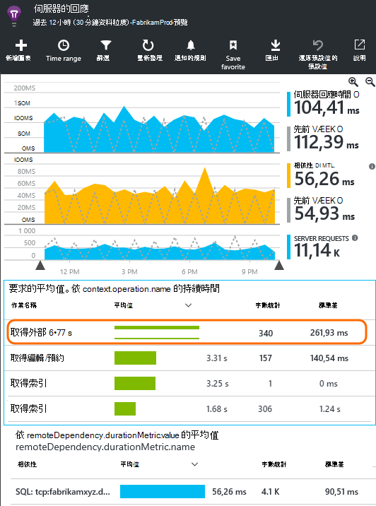
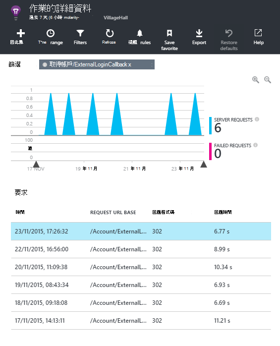
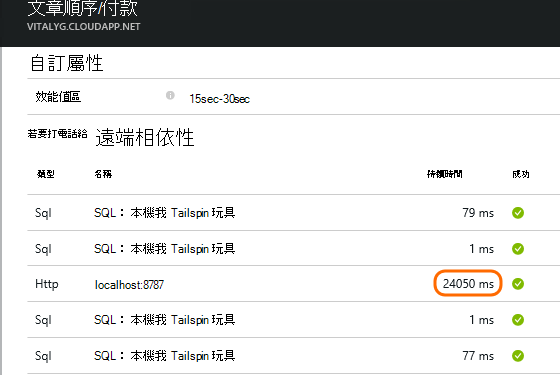
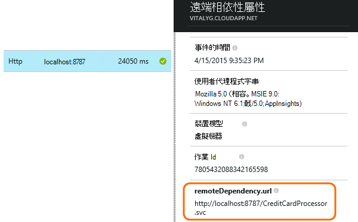
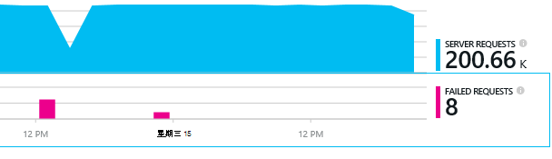
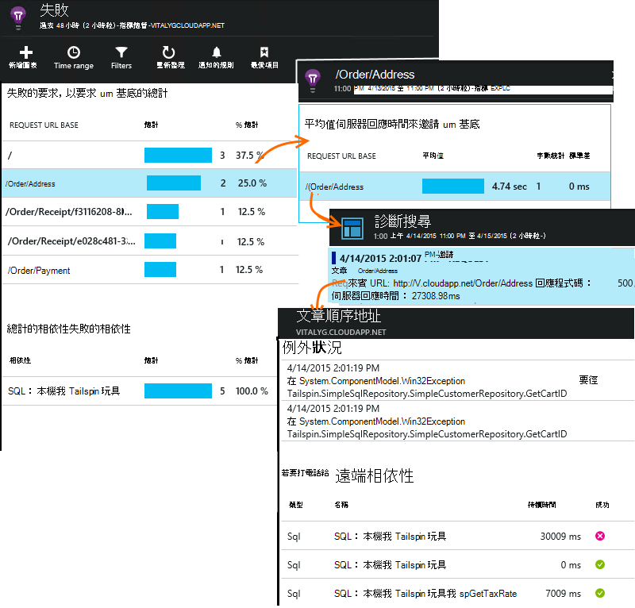

<properties 
    pageTitle="診斷在應用程式的深入見解的相依性問題" 
    description="尋找失敗和相依性所造成的效能變慢" 
    services="application-insights" 
    documentationCenter=""
    authors="alancameronwills" 
    manager="douge"/>

<tags 
    ms.service="application-insights" 
    ms.workload="tbd" 
    ms.tgt_pltfrm="ibiza" 
    ms.devlang="na" 
    ms.topic="article" 
    ms.date="05/12/2016" 
    ms.author="awills"/>
 
# <a name="diagnosing-issues-with-dependencies-in-application-insights"></a>診斷在應用程式的深入見解的相依性問題


*相依性*是由您的應用程式稱為外部元件。 通常是稱為使用 HTTP] 或資料庫檔案系統的服務。 或在您網頁的指令碼至伺服器 AJAX 通話。 在 Visual Studio 深入見解應用程式，您可以輕鬆地查看應用程式會相依性等候多久和相依性通話失敗的頻率。

## <a name="where-you-can-use-it"></a>您可以使用在哪裡

預設工作相依性監控是目前可用︰

* ASP.NET web 應用程式與服務 Azure 或 IIS 伺服器上執行
* [Java web 應用程式](app-insights-java-agent.md)
* [網頁](https://azure.microsoft.com/blog/ajax-collection-in-application-insights/)

其他類型，例如裝置應用程式，您可以撰寫您自己使用[TrackDependency API](app-insights-api-custom-events-metrics.md#track-dependency)的監視器。

-現成的相依性監視器目前報告這些類型的相依性的來電︰

* ASP.NET
 * SQL 資料庫
 * ASP.NET web 和使用 HTTP 為基礎的繫結的 WCF 服務
 * 本機或遠端 HTTP 通話
 * Azure DocumentDb、 表格、 blob 儲存體，以及佇列中
* Java
 * 電話可透過[JDBC](http://docs.oracle.com/javase/7/docs/technotes/guides/jdbc/)驅動程式，例如 MySQL、 SQL Server、 PostgreSQL 或 SQLite 資料庫。
* 網頁
 * [AJAX 通話](app-insights-javascript.md)

同樣地，您可以撰寫 SDK 來電監控其他相依性。

## <a name="to-set-up-dependency-monitoring"></a>若要設定監控相依性

安裝適當的代理程式 host （主機） 伺服器。

平台 | 安裝
---|---
IIS 伺服器 | [[安裝在伺服器上的狀態監視器](app-insights-monitor-performance-live-website-now.md)或[升級.NET framework 4.6 或更新您的應用程式](http://go.microsoft.com/fwlink/?LinkId=528259)並安裝[應用程式的深入見解 SDK](app-insights-asp-net.md)應用程式中。
Azure Web 應用程式 | [應用程式的深入見解副檔名](app-insights-azure-web-apps.md)
Java 網頁伺服器 | [Java web 應用程式](app-insights-java-agent.md)
網頁 | [JavaScript 監視器](app-insights-javascript.md)（除了網頁監控沒有其他設定）
Azure 雲端服務 |  [使用啟動任務](app-insights-cloudservices.md#dependencies)或[安裝.NET framework 4.6 +](../cloud-services/cloud-services-dotnet-install-dotnet.md)  

狀態監視器的 IIS 伺服器不需要您重建應用程式的深入見解 SDK 在來源專案。 

## <a name="application-map"></a>應用程式對應

應用程式對應作為視覺輔助工具來探索應用程式的元件之間的相依性。 

![按一下 [設定] 應用程式對應](./media/app-insights-dependencies/08.png)

從] 方塊中，您可以瀏覽至相關的相依性及其他的圖表。

按一下小型 [x] 以摺疊子樹狀目錄。

[固定的[儀表板](app-insights-dashboards.md)地圖位置會完全正常運作。

[進一步瞭解](app-insights-app-map.md)。

## <a name="diagnosis"></a>在網頁伺服器的診斷相依性效能問題

若要存取您的伺服器要求的效能︰

![在 [應用程式中的應用程式的深入見解的 [概觀] 頁面中，按一下 [效能的方塊](./media/app-insights-dependencies/01-performance.png)

捲動查看要求的格線下︰



花費很長的上方的項目。 我們來看看我們可以瞭解花費的時間的位置。

按一下以查看個別的邀請事件該資料列︰




按一下要進一步檢查有任何長執行個體。

> [AZURE.NOTE] 若要選擇執行個體稍微向下捲動。 延遲管道可能表示上方的執行個體的資料不完整。

捲動到遠端相依性來電相關此要求︰



它看起來像大部分的時間服務要求花在本機的服務進行通話。 

選取該資料列，以取得詳細資訊︰




詳細資料包含足夠診斷問題的資訊。


## <a name="failures"></a>失敗

如果有失敗的要求，請按一下 [圖表]。



按一下 [透過要求類型和要求執行個體，若要尋找遠端相依性在失敗的通話]。





## <a name="custom-dependency-tracking"></a>追蹤自訂相依性

標準的相依性追蹤模組會自動探索資料庫等 REST Api 外部相依性。 但您可能會想以相同的方式處理某些其他元件。 

您可以撰寫程式碼會傳送相依性的資訊，請使用相同的[TrackDependency API](app-insights-api-custom-events-metrics.md#track-dependency)所使用的標準模組。

例如，如果您沒有撰寫您自己的組件建立您的程式碼，您可能會時間所有來電，找出哪些對您的回應時間的比重。 若要讓此應用程式的深入見解的相依性圖表中顯示的資料，並使用傳送`TrackDependency`。

```C#

            var success = false;
            var startTime = DateTime.UtcNow;
            var timer = System.Diagnostics.Stopwatch.StartNew();
            try
            {
                success = dependency.Call();
            }
            finally
            {
                timer.Stop();
                telemetry.TrackDependency("myDependency", "myCall", startTime, timer.Elapsed, success);
            }
```

如果您想要切換標準的相依性追蹤模組，DependencyTrackingTelemetryModule 參照中移除[ApplicationInsights.config](app-insights-configuration-with-applicationinsights-config.md)。


## <a name="ajax"></a>Ajax

請參閱[網頁](app-insights-javascript.md)。


 