<properties
    pageTitle="偵測分類、 診斷"
    description="Analyse 當機，偵測並診斷在應用程式中的效能問題"
    authors="alancameronwills"
    services="application-insights"
    documentationCenter=""
    manager="douge"/>

<tags
    ms.service="application-insights"
    ms.workload="tbd"
    ms.tgt_pltfrm="ibiza"
    ms.devlang="na"
    ms.topic="article" 
    ms.date="11/06/2015"
    ms.author="awills"/>

# 偵測、 分類和診斷與應用程式的深入見解

*應用程式的深入見解位於預覽。*

應用程式的深入見解可協助您瞭解如何執行您的應用程式，且即時時使用。 與問題時，其可讓您認識，可協助您評估影響，以及可協助您判斷原因。

以下是從小組開發 web 應用程式的帳戶︰

* *「 數天之內的我們部署 '次要' 重要修正程式。我們未執行主要的測試，但部分預期的變更您使用的是很抱歉合併的內容，導致之間的正面與背面的結束不相容。立即引發 surged 伺服器例外狀況，我們警示，，我們已所發生的情況。按幾下滑鼠，離開應用程式的深入見解入口網站上，我們會有足夠的資訊，從例外狀況呼叫堆疊來縮小問題。我們會立即復原，並限制損毀。應用程式的深入見解已循環 devops 這個部分很容易及當中。 」*

我們來看看如何一般的 web 開發團隊使用應用程式的深入見解監控效能。 我們會依照開發線上銀行系統 (OBS) 的 Fabrikam 銀行小組。

小組合作的循環圖所示︰

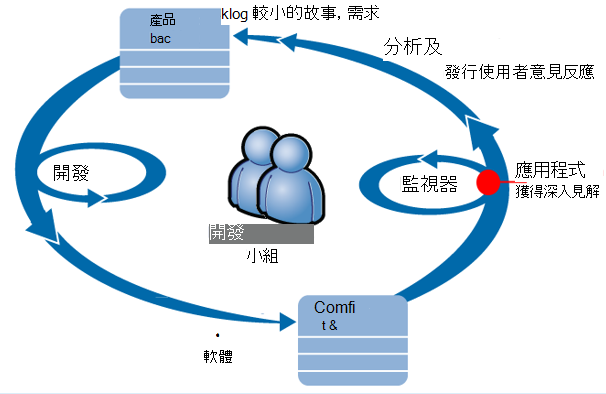

摘要將其開發積存 （任務清單） 的需求。 簡言之，其運作式衝刺，通常提供工作的軟體-通常在表單中的增強功能與延伸至現有的應用程式。 即時應用程式會經常更新的新功能。 雖然即時，小組監視其效能與使用應用程式的深入見解的協助。 此分析摘要回其開發積存。

小組使用的應用程式的深入見解監控密切的即時的 web 應用程式︰
* 效能。 想要瞭解如何回應時間因要求數。多少 CPU、 網路、 磁碟及其他資源的使用。然後瓶頸身在何處。
* 失敗。 如果有例外或失敗的要求，或如果效能計數器其習慣的範圍之外，小組要快速瞭解的好讓他們可以採取的動作。
* 使用方式。 每當發行的新功能，小組想知道哪些範圍它用，且使用者是否有任何問題，與其。

現在就讓我們著重於循環圖的意見反應部分︰

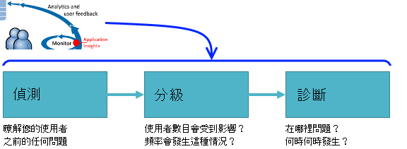

## 偵測不佳的可用性

Marcela Markova 資深開發人員 OBS 小組，並開始進行監視 online 的效能。 她會設定數個[web 測試][availability]:

* 單一 URL 測試主要登陸頁面上的應用程式，http://fabrikambank.com/onlinebanking/。 她 「 '歡迎使用 ！ 設定 HTTP 碼 200 和文字的準則。 這項測試失敗時，有網路或伺服器或可能的部署問題嚴重錯誤。 （或某人已變更歡迎使用 ！ 郵件在不讓其知道頁面上。）

* 更多步驟測試，登入，並取得目前的帳戶清單，檢查每一頁上的幾個重要詳細資料。 這項測試驗證正在帳戶資料庫的連結。 她使用虛構客戶識別碼︰ 其中一些維護以供測試之用。

設定這些測試，Marcela 就自信小組快速就會知道任何資料。  

失敗顯示為紅色點 web 測試圖表︰

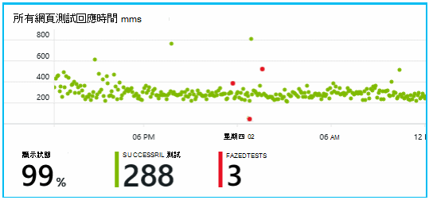

但更重要的是會送任何失敗的提醒給開發團隊。 如此一來，他們知道之前幾乎所有客戶。

## 監控效能指標

在 [應用程式的深入見解中的 [概觀] 頁面上有圖表顯示各種不同的[主要的度量][perf]。

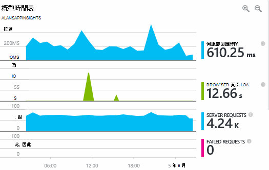

在瀏覽器頁面載入時間衍生自遙測直接從網頁送出]。 伺服器回應時間、 伺服器要求計數失敗的要求計數是所有以網頁伺服器，並從該處傳送應用程式獲得深入見解。

Marcela 是稍微考慮在伺服器回應 graph 下方，伺服器收到 HTTP 要求從使用者的瀏覽器，並會傳回回應時，會顯示之間的平均時間。 當系統負載而不異常請參閱在此圖中，一種變化。 但在此情況下，似乎之間小型彈計數的要求，並顯示較大的相互關聯彈回應時間。 可能表示系統作業只在其限制。 

她會開啟伺服器圖表︰

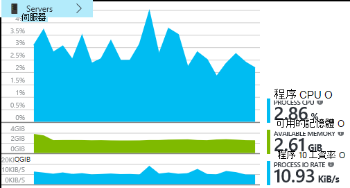

似乎沒有正負號的資源限制，因此可能伺服器回應圖表碰撞是只巧合。

## 通知

不過，晨怡也想要留意回應時間。 如果他們得太高，她想知道它立即。

她設定[提醒]，讓[metrics]的回應時間超過一般閥值。 這會提供她會將其變得很慢回應時間是否知道她信賴度。

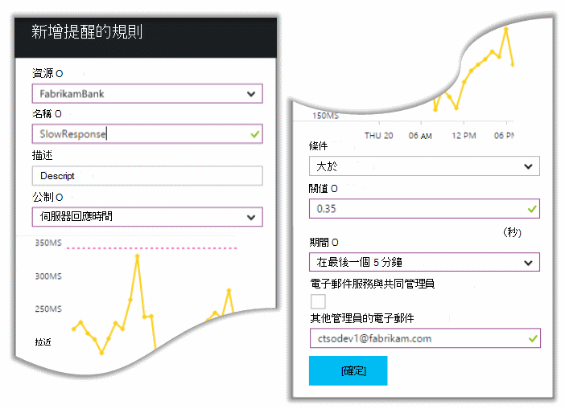

可以在各種不同的其他標準設定通知。 例如，您可接收電子郵件，如果例外狀況計數變成高，或可用的記憶體進入低，或者在用戶端邀請中有最大使用量。

## 主動式診斷通知

下一天，提醒的電子郵件未送達從應用程式的深入見解。 不是她開啟它，她找到她設定回應時間提醒。 不過，它會告訴她已突然上升失敗在邀請中-亦即會傳回失敗碼 500 或更多的要求。

失敗的要求是使用者已經看到錯誤-通常是下列例外狀況程式碼中的位置。 也許就會看到一則訊息說 「 很抱歉我們無法立即更新您的詳細資訊 」，或在絕對 embarrassing，堆疊傾印在使用者的畫面上，內容網頁伺服器。

此通知，所以奇怪，她看，最後一次失敗的要求計數已 encouragingly 低。 忙碌的伺服器可能需要為少量的失敗次數。 

也是有點奇怪為她因為她未設定此通知。 事實上，主動診斷會自動隨附的應用程式的深入見解。 它會自動調整以您的應用程式一般失敗圖樣] 和 [」 會用來 「 失敗的特定頁面上，或在高負載時，或連結至其他指標。 只有在上升上方其出現發生的事，它會引發警示。

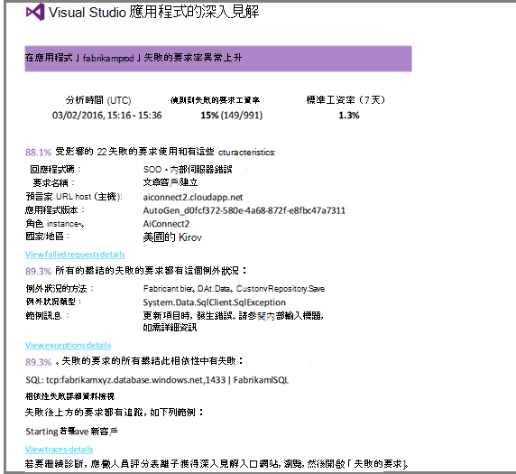

這是非常好用的電子郵件。 它不只會引發警示。它也會有許多分級和診斷公司]。

將其顯示多少客戶會受到影響，以及哪些網頁或作業。 Marcela 可以決定是否她需要取得這項工作 fire 向下切入，為整個小組或直到下週是否可以略過。

特定的例外狀況發生，甚至-更趣味-失敗會失敗的來電至特定的資料庫與相關聯，也會顯示電子郵件。 此說明為什麼故障突然出現即使 Marcela 的小組尚未最近部署任何更新。 

她會偵測資料庫小組的前置字元。 是的在發行修正在過去的半小時。與真也許可能有稍微結構描述變更...

因此問題是固定，甚至之前調查記錄]，與該工作而有 15 分鐘內的方式。 不過，Marcela 按一下以開啟應用程式的深入見解的連結。 直接進入失敗的要求，它會開啟，就可以看到失敗撥入相關聯的相依性的通話清單的資料庫。 

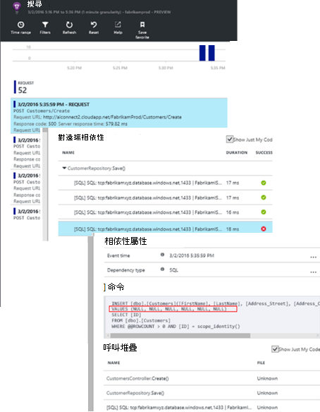

## 偵測例外狀況

安裝程式實際上，[例外狀況](app-insights-asp-net-exceptions.md)報告應用程式獲得深入見解自動。 他們可以也擷取明確的來電至[TrackException()](app-insights-api-custom-events-metrics.md#track-exception)插入程式碼︰  

    var telemetry = new TelemetryClient();
    ...
    try
    { ...
    }
    catch (Exception ex)
    {
       // Set up some properties:
       var properties = new Dictionary <string, string>
         {{"Game", currentGame.Name}};

       var measurements = new Dictionary <string, double>
         {{"Users", currentGame.Users.Count}};

       // Send the exception telemetry:
       telemetry.TrackException(ex, properties, measurements);
    }

Fabrikam 銀行小組具有發展出例外狀況，永遠傳送遙測的練習，除非有明顯的復原。  

事實上，其策略是更多︰ 傳送遙測客戶在哪裡神情什麼他們想要執行這項，或不一致的程式碼中的例外狀況是否在每個大小寫。 例如，如果外部間的銀行傳輸系統操作因故 （客戶的沒有錯誤） 傳回 「 無法完成此交易 」 的訊息然後他們追蹤該事件。

    var successCode = AttemptTransfer(transferAmount, ...);
    if (successCode < 0)
    {
       var properties = new Dictionary <string, string>
            {{ "Code", returnCode, ... }};
       var measurements = new Dictionary <string, double>
         {{"Value", transferAmount}};
       telemetry.TrackEvent("transfer failed", properties, measurements);
    }

TrackException 用來報告例外狀況，因為它會傳送一份堆疊。TrackEvent 用來報告其他事件。 您可以附加可能很有用的診斷中的任何內容。

例外狀況和事件顯示在[診斷搜尋][diagnostic]刀。 您可以深入瞭解，請參閱其他屬性，以及堆疊追蹤。

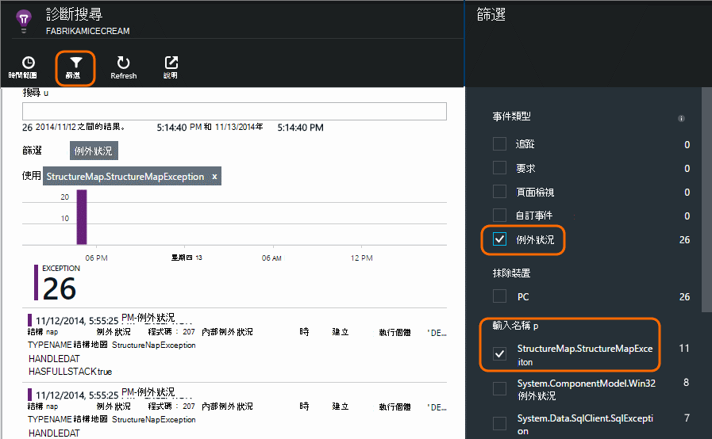

## 監視使用者活動

回應時間，請務必一致的方式，有一些例外狀況開發小組可以考慮如何改善使用者的體驗，以及如何鼓勵更多使用者，以達到所要的目標。

一般使用者生涯時透過網站，例如已清除的 「 漏斗圖 」: 許多客戶看起來不同類型的貸款; 率將其中一些填寫報價表單。並的人取得引號，幾安不貸款。

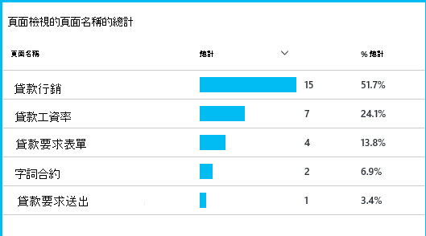

考慮之客戶的最大的數字放置的位置，企業就可以使用如何取得更多使用者底部的漏斗圖。 在某些情況下可能使用者體驗 (UX) 失敗-，例如 [下一頁] 按鈕難以尋找，或不明顯的指示進行。 更有可能更重要商務的原因有首深入瞭解︰ 也許貸款率會太高。

任何原因資料可協助小組找出使用者所執行的動作。 更多追蹤來電可以插入出更多詳細資料。 TrackEvent() 可以用於計算中的個別按鈕按鍵，例如付清貸款嚴重成就至關係的詳細資料的任何使用者動作。

小組會取得用於使用者活動的相關資訊。 最近，如果其設計的新功能，其運作查看如何就會看到關於及其用法的意見反應。 在設計的功能，從開始追蹤來電。 使用意見反應，可改善在每個開發週期中的功能。

## 主動監視  

Marcela 不只是坐著等待通知。 推出之後每個重新部署，她需要[回應時間]看[perf]-同時整體圖，以及最慢的要求，以及例外狀況的計算。  

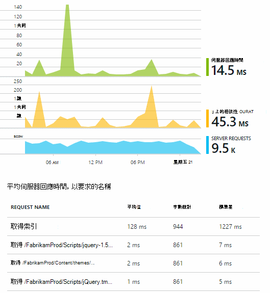

晨怡也可以評估效能效果的每個部署中，通常比較，最後一個每週。 如果沒有突然 worsening，晨怡也會引發的與相關的開發人員。

## 分級

分級-評估嚴重性和程度-後偵測是問題的第一步。 應該我們撥出小組午夜？ 或者可以保留直到積存中的下一個方便的間距嗎？ 有分級的一些重要問題。

多少它新鮮事？ 概觀刀上的圖表的觀點顯示某些問題。 例如，Fabrikam 應用程式產生四個 web 測試通知一個晚上。 上午查看圖表，小組可能會看到已確實一些紅色的點，綠色仍大部分的測試一樣。 切入至可用的圖表，是清除所有這些間歇性發生的問題已從一個測試位置。 這是明顯的影響，只有一個路由網路問題，很可能會想要清除本身。  

相反地的例外狀況數量或回應時間圖形中引人注目及穩定上升是明顯驚慌相關項目。

實用的分級策略是嘗試它自己。 如果您遇到的問題時，就會知道它是實數。

使用者的哪些部分會受到影響？ 若要取得概略的答案，請失敗率除以工作階段計數。

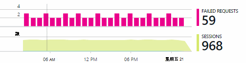

若是變得很慢的回應，比較慢回應的要求，每一頁的使用狀況頻率的資料表。

如何重要的是 [封鎖的情況？ 如果這是封鎖特定使用者本文功能問題時，會影響多嗎？ 如果客戶無法使用其帳單，這是有;如果他們不能變更其喜好設定] 畫面的色彩，是不是它可以等。 事件或的例外狀況的詳細資料或 [變得很慢] 頁面的身分識別會告訴您的客戶會有問題的位置。

## 診斷

診斷不完全相同偵錯。 您開始追蹤執行程式碼之前，您應該可以為何，概略瞭解發生問題的位置和時間。

**何時何時發生？** 事件] 和 [公制圖表所提供的歷史檢視讓您更容易關聯效果與可能的原因。 如果回應時間] 或 [例外狀況費率有斷斷續續尖峰，看看要求計數︰ 如果該尖峰同時，再看起來像是資源問題。 您需要指派更多的 CPU 或記憶體嗎？ 還是無法管理載入的相依性？

**它是我們嗎？**  如果您有突然置放效能的特定類型的邀請-例如當客戶想要的帳戶陳述式-然後時可能會發生，可能的外部子系統，而不是您的 web 應用程式。 指標總管] 中選取的相依性失敗率和相依性工期工資率和比較其歷程記錄過去幾個小時或天數您偵測到的問題。 如果有會相互關聯的變更，外部子系統可能清白。  

![圖表的相依性失敗及工期的來電至] 相依性](./media/app-insights-detect-triage-diagnose/11-dependencies.png)

變得很慢的相依性的一些問題是地理位置的問題。 Fabrikam 銀行使用 Azure 虛擬機器，並且發現，他們有不小心位於其網頁伺服器和帳戶伺服器不同國家/地區。 錯誤碼引人注目的改進，是將它移轉其中之一。

**我們是否做什麼？** 如果問題不會出現在相依性，而且它不一定有，可能是最近的變更所致。 歷史公制與事件圖表所提供的觀點來看讓您更容易使用部署關聯突然的任何變更。 縮小下尋找有問題。

**什麼事？** 某些問題發生很少，而且很難追蹤離線測試。 我們可以只是嘗試擷取 bug 時 live。 您可以檢查例外狀況報表中的堆疊傾印。 此外，您也可以使用您慣用的記錄架構或 TrackTrace() 或 TrackEvent() 撰寫追蹤呼叫。  

Fabrikam 有斷斷續續的問題與間的帳戶傳送，但只能與特定的帳戶類型。 若要進一步瞭解發生什麼，其程式碼中，為屬性的帳戶類型附加至每個通話中插入 TrackTrace() 來電。 無比篩選出只搜尋診斷] 中的追蹤。 他們也會附加到追蹤呼叫的參數值屬性和量值。

## 處理方式

一旦您已診斷的問題，您可以將計劃以修正此問題。 您可能需要復原最近的變更，或只安和修正。 一旦修正] 完成後，應用程式的深入見解會告訴您是否成功的位置。  

Fabrikam 銀行開發小組需要更多結構化的方式效能測量於使用應用程式的深入見解。

* 他們可以設定特定的量值龐大的效能目標應用程式的深入見解的 [概觀] 頁面中。

* 在應用程式從 [開始]，例如測量 'funnels。 」 的使用者進行指標設計效能量值  

## 使用方式

應用程式的深入見解也可用於瞭解使用者如何處理相關應用程式。 順利執行，一旦小組想要知道有最常用的功能什麼使用者喜歡或有困難，和頻率他們回來。 可協助他們排列優先順序，其即將來臨的工作。 他們可以計劃測量的每一個功能成功開發週期的一部分。 [延伸閱讀][usage]。

## 您的應用程式

因此，這是如何小組使用的應用程式的深入見解不只是修正個別的問題，但以改善其開發週期。 希望將其有提供您一些有關應用程式深入資訊可以如何協助您改善您的應用程式的效能。

## 視訊

[AZURE.VIDEO performance-monitoring-application-insights]

<!--Link references-->

[api]: app-insights-api-custom-events-metrics.md
[availability]: app-insights-monitor-web-app-availability.md
[diagnostic]: app-insights-diagnostic-search.md
[metrics]: app-insights-metrics-explorer.md
[perf]: app-insights-web-monitor-performance.md
[usage]: app-insights-web-track-usage.md
 
