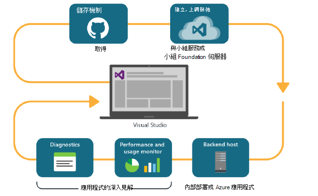
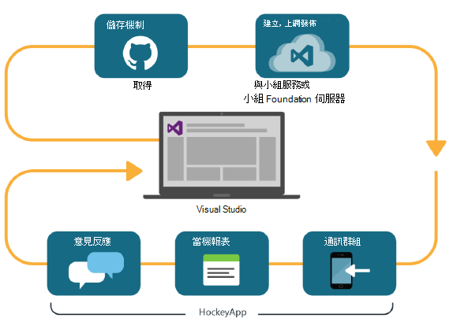

<properties
    pageTitle="開發人員狀況分析"
    description="使用 Visual Studio、 應用程式的深入見解及 HockeyApp DevOps"
    authors="alancameronwills"
    services="application-insights"
    documentationCenter=""
    manager="douge"/>

<tags
    ms.service="application-insights"
    ms.workload="tbd"
    ms.tgt_pltfrm="ibiza"
    ms.devlang="na"
    ms.topic="article" 
    ms.date="05/18/2016"
    ms.author="awills"/>

# 應用程式的深入見解與 HockeyApp 開發人員狀況分析

*應用程式的深入見解位於預覽。*

多個專案操作的快速[DevOps](https://en.wikipedia.org/wiki/DevOps)循環。 他們會建立及發佈應用程式、 取得關於如何執行與使用者，請執行的意見反應，然後使用知識計劃進一步的開發週期。 

監視使用情況和效能，請務必讓遙測的即時的應用程式，以及從使用者自己的意見反應。 

許多系統建立從多個元件︰ web 服務、 後端處理器或資料儲存區及執行使用者的瀏覽器中或為手機或其他裝置中的應用程式的用戶端軟體。 從這些其他元件遙測具有所要採取放在一起。

某些發行有限制通訊群組，以指定的人員。我們具備也組織 flighting （測試新功能與受限制的對象） 和 A |B 測試 （平行測試替代的使用者介面）。

管理散佈和整合在用戶端與伺服器的多個元件監控不是一般的工作。 此程序為架構的應用程式中不可或缺的一部分︰ 我們無法建立此類型不反覆運算開發週期以及建議監視工具系統。

本文中，我們會看看如何 devOps 循環圖的監控方面適用於使用其他部分的程序。 

如果您想要查看的特定範例，則表示[感興趣的案例研究](http://aka.ms/mydrivingdocs)含有多個用戶端與伺服器的元件。

## DevOps 循環圖

Visual Studio 與開發人員分析工具提供完善的整合式 devOps 的體驗。 例如，以下是 web 應用程式 （這可能是 Java、 Node.js 或 ASP.NET） 一般循環圖︰

* 開發人員檢查程式碼存放庫，或合併到主分支。 將存放庫給在此圖中，但平均可能是[小組 Foundation 版本控制](https://www.visualstudio.com/docs/tfvc/overview)。
* 變更觸發程序建立和單位的測試。 建立服務可在[Visual Studio 小組服務或內部部署涵蓋，小組 Foundation 伺服器](https://www.visualstudio.com/docs/vsts-tfs-overview)。 
* 成功建立和單位測試可以[觸發程序的自動部署](https://www.visualstudio.com/docs/release/author-release-definition/more-release-definition)。 您自己的網頁伺服器或 Microsoft Azure，可以是 web 應用程式主機。 
* 從 live 應用程式的遙測會傳送至[應用程式的深入見解](app-insights-overview.md)同時從伺服器，並[從用戶端的瀏覽器](app-insights-javascript.md)。 那里，您可以 analyse 應用程式和使用狀況模式的效能。 強大的[搜尋工具](app-insights-analytics.md)說明診斷任何問題。 [通知](app-insights-alerts.md)請確定您瞭解問題時，會發生。 
* 下一步開發週期會通知他們的即時遙測您分析。

### 裝置及桌面應用程式

裝置與桌面應用程式，通訊群組的一部分循環圖的位置略有不同，因為我們不只上傳到一或兩個伺服器。 不過，成功建立和單位測試可以[觸發程序將上傳至 HockeyApp](https://support.hockeyapp.net/kb/third-party-bug-trackers-services-and-webhooks/how-to-use-hockeyapp-with-visual-studio-team-services-vsts-or-team-foundation-server-tfs)。 HockeyApp supervises 分配給您的小組的測試使用者 （或一般大眾，如果您想要的話）。 

效能及使用方式資料的表單，也會收集 HockeyApp:

* 逐字使用者意見反應的螢幕擷取畫面
* 當機報表
* 撰寫您的自訂遙測。

同樣地，當您所獲得的意見反應 in the light of 您未來開發計劃，已完成的 devOps 循環。

## 設定 [開發人員狀況分析

針對每個元件的應用程式-行動裝置或網頁或桌面-步驟會基本上相同。 有許多種應用程式的詳細資訊，如 Visual Studio 會自動執行這些步驟。

1. 新增適當的 SDK，您的應用程式。 裝置應用程式，則 HockeyApp，而 web 服務則是應用程式的深入見解。 有數種不同的平台的前的變異字。 （您也可使用任一 SDK 桌面應用程式，但我們建議您 HockeyApp。）
2. 使用應用程式的深入見解或 HockeyApp 入口網站，根據您使用的 SDK 註冊您的應用程式。 這是，您會看到您即時應用程式的分析。 您收到儀器鍵或以便 SDK 知道傳送其遙測位置設定您的應用程式的識別碼。
3. 登入事件或單位，可協助您處理診斷或效能] 或 [使用狀況分析新增自訂程式碼 （如有需要）。 有許多監控內建的因此您不需要這在您的第一個循環。
3. 裝置應用程式︰
 * 將偵錯組建的上傳到 HockeyApp。 從這裡您可以將它發佈給小組中的 [測試使用者。 每當您上傳後續組建時，就會收到小組。
 * 當您設定您連續建立服務時，建立發行定義上傳至 HockeyApp 所使用的外掛程式的步驟。

### 分析及 HockeyApp 遙測的匯出

您可以調查 HockeyApp 自訂並登入遙測使用[橋](app-insights-hockeyapp-bridge-app.md)設定應用程式的深入見解的分析及連續匯出功能。

## 後續步驟
 
以下是不同類型的應用程式的詳細的指示︰

* [ASP.NET web 應用程式](app-insights-asp-net.md) 
* [Java web 應用程式](app-insights-java-get-started.md)
* [Node.js web 應用程式](https://github.com/Microsoft/ApplicationInsights-node.js)
* [iOS 應用程式](https://support.hockeyapp.net/kb/client-integration-ios-mac-os-x-tvos/hockeyapp-for-ios)
* [Mac OS X 應用程式](https://support.hockeyapp.net/kb/client-integration-ios-mac-os-x-tvos/hockeyapp-for-mac-os-x)
* [Android 應用程式](https://support.hockeyapp.net/kb/client-integration-android/hockeyapp-for-android-sdk)
* [通用的 Windows 應用程式](https://support.hockeyapp.net/kb/client-integration-windows-and-windows-phone/how-to-create-an-app-for-uwp)
* [Windows Phone 8 和 8.1 應用程式](https://support.hockeyapp.net/kb/client-integration-windows-and-windows-phone/hockeyapp-for-windows-phone-silverlight-apps-80-and-81)
* [Windows 簡報 Foundation 應用程式](https://support.hockeyapp.net/kb/client-integration-windows-and-windows-phone/hockeyapp-for-windows-wpf-apps)

