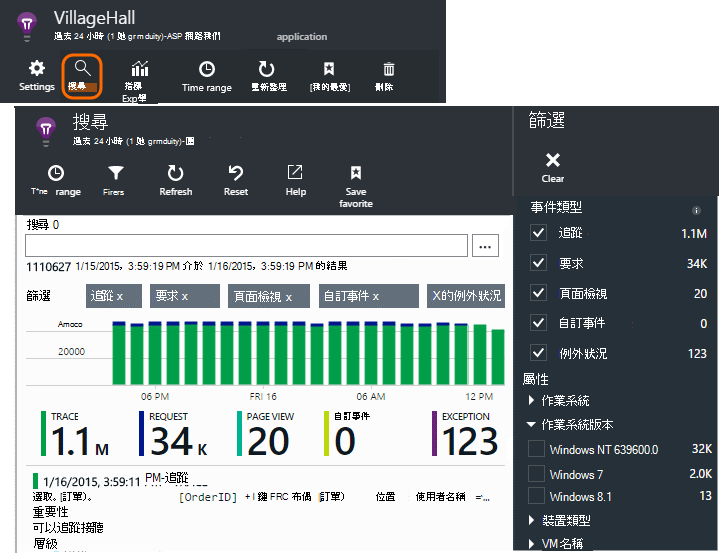
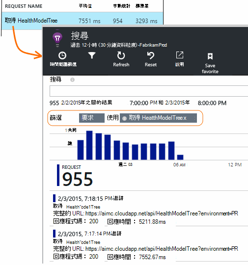
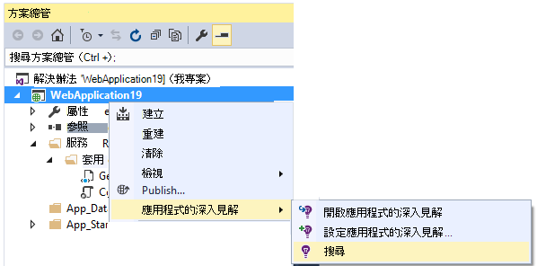
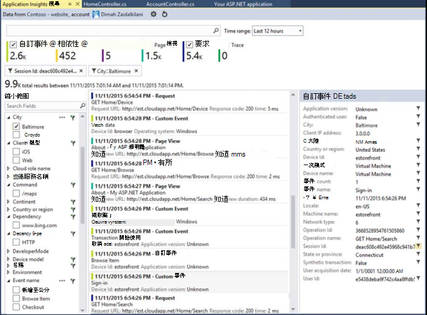
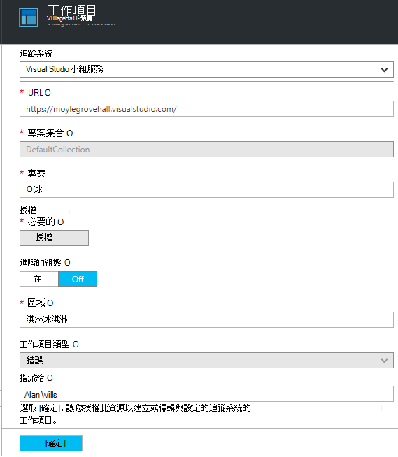
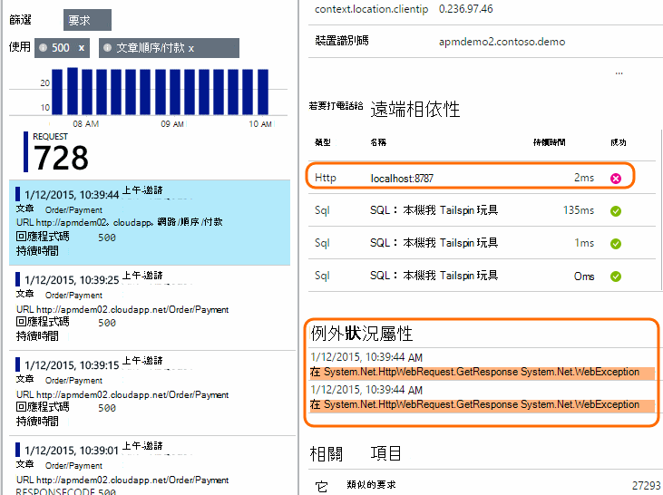
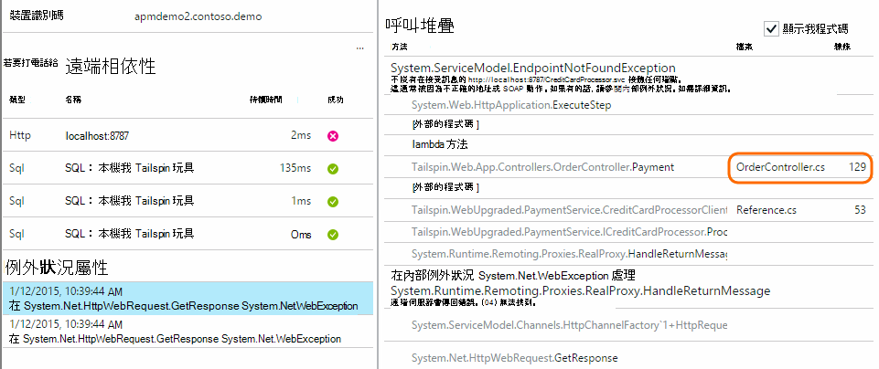
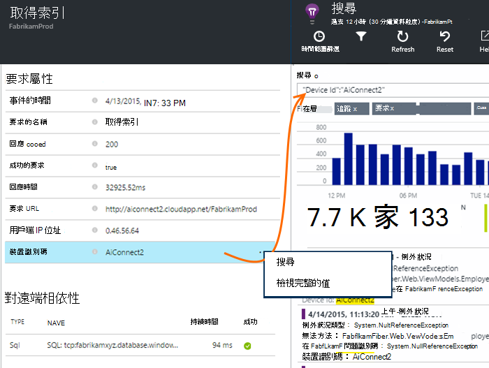
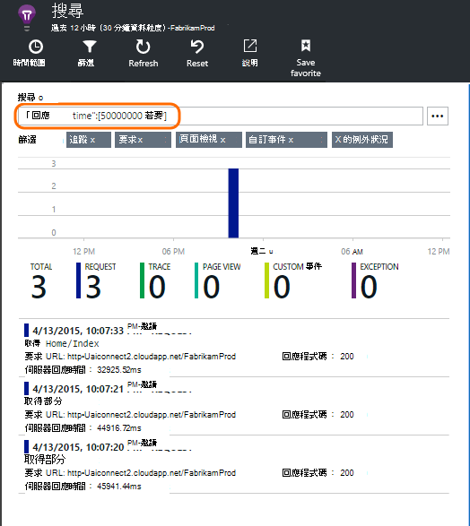
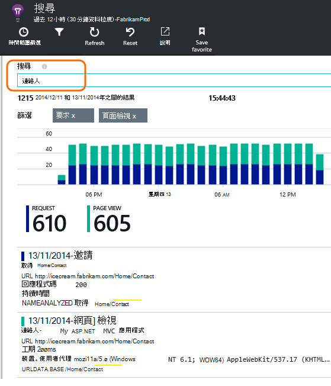

<properties 
    pageTitle="使用搜尋診斷 |Microsoft Azure" 
    description="搜尋篩選個別的事件，要求]，並登入的追蹤。" 
    services="application-insights" 
    documentationCenter=""
    authors="alancameronwills" 
    manager="douge"/>

<tags 
    ms.service="application-insights" 
    ms.workload="tbd" 
    ms.tgt_pltfrm="ibiza" 
    ms.devlang="na" 
    ms.topic="article" 
    ms.date="06/09/2016" 
    ms.author="awills"/>
 
# 使用中應用程式的深入見解的診斷搜尋

診斷搜尋是[應用程式的深入見解]的功能[start]您使用尋找及瀏覽個別遙測項目，例如 [頁面檢視]、 [例外]，或網頁的要求。 然後，您可以檢視記錄追蹤和您編碼的事件。

## 您看到診斷搜尋的位置？

### Azure 入口網站中

您可以明確開啟診斷搜尋︰

當您按一下透過部分的圖表和格線項目時，它也會開啟。 在此情況下，其篩選已預先設為焦點放在您選取的項目類型。 

例如，web 服務應用程式時，概觀刀便會顯示要求量的圖表。 按一下，前往更詳細的圖表，以顯示多少要求所做的每個 URL 的清單。 按一下任一列中，和您的 url 取得個別要求的清單︰

搜尋診斷的主體是清單的遙測項目-伺服器要求頁面檢視、 自訂您編碼的事件等等。 清單的頂端會顯示一段時間的事件計數的摘要圖表。

事件通常會顯示在搜尋診斷之前公制檔案總管] 中顯示。 雖然刀自行重新整理的間隔，您可以按一下重新整理，如果您正在等待特定事件。

### 在 Visual Studio 中

Visual Studio 中開啟 [搜尋] 視窗︰

[搜尋] 視窗會具有與入口網站相同的功能︰

## 範例

如果您的應用程式會產生遙測許多 (並您正在使用 SDK ASP.NET 版本 2.0.0-beta3 或更新版本)，調整取樣模組會自動降低音量傳送入口網站的傳送代表分數的事件。 不過，相同的邀請相關的事件會選取或取消選取群組，讓您可以瀏覽相關事件之間。 

[深入了解範例](app-insights-sampling.md)。

## 檢查個別項目

選取任何遙測項目，以查看索引鍵欄位和相關項目。 如果您想要查看完整的欄位組，請按一下 [...]。 

![按一下 [新項目，編輯的欄位，，然後按一下 [確定]。](./media/app-insights-diagnostic-search/10-detail.png)

若要尋找完整的欄位組，使用純文字字串 （不含萬用字元）。 可用欄位的遙測類型而定。

## 建立工作項目

您可以建立錯誤 Visual Studio 小組服務中的任何遙測項目的詳細資料。 

![按一下 [新項目，編輯的欄位，，然後按一下 [確定]。](./media/app-insights-diagnostic-search/42.png)

第一次這麼做，會要求您設定您的小組服務帳戶和專案的連結。

(您也可以前往設定刀從設定 > 工作項目。)

## 篩選事件類型

開啟 [篩選刀並選擇您想要查看的事件類型。 （如果更新版本中，您會想要還原開啟刀的篩選，按一下 [重設。）

![選擇 [篩選]，然後選取 [遙測類型](./media/app-insights-diagnostic-search/02-filter-req.png)

事件類型如下︰

* **追蹤**-診斷記錄，包括 TrackTrace、 log4Net、 NLog 和 System.Diagnostic.Trace 通話。
* **要求**-伺服器應用程式，包括網頁、 指令碼、 圖像、 樣式檔案和資料所接收到的 HTTP 要求。 這些事件會用來建立的邀請及回應概觀圖。
* **頁面檢視**遙測網頁用戶端，傳送用來建立頁面檢視報表。 
* **自訂事件**-如果您插入的來電至 TrackEvent()[監視使用情況]的順序[track]，以下搜尋。
* **例外狀況**-無法攔截的例外狀況中的伺服器，以及您使用 TrackException() 登入。

## 篩選屬性值

您可以篩選事件及其屬性的值。 可用的屬性需視您所選取的事件類型而定。 

例如，選擇以特定的回應代碼的邀請。

![展開] 屬性，並選擇值](./media/app-insights-diagnostic-search/03-response500.png)

不選擇特定屬性的任何值具有相同的效果選擇所有的值。切換關閉該屬性篩選。

### 縮小搜尋範圍

請注意右側的篩選值的計數，顯示有多少項目會在目前的篩選設定。 

在此範例中，將其已清除的`Reports/Employees`要求在大部分的 500 錯誤的結果︰

![展開] 屬性，並選擇值](./media/app-insights-diagnostic-search/04-failingReq.png)

此外如果您想要也請參閱什麼其他事件已發生在這段時間，您可以檢查**包含事件未定義的屬性**。

## 移除傀儡和 web 測試流量

使用篩選**實數或綜合流量**，並核取 [**實數**。

您也可以篩選**綜合流量的來源**。

## 檢查個別項目

篩選設定，以新增該要求的名稱，您就可以檢查該事件的個別項目。

要求事件的詳細資訊會顯示處理要求時，發生的例外狀況。

按一下以查看其詳細資料，包括堆疊追蹤例外狀況。

## 尋找具有相同的屬性的事件

尋找具有相同的屬性值的所有項目︰

## 搜尋公制值

取得所有的要求回應時間 > 5s。  時間刻度為單位表示︰ 10 000 刻度 = 1ms。

## 搜尋資料

您可以搜尋字詞中任何屬性的值。 這是您所撰寫的[自訂事件]的特別有用[track]與屬性值。 

您可能會想要設定的時間範圍，以搜尋為較短的速度。 

搜尋字詞，不子字串。 字詞是英數字元的字串，例如包括一些標點符號 '。 ' 和 '_'。 例如︰

字詞|*不*符合嗎|但這些比對
---|---|---
HomeController.About|關於 首頁|h\*相關 首頁\*
IsLocal|本機 為 \*本機|isl\* islocal i\*l\*
新的延遲|w d|新 延遲 n\*與 d\*

以下是您可以使用搜尋運算式︰

範例查詢 | 效果 
---|---
速度|尋找其欄位中包含字詞的日期範圍中的所有事件 」 都速度 」
資料庫？|DatabaseAB，相符的項目 database01... ? 不允許搜尋字詞的開頭。
資料庫 * |相符的項目資料庫、 database01 databaseNNNN  * 不允許搜尋字詞的開頭
apple 與香蕉|尋找包含兩個字詞的事件。 使用 capital 」 和 「，不 「 和 」。
apple 或香蕉 apple 香蕉|尋找包含其中一個字詞的事件。 使用 「 或者 」，不 「 或 」。 < /br/ > 簡短的表單。
apple 不香蕉 apple-香蕉|尋找包含一個字詞，但不是其他事件。 簡短的表單。
應用程式 * 與香蕉-(grape pear)|邏輯運算子和 bracketing。
「 公制 」: 0 到 500 [公制]: 500 收 * | 尋找包含命名的度量值的範圍內的事件。

## 儲存您的搜尋

當您已設定您想要的所有篩選時，您可以儲存搜尋為最愛項目。 如果您使用的組織帳戶，您可以選擇是否要與其他小組成員共用。

![按一下 [最愛項目，設定名稱]，並按一下 [儲存]](./media/app-insights-diagnostic-search/08-favorite-save.png)

若要查看一次，**前往概觀刀**搜尋並開啟 [我的最愛]:

![[我的最愛] 磚](./media/app-insights-diagnostic-search/09-favorite-get.png)

如果您儲存包含相對的時間範圍，重新開啟的刀有最新的資料。 如果您儲存包含絕對的時間範圍，您看到相同的資料每次。

## 更多遙測傳送應用程式獲得深入見解

除了應用程式的深入見解 SDK 所傳送的方塊出遙測，您可以︰

* 擷取您最愛的記錄中架構[.NET]從記錄追蹤[netlogs]或[Java][javalogs]。 這表示您可以搜尋您的記錄追蹤及建立它們使用頁面檢視、 例外] 及其他事件的關聯。 
* [撰寫程式碼][track]傳送自訂事件與網頁] 檢視中的例外狀況。 

[瞭解如何將應用程式獲得深入見解傳送記錄檔和自訂遙測][trace]。

## 問與答

### 要保留的資料量？

最多 500 個秒每個應用程式的事件。 仍會保留七天的事件。

### 如何在我的伺服器邀請中看到文章資料？

我們不會自動登入張貼資料，但您可以使用[TrackTrace 或記錄通話][trace]。 文章中資料放置的訊息參數。 您無法篩選郵件的方式內容，但的大小限制是更長的時間。

## 後續步驟

* [傳送記錄檔和自訂遙測應用程式獲得深入見解][trace]
* [設定可用性和回應速度測試][availability]
* [疑難排解][qna]

<!--Link references-->

[availability]: app-insights-monitor-web-app-availability.md
[javalogs]: app-insights-java-trace-logs.md
[netlogs]: app-insights-asp-net-trace-logs.md
[qna]: app-insights-troubleshoot-faq.md
[start]: app-insights-overview.md
[trace]: app-insights-search-diagnostic-logs.md
[track]: app-insights-api-custom-events-metrics.md

 