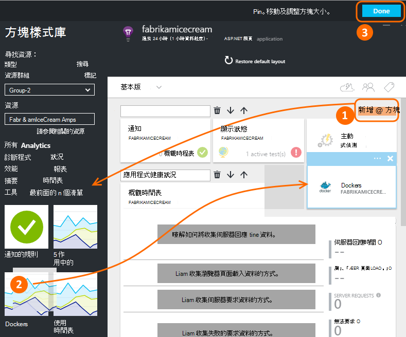
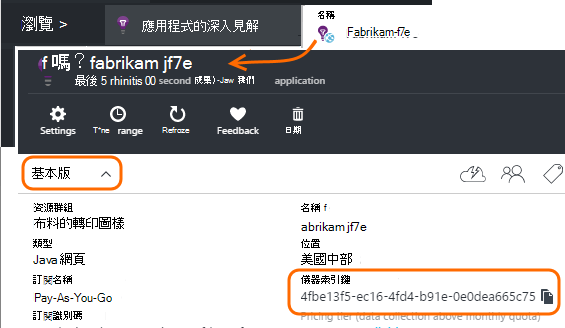
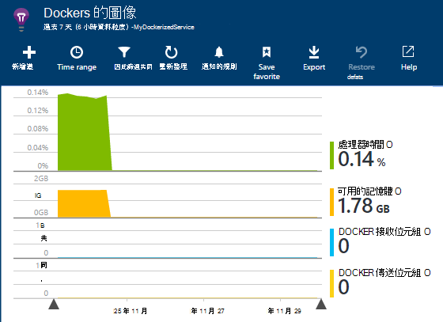
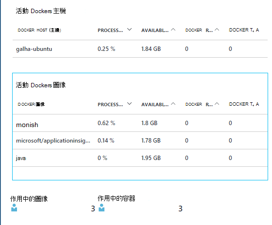
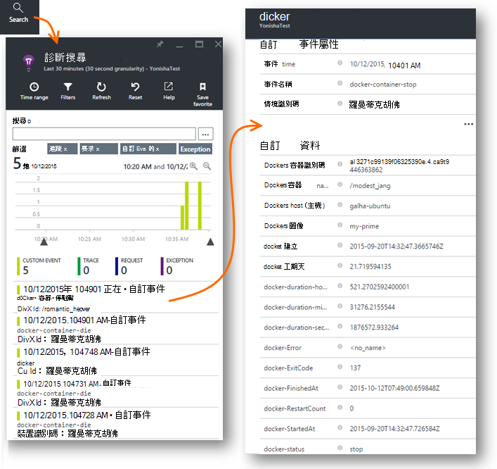
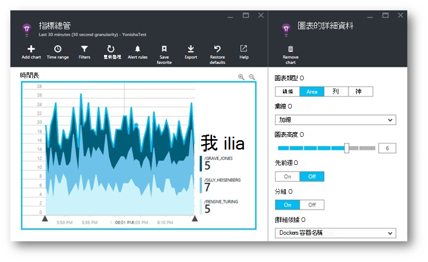
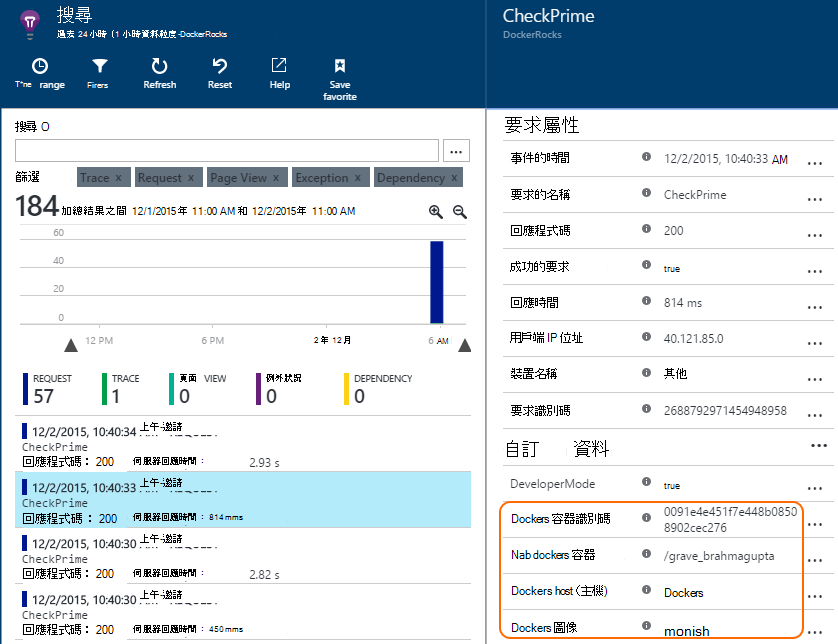
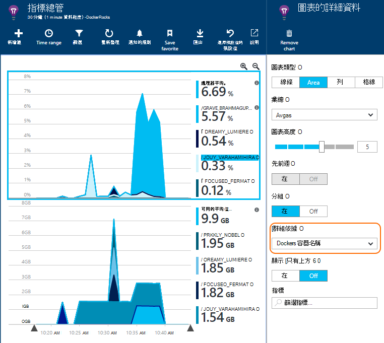

<properties 
    pageTitle="在 [應用程式的深入見解的監視器 Docker 應用程式" 
    description="Docker 效能計數器、 事件和例外狀況可顯示應用程式的深入見解，以及編應用程式的遙測。" 
    services="application-insights" 
    documentationCenter=""
    authors="alancameronwills" 
    manager="douge"/>

<tags 
    ms.service="application-insights" 
    ms.workload="tbd" 
    ms.tgt_pltfrm="ibiza" 
    ms.devlang="na" 
    ms.topic="article" 
    ms.date="12/01/2015" 
    ms.author="awills"/>
 
# <a name="monitor-docker-applications-in-application-insights"></a>在 [應用程式的深入見解的監視器 Docker 應用程式

在 [應用程式的深入見解製圖可以到生命週期事件和效能計數器從[Docker](https://www.docker.com/)容器。 在您的主機容器中安裝的[應用程式的深入見解](app-insights-overview.md)圖像和主應用程式，以及其他圖像，它會顯示正在。

使用 Docker 散發您完成所有的相依性輕量型容器中的應用程式。 他們會在 Docker 引擎會執行任何主機上執行。

當您在您的 Docker 主機上執行[應用程式的深入見解圖像](https://hub.docker.com/r/microsoft/applicationinsights/)時，您會看到下列優點︰

* 瞭解執行的所有容器的生命週期遙測主機-啟動、 停止，依此類推。
* 所有容器的效能計數器。 CPU、 記憶體、 網路使用及其他功能。
* 如果您在容器，這些應用程式的所有遙測執行應用程式中的 [[安裝應用程式的深入見解 SDK](app-insights-java-live.md)會有其他屬性，識別容器和主機機器。 因此，例如，如果您有一個以上的主應用程式中執行應用程式的執行個體，您就輕鬆可以篩選您的應用程式遙測主機。


## <a name="set-up-your-application-insights-resource"></a>設定您的應用程式的深入見解的資源

1. 登入[Microsoft Azure 入口網站](https://azure.com)，並開啟應用程式的深入見解資源的應用程式。或[建立新的項目](app-insights-create-new-resource.md)。 

    *我應該使用哪一個資源？* 如果您執行的在您的主機的應用程式所開發的其他人，則您必須先[建立新的應用程式的深入見解資源](app-insights-create-new-resource.md)。 這是您檢視及分析遙測的位置。 （選取 「 其他 」 應用程式類型）。

    但如果您的應用程式開發人員，然後我們希望每個 [[新增應用程式的深入見解 SDK](app-insights-java-live.md) 。 如果他們是真正的所有元件的單一商務應用程式，然後，您可能會設定全部都將遙測傳送給某個資源，及您會使用該相同的資源來顯示 Docker 生命週期與效能資料。 

    第三種情況是開發大部分的應用程式，但您使用不同的資源來顯示其遙測。 在此情況下，您將可能也想要建立 Docker 資料的不同的資源。 

2.  新增 Docker 磚︰ 選擇 [**新增] 磚**，從圖庫中，拖曳 Docker 磚，然後按一下**完成**。 

    


3. 按一下 [**基本資訊**] 下拉式清單，然後複製儀器鍵。 您可以使用此告知 SDK 傳送其遙測位置。


    

讓該瀏覽器視窗方便，您會回到它，看看您遙測。


## <a name="run-the-application-insights-monitor-on-your-host"></a>在 [您的主機上執行應用程式的深入見解監視器
 
現在，您有他顯示遙測，您可以設定的會收集並將其傳送編應用程式。

1.  連線到您 Docker 主機。 
2.  將此命令，編輯您儀器鍵，然後執行︰
 
    ```

    docker run -v /var/run/docker.sock:/docker.sock -d microsoft/applicationinsights ikey=000000-1111-2222-3333-444444444
    ```

需要每個 Docker 主機只有一個應用程式的深入見解圖像。 如果您的應用程式部署在多個 Docker 主機上，然後重複每個主機上的命令。

## <a name="update-your-app"></a>更新您的應用程式

如果您的應用程式會使用[應用程式的深入見解 SDK java](app-insights-java-get-started.md)檢測，將下列行 ApplicationInsights.xml 檔案，在專案中，在`<TelemetryInitializers>`項目︰

```xml

    <Add type="com.microsoft.applicationinsights.extensibility.initializer.docker.DockerContextInitializer"/> 
```

從您的應用程式傳送的每個遙測項目新增 Docker 資訊，例如容器和主機識別碼。

## <a name="view-your-telemetry"></a>檢視您遙測

回到您的應用程式的深入見解資源 Azure 入口網站中。

按一下 [Docker] 磚。

引進了，尤其是如果您有其他您 Docker 引擎上執行的容器，您會看到送達從 Docker 應用程式的資料。


以下是一些您可以取得的檢視。

### <a name="perf-counters-by-host-activity-by-image"></a>效能計數器主機，活動的圖像








按一下任何主機] 或 [圖像的名稱，如需詳細資訊。


若要自訂檢視，請按一下任何圖表，格線標題，或使用新增圖表。 

[深入瞭解指標檔案總管]](app-insights-metrics-explorer.md)。

### <a name="docker-container-events"></a>Docker 容器事件




若要調查個別的事件，按一下 [[搜尋](app-insights-diagnostic-search.md)]。 搜尋和篩選，以尋找您想要的事件。 按一下以取得更多詳細資料的任何事件。
 
### <a name="exceptions-by-container-name"></a>依容器名稱的例外狀況
 



### <a name="docker-context-added-to-app-telemetry"></a>新增至應用程式遙測 docker 內容

要求遙測寄件者與 AI sdk，您可以與 Docker 內容 enriched 檢測的應用程式︰



處理器時間] 和 [可用的記憶體效能計數器 enriched 和分組 Docker 容器名稱︰





## <a name="q--a"></a>問與答

*什麼會應用程式的深入見解讓我無法從 Docker 中取得？*

* 詳細的效能計數器容器和圖像來分析。
* 整合在一個儀表板容器和應用程式的資料。
* [匯出遙測](app-insights-export-telemetry.md)以進一步分析資料庫、 Power BI 或其他儀表板。

*如何取得遙測從應用程式本身中？*

* 安裝應用程式的深入見解 SDK 的應用程式中。 瞭解如何針對︰ [Java web 應用程式](app-insights-java-get-started.md)、 [Windows web 應用程式](app-insights-asp-net.md)。
