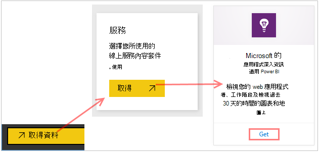
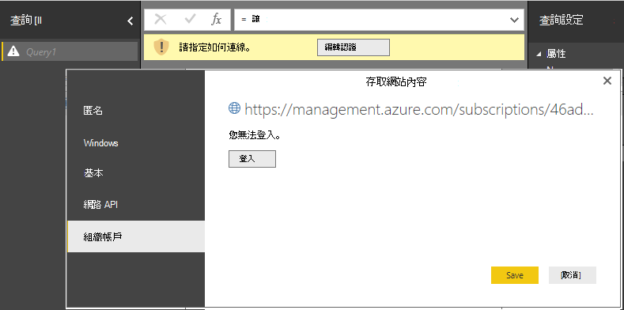

<properties 
    pageTitle="匯出至 Power BI 應用程式的深入見解 |Microsoft Azure" 
    description="Power BI 中可顯示查詢分析。" 
    services="application-insights" 
    documentationCenter=""
    authors="noamben" 
    manager="douge"/>

<tags 
    ms.service="application-insights" 
    ms.workload="tbd" 
    ms.tgt_pltfrm="ibiza" 
    ms.devlang="na" 
    ms.topic="article" 
    ms.date="10/18/2016" 
    ms.author="awills"/>

# 從應用程式的深入見解摘要 Power BI

[Power BI](http://www.powerbi.com/)是商務分析工具，可協助您套件分析資料，以及共用深入資訊。 Rtf 儀表板，可在每個裝置上。 您可以結合多個來源，包括從[Visual Studio 應用程式獲得深入見解](app-insights-overview.md)查詢的分析的資料。

有三個建議的方法將應用程式的深入見解資料匯出至 Power BI。 您可以使用這些分別或共同。

* [**Power BI 介面卡**](#power-pi-adapter)-從您的應用程式設定完成的遙測儀表板。 預先定義的圖表，但您可以新增您自己的查詢，從任何其他來源。
* [**查詢匯出分析**](#export-analytics-queries)-撰寫任何您想要查詢使用狀況分析，將其匯出到 Power BI。 您可以將此查詢，以及任何其他資料的儀表板上。
* [**連續匯出並串流分析**](app-insights-export-stream-analytics.md)-包括設定更多工作。 如果您想要保留您的資料長期，非常有用。 否則，建議您其他方法。

## Power BI 介面卡

這個方法為您建立完成的遙測儀表板。 預先定義初始資料集，但您可以為其新增更多資料。

### 取得介面卡

1. 登入[Power BI](https://app.powerbi.com/)。
2. 開啟**取得資料**、**服務**、**應用程式的深入見解**

    

3. 提供您的應用程式的深入見解資源的詳細資料。

    

4. 請等候幾分鐘，或是要匯入資料的兩個。

    

您可以編輯儀表板的其他來源與使用狀況分析查詢合併到應用程式的深入見解的圖表。 有視覺效果] 圖庫中，您可以取得更多的圖表，且每個圖表參數，您可以設定。

初始匯入之後，儀表板及報表繼續每日更新。 您可以控制資料集上的重新整理排程。

## 匯出查詢分析

這可讓您撰寫您喜歡，任何分析查詢，然後將的匯出的 Power BI 儀表板。 （您可以新增至介面卡所建立的儀表板。）

### 一次︰ 安裝 Power BI Desktop

若要匯入您的應用程式的深入見解的查詢，您可以使用桌面版的 Power BI。 但是，然後您可以將它發佈到網站或您的 Power BI 雲端工作區。 

安裝[Power BI Desktop](https://powerbi.microsoft.com/en-us/desktop/)。

### 匯出的分析查詢

1. [開啟分析及撰寫您的查詢](app-insights-analytics-tour.md)。
2. 測試並縮小查詢的範圍，直到您滿意結果。
3. 在 [**匯出**] 功能表中，選擇 [ **Power BI (M)**]。 儲存文字檔案。

    
4. 在 Power BI Desktop 中選取**取得資料、 空白查詢**，然後在查詢編輯器] 中**檢視**] 底下選取**進階查詢編輯器]**。

    匯出的 M 語言指令碼貼上到 [進階查詢編輯器]。

    

5. 您可能必須提供的認證以允許存取 Azure Power BI。 使用 [組織的帳號] 以使用您的 Microsoft 帳戶登入。

    

6. 選擇查詢視覺效果，然後選取 x 軸、 y 軸及切割維度的欄位。

    

7. 發佈到 Power BI 雲端工作區的 [報表]。 從該位置，您可以將其他網頁內嵌同步處理的版本。

    
 
8. 設定 [排定的重新整理] 選項頁面上或間隔，手動重新整理報表。

## 關於範例

如果您的應用程式傳送大量資料，調整取樣功能可能運作，並傳送您遙測的百分比。 相同是當您以手動方式設定取樣 SDK 或 ingestion。 [進一步瞭解範例。](app-insights-sampling.md)
 

## 後續步驟

* [Power BI-瞭解](http://www.powerbi.com/learning/)
* [分析教學課程](app-insights-analytics-tour.md)
