<properties 
    pageTitle="處理從應用程式的深入見解匯出的資料使用串流分析 |Microsoft Azure" 
    description="資料流分析持續轉換、 篩選及路由您從應用程式的深入見解匯出資料。" 
    services="application-insights" 
    documentationCenter=""
    authors="noamben" 
    manager="douge"/>

<tags 
    ms.service="application-insights" 
    ms.workload="tbd" 
    ms.tgt_pltfrm="ibiza" 
    ms.devlang="na" 
    ms.topic="article" 
    ms.date="10/18/2016" 
    ms.author="awills"/>

# <a name="use-stream-analytics-to-process-exported-data-from-application-insights"></a>使用資料流分析處理從應用程式的深入見解的匯出的資料

[Azure 資料流分析](https://azure.microsoft.com/services/stream-analytics/)是理想的工具來處理[從應用程式的深入見解匯出](app-insights-export-telemetry.md)資料。 資料流分析可以從各種不同的來源擷取資料。 它可以轉換並篩選資料，然後將其傳送至各種不同的接收。

在此範例中，我們會建立介面卡，以取得資料從應用程式的深入見解，重新命名和程序的某些欄位，並將其管道 Power bi。

> [AZURE.WARNING] 有太多更好且更容易[建議顯示 Power bi 應用程式的深入見解資料的方式](app-insights-export-power-bi.md)。 如下所示的路徑是只是為了說明如何處理匯出的資料的範例。

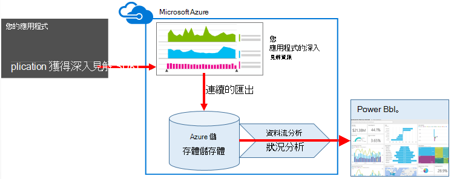


## <a name="create-storage-in-azure"></a>建立 Azure 中的儲存空間

連續匯出永遠輸出 Azure 儲存體帳戶、 資料，因此您需要先建立儲存空間。

1.  在您的訂閱在[Azure 入口網站](https://portal.azure.com)中建立 「 傳統 」 儲存的帳戶。

    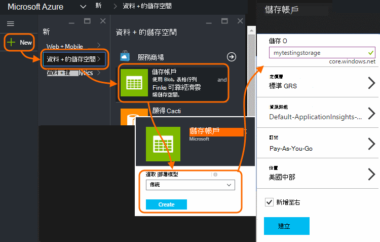

2. 建立容器

    ![在新的儲存空間，選取 [容器，然後按一下 [容器] 方塊中，然後新增](./media/app-insights-export-stream-analytics/040.png)

3. 複製的儲存空間便捷鍵

    您必須將立即設定資料流分析服務輸入。

    ![在儲存空間，開啟 [設定] 鍵，並採取存取主索引鍵的複本](./media/app-insights-export-stream-analytics/045.png)

## <a name="start-continuous-export-to-azure-storage"></a>啟動 [接續本頁] 分匯出至 Azure 儲存體

[連續匯出](app-insights-export-telemetry.md)時，會將資料移動從 Azure 儲存到的應用程式深入資訊。

1. 在 Azure 入口網站中，瀏覽至您建立的應用程式的應用程式的深入見解資源。

    ![選擇 [瀏覽]，應用程式的深入見解，您的應用程式](./media/app-insights-export-stream-analytics/050.png)

2. 建立連續的匯出。

    ![選擇 [設定]，[接續本頁] 分匯出] 新增](./media/app-insights-export-stream-analytics/060.png)


    選取您先前建立的儲存空間帳戶︰

    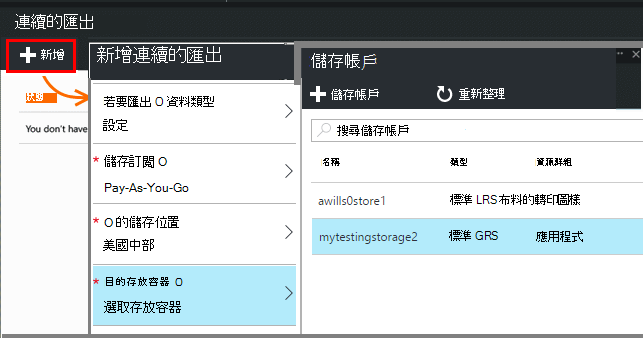
    
    設定您想要查看的事件類型︰

    

3. 讓累積一些資料。 坐，讓您的應用程式，使用一段的人員。 遙測傳送，您會看到[公制檔案總管]](app-insights-metrics-explorer.md)中的統計圖表和[搜尋診斷](app-insights-diagnostic-search.md)] 中的個別事件。 

    此外，資料會匯出您的儲存空間。 

4. 檢查匯出的資料。 在 Visual Studio 中，選擇 [**檢視 / 雲端總管**，並開啟 Azure / 儲存空間。 (如果您沒有安裝此功能表選項，您需要安裝 Azure SDK︰ 開啟新的專案] 對話方塊，並開啟 Visual C# / 雲端 / Microsoft Azure SDK 取得.NET。)

    

    記下路徑名稱，衍生自應用程式名稱] 和 [儀器鍵常見的一部分。 

事件會寫入到 blob JSON 格式的檔案。 每個檔案可能包含一或多個事件。 因此我們想要閱讀的事件資料，並篩選出我們所要的欄位。 所有類型的資料，無法處理的項目，但我們計畫今天是使用資料流分析管道 Power bi 的資料。

## <a name="create-an-azure-stream-analytics-instance"></a>建立 Azure 資料流分析執行個體

[傳統 Azure 入口網站](https://manage.windowsazure.com/)中，選取 [Azure 資料流分析服務]，並建立新的資料流分析工作︰


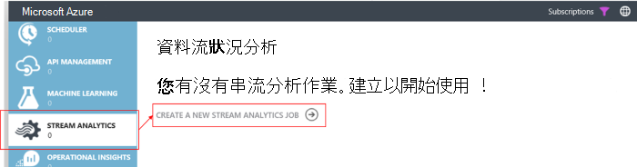


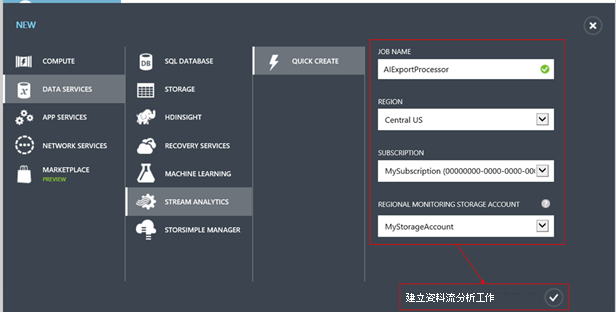

建立新的工作時，展開 [詳細資料︰

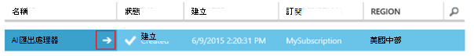


### <a name="set-blob-location"></a>設定 blob 位置

設定將會從您的連續匯出 blob 輸入︰

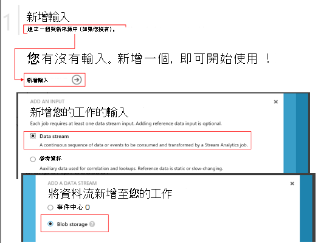

現在，您會從您先前所述的儲存空間帳戶需要存取主索引鍵。 設定此儲存帳戶索引鍵。

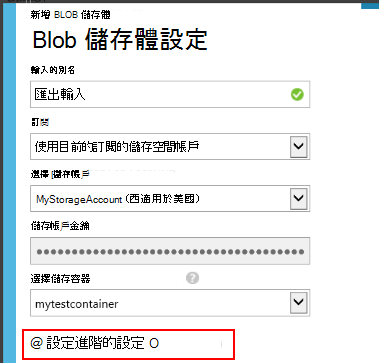

### <a name="set-path-prefix-pattern"></a>設定路徑首碼圖樣 

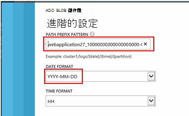


**請務必日期格式設定為 [YYYY MM DD，（含連字號）。**

將路徑加上字首模式指定資料流分析存放區中找到輸入的檔案的位置。 您需要將其設定為會對應到如何連續匯出儲存資料。 您可以將其像這樣︰

    webapplication27_12345678123412341234123456789abcdef0/PageViews/{date}/{time}

在此範例中︰

* `webapplication27`是應用程式的深入見解資源**的所有小寫**的名稱。
* `1234...`是的應用程式的深入見解的資源，**省略虛線**儀器鍵。 
* `PageViews`是您想要分析的資料類型。 可用的類型而定您設定中連續的匯出篩選器。 匯出的資料，以查看其他可用的類型，請檢查，請參閱[匯出資料模型](app-insights-export-data-model.md)。
* `/{date}/{time}`圖樣如實撰寫。

> [AZURE.NOTE] 檢查儲存空間，請確定您取得正確的路徑。

### <a name="finish-initial-setup"></a>完成初始設定

確認序列化格式︰

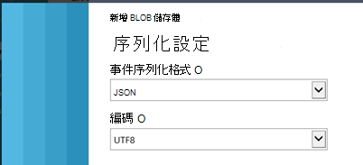

關閉精靈，並等待安裝完成。

> [AZURE.TIP] 若要下載一些資料中使用 [範例] 命令。 保留測試範例偵錯查詢。

## <a name="set-the-output"></a>設定輸出

現在請選取您的工作，並設定輸出。

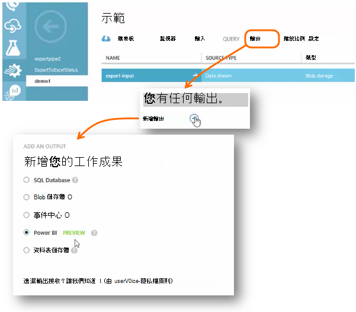

提供您的**公司或學校帳戶**，即可授權串流分析來存取您的 Power BI 資源。 然後設計輸出，以及目標 Power BI 資料集和資料表的名稱。

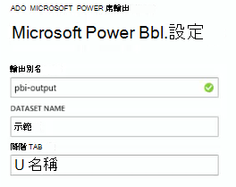

## <a name="set-the-query"></a>設定查詢

查詢管理輸出輸入翻譯。

![選取工作]，然後按一下 [查詢]。 貼上下列範例。](./media/app-insights-export-stream-analytics/180.png)


若要檢查您取得正確的輸出使用測試函數。 讓您原本從 [輸入] 頁面的範例資料。 

### <a name="query-to-display-counts-of-events"></a>若要顯示的查詢會計算的事件

貼上這個查詢︰

```SQL

    SELECT
      flat.ArrayValue.name,
      count(*)
    INTO
      [pbi-output]
    FROM
      [export-input] A
    OUTER APPLY GetElements(A.[event]) as flat
    GROUP BY TumblingWindow(minute, 1), flat.ArrayValue.name
```

* 匯出輸入是我們提供資料流輸入的別名
* pbi 輸出是我們所定義的輸出別名
* 因為事件] 名稱中的巢狀 JSON arrray，我們會使用[外部套用 GetElements](https://msdn.microsoft.com/library/azure/dn706229.aspx) 。 然後選取 [挑選事件] 名稱中，搭配使用的時段中具有該名稱的執行個體數目。 [Group By](https://msdn.microsoft.com/library/azure/dn835023.aspx)子句群組項目，將 1 分鐘的時間週期。


### <a name="query-to-display-metric-values"></a>若要顯示度量值的查詢


```SQL

    SELECT
      A.context.data.eventtime,
      avg(CASE WHEN flat.arrayvalue.myMetric.value IS NULL THEN 0 ELSE  flat.arrayvalue.myMetric.value END) as myValue
    INTO
      [pbi-output]
    FROM
      [export-input] A
    OUTER APPLY GetElements(A.context.custom.metrics) as flat
    GROUP BY TumblingWindow(minute, 1), A.context.data.eventtime

``` 

* 此查詢切入指標遙測，以取得事件時間，以及公制的值。 度量值都是在陣列中，因此我們使用外部套用 GetElements 圖樣展開的資料列。 「 myMetric 「 在此情況下是公制的名稱。 

### <a name="query-to-include-values-of-dimension-properties"></a>若要包含的維度屬性的值的查詢

```SQL

    WITH flat AS (
    SELECT
      MySource.context.data.eventTime as eventTime,
      InstanceId = MyDimension.ArrayValue.InstanceId.value,
      BusinessUnitId = MyDimension.ArrayValue.BusinessUnitId.value
    FROM MySource
    OUTER APPLY GetArrayElements(MySource.context.custom.dimensions) MyDimension
    )
    SELECT
     eventTime,
     InstanceId,
     BusinessUnitId
    INTO AIOutput
    FROM flat

```

* 此查詢包含不根據特定維度在維度陣列中的固定索引維度屬性的值。

## <a name="run-the-job"></a>執行工作

您可以選取日期過去啟動上的工作。 

![選取工作]，然後按一下 [查詢]。 貼上下列範例。](./media/app-insights-export-stream-analytics/190.png)

請等待工作執行。

## <a name="see-results-in-power-bi"></a>請參閱 Power BI 中的結果

> [AZURE.WARNING] 有太多更好且更容易[建議顯示 Power bi 應用程式的深入見解資料的方式](app-insights-export-power-bi.md)。 如下所示的路徑是只是為了說明如何處理匯出的資料的範例。

開啟 Power BI 用您的工作或學校帳戶，然後選取資料集和您定義為串流分析工作的輸出的資料表。

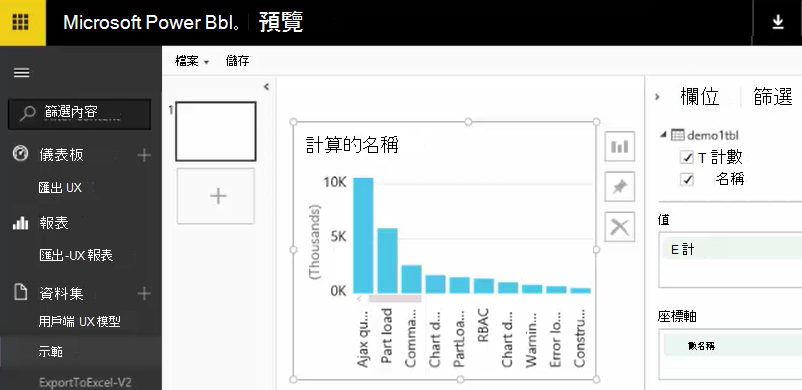

現在您可以使用此報表中的資料集和[Power BI](https://powerbi.microsoft.com)儀表板。


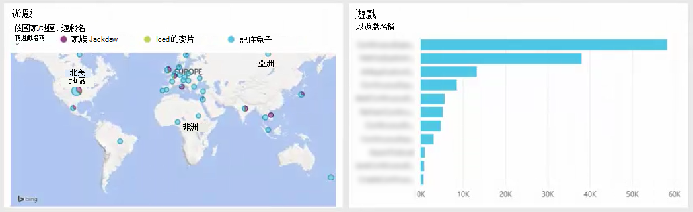


## <a name="no-data"></a>沒有資料？

* 核取該您[設定日期格式](#set-path-prefix-pattern)正確 YYYY-MM-DD （含連字號）。


## <a name="video"></a>視訊

Noam 精靈 Zeev 示範如何使用資料流分析的資料匯出 [處理程序。

> [AZURE.VIDEO export-to-power-bi-from-application-insights]

## <a name="next-steps"></a>後續步驟

* [連續的匯出](app-insights-export-telemetry.md)
* [詳細的資料模型的內容類型和值的參照。](app-insights-export-data-model.md)
* [應用程式的深入見解](app-insights-overview.md)
* [更多範例與逐步解說](app-insights-code-samples.md)
 
