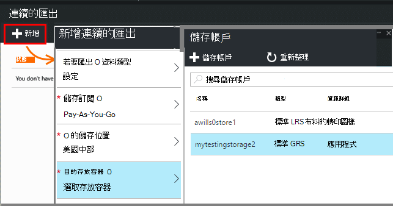
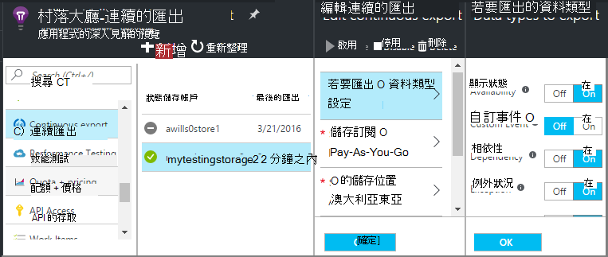
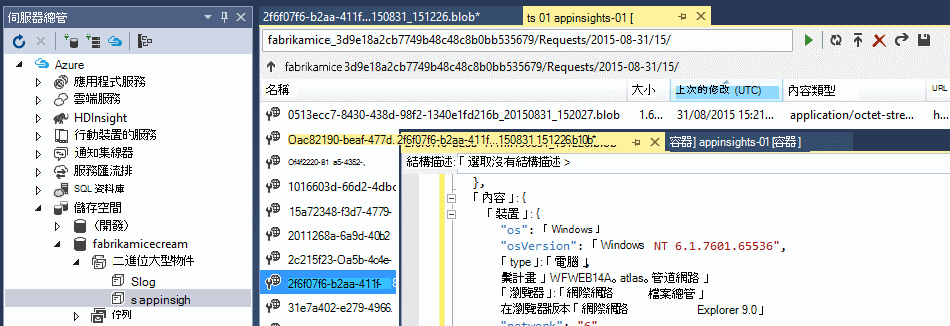
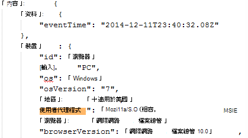

<properties 
    pageTitle="從應用程式的深入見解遙測連續匯出 |Microsoft Azure" 
    description="診斷及使用方式的資料匯出至 Microsoft Azure 中的儲存空間，然後從該處下載。" 
    services="application-insights" 
    documentationCenter=""
    authors="alancameronwills" 
    manager="douge"/>

<tags 
    ms.service="application-insights" 
    ms.workload="tbd" 
    ms.tgt_pltfrm="ibiza" 
    ms.devlang="na" 
    ms.topic="article" 
    ms.date="10/18/2016" 
    ms.author="awills"/>
 
# 從應用程式的深入見解匯出遙測

想要保留的標準保留時間超過您遙測？ 或處理某些特殊的方式？ 連續匯出非常適合用於此項目。 您在應用程式的深入見解入口網站中看到的事件可以匯出到 Microsoft Azure 中 JSON 格式的儲存空間。 您可以從該處下載您的資料，並撰寫的任何程式碼您需要進行處理。  

免費的試用期間，然後在[一般] 及 [進階版資費方案](https://azure.microsoft.com/pricing/details/application-insights/)使用連續匯出。

您設定連續匯出之前，有一些您可能想要考慮的替代方案︰

* 按一下頂端的 [指標] 或 [搜尋刀[匯出] 按鈕](app-insights-metrics-explorer.md#export-to-excel)可讓您傳送的資料表，和圖表為 Excel 試算表。 
* [分析](app-insights-analytics.md)遙測，提供的功能強大的查詢語言，也可以匯出結果。
* 如果您正在尋找[探索您在 Power BI 中的資料](http://blogs.msdn.com/b/powerbi/archive/2015/11/04/explore-your-application-insights-data-with-power-bi.aspx)，您可以執行，而不使用連續匯出。

## 建立儲存的帳戶

如果您還沒有 「 傳統 」 儲存帳戶，建立一個現在。

1. 建立您的訂閱在[Azure 入口網站](https://portal.azure.com)中的儲存空間的帳戶。

    

2. 建立容器。

    ![在新的儲存空間，選取 [容器，然後按一下 [容器] 方塊中，然後新增](./media/app-insights-export-telemetry/040.png)

## 設定 [接續本頁] 分匯出

在您的應用程式概觀刀應用程式的深入見解入口網站中，開啟 [接續本頁] 分匯出︰ 

![向下捲動，然後按一下 [接續本頁] 分匯出](./media/app-insights-export-telemetry/01-export.png)

新增連續匯出]，然後選擇您想要匯出的事件類型︰

![[新增]，匯出的目的地，請儲存帳戶，然後建立新的儲存區或選擇現有的存放區](./media/app-insights-export-telemetry/02-add.png)

選擇或建立您想要用來儲存資料[Azure 儲存體帳戶](../storage/storage-introduction.md)︰

建立您匯出之後，它會開始進行。 （您只取得送達建立匯出後的資料。） 

可以有需一個小時 blob 中顯示的資料之前的延遲。

如果您想要變更的事件類型稍後編輯匯出︰

若要停止串流，按一下 [停用]。 再按一下 [啟用，串流將會重新啟動新的資料。 您不會收到匯出已停用時，收到入口網站中的資料。

若要永久停止串流，刪除 [匯出]。 如此一來，不會從儲存刪除您的資料。

#### 無法新增或變更匯出嗎？

* 若要新增或變更匯出，您必須擁有人、 參與者或應用程式的深入見解參與者的存取權限。 [深入了解角色][roles]。

## 您收到什麼事件？

匯出的資料是從應用程式，我們會收到原始遙測，但我們位置的計算中的資料新增用戶端 IP 位址。 

已被捨棄的[範例](app-insights-sampling.md)的資料不會包含在 [匯出資料。

其他計算的公制不包含在內。 例如，我們不匯出平均的 CPU utilisation，但我們執行將平均值的計算從原始遙測。

資料也包含有設定任何[可用性 web 測試](app-insights-monitor-web-app-availability.md)的結果。 

> [AZURE.NOTE] **範例。** 如果您的應用程式傳送大量資料，您使用的應用程式的深入見解 SDK ASP.NET 版本 2.0.0-beta3 或更新版本，調整取樣功能可能運作，然後傳送您遙測的百分比。 [進一步瞭解範例。](app-insights-sampling.md)

## 檢查資料

您可以檢查入口網站中直接儲存空間。 按一下 [**瀏覽**、 選取您儲存的帳戶，然後再開啟**容器**。

若要檢查 Azure 儲存在 Visual Studio 中的，開啟 [**檢視**，**雲端的檔案總管**]。 (如果您沒有安裝的 [功能表] 命令，您需要安裝 Azure SDK︰ 開啟**新的專案**] 對話方塊，展開 Visual C# / 雲端，然後選擇**.net 取得 Microsoft Azure SDK**。)

當您開啟您 blob 存放區時，您會看到一組 blob 檔案與容器。 每個檔案 URI 衍生自您的應用程式的深入見解的資源名稱、 儀器鍵、 遙測-類型/日期/時間。 （資源名稱為全部小寫，與儀器鍵省略連字號）。

日期及時間 UTC 而時遙測已存放在市集-不將它產生的時間。 因此，如果您撰寫程式碼，以下載的資料，它可以移動直線瀏覽的資料。

以下是路徑的表單︰

    $"{applicationName}_{instrumentationKey}/{type}/{blobDeliveryTimeUtc:yyyy-MM-dd}/{ blobDeliveryTimeUtc:HH}/{blobId}_{blobCreationTimeUtc:yyyyMMdd_HHmmss}.blob"
  
位置 

-   `blobCreationTimeUtc`已在內部建立 blob 的時間臨時儲存空間
-   `blobDeliveryTimeUtc`當 blob 會複製到匯出的目的地儲存空間的時間

## 資料格式

* 每個項目不包含多個文字檔案 ' \n'-separated 列。 包含一段時間大約半分鐘處理遙測。
* 每個資料列代表遙測資料點，例如要求或頁面檢視。
* 每個資料列是格式化的 JSON 文件。 如果您想要坐在其 stare，在 Visual Studio 中開啟，然後選擇 [編輯進階]，格式檔案︰

時間工期位於的刻度]，10 000 的刻度位置 = 1ms。 例如，這些值顯示 1ms，傳送要求的瀏覽器，3ms 接收，並 1.8s 處理瀏覽器中的頁面的時間︰

    "sendRequest": {"value": 10000.0},
    "receiveRequest": {"value": 30000.0},
    "clientProcess": {"value": 17970000.0}

[詳細的資料模型的內容類型和值的參照。](app-insights-export-data-model.md)

## 處理資料

小型等級，您可以撰寫程式碼來拉開您的資料，讀取將試算表，依此類推。 例如︰

    private IEnumerable<T> DeserializeMany<T>(string folderName)
    {
      var files = Directory.EnumerateFiles(folderName, "*.blob", SearchOption.AllDirectories);
      foreach (var file in files)
      {
         using (var fileReader = File.OpenText(file))
         {
            string fileContent = fileReader.ReadToEnd();
            IEnumerable<string> entities = fileContent.Split('\n').Where(s => !string.IsNullOrWhiteSpace(s));
            foreach (var entity in entities)
            {
                yield return JsonConvert.DeserializeObject<T>(entity);
            }
         }
      }
    }

對於較大的程式碼範例，請參閱[使用工作者角色][exportasa]。

## 刪除舊的資料
請注意，您負責管理您的儲存容量，如有必要，請刪除資料。 

## 如果您重新產生您儲存空間的金鑰...

如果您變更您的儲存空間的索引鍵，則連續的匯出會停止運作。 在您 Azure 帳戶，您會看到通知。 

開啟連續匯出刀並編輯您匯出。 編輯的匯出的目的地，但只讓選取相同的儲存空間。 按一下 [確定] 確認。

![編輯開啟和關閉接續本頁] 分匯出三個匯出的目的地。](./media/app-insights-export-telemetry/07-resetstore.png)

接續本頁] 分匯出會重新啟動。

## 匯出範例

* [匯出至 SQL 使用工作者角色][exportcode]
* [匯出至 SQL 使用串流狀況分析][exportasa]
* [資料流分析範例 2](app-insights-export-stream-analytics.md)

在較大的比例，請考慮[HDInsight](https://azure.microsoft.com/services/hdinsight/) -Hadoop 叢集雲端中。 HDInsight 提供各種不同的技術適用於管理及分析大型資料。

## 問與答

* *但我想在單次下載的圖表。*  
 
    是的您可以執行這項作業。 在刀頂端，按一下 [[匯出資料](app-insights-metrics-explorer.md#export-to-excel)]。

* *設定匯出]，但我存放區中沒有任何資料。*

    是否應用程式的深入見解收到任何遙測從您的應用程式之後，您可以設定匯出？ 您只會收到新的資料。

* *我嘗試設定匯出]，但無法存取*

    如果您的組織所擁有的帳戶，您必須是擁有人] 或 [參與者群組的成員。

* *我可以匯出直接到自己的內部部署存放區嗎？* 

    否，很抱歉。 我們匯出引擎目前僅適用於 Azure 儲存這一次。  

* *有無任何限制的您放置我存放區中的資料量嗎？* 

    [否]。 我們會保留推入的資料，直到您刪除匯出。 如果我們叫用功能的外部 blob 儲存體，限制，但這是很大，我們會停止。 是由您來控制您使用多少儲存空間。  

* *在儲存空間中應該會看到多少二進位大型物件？*

 * 針對每個您選取要匯出的資料類型，新 blob 建立每分鐘 （如果有可用的資料）。 
 * 此外，高的資料傳輸的應用程式，其他的磁碟分割單位的配置。 在此情況下每個單位建立 blob 每分鐘。

* *我產生索引鍵至我的儲存空間，或者變更容器的名稱，然後匯出現在無法運作。*

    編輯匯出，並開啟匯出目的地刀。 將相同的儲存空間，已選取，然後按一下 [確定] 確認。 匯出會重新啟動。 如果變更是在過去的幾天內，您就不會遺失資料。

* *可以暫停匯出嗎？*

    [是]。 按一下 [停用]。

## 程式碼範例

* [剖析匯出的 JSON 使用工作者角色][exportcode]
* [資料流分析範例](app-insights-export-stream-analytics.md)
* [匯出至 SQL 使用串流狀況分析][exportasa]

* [詳細的資料模型的內容類型和值的參照。](app-insights-export-data-model.md)

<!--Link references-->

[exportcode]: app-insights-code-sample-export-telemetry-sql-database.md
[exportasa]: app-insights-code-sample-export-sql-stream-analytics.md
[roles]: app-insights-resources-roles-access-control.md

 
